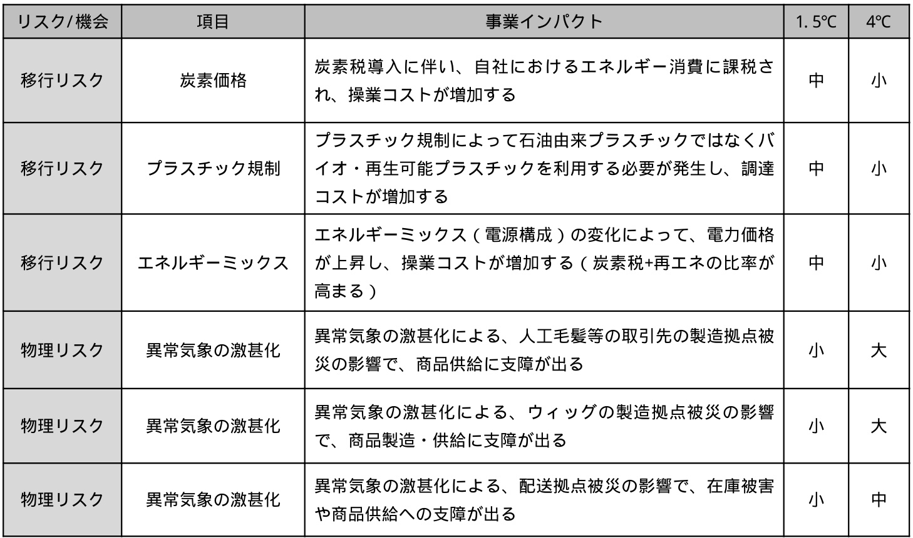
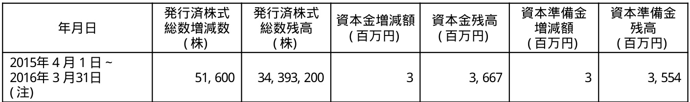
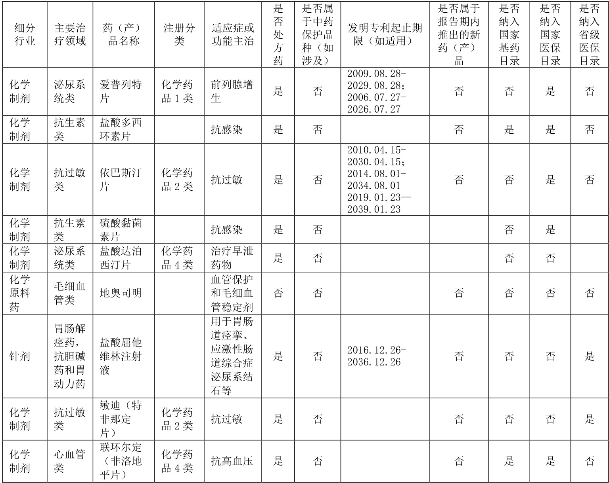
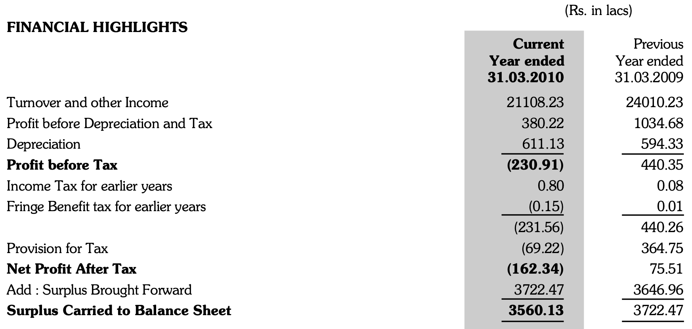

## page 9 f_0AibR1dz

Azure:
<html><body><table> \t<tr> \t\t<td colspan="2" rowspan="1"></td> \t\t<td colspan="3" rowspan="1">全体 女性 中途採用者</td> \t</tr> \t<tr> \t\t<td colspan="1" rowspan="2">社員</td> \t\t<td colspan="1" rowspan="1"></td> \t\t<td colspan="1" rowspan="1">2,623人</td> \t\t<td colspan="1" rowspan="1">1,575人 (60.0%)</td> \t\t<td colspan="1" rowspan="1">2,408人 (91.8%)</td> \t</tr> \t<tr> \t\t<td colspan="1" rowspan="1">管理職</td> \t\t<td colspan="1" rowspan="1">362人</td> \t\t<td colspan="1" rowspan="1">67人 (18.5%)</td> \t\t<td colspan="1" rowspan="1">300人(82.8%)</td> \t</tr> \t<tr> \t\t<td colspan="2" rowspan="1">取締役</td> \t\t<td colspan="1" rowspan="1">9人</td> \t\t<td colspan="1" rowspan="1">2人 (22.2%)</td> \t\t<td colspan="1" rowspan="1">9人 (100.0%)</td> \t</tr> </table></body></html>

Marker-162:
<table><tbody><tr><th></th><th></th><th colspan=3>全体</th></tr><tr><td></td><td></td><td></td><td>女性</td><td>中途採用者</td></tr><tr><td></td><td></td><td>2, 623人</td><td>1, 575人(60. 0%)</td><td>2, 408人(91. 8%)</td></tr><tr><td>社員</td><td>管理職</td><td>362人</td><td>67人(18. 5%)</td><td>300人(82. 8%)</td></tr><tr><td colspan=2>取締役</td><td>9人</td><td>2人(22. 2%)</td><td>9人(100. 0%)</td></tr></tbody></table>

MinerU-1310:
<html><body><table><tr><td colspan="2" rowspan="2"></td><td colspan="3">全体</td></tr><tr><td>女性</td><td>中途採用者</td></tr><tr><td rowspan="2">社員</td><td></td><td>2,623人</td><td>1,575人 (60.0%)</td><td>2,408人 (91.8%)</td></tr><tr><td>管理職</td><td>362人</td><td>67人 (18.5%)</td><td>300人 (82.8%)</td></tr><tr><td colspan="2">取缔役</td><td>9人</td><td>2人 (22.2%)</td><td>9人（100.0%)</td></tr></table></body></html>

Ours-v2:
<table><tbody><tr><th rowspan=2 colspan=2></th><th colspan=3>全体</th></tr><tr><td></td><td>女性</td><td>中途採用者</td></tr><tr><td></td><td></td><td>2,623人</td><td>1,575人 (60.0%)</td><td>2,408人 (91.8%)</td></tr><tr><td>社員</td><td>管理職</td><td>362人</td><td>67人 (18.5%)</td><td>300人 (82.8%)</td></tr><tr><td>取缔役</td><td></td><td>9人</td><td>2人 (22.2%)</td><td>9人(100.0%)</td></tr></tbody></table>

Ours-pdfconverter:
<table><tbody><tr><th rowspan=2 colspan=2></th><th></th><th colspan=4>全体</th></tr><tr><td></td><td>女性</td><td>中途採用者</td></tr><tr><td rowspan=2>社員</td><td></td><td>2, 623人</td><td>1,575人 (60.0%)</td><td>2,408人 (91.8%)</td></tr><tr><td>管理職</td><td>362人</td><td>67人 (18.5%)</td><td>300人 (82.8%)</td></tr><tr><td colspan=2>取締役</td><td>9人</td><td>2人 (22.2%)</td><td>9人 (100.0%)</td></tr></tbody></table>  

Ours-batch:
<table><tbody><tr><th rowspan=2 colspan=2></th><th colspan=3>全体</th></tr><tr><td></td><td>女性</td><td>中途採用者</td></tr><tr><td>社員</td><td></td><td>2, 623人</td><td>1,575人 (60.0%)</td><td>2,408人 (91.8%)</td></tr><tr><td></td><td>管理職</td><td>362人</td><td>67人 (18.5%)</td><td>300人 (82.8%)</td></tr><tr><td>取締役</td><td></td><td>9人</td><td>2人 (22.2%)</td><td>9人 (100.0%)</td></tr></tbody></table>

Ours-converter:
<table><tbody><tr><th rowspan=2 colspan=2></th><th colspan=3>全体</th></tr><tr><td></td><td>女性</td><td>中途採用者</td></tr><tr><td>社員</td><td></td><td>2, 623人</td><td>1,575人 (60.0%)</td><td>2,408人 (91.8%)</td></tr><tr><td></td><td>管理職</td><td>362人</td><td>67人 (18.5%)</td><td>300人 (82.8%)</td></tr><tr><td colspan=2>取締役</td><td>9人</td><td>2人 (22.2%)</td><td>9人 (100.0%)</td></tr></tbody></table> 

## page 33

Azure:
<html><body><table> \t<tr> \t\t<td colspan="2" rowspan="1">項目</td> \t\t<td colspan="1" rowspan="1">1.5℃シナリオ</td> \t\t<td colspan="1" rowspan="1">4℃シナリオ</td> \t</tr> \t<tr> \t\t<td colspan="2" rowspan="1">対象範囲</td> \t\t<td colspan="2" rowspan="1">海外連結子会社まで</td> \t</tr> \t<tr> \t\t<td colspan="2" rowspan="1">対象年</td> \t\t<td colspan="2" rowspan="1">移行リスク:2030年,物理リスク:2050年</td> \t</tr> \t<tr> \t\t<td colspan="1" rowspan="2">主な参照先</td> \t\t<td colspan="1" rowspan="1">移行面</td> \t\t<td colspan="1" rowspan="1">IEA NZE*</td> \t\t<td colspan="1" rowspan="1">IEA STEPS*</td> \t</tr> \t<tr> \t\t<td colspan="1" rowspan="1">物理面</td> \t\t<td colspan="1" rowspan="1">IPCC SSP1-1.9*</td> \t\t<td colspan="1" rowspan="1">IPCC RCP8.5*</td> \t</tr> </table></body></html>

Marker-162:
<table><tbody><tr><th></th><th>項目</th><th colspan=4>1. 5℃シナリオ 4℃シナリオ</th></tr><tr><td colspan=2>対象範囲</td><td colspan=2>海外連結子会社まで</td></tr><tr><td colspan=2>対象年</td><td colspan=2>移行リスク:2030年, 物理リスク:2050年</td></tr><tr><td rowspan=2>主な参照先</td><td>移行面</td><td>IEA NZE*</td><td>IEA STEPS*</td></tr><tr><td>物理面</td><td>IPCC SSP1-1. 9*</td><td>IPCC RCP8. 5*</td></tr></tbody></table>

MinerU-1310:
<html><body><table><tr><td colspan="2">项目</td><td>1.5℃シリオ</td><td>4℃リオ</td></tr><tr><td colspan="2">对象範圈</td><td colspan="2">海外連結子会社ま</td></tr><tr><td colspan="2">对象年</td><td colspan="2">移行リク：2030年，物理リク：2050年</td></tr><tr><td rowspan="2">主な参照先</td><td>移行面</td><td>I EA NZE*</td><td>I EA STEPS*</td></tr><tr><td>物理面</td><td>IPCCSSP1-1.9*</td><td>I PCC RCP8.5*</td></tr></table></body></html>

Ours-v2:
<table><tbody><tr><th colspan=2>项目</th><th>1.5℃シリオ</th><th>4℃リオ</th></tr><tr><td colspan=2>对象範圈</td><td colspan=2>海外連結子会社ま</td></tr><tr><td colspan=2>对象年</td><td colspan=2>移行リク:2030年,物理リク:2050年</td></tr><tr><td rowspan=2>主な参照先</td><td>移行面</td><td>I EA NZE*</td><td>I EA STEPS*</td></tr><tr><td>物理面</td><td>IPCCSSP1-1.9*</td><td>I PCC RCP8.5*</td></tr></tbody></table>

Ours-pdfconverter:
<table><tbody><tr><th colspan=2>項目</th><th>1.5℃シナリオ</th><th colspan=3>4℃シナリオ</th></tr><tr><td></td><td colspan=2>対象範囲 海外連結子会社まで</td><td></td></tr><tr><td></td><td>対象年</td><td colspan=2>移行リスク:2030年,物理リスク:2050年</td></tr><tr><td rowspan=2>主な参照先</td><td>移行面</td><td>IFA NE</td><td>I EA STEPS*</td></tr><tr><td>物理面</td><td>IPCC SSP1-1.9*</td><td>IPCC RCP8.5*</td></tr></tbody></table>  

Ours-batch:
<table><tbody><tr><th colspan=2>項目</th><th>1.5℃シナリオ</th><th>4°Cシナリオ</th></tr><tr><td colspan=2>対象範囲</td><td colspan=2>海外連結子会社まで</td></tr><tr><td colspan=2>対象年</td><td colspan=2>移行リスク:2030年,物理リスク:2050年</td></tr><tr><td rowspan=2>主な参照先</td><td>移行面</td><td>IFA NE</td><td>I EA STEPS*</td></tr><tr><td>物理面</td><td>IPCC SSP1-1.9*</td><td>I PCC RCP8. 5*</td></tr></tbody></table>

Ours-converter:
<table><tbody><tr><th colspan=2>項目</th><th>1.5℃シナリオ</th><th>4℃シナリオ</th></tr><tr><td colspan=2>対象範囲</td><td colspan=2>海外連結子会社まで</td></tr><tr><td colspan=2>対象年</td><td colspan=2>移行リスク:2030年,物理リスク:2050年</td></tr><tr><td rowspan=2>主な参照先</td><td>移行面</td><td>IEA NE</td><td>I EA STEPS*</td></tr><tr><td>物理面</td><td>IPCC SSP1-1.9*</td><td>IPCC RCP8. 5*</td></tr></tbody></table>  

## page 34

Azure:
<html><body><table> \t<tr> \t\t<td colspan="1" rowspan="1">リスク/機会</td> \t\t<td colspan="1" rowspan="1">項目</td> \t\t<td colspan="1" rowspan="1">事業インパクト</td> \t\t<td colspan="1" rowspan="1">1.5℃</td> \t\t<td colspan="1" rowspan="1">4℃</td> \t</tr> \t<tr> \t\t<td colspan="1" rowspan="1">移行リスク</td> \t\t<td colspan="1" rowspan="1">炭素価格</td> \t\t<td colspan="1" rowspan="1">炭素税導入に伴い、自社におけるエネルギー消費に課税さ れ、操業コストが増加する</td> \t\t<td colspan="1" rowspan="1">中</td> \t\t<td colspan="1" rowspan="1">小</td> \t</tr> \t<tr> \t\t<td colspan="1" rowspan="1">移行リスク</td> \t\t<td colspan="1" rowspan="1">プラスチック規制</td> \t\t<td colspan="1" rowspan="1">プラスチック規制によって石油由来プラスチックではなくバ イオ·再生可能プラスチックを利用する必要が発生し、調達 コストが増加する</td> \t\t<td colspan="1" rowspan="1">中</td> \t\t<td colspan="1" rowspan="1">小</td> \t</tr> \t<tr> \t\t<td colspan="1" rowspan="1">移行リスク</td> \t\t<td colspan="1" rowspan="1">エネルギーミックス</td> \t\t<td colspan="1" rowspan="1">エネルギーミックス(電源構成)の変化によって、電力価格 が上昇し、操業コストが増加する(炭素税+再エネの比率が 高まる)</td> \t\t<td colspan="1" rowspan="1">中</td> \t\t<td colspan="1" rowspan="1">小 :selected:</td> \t</tr> \t<tr> \t\t<td colspan="1" rowspan="1">物理リスク</td> \t\t<td colspan="1" rowspan="1">異常気象の激甚化</td> \t\t<td colspan="1" rowspan="1">異常気象の激甚化による、人工毛髪等の取引先の製造拠点被 災の影響で、商品供給に支障が出る</td> \t\t<td colspan="1" rowspan="1">小 :selected:</td> \t\t<td colspan="1" rowspan="1">大 :selected:</td> \t</tr> \t<tr> \t\t<td colspan="1" rowspan="1">物理リスク</td> \t\t<td colspan="1" rowspan="1">異常気象の激甚化</td> \t\t<td colspan="1" rowspan="1">異常気象の激甚化による、ウィッグの製造拠点被災の影響 で、商品製造·供給に支障が出る</td> \t\t<td colspan="1" rowspan="1">小 :selected:</td> \t\t<td colspan="1" rowspan="1">大 :selected:</td> \t</tr> \t<tr> \t\t<td colspan="1" rowspan="1">物理リスク</td> \t\t<td colspan="1" rowspan="1">異常気象の激甚化</td> \t\t<td colspan="1" rowspan="1">異常気象の激甚化による、配送拠点被災の影響で、在庫被害 や商品供給への支障が出る</td> \t\t<td colspan="1" rowspan="1">小</td> \t\t<td colspan="1" rowspan="1">中 :selected:</td> \t</tr> </table></body></html>

Marker-162:
<table><tbody><tr><th>リスク/機会</th><th>項目</th><th>事業インパクト</th><th>1. 5℃</th><th>4℃</th></tr><tr><td>移行リスク</td><td>炭素価格</td><td>炭素税導入に伴い、自社におけるエネルギー消費に課税さ れ、操業コストが増加する</td><td>中</td><td>小</td></tr><tr><td>移行リスク</td><td>プラスチック規制</td><td>プラスチック規制によって石油由来プラスチックではなくバ イオ・再生可能プラスチックを利用する必要が発生し、調達 コストが増加する</td><td>中</td><td>小</td></tr><tr><td>移行リスク</td><td>エネルギーミックス</td><td>エネルギーミックス(電源構成)の変化によって、電力価格 が上昇し、操業コストが増加する(炭素税+再エネの比率が 高まる)</td><td>中</td><td>小</td></tr><tr><td>物理リスク</td><td>異常気象の激甚化</td><td>異常気象の激甚化による、人工毛髪等の取引先の製造拠点被 災の影響で、商品供給に支障が出る</td><td>小</td><td>大</td></tr><tr><td>物理リスク</td><td>異常気象の激甚化</td><td>異常気象の激甚化による、ウィッグの製造拠点被災の影響 で、商品製造・供給に支障が出る</td><td>小</td><td>大</td></tr><tr><td>物理リスク</td><td>異常気象の激甚化</td><td>異常気象の激甚化による、配送拠点被災の影響で、在庫被害 や商品供給への支障が出る</td><td>小</td><td>中</td></tr></tbody></table>

MinerU-1310:
<html><body><table><tr><td>）スク/機会</td><td>项目</td><td>事業ト</td><td>1.5°℃</td><td>4℃</td></tr><tr><td>移行リク</td><td>炭素倆格</td><td>炭素税導に伴い、自社におけるルー消費に課税 れ、操業□ス卜か增加す</td><td>中</td><td>小</td></tr><tr><td>移行リク</td><td>ラク規制</td><td>ラク規制によ石油由ラクでは 才·再生可能ラチクを利用る必要が生し、調達 ト增加</td><td>中</td><td>小</td></tr><tr><td>移行リク</td><td>工礻ル戈一三クス</td><td>工ーミク（電源構成）の変化によー、電力倆格 が上昇し、操業コトか增加する（炭素税+再工の比率か 高まる）</td><td>中</td><td>小</td></tr><tr><td>物理ク</td><td>異常氨象の激甚化</td><td>異常氨象の激甚化よ、人工毛髪等の取引先の製造抛点被 災の影響で、商品供給に支障が出</td><td>小</td><td>大</td></tr><tr><td>物理リク</td><td>異常氨象の激甚化</td><td>異常気象の激甚化による、イの製造点被災の影響 、商品製造·供給に支障が出</td><td>小</td><td>大</td></tr><tr><td>物理リク</td><td>異常気象の激甚化</td><td>異常氨象の激甚化よ、配送抛点被災の影響、在庫被害 や商品供給^の支障か出る</td><td>小</td><td>中</td></tr></table></body></html>  

Ours-v2:
<table><tbody><tr><th>)スク/機会</th><th>项目</th><th>事業ト</th><th>1.5°℃</th><th>4℃</th></tr><tr><td>移行リク</td><td>炭素倆格</td><td>炭素税導に伴い、自社におけるルー消費に課税 れ、操業□ス卜か增加す</td><td>中</td><td>小</td></tr><tr><td>移行リク</td><td>ラク規制</td><td>ラク規制によ石油由ラクでは 才·再生可能ラチクを利用る必要が生し、調達 ト增加</td><td>中</td><td>小</td></tr><tr><td>移行リク</td><td>工礻ル戈一三クス</td><td>工ーミク(電源構成)の変化によー、電力倆格 が上昇し、操業コトか增加する(炭素税+再工の比率か 高まる)</td><td>中</td><td>小</td></tr><tr><td>物理リスク</td><td>異常氨象の激甚化</td><td>異常氨象の激甚化よ、人工毛髪等の取引先の製造抛点被 災の影響で、商品供給に支障が出</td><td>小</td><td>大</td></tr><tr><td>物理リク</td><td>異常氨象の激甚化</td><td>異常気象の激甚化による、イの製造点被災の影響 、商品製造·供給に支障が出</td><td>小</td><td>大</td></tr><tr><td>物理リク</td><td>異常気象の激甚化</td><td>異常氨象の激甚化よ、配送抛点被災の影響、在庫被害 や商品供給^の支障か出る</td><td>小</td><td>中</td></tr></tbody></table>

Ours-pdfconverter:
<table><tbody><tr><th>リスク/機会</th><th>項目</th><th>事業インパクト</th><th>1.5℃</th><th>4°C</th></tr><tr><td>移行リスク</td><td>炭素価格</td><td>炭素税導入に伴い、自社におけるエネルギー消費に課税さ れ、操業コストが増加する</td><td>L</td><td>11</td></tr><tr><td>移行リスク</td><td>ブラスチック規制</td><td>ブラスチック規制によって右油由来ブラスチックではなくバ イオ・再生可能ブラスチックを利用する必要が発生し、調達 コストが増加する</td><td>LI</td><td>小</td></tr><tr><td>移行リスク</td><td>エネルギーミックス</td><td>エネルギーミックス(電源構成)の変化によって、電力価格 が上昇し、操業コストが増加する(炭素税+再エネの比率が 高まる)</td><td>11</td><td>小</td></tr><tr><td>物理リスク</td><td>異常気象の激甚化</td><td>異常気象の激甚化による、人工毛髪等の取引先の製造拠点被 災の影響で、商品供給に支障が出る</td><td>11</td><td>大</td></tr><tr><td>物理リスク</td><td>異常気象の激甚化</td><td>異常気象の激甚化による、ウィッグの製造拠点被災の影響 で、商品製造・供給に支障が出る</td><td>11</td><td>大</td></tr><tr><td>物理リスク</td><td>異常気象の激甚化</td><td>異常気象の激甚化による、配送拠点被災の影響で、在庫被害 や商品供給への支障が出る</td><td>小</td><td>11</td></tr></tbody></table>

Ours-batch:
<table><tbody><tr><th>リスク/機会</th><th>項目</th><th>事業インパクト</th><th>1.5°C</th><th>4°C</th></tr><tr><td>移行リスク</td><td>炭素価格</td><td>炭素税導入に伴い、自社におけるエネルギー消費に課税さ れ、操業コストが増加する</td><td>La</td><td>小</td></tr><tr><td>移行リスク</td><td>プラスチック規制</td><td>プラスチック規制によって石油由来ブラスチックではなくバ イオ・再生可能ブラスチックを利用する必要が発生し、調達 コストが増加する</td><td>La</td><td>小</td></tr><tr><td>移行リスク</td><td>エネルギーミックス</td><td>エネルギーミックス(電源構成)の変化によって、電力価格 が上昇し、操業コストが増加する(炭素税+再エネの比率が 高まる)</td><td>la</td><td>小</td></tr><tr><td>物理リスク</td><td>異常気象の激甚化</td><td>異常気象の激甚化による、人工毛髪等の取引先の製造拠点被 災の影響で、商品供給に支障が出る</td><td>小</td><td>大</td></tr><tr><td>物理リスク</td><td>異常気象の激甚化</td><td>異常気象の激甚化による、ウィッグの製造拠点被災の影響 で、商品製造・供給に支障が出る</td><td>小</td><td>大</td></tr><tr><td>物理リスク</td><td>異常気象の激甚化</td><td>異常気象の激甚化による、配送拠点被災の影響で、在庫被害 や商品供給への支障が出る</td><td>小</td><td>La</td></tr></tbody></table>

Ours-converter:
<table><tbody><tr><th>リスク/機会</th><th>項目</th><th>事業インパクト</th><th>1.5℃</th><th>4°C</th></tr><tr><td>移行リスク</td><td>炭素価格</td><td>炭素税導入に伴い、自社におけるエネルギー消費に課税さ れ、操業コストが増加する</td><td>ロ</td><td>小</td></tr><tr><td>移行リスク</td><td>ブラスチック規制</td><td>ブラスチック規制によって石油由来ブラスチックではなくバ イオ・再生可能ブラスチックを利用する必要が発生し、調達 コストが増加する</td><td>11</td><td>小</td></tr><tr><td>移行リスク</td><td>エネルギーミックス</td><td>エネルギーミックス(電源構成)の変化によって、電力価格 が上昇し、操業コストが増加する(炭素税+再エネの比率が 高まる)</td><td>1</td><td>バ</td></tr><tr><td>物理リスク</td><td>異常気象の激甚化</td><td>異常気象の激基化による、人工毛髪等の取引先の製造拠点被 災の影響で、商品供給に支障が出る</td><td>小</td><td>大</td></tr><tr><td>物理リスク</td><td>異常気象の激甚化</td><td>異常気象の激甚化による、ウィッグの製造拠点被災の影響 で、商品製造・供給に支障が出る</td><td>小</td><td>大</td></tr><tr><td>物理リスク</td><td>異常気象の激甚化</td><td>異常気象の激甚化による、配送拠点被災の影響で、在庫被害 や商品供給への支障が出る</td><td>小</td><td>ロ</td></tr></tbody></table> 

## page 44

Azure:
<html><body><table> \t<tr> \t\t<td colspan="1" rowspan="2">事業所名 (所在地)</td> \t\t<td colspan="1" rowspan="2">事業部門の 名称</td> \t\t<td colspan="1" rowspan="2">設備の内容</td> \t\t<td colspan="5" rowspan="1">帳簿価額</td> \t\t<td colspan="1" rowspan="2">従業員数 (人)</td> \t</tr> \t<tr> \t\t<td colspan="1" rowspan="1">建物及び 構築物 (百万円)</td> \t\t<td colspan="1" rowspan="1">機械装置 及び運搬具 (百万円)</td> \t\t<td colspan="1" rowspan="1">土地 (百万円) (面積m2)</td> \t\t<td colspan="1" rowspan="1">その他 (百万円)</td> \t\t<td colspan="1" rowspan="1">合計 (百万円)</td> \t</tr> \t<tr> \t\t<td colspan="1" rowspan="1">本社 (東京都渋谷区)</td> \t\t<td colspan="1" rowspan="1">総合毛髮関 連事業</td> \t\t<td colspan="1" rowspan="1">総括業務 施設</td> \t\t<td colspan="1" rowspan="1">1,323</td> \t\t<td colspan="1" rowspan="1">-</td> \t\t<td colspan="1" rowspan="1">1,479 (1,153.28)</td> \t\t<td colspan="1" rowspan="1">140</td> \t\t<td colspan="1" rowspan="1">2,944</td> \t\t<td colspan="1" rowspan="1">287 (50)</td> \t</tr> \t<tr> \t\t<td colspan="1" rowspan="1">商品物流セン ター (新潟県村上市)</td> \t\t<td colspan="1" rowspan="1">総合毛髮関 連事業</td> \t\t<td colspan="1" rowspan="1">物流倉庫</td> \t\t<td colspan="1" rowspan="1">77</td> \t\t<td colspan="1" rowspan="1">-</td> \t\t<td colspan="1" rowspan="1">54 (8,896.41)</td> \t\t<td colspan="1" rowspan="1">35</td> \t\t<td colspan="1" rowspan="1">168</td> \t\t<td colspan="1" rowspan="1">19 (9)</td> \t</tr> \t<tr> \t\t<td colspan="1" rowspan="1">関東信越ブロッ ク 計2店舗 内レディース専 門店 1店舗</td> \t\t<td colspan="1" rowspan="1">総合毛髮関 連事業</td> \t\t<td colspan="1" rowspan="1">販売設備</td> \t\t<td colspan="1" rowspan="1">70</td> \t\t<td colspan="1" rowspan="1">-</td> \t\t<td colspan="1" rowspan="1">268 (135.23)</td> \t\t<td colspan="1" rowspan="1">2</td> \t\t<td colspan="1" rowspan="1">341</td> \t\t<td colspan="1" rowspan="1">10 (0)</td> \t</tr> \t<tr> \t\t<td colspan="1" rowspan="1">関西ブロック 計3店舗 内レディース専 門店 1店舗</td> \t\t<td colspan="1" rowspan="1">総合毛髮関 連事業</td> \t\t<td colspan="1" rowspan="1">販売設備</td> \t\t<td colspan="1" rowspan="1">210</td> \t\t<td colspan="1" rowspan="1">1</td> \t\t<td colspan="1" rowspan="1">299 (355.58)</td> \t\t<td colspan="1" rowspan="1">2</td> \t\t<td colspan="1" rowspan="1">512</td> \t\t<td colspan="1" rowspan="1">25 (1)</td> \t</tr> \t<tr> \t\t<td colspan="1" rowspan="1">中四国ブロック 計2店舗 内レディース専 門店1店舗</td> \t\t<td colspan="1" rowspan="1">総合毛髮関 連事業</td> \t\t<td colspan="1" rowspan="1">販売設備</td> \t\t<td colspan="1" rowspan="1">94</td> \t\t<td colspan="1" rowspan="1">-</td> \t\t<td colspan="1" rowspan="1">671 (144.46)</td> \t\t<td colspan="1" rowspan="1">1</td> \t\t<td colspan="1" rowspan="1">768</td> \t\t<td colspan="1" rowspan="1">15 (1)</td> \t</tr> \t<tr> \t\t<td colspan="1" rowspan="1">AN第2別館 (東京都渋谷区) :selected:</td> \t\t<td colspan="1" rowspan="1">総合毛髮関 連事業</td> \t\t<td colspan="1" rowspan="1">業務施設</td> \t\t<td colspan="1" rowspan="1">44</td> \t\t<td colspan="1" rowspan="1">-</td> \t\t<td colspan="1" rowspan="1">612 (623.83)</td> \t\t<td colspan="1" rowspan="1">2</td> \t\t<td colspan="1" rowspan="1">659</td> \t\t<td colspan="1" rowspan="1">57 (37)</td> \t</tr> </table></body></html>

Marker-162:
TextInlineMath
<!-- <html><body><table><tbody><tr><th></th><th rowspan=2>事業部門の 名称</th><th rowspan=2>設備の内容</th><th colspan=7>帳簿価額</th></tr><tr><td>事業所名 (所在地)</td><td>建物及び 構築物 (百万円)</td><td>機械装置 及び運搬具 (百万円)</td><td>土地 (百万円) (面積㎡)</td><td>その他 (百万円)</td><td>合計 (百万円)</td><td colspan=2>従業員数 (人)</td></tr><tr><td>本社 (東京都渋谷区)</td><td>総合毛髪関 連事業</td><td>総 括 業 務 施設</td><td>1,323</td><td></td><td>1,479 (1,153.28)</td><td>140</td><td>2,944</td><td>287 (50)</td></tr><tr><td>商 品 物 流 セ ン ター (新潟県村上市)</td><td>総合毛髪関 連事業</td><td>物流倉庫</td><td>77</td><td></td><td>54 (8,896.41)</td><td>35</td><td>168</td><td>19 (9)</td></tr><tr><td>関東信越ブロッ ク 計2店舗 内レディース専 門店1店舗</td><td>総合毛髪関 連事業</td><td>販売設備</td><td>70</td><td></td><td>268 (135.23)</td><td></td><td>341</td><td>10 (0)</td></tr><tr><td>関西ブロック 計3店舗 内レディース専 門店1店舗</td><td>総合毛髪関 連事業</td><td>販売設備</td><td>210</td><td></td><td>299 (355.58)</td><td></td><td>512</td><td>25 (1)</td></tr><tr><td>中四国ブロック 計2店舗 内レディース専 門店1店舗</td><td>総合毛髪関 連事業</td><td>販売設備</td><td>94</td><td></td><td>671 (144.46)</td><td></td><td>768</td><td>15 (1)</td></tr><tr><td>AN第2別館 (東京都渋谷区)</td><td>総合毛髪関 連事業</td><td>業務施設</td><td>44</td><td></td><td>612 (623.83)</td><td></td><td>659</td><td>57 (37)</td></tr></tbody></table></body></html> -->

MinerU-1310:
<html><body><table><tr><td rowspan="2">事業所名 (所在地)</td><td rowspan="2">事業部門の 名称</td><td rowspan="2">設備の内容</td><td colspan="5">帳簿佃額</td><td rowspan="2">從業員数 （人）</td></tr><tr><td>建物及 精物</td><td>機械装置 及具</td><td>土地 （面m）</td><td>の他 (百万門)</td><td>合計 (百万門)</td></tr><tr><td>京都涉谷区)</td><td>髪</td><td>括業務</td><td>1,323</td><td></td><td>(1, 153.79</td><td>140</td><td>2, 944</td><td>287</td></tr><tr><td>商品物流七 夕一 (新渴鼎村上市)</td><td>総合毛髪闋 連事業</td><td>物流倉库</td><td>77</td><td></td><td>54 (8,896.41)</td><td>35</td><td>168</td><td>19 (9)</td></tr><tr><td>東信越□ 2惠 門店1店舖</td><td>髪</td><td>販壳設備</td><td>70</td><td></td><td>(135.28)</td><td>2</td><td>341</td><td>10</td></tr><tr><td>西口ク 門店1店舖</td><td>總髪</td><td>販壳設備</td><td>210</td><td>1</td><td>(355.5)</td><td>2</td><td>512</td><td>25</td></tr><tr><td>中四国</td><td>髪</td><td>販壳設備</td><td>94</td><td></td><td>(144.7)</td><td>1</td><td>768</td><td>5</td></tr><tr><td>門店1店舖 京</td><td>髪</td><td>業務施設</td><td>44</td><td></td><td>(623.12)</td><td>2</td><td>659</td><td>37</td></tr></table></body></html>

Ours-v2:
<table><tbody><tr><th rowspan=2>事業所名 (所在地)</th><th rowspan=2>事業部門の 名称</th><th rowspan=2>設備の内容</th><th colspan=5>帳簿佃額</th><th></th></tr><tr><td>建物及 精物</td><td>機械装置 及具</td><td>土地 (面m)</td><td>の他 (百万門)</td><td>合計 (百万門)</td><td>從業員数 (人)</td></tr><tr><td>京都涉谷区)</td><td>髪</td><td>括業務</td><td>1,323</td><td></td><td>(1, 153.79</td><td>140</td><td>2, 944</td><td>287</td></tr><tr><td>商品物流七 夕一 (新渴鼎村上市)</td><td>総合毛髪闋 連事業</td><td>物流倉库</td><td>77</td><td></td><td>54 (8,896.41)</td><td>35</td><td>168</td><td>19 (9)</td></tr><tr><td>東信越□ 2惠 門店1店舖</td><td>髪</td><td>販壳設備</td><td>70</td><td></td><td>(135.28)</td><td>2</td><td>341</td><td>10</td></tr><tr><td>西口ク 門店1店舖</td><td>總髪</td><td>販壳設備</td><td>210</td><td>1</td><td>(355.5)</td><td>2</td><td>512</td><td>25</td></tr><tr><td>中四国 門店1店舖</td><td>髪</td><td>販壳設備</td><td>94</td><td></td><td>(144.7)</td><td>1</td><td>768</td><td>5</td></tr><tr><td>京</td><td>髪</td><td>業務施設</td><td>44</td><td></td><td>(623.12)</td><td>2</td><td>659</td><td>37</td></tr></tbody></table>

Ours-pdfconverter:
<table><tbody><tr><th></th><th></th><th></th><th colspan=5>帳薄価額</th><th></th></tr><tr><td>事業所名 (所在地)</td><td>事業部門の 名称</td><td>設備の内容</td><td>建物及び 荷莱物 白万円)</td><td>機械裝置 及び運搬具 自万円)</td><td>士地 (白方門) (咱積m)</td><td>その他 百万円)</td><td>合計 自力円)</td><td>従業員数 (人)</td></tr><tr><td>本社: 東京都渋谷区)</td><td>総合毛髪関 進事業</td><td>総括業務 施設</td><td>1, 323</td><td></td><td>1, 479 (1, 153. 28)</td><td>140</td><td>2, 944</td><td>287 (50)</td></tr><tr><td>商品物流セン ター 新潟県村上市)</td><td>総合毛髪関 連事業</td><td>物流倉庫</td><td>77</td><td></td><td>54 8, 896. 41)</td><td>35</td><td>168</td><td>19 (9)</td></tr><tr><td>関東信越ブロッ 17 計2店舗 内レディース専 門店 1 店舗</td><td>総合毛髪関 进手美</td><td>販売設備</td><td>70</td><td></td><td>268 ( 135. 23)</td><td>2</td><td>341</td><td>10 (0)</td></tr><tr><td>関西ブロック 計3店舗 内レディース専 門店 1 店舗</td><td>総合毛髪肉 进 关</td><td>販売設備</td><td>210</td><td>1</td><td>299 (355. 58)</td><td>2</td><td>512</td><td>25 (1)</td></tr><tr><td>中四国ブロック 計2店舗 内レディース専 門店 1 店舗</td><td>総合毛髪関 速引美</td><td>販売設備</td><td>94</td><td></td><td>671 ( 144. 46)</td><td>I</td><td>768</td><td>15 (1)</td></tr><tr><td>AN第2别館 東京都渋谷区)</td><td>総合毛髪関 进 | 美</td><td>美務施設</td><td>44</td><td></td><td>612 623. 83)</td><td>2</td><td>659</td><td>57 37)</td></tr></tbody></table>

Ours-batch:
<table><tbody><tr><th rowspan=2>事業所名 (所在地)</th><th rowspan=2>事業部門の 名称</th><th rowspan=2>設備の内容</th><th colspan=5>帳簿価額</th><th></th></tr><tr><td>建物及び 構築物 自力円)</td><td>機械裝置 及び運搬具 自力円)</td><td>士地 (自方門) 咱積m)</td><td>その他 百万円)</td><td>合計 自万円)</td><td>従業員数 (人)</td></tr><tr><td>本社 東京都渋谷区)</td><td>総合毛髪関 連事業</td><td>総括業務 施設</td><td>1, 323</td><td></td><td>1, 479 ( 1, 153. 28)</td><td>140</td><td>2, 944</td><td>287 50)</td></tr><tr><td>商品物流セン ター 新潟県村上市)</td><td>総合毛髪関 連事業</td><td>物流倉庫</td><td>77</td><td></td><td>54 8, 896. 41)</td><td>35</td><td>168</td><td>19 ( 9)</td></tr><tr><td>関東信越ブロッ 17 mo 2 店舗 内レディース専 門店 1 店舗</td><td>総合毛髪関 連事業</td><td>販売設備</td><td>70</td><td></td><td>268 ( 135. 23)</td><td>2</td><td>341</td><td>l O ( ( ( ( ( ( ( ( ( ( ( ( ( ( ( ( (</td></tr><tr><td>関西ブロック 計3店舗 内レディース専 門店 1 店舗</td><td>総合毛髪関 速事業</td><td>販売設備</td><td>210</td><td>l</td><td>299 ( 355. 58)</td><td>2</td><td>512</td><td>25 ( 1)</td></tr><tr><td>中四国ブロック 計2店舗 内レディース専 門店 1 店舗</td><td>総合毛髪関 速事業</td><td>販売設備</td><td>94</td><td></td><td>671 ( 144. 46)</td><td>l</td><td>768</td><td>15 ( 1)</td></tr><tr><td>A N 第 2 刷館 東京都渋谷区)</td><td>総合毛髪関 連事業</td><td>業務施設</td><td>44</td><td></td><td>612 623. 83)</td><td>2</td><td>659</td><td>57 37)</td></tr></tbody></table>

Ours-converter:
<table><tbody><tr><th rowspan=2>事業所名 (所在地)</th><th rowspan=2>事業部門の 名称</th><th rowspan=2>設備の内容</th><th colspan=5>帳簿価額</th><th></th></tr><tr><td>建物及び 構築物 自力円)</td><td>機械裝置 及び運搬具 自力円)</td><td>士地 自万円) 咱積m)</td><td>その他 百万円)</td><td>合計 自力円)</td><td>従業員数 (人)</td></tr><tr><td>本社 東京都渋谷区)</td><td>総合毛髪関 運事業</td><td>総括業務 施設</td><td>1, 323</td><td></td><td>1, 479 (1, 153. 28)</td><td>140</td><td>2, 944</td><td>287 50)</td></tr><tr><td>商品物流セン ター 新潟県村上市)</td><td>総合毛髪関 連事業</td><td>物流倉庫</td><td>77</td><td></td><td>54 8, 896. 41)</td><td>35</td><td>168</td><td>19 ( 9)</td></tr><tr><td>関東信越ブロッ 17 三十 2店舗 内レディース専 門店 1 店舗</td><td>総合毛髪関 運事業</td><td>販売設備</td><td>70</td><td></td><td>268 ( 135. 23)</td><td>2</td><td>341</td><td>10 ( 0)</td></tr><tr><td>17 関西ブロッ 計3店舗 内レディース専 門店 1 店舗</td><td>総合毛髪関 連事業</td><td>販売設備</td><td>210</td><td>l</td><td>299 ( 355. 58)</td><td>2</td><td>512</td><td>25 (1)</td></tr><tr><td>中四国ブロック 計2店舗 内レディース専 門店 1 店舗</td><td>総合毛髪関 連事業</td><td>販売設備</td><td>94</td><td></td><td>671 ( 144. 46)</td><td>l</td><td>768</td><td>15 (1)</td></tr><tr><td>AN第2別館 東京都渋谷区)</td><td>総合毛髪関 連事業</td><td>業務施設</td><td>44</td><td></td><td>612 (623. 83)</td><td>2</td><td>659</td><td>57 37)</td></tr></tbody></table>

## page 49

Azure:
<html><body><table> \t<tr> \t\t<td colspan="1" rowspan="1">年月日</td> \t\t<td colspan="1" rowspan="1">発行済株式 総数増減数 (株)</td> \t\t<td colspan="1" rowspan="1">発行済株式 総数残高 (株)</td> \t\t<td colspan="1" rowspan="1">資本金増減額 (百万円)</td> \t\t<td colspan="1" rowspan="1">資本金残高 (百万円)</td> \t\t<td colspan="1" rowspan="1">資本準備金 増減額 (百万円)</td> \t\t<td colspan="1" rowspan="1">資本準備金 残高 (百万円)</td> \t</tr> \t<tr> \t\t<td colspan="1" rowspan="1">2015年4月1日~ 2016年3月31日 (注)</td> \t\t<td colspan="1" rowspan="1">51,600</td> \t\t<td colspan="1" rowspan="1">34,393,200</td> \t\t<td colspan="1" rowspan="1">3</td> \t\t<td colspan="1" rowspan="1">3,667</td> \t\t<td colspan="1" rowspan="1">3</td> \t\t<td colspan="1" rowspan="1">3,554</td> \t</tr> </table></body></html>

Marker-162:
<table><tbody><tr><th>年月日</th><th>発行済株式 総数増減数 ( 株)</th><th>発行済株式 総数残高 ( 株)</th><th>資本金増減額 ( 百万円)</th><th>資本金残高 ( 百万円)</th><th>資本準備金 増減額 ( 百万円)</th><th>資本準備金 残高 ( 百万円)</th></tr><tr><td>2015年4月1日~ 2016年3月31日 ( 注)</td><td>51, 600</td><td>34, 393, 200</td><td>3</td><td>3, 667</td><td>3</td><td>3, 554</td></tr></tbody></table>

MinerU-1310:
<html><body><table><tr><td>年月日</td><td>龚行济株式 総数增減数 (株)</td><td>龚行济株式 総数残高 (株)</td><td>资本金增減额 (百万門)</td><td>资本金残高 (百万門)</td><td>资本準備金 增減额 (百万門)</td><td>资本準備金 残高 (百万門)</td></tr><tr><td>2015年4月1日～ 2016年3月31日 (注)</td><td>51,600</td><td>34,393,200</td><td>3</td><td>3,667</td><td>3</td><td>3,554</td></tr></table></body></html>

Ours-v2:
<table><tbody><tr><th>年月日</th><th>龚行济株式 総数增減数 (株)</th><th>龚行济株式 総数残高 (株)</th><th>资本金增減额 (百万門)</th><th>资本金残高 (百万門)</th><th>资本準備金 增減额 (百万門)</th><th>资本準備金 残高 (百万門)</th></tr><tr><td>2015年4月1日~ 2016年3月31日 (注)</td><td>51,600</td><td>34,393,200</td><td>3</td><td>3,667</td><td>3</td><td>3,554</td></tr></tbody></table>

Ours-pdfconverter:
<table><tbody><tr><th>年月日</th><th>発行済株式 総数増減数 株)</th><th>発行済株式 総数残高 株)</th><th>資本金増減額| 自力円)</th><th>資本金残高 百万円)</th><th>資本準備金 増減額 白万円)</th><th>資本準備金 残高 白万円)</th></tr><tr><td>2015年4月1日~ 2016年 3 月31日 注)</td><td>51,600</td><td>34, 393, 200</td><td>3</td><td>3,667</td><td>റ</td><td>3, 554</td></tr></tbody></table>

Ours-batch:
<html><body><table><tr><td>年月日</td><td>龚行济株式 総数增減数 (株)</td><td>龚行济株式 総数残高 (株)</td><td>资本金增減额 (百万門)</td><td>资本金残高 (百万門)</td><td>资本準備金 增減额 (百万門)</td><td>资本準備金 残高 (百万門)</td></tr><tr><td>2015年4月1日～ 2016年3月31日 (注)</td><td>51,600</td><td>34,393,200</td><td>3</td><td>3,667</td><td>3</td><td>3,554</td></tr></table></body></html>

Ours-converter:
<table><tbody><tr><th>年月日</th><th>発行済株式 総数増減数 株)</th><th>発行済株式 総数残高 (株)</th><th>資本金増減額 | 自万円)</th><th>資本金残高 (自万円)</th><th>資本準備金 増減額 自力円)</th><th>資本準備金 残高 自力門)</th></tr><tr><td>2015年4月1日~ 2016年 3 月31日 (注)</td><td>51,600 ||</td><td>34, 393, 200</td><td>ട</td><td>3, 667</td><td>3</td><td>3, 554 |</td></tr></tbody></table>

## page 18 f_0tzQVDOgPR6BPci3U5SmQj

Azure:
<html><body><table> \t<tr> \t\t<td colspan="1" rowspan="1">细分 行业</td> \t\t<td colspan="1" rowspan="1">主要治 疗领域</td> \t\t<td colspan="1" rowspan="1">药(产) 品名称</td> \t\t<td colspan="1" rowspan="1">注册分 类</td> \t\t<td colspan="1" rowspan="1">适应症或 功能主治</td> \t\t<td colspan="1" rowspan="1">是否处方药</td> \t\t<td colspan="1" rowspan="1">是否属 于中药 保护品 种(如 涉及)</td> \t\t<td colspan="1" rowspan="1">发明专利起止期 限(如适用)</td> \t\t<td colspan="1" rowspan="1">是否属于 报告期内 推出的新 药(产) 品</td> \t\t<td colspan="1" rowspan="1">是否 纳入 国家 基药 目录</td> \t\t<td colspan="1" rowspan="1">是否 纳入 国家 医保 目录</td> \t\t<td colspan="1" rowspan="1">是否 纳入 省级 医保 目录</td> \t</tr> \t<tr> \t\t<td colspan="1" rowspan="1">化学 制剂</td> \t\t<td colspan="1" rowspan="1">泌尿系 统类</td> \t\t<td colspan="1" rowspan="1">爱普列特 片</td> \t\t<td colspan="1" rowspan="1">化学药 品1类</td> \t\t<td colspan="1" rowspan="1">前列腺增 生</td> \t\t<td colspan="1" rowspan="1">是</td> \t\t<td colspan="1" rowspan="1">否</td> \t\t<td colspan="1" rowspan="1">2009. 08. 28- 2029. 08. 28; 2006. 07.27- 2026.07.27</td> \t\t<td colspan="1" rowspan="1">否</td> \t\t<td colspan="1" rowspan="1">否</td> \t\t<td colspan="1" rowspan="1">是</td> \t\t<td colspan="1" rowspan="1">否</td> \t</tr> \t<tr> \t\t<td colspan="1" rowspan="1">化学 制剂</td> \t\t<td colspan="1" rowspan="1">抗生素 类</td> \t\t<td colspan="1" rowspan="1">盐酸多西 环素片</td> \t\t<td colspan="1" rowspan="1"></td> \t\t<td colspan="1" rowspan="1">抗感染</td> \t\t<td colspan="1" rowspan="1">是</td> \t\t<td colspan="1" rowspan="1">否</td> \t\t<td colspan="1" rowspan="1"></td> \t\t<td colspan="1" rowspan="1">否</td> \t\t<td colspan="1" rowspan="1">是</td> \t\t<td colspan="1" rowspan="1">是</td> \t\t<td colspan="1" rowspan="1">否</td> \t</tr> \t<tr> \t\t<td colspan="1" rowspan="1">化学 制剂</td> \t\t<td colspan="1" rowspan="1">抗过敏 类</td> \t\t<td colspan="1" rowspan="1">依巴斯汀 片</td> \t\t<td colspan="1" rowspan="1">化学药 品2类</td> \t\t<td colspan="1" rowspan="1">抗过敏</td> \t\t<td colspan="1" rowspan="1">是</td> \t\t<td colspan="1" rowspan="1">否</td> \t\t<td colspan="1" rowspan="1">2010. 04. 15- 2030. 04. 15; 2014. 08. 01- 2034. 08. 01 2019. 01. 23- 2039. 01. 23</td> \t\t<td colspan="1" rowspan="1">否</td> \t\t<td colspan="1" rowspan="1">否</td> \t\t<td colspan="1" rowspan="1">是</td> \t\t<td colspan="1" rowspan="1">否</td> \t</tr> \t<tr> \t\t<td colspan="1" rowspan="1">化学 制剂</td> \t\t<td colspan="1" rowspan="1">抗生素 类</td> \t\t<td colspan="1" rowspan="1">硫酸黏菌 素片</td> \t\t<td colspan="1" rowspan="1"></td> \t\t<td colspan="1" rowspan="1">抗感染</td> \t\t<td colspan="1" rowspan="1">是</td> \t\t<td colspan="1" rowspan="1">否</td> \t\t<td colspan="1" rowspan="1"></td> \t\t<td colspan="1" rowspan="1"></td> \t\t<td colspan="1" rowspan="1">否</td> \t\t<td colspan="1" rowspan="1">是</td> \t\t<td colspan="1" rowspan="1"></td> \t</tr> \t<tr> \t\t<td colspan="1" rowspan="1">化学 制剂</td> \t\t<td colspan="1" rowspan="1">泌尿系 统类</td> \t\t<td colspan="1" rowspan="1">盐酸达泊 西汀片</td> \t\t<td colspan="1" rowspan="1">化学药 品4类</td> \t\t<td colspan="1" rowspan="1">治疗早泄 药物</td> \t\t<td colspan="1" rowspan="1">是</td> \t\t<td colspan="1" rowspan="1">否</td> \t\t<td colspan="1" rowspan="1"></td> \t\t<td colspan="1" rowspan="1"></td> \t\t<td colspan="1" rowspan="1">否</td> \t\t<td colspan="1" rowspan="1">否</td> \t\t<td colspan="1" rowspan="1"></td> \t</tr> \t<tr> \t\t<td colspan="1" rowspan="1">化学 原料 药</td> \t\t<td colspan="1" rowspan="1">毛细血 管类</td> \t\t<td colspan="1" rowspan="1">地奥司明</td> \t\t<td colspan="1" rowspan="1"></td> \t\t<td colspan="1" rowspan="1">血管保护 和毛细血 管稳定剂</td> \t\t<td colspan="1" rowspan="1">否</td> \t\t<td colspan="1" rowspan="1">否</td> \t\t<td colspan="1" rowspan="1"></td> \t\t<td colspan="1" rowspan="1">否</td> \t\t<td colspan="1" rowspan="1">否</td> \t\t<td colspan="1" rowspan="1">否</td> \t\t<td colspan="1" rowspan="1">否</td> \t</tr> \t<tr> \t\t<td colspan="1" rowspan="1">针剂</td> \t\t<td colspan="1" rowspan="1">胃肠解 空药, 抗胆碱 药和胃 动力药</td> \t\t<td colspan="1" rowspan="1">盐酸屈他 维林注射 液</td> \t\t<td colspan="1" rowspan="1"></td> \t\t<td colspan="1" rowspan="1">用于胃肠 道痉挛、 应激性肠 道综合症 泌尿系结 石等</td> \t\t<td colspan="1" rowspan="1">是</td> \t\t<td colspan="1" rowspan="1">否</td> \t\t<td colspan="1" rowspan="1">2016. 12. 26- 2036. 12.26</td> \t\t<td colspan="1" rowspan="1">否</td> \t\t<td colspan="1" rowspan="1">否</td> \t\t<td colspan="1" rowspan="1">否</td> \t\t<td colspan="1" rowspan="1">是</td> \t</tr> \t<tr> \t\t<td colspan="1" rowspan="1">化学 制剂</td> \t\t<td colspan="1" rowspan="1">抗过敏 类</td> \t\t<td colspan="1" rowspan="1">敏迪(特 非那定 片)</td> \t\t<td colspan="1" rowspan="1">化学药 品2类</td> \t\t<td colspan="1" rowspan="1">抗过敏</td> \t\t<td colspan="1" rowspan="1">是</td> \t\t<td colspan="1" rowspan="1">否</td> \t\t<td colspan="1" rowspan="1"></td> \t\t<td colspan="1" rowspan="1">否</td> \t\t<td colspan="1" rowspan="1">否</td> \t\t<td colspan="1" rowspan="1">否</td> \t\t<td colspan="1" rowspan="1">是</td> \t</tr> \t<tr> \t\t<td colspan="1" rowspan="1">化学 制剂</td> \t\t<td colspan="1" rowspan="1">心血管 类</td> \t\t<td colspan="1" rowspan="1">联环尔定 (非洛地 平片)</td> \t\t<td colspan="1" rowspan="1">化学药 品4类</td> \t\t<td colspan="1" rowspan="1">抗高血压</td> \t\t<td colspan="1" rowspan="1">是</td> \t\t<td colspan="1" rowspan="1">否</td> \t\t<td colspan="1" rowspan="1"></td> \t\t<td colspan="1" rowspan="1">否</td> \t\t<td colspan="1" rowspan="1">是</td> \t\t<td colspan="1" rowspan="1">是</td> \t\t<td colspan="1" rowspan="1">否</td> \t</tr> </table></body></html>

Marker-162:
<table><tbody><tr><th>细分 行业</th><th>主要治 疗领域</th><th>药(产) 品名称</th><th>注册分 类</th><th>适应症或 功能主治</th><th>是 否 处 方 药</th><th>是否属 于中药 保护品 种(如 涉及)</th><th>发明专利起止期 限(如适用)</th><th>是否属于 报告期内 推出的新 药(产) 品</th><th>是否 纳入 国家 基药 目录</th><th>是否 纳入 国家 医保 目录</th><th>是否 纳入 省级 医保 目录</th></tr><tr><td>化学 制剂</td><td>泌尿系 统类</td><td>爱普列特 片</td><td>化学药 品 1 类</td><td>前列腺增 生</td><td>是</td><td>否</td><td>2009.08.28- 2029.08.28; 2006.07.27- 2026.07.27</td><td>否</td><td>否</td><td>是</td><td>否</td></tr><tr><td>化学 制剂</td><td>抗生素 类</td><td>盐酸多西 环素片</td><td></td><td>抗感染</td><td>是</td><td>否</td><td></td><td>否</td><td>是</td><td>是</td><td>否</td></tr><tr><td>化学 制剂</td><td>抗过敏 类</td><td>依巴斯汀 片</td><td>化学药 品 2 类</td><td>抗过敏</td><td>是</td><td>否</td><td>2010.04.15- 2030.04.15; 2014.08.01- 2034.08.01 2019.01.23— 2039.01.23</td><td>否</td><td>否</td><td>是</td><td>否</td></tr><tr><td>化学 制剂</td><td>抗生素 类</td><td>硫酸黏菌 素片</td><td></td><td>抗感染</td><td>是</td><td>否</td><td></td><td></td><td>否</td><td>是</td><td></td></tr><tr><td>化学 制剂</td><td>泌尿系 统类</td><td>盐酸达泊 西汀片</td><td>化学药 品 4 类</td><td>治疗早泄 药物</td><td>是</td><td>否</td><td></td><td></td><td>否</td><td>否</td><td></td></tr><tr><td>化学 原料 药</td><td>毛细血 管类</td><td>地奥司明</td><td></td><td>血管保护 和毛细血 管稳定剂</td><td>否</td><td>否</td><td></td><td>否</td><td>否</td><td>否</td><td>否</td></tr><tr><td>针剂</td><td>胃肠解 痉药, 抗胆碱 药和胃 动力药</td><td>盐酸屈他 维林注射 液</td><td></td><td>用于胃肠 道痉挛、 应激性肠 道综合症 泌尿系结 石等</td><td>是</td><td>否</td><td>2016.12.26- 2036.12.26</td><td>否</td><td>否</td><td>否</td><td>是</td></tr><tr><td>化学 制剂</td><td>抗过敏 类</td><td>敏迪(特 非那定 片)</td><td>化学药 品 2 类</td><td>抗过敏</td><td>是</td><td>否</td><td></td><td>否</td><td>否</td><td>否</td><td>是</td></tr><tr><td>化学 制剂</td><td>心血管 类</td><td>联环尔定 (非洛地 平片)</td><td>化学药 品 4 类</td><td>抗高血压</td><td>是</td><td>否</td><td></td><td>否</td><td>是</td><td>是</td><td>否</td></tr></tbody></table>

MinerU-1310:
<html><body><table><tr><td>细分 行业</td><td>主要治 疗领域</td><td>药 (产) 品名称</td><td>注册分 类</td><td>适应症或 功能主治</td><td>是 否 处 方 药</td><td>是否属 于中药 保护品 种（如 涉及）</td><td>发明专利起止期 限（如适用）</td><td>是否属于 报告期内 推出的新 药 (产) 品</td><td>是否 纳入 国家 基药 目录</td><td>是否 纳入 国家 医保 目录</td><td>是否 纳入 省级 医保 目录</td></tr><tr><td>化学利</td><td>类系</td><td>爱普列特</td><td>化学药</td><td>前列腺增</td><td>是</td><td>否</td><td>2009.08.28- 2029.07. 28 2026.07.27</td><td>否</td><td>否</td><td>是</td><td>香</td></tr><tr><td>化学 制剂</td><td>抗生素 类</td><td>盐酸多西 环素片</td><td></td><td>抗感染</td><td>是</td><td>香</td><td>2010.04.15-</td><td>否</td><td>是</td><td>是</td><td>否</td></tr><tr><td>化学 制剂</td><td>抗过敏 类</td><td>依巴斯汀 片</td><td>化学药 品2类</td><td>抗过敏</td><td>是</td><td>否</td><td>2030.04.15; 2014.08.01- 2034.08.01 2019.01.23— 2039.01.23</td><td>否</td><td>否</td><td>是</td><td>否</td></tr><tr><td>化学 制剂</td><td>抗生素 类</td><td>硫酸黏菌 素片</td><td></td><td>抗感染</td><td>是</td><td>香</td><td></td><td></td><td>香</td><td>是</td><td></td></tr><tr><td>化学 制剂 化学</td><td>泌尿系 统类</td><td>盐酸达泊 西汀片</td><td>化学药 品4类</td><td>治疗早泄 药物 血管保护</td><td>是</td><td>香</td><td></td><td></td><td>香</td><td>香</td><td></td></tr><tr><td>原料 药</td><td>毛细血 管类 胃肠解</td><td>地奥司明</td><td></td><td>和毛细血 管稳定剂 用于胃肠</td><td>否</td><td>否</td><td></td><td>否</td><td>否</td><td>香</td><td>否</td></tr><tr><td>针剂</td><td>痉药， 抗胆碱 药和胃 动力药</td><td>盐酸屈他 维林注射 液</td><td></td><td>道痉挛、 应激性肠 道综合症 泌尿系结 石等</td><td>是</td><td>否</td><td>2016.12.26- 2036.12.26</td><td>否</td><td>否</td><td>否</td><td>是</td></tr><tr><td>化学 制剂</td><td>抗过敏 类</td><td>敏定特 片）</td><td>化学药 品2类</td><td>抗过敏</td><td>是</td><td>否</td><td></td><td>否</td><td>否</td><td>否</td><td>是</td></tr><tr><td>化学 制剂</td><td>心血管 类</td><td>联环尔定 （非洛地 平片）</td><td>化学药 品4类</td><td>抗高血压</td><td>是</td><td>否</td><td></td><td>否</td><td>是</td><td>是</td><td>否</td></tr></table></body></html>  

Ours-v2:
<table><tbody><tr><th>细分 行业</th><th>主要治 疗领域</th><th>药 (产) 品名称</th><th>注册分 类</th><th>适应症或 功能主治</th><th>是 否 处 方 药</th><th>是否属 于中药 保护品 种(如 涉及)</th><th>发明专利起止期 限(如适用)</th><th>是否属于 报告期内 推出的新 药 (产) 品</th><th>是否 纳入 国家 基药 目录</th><th>是否 纳入 国家 医保 目录</th><th>是否 纳入 省级 医保 目录</th></tr><tr><td>化学利</td><td>类系</td><td>爱普列特</td><td>化学药</td><td>前列腺增</td><td>是</td><td>否</td><td>2009.08.28- 2029.07. 28 2026.07.27</td><td>否</td><td>否</td><td>是</td><td>香</td></tr><tr><td>化学 制剂</td><td>抗生素 类</td><td>盐酸多西 环素片</td><td></td><td>抗感染</td><td>是</td><td>香</td><td></td><td>否</td><td>是</td><td>是</td><td>否</td></tr><tr><td>化学 制剂</td><td>抗过敏 类</td><td>依巴斯汀 片</td><td>化学药 品2类</td><td>抗过敏</td><td>是</td><td>否</td><td>2010.04.15- 2030.04.15; 2014.08.01- 2034.08.01 2019.01.23— 2039.01.23</td><td>否</td><td>否</td><td>是</td><td>否</td></tr><tr><td>化学 制剂</td><td>抗生素 类</td><td>硫酸黏菌 素片</td><td></td><td>抗感染</td><td>是</td><td>香</td><td></td><td></td><td>香</td><td>是</td><td></td></tr><tr><td>化学 制剂</td><td>泌尿系 统类</td><td>盐酸达泊 西汀片</td><td>化学药 品4类</td><td>治疗早泄 药物</td><td>是</td><td>香</td><td></td><td></td><td>香</td><td>香</td><td></td></tr><tr><td>化学 原料 药</td><td>毛细血 管类</td><td>地奥司明</td><td></td><td>血管保护 和毛细血 管稳定剂</td><td>否</td><td>否</td><td></td><td>否</td><td>否</td><td>香</td><td>否</td></tr><tr><td>针剂</td><td>胃肠解 痉药, 抗胆碱 药和胃 动力药</td><td>盐酸屈他 维林注射 液</td><td></td><td>用于胃肠 道痉挛、 应激性肠 道综合症 泌尿系结 石等</td><td>是</td><td>否</td><td>2016.12.26- 2036.12.26</td><td>否</td><td>否</td><td>否</td><td>是</td></tr><tr><td>化学 制剂</td><td>抗过敏 类</td><td>敏定特 片)</td><td>化学药 品2类</td><td>抗过敏</td><td>是</td><td>否</td><td></td><td>否</td><td>否</td><td>否</td><td>是</td></tr><tr><td>化学 制剂</td><td>心血管 类</td><td>联环尔定 (非洛地 平片)</td><td>化学药 品4类</td><td>抗高血压</td><td>是</td><td>否</td><td></td><td>否</td><td>是</td><td>是</td><td>否</td></tr></tbody></table>

Ours-pdfconverter:
<table><tbody><tr><th>细分 行业</th><th>主要治 疗领域</th><th>药(产) 品名称</th><th>注册分 炎</th><th>适应症或 功能主治</th><th>是 合 处 方 药</th><th>是否属 于内药 保护品 种(如 涉及)</th><th>发明专利起止期 限(如适用)</th><th>是否属于 报告期内 推出的新 药(产) 급</th><th>是否 纳入 国家 基药 目录</th><th>是否 纳入 国家 医保 目录</th><th>是否 纳入 省级 灰保 目录</th></tr><tr><td>化学 制剂</td><td>泌尿系 统类</td><td>爱普列特 片</td><td>化学药 品1类</td><td>前列腺增 生</td><td>是</td><td>否</td><td>2009.08.28- 2029.08.28: 2006. 07. 27- 2026. 07. 27</td><td>合</td><td>合</td><td>是</td><td>否</td></tr><tr><td>化学 制剂</td><td>抗生素 关</td><td>盐酸多西 环素片</td><td></td><td>抗感染</td><td>是</td><td>否</td><td></td><td>E</td><td>是</td><td>是</td><td>否</td></tr><tr><td>化学 制剂</td><td>抗过敏 类</td><td>依巴斯汀 片</td><td>化学药 品2类</td><td>抗过敏</td><td>是</td><td>る</td><td>2010.04.15- 2030.04.15: 2014.08.01- 2034.08.01 2019.01.23- 2039.01.23</td><td>香</td><td>合</td><td>是</td><td>合</td></tr><tr><td>化学 制剂</td><td>抗生素 类</td><td>硫酸蛋床 素片</td><td></td><td>抗成染</td><td>是</td><td>否</td><td></td><td></td><td>否</td><td>是</td><td></td></tr><tr><td>化学 制剂</td><td>泌尿系 统类</td><td>盐酸达泊 西汀片</td><td>化学药 品 4类</td><td>治疗早泄 药物</td><td>是</td><td>合</td><td></td><td></td><td>合</td><td>合</td><td></td></tr><tr><td>化学 原料 药</td><td>毛细血 管类</td><td>地奥司明</td><td></td><td>血管保护 和毛细血 管稳定剂</td><td>否</td><td>合</td><td></td><td>否</td><td>否</td><td>否</td><td>否</td></tr><tr><td>针剂</td><td>胃肠解 搭药, 抗旧碱 药和胃 动力药</td><td>盐酸屈他 维林注射 液</td><td></td><td>用于胃肠 道痉挛、 应激性肠 道综合症 泌尿系结 石等</td><td>是</td><td>る</td><td>2016. 12. 26- 2036. 12. 26</td><td>合</td><td>否</td><td>合</td><td>農</td></tr><tr><td>化学 制剂</td><td>抗过敏 类</td><td>敏迪(特 非那定 片)</td><td>化学药 品2类</td><td>抗过敏</td><td>是</td><td>合</td><td></td><td>合</td><td>合</td><td>合</td><td>農</td></tr><tr><td>化学 制剂</td><td>心血管 类</td><td>联环尔定 (非洛地 平片)</td><td>化学药 品 4类</td><td>抗高血压</td><td>是</td><td>否</td><td></td><td>否</td><td>是</td><td>是</td><td>否</td></tr></tbody></table>  

Ours-batch:
<table><tbody><tr><th>细分 行业</th><th>主要治 疗领域</th><th>药(产) 品名称</th><th>注册分 类</th><th>适应症或 功能主治</th><th>定 n 处 方 药</th><th>是否属 于中药 保护品 种(如 涉及)</th><th>发明专利起止期 限(如适用)</th><th>是否属于 报告期内 推出的新 药(产) the</th><th>是否 纳入 国家 基药 目录</th><th>是否 纳入 国家 医保 目录</th><th>是否 纳入 省级 医保 目录</th></tr><tr><td>化学 制剂</td><td>泌尿系 统类</td><td>爱普列特 H</td><td>化学药 品 1 类</td><td>前列腺增 生</td><td>是</td><td>lan</td><td>2009. 08. 28- 2029.08.28; 2006. 07. 27- 2026. 07. 27</td><td>否</td><td>12</td><td>是</td><td>g</td></tr><tr><td>化学 制剂</td><td>抗生素 ಸ್ಥೆ</td><td>盐酸多西 环素片</td><td></td><td>抗感染</td><td>是</td><td>否</td><td></td><td>否</td><td>是</td><td>是</td><td>否</td></tr><tr><td>化学 制剂</td><td>抗过敏 ই</td><td>依巴斯汀 H</td><td>化学药 品2类</td><td>抗过敏</td><td>是</td><td>否</td><td>2010.04.15- 2030.04.15; 2014.08.01- 2034.08.01 2019.01.23- 2039.01.23</td><td>否</td><td>10</td><td>是</td><td>否</td></tr><tr><td>化学 制剂</td><td>抗生素 ইহু</td><td>硫酸黏菌 素片</td><td></td><td>抗感染</td><td>是</td><td>16</td><td></td><td></td><td>A</td><td>是</td><td></td></tr><tr><td>化学 制剂</td><td>泌尿系 统类</td><td>盐酸达泊 西汀片</td><td>化学药 品 4 类</td><td>治疗早泄 药物</td><td>是</td><td>否</td><td></td><td></td><td>A</td><td>否</td><td></td></tr><tr><td>化学 原料 药</td><td>手细血 管类</td><td>地奥司明</td><td></td><td>血管保护 和手细血 管稳定剂</td><td>否</td><td>合</td><td></td><td>16</td><td>A</td><td>e</td><td>15</td></tr><tr><td>针剂</td><td>胃肠解 疼药, 抗胆碱 药和胃 动力药</td><td>盐酸屈他 维林注射 液</td><td></td><td>用于胃肠 道痉挛、 应激性肠 道综合症 泌尿系结 石等</td><td>是</td><td>n</td><td>2016. 12. 26- 2036. 12. 26</td><td>16</td><td>er</td><td>er</td><td>是</td></tr><tr><td>化学 制剂</td><td>抗过敏 ই</td><td>敏迪 (特 非那定 片)</td><td>化学药 品 2 类</td><td>抗过敏</td><td>是</td><td>le</td><td></td><td>16</td><td>15</td><td>A</td><td>是</td></tr><tr><td>化学 制剂</td><td>心血管 స్టేష్</td><td>联环尔定 (非洛地 平片)</td><td>化学药 品 4 类</td><td>抗高血压</td><td>是</td><td>16</td><td></td><td>否</td><td>是</td><td>是</td><td>否</td></tr></tbody></table>

Ours-converter:
<table><tbody><tr><th>细分 行业</th><th>主要治 疗领域</th><th>药(产) 品名称</th><th>注册分 类</th><th>适应症或 功能主治</th><th>是 ਨੇ 处 方 药</th><th>是否属 于内药 保护品 神(如 涉及)</th><th>发明专利起止期 限(如适用)</th><th>是否属于 报告期内 推出的新 药(产) 급</th><th>是否 纳入 国家 是药 目录</th><th>是否 纳入 国家 医保 目录</th><th>是否 纳入 省级 医保 目录</th></tr><tr><td>化学 制剂</td><td>泌尿系 统类</td><td>爱普列特 片</td><td>化学药 品1类</td><td>前列腺增 生</td><td>是</td><td>る</td><td>2009.08.28- 2029.08.28; 2006.07.27- 2026. 07. 27</td><td>否</td><td>る</td><td>是</td><td>을</td></tr><tr><td>化学 制剂</td><td>抗生素 నేన</td><td>盐酸多西 环素片</td><td></td><td>抗感染</td><td>是</td><td>る</td><td></td><td>일</td><td>是</td><td>是</td><td>合</td></tr><tr><td>化学 制剂</td><td>抗过敏 类</td><td>依巴斯汀 片</td><td>化学药 品2类</td><td>抗过敏</td><td>是</td><td>る</td><td>2010.04.15- 2030.04.15; 2014.08.01- 2034.08.01 2019.01.23- 2039.01.23</td><td>る</td><td>る</td><td>是</td><td>을</td></tr><tr><td>化学 制剂</td><td>抗生素 类</td><td>硫酸黏菌 素片</td><td></td><td>抗感染</td><td>是</td><td>を</td><td></td><td></td><td>合</td><td>是</td><td></td></tr><tr><td>化学 制剂</td><td>泌尿系 统类</td><td>盐酸达泊 西汀片</td><td>化学药 品 4 类</td><td>治疗早泄 药物</td><td>是</td><td>を</td><td></td><td></td><td>合</td><td>る</td><td></td></tr><tr><td>化学 原料 载</td><td>毛细血 管类</td><td>地奥司明</td><td></td><td>血管保护 和毛细血 管稳定剂</td><td>合</td><td>を</td><td></td><td>집</td><td>合</td><td>を</td><td>일</td></tr><tr><td>针剂</td><td>胃肠解 疼药, 抗胆碱 药和胃 动力药</td><td>盐酸屈他 维林注射 液</td><td></td><td>用于胃肠 道痉挛、 应激性肠 道综合症 泌尿系结 石等</td><td>li た</td><td>を</td><td>2016. 12. 26- 2036. 12. 26</td><td>合</td><td>を</td><td>を</td><td>글 た</td></tr><tr><td>化学 制剂</td><td>抗过敏 నే నే</td><td>敏迪 (特 非那定 片)</td><td>化学药 品 2 类</td><td>抗过敏</td><td>是</td><td>일</td><td></td><td>집</td><td>合</td><td>を</td><td>是</td></tr><tr><td>化学 制剂</td><td>心血管 类</td><td>联环尔定 (非洛地 平片)</td><td>化学药 品 4 类</td><td>抗高血圧</td><td>是</td><td>지</td><td></td><td>否</td><td>是</td><td>是</td><td>를</td></tr></tbody></table> 

## page 6 f_2XrmrF5l

Azure:
<html><body><table> \t<tr> \t\t<td colspan="1" rowspan="1">FINANCIAL HIGHLIGHTS</td> \t\t<td colspan="1" rowspan="1">Current Year ended 31.03.2010</td> \t\t<td colspan="1" rowspan="1">Previous Year ended 31.03.2009</td> \t</tr> \t<tr> \t\t<td colspan="1" rowspan="1">Turnover and other Income</td> \t\t<td colspan="1" rowspan="1">21108.23</td> \t\t<td colspan="1" rowspan="1">24010.23</td> \t</tr> \t<tr> \t\t<td colspan="1" rowspan="1">Profit before Depreciation and Tax</td> \t\t<td colspan="1" rowspan="1">380.22</td> \t\t<td colspan="1" rowspan="1">1034.68</td> \t</tr> \t<tr> \t\t<td colspan="1" rowspan="1">Depreciation</td> \t\t<td colspan="1" rowspan="1">611.13</td> \t\t<td colspan="1" rowspan="1">594.33</td> \t</tr> \t<tr> \t\t<td colspan="1" rowspan="1">Profit before Tax</td> \t\t<td colspan="1" rowspan="1">(230.91)</td> \t\t<td colspan="1" rowspan="1">440.35</td> \t</tr> \t<tr> \t\t<td colspan="1" rowspan="1">Income Tax for earlier years</td> \t\t<td colspan="1" rowspan="1">0.80</td> \t\t<td colspan="1" rowspan="1">0.08</td> \t</tr> \t<tr> \t\t<td colspan="1" rowspan="1">Fringe Benefit tax for earlier years</td> \t\t<td colspan="1" rowspan="1">(0.15)</td> \t\t<td colspan="1" rowspan="1">0.01</td> \t</tr> \t<tr> \t\t<td colspan="1" rowspan="1"></td> \t\t<td colspan="1" rowspan="1">(231.56)</td> \t\t<td colspan="1" rowspan="1">440.26</td> \t</tr> \t<tr> \t\t<td colspan="1" rowspan="1">Provision for Tax</td> \t\t<td colspan="1" rowspan="1">(69.22)</td> \t\t<td colspan="1" rowspan="1">364.75</td> \t</tr> \t<tr> \t\t<td colspan="1" rowspan="1">Net Profit After Tax</td> \t\t<td colspan="1" rowspan="1">(162.34)</td> \t\t<td colspan="1" rowspan="1">75.51</td> \t</tr> \t<tr> \t\t<td colspan="1" rowspan="1">Add : Surplus Brought Forward</td> \t\t<td colspan="1" rowspan="1">3722.47</td> \t\t<td colspan="1" rowspan="1">3646.96</td> \t</tr> \t<tr> \t\t<td colspan="1" rowspan="1">Surplus Carried to Balance Sheet</td> \t\t<td colspan="1" rowspan="1">3560.13</td> \t\t<td colspan="1" rowspan="1">3722.47</td> \t</tr> </table></body></html>

marker-162:
<table><tbody><tr><th>FINANCIAL HIGHLIGHTS</th><th colspan=4>(Rs. in lacs)</th></tr><tr><th></th><th>Current Year ended 31.03.2010</th><th>Previous Year ended 31.03.2009</th></tr><tr><td>Turnover and other Income</td><td>21108.23</td><td>24010.23</td></tr><tr><td>Profit before Depreciation and Tax</td><td>380.22</td><td>1034.68</td></tr><tr><td>Depreciation</td><td>611.13</td><td>594.33</td></tr><tr><td>Profit before Tax</td><td>(230.91)</td><td>440.35</td></tr><tr><td>Income Tax for earlier years</td><td>0.80</td><td>0.08</td></tr><tr><td>Fringe Benefit tax for earlier years</td><td>(0.15)</td><td>0.01</td></tr><tr><td></td><td>(231.56)</td><td>440.26</td></tr><tr><td>Provision for Tax</td><td>(69.22)</td><td>364.75</td></tr><tr><td>Net Profit After Tax</td><td>(162.34)</td><td>75.51</td></tr><tr><td>Add : Surplus Brought Forward</td><td>3722.47</td><td>3646.96</td></tr><tr><td>Surplus Carried to Balance Sheet</td><td>3560.13</td><td>3722.47</td></tr></tbody></table>

MinerU-1310:
failed

Ours-v2:
<table><tbody><tr><th></th><th></th></tr><tr><th>Current</th><th>Previous</th></tr><tr><th>Year ended</th><th>Yearended</th></tr><tr><th>31.03.2010</th><th>31.03.2009</th></tr><tr><th>21108.23</th><th>24010.23</th></tr><tr><th>380.22</th><th>1034.68</th></tr><tr><th>611.13</th><th>594.33</th></tr><tr><th>(230.91)</th><th>440.35</th></tr><tr><th>0.80</th><th>0.08</th></tr><tr><th>(0.15)</th><th>0.01</th></tr><tr><th>(231.56)</th><th>440.26</th></tr><tr><th>(69.22)</th><th>364.75</th></tr><tr><th>(162.34)</th><th>75.51</th></tr><tr><th>3722.47</th><th>3646.96</th></tr><tr><th>3560.13</th><th>3722.47</th></tr><tr><th></th><th></th></tr></tbody></table>

Ours-pdfconverter:
failed

Ours-batch:
<table><tbody><tr><th></th><th></th></tr><tr><th>Current</th><th>Previous</th></tr><tr><th>Year ended</th><th>Year ended</th></tr><tr><th>31.03.2010</th><th>31.03.2009</th></tr><tr><th>21108.23</th><th>24010.23</th></tr><tr><th>380.22</th><th>1034.68</th></tr><tr><th>611.13</th><th>594.33</th></tr><tr><th>(230.91)</th><th>440.35</th></tr><tr><th>0.80</th><th>0.08</th></tr><tr><th>(0.15)</th><th>0.01</th></tr><tr><th>(231.56)</th><th>440.26</th></tr><tr><th>(69.22)</th><th>364.75</th></tr><tr><th>(162.34)</th><th>75.51</th></tr><tr><th>3722.47</th><th>3646.96</th></tr><tr><th>3560.13</th><th>3722.47</th></tr><tr><th></th><th></th></tr></tbody></table>

Ours-converter:
<table><tbody><tr><th></th><th></th></tr><tr><th>Current</th><th>Previous</th></tr><tr><th>Year ended</th><th>Year ended</th></tr><tr><th>31.03.2010</th><th>31.03.2009</th></tr><tr><th>21108.23</th><th>24010.23</th></tr><tr><th>380.22</th><th>1034.68</th></tr><tr><th>611.13</th><th>594.33</th></tr><tr><th>(230.91)</th><th>440.35</th></tr><tr><th>0.80</th><th>0.08</th></tr><tr><th>(0.15)</th><th>0.01</th></tr><tr><th>(231.56)</th><th>440.26</th></tr><tr><th>(69.22)</th><th>364.75</th></tr><tr><th>(162.34)</th><th>75.51</th></tr><tr><th>3722.47</th><th>3646.96</th></tr><tr><th>3560.13</th><th>3722.47</th></tr><tr><th></th><th></th></tr></tbody></table>  

## page 43

Azure:
<html><body><table> \t<tr> \t\t<td colspan="2" rowspan="1">Description</td> \t\t<td colspan="2" rowspan="1">2009-10 Gratuity</td> \t\t<td colspan="2" rowspan="1">2008-09 Gratuity</td> \t</tr> \t<tr> \t\t<td colspan="2" rowspan="1"></td> \t\t<td colspan="1" rowspan="1">Funded (Rs. in lacs)</td> \t\t<td colspan="1" rowspan="1">Unfunded (Rs. in lacs)</td> \t\t<td colspan="1" rowspan="1">Funded (Rs. in lacs)</td> \t\t<td colspan="1" rowspan="1">Unfunded (Rs. in lacs)</td> \t</tr> \t<tr> \t\t<td colspan="2" rowspan="1">1. Reconciliation of opening and closing balance of obligation</td> \t\t<td colspan="1" rowspan="1"></td> \t\t<td colspan="1" rowspan="1"></td> \t\t<td colspan="1" rowspan="1"></td> \t\t<td colspan="1" rowspan="1"></td> \t</tr> \t<tr> \t\t<td colspan="1" rowspan="1">a.</td> \t\t<td colspan="1" rowspan="1">Obligation as at 01.04.2009</td> \t\t<td colspan="1" rowspan="1">32.94</td> \t\t<td colspan="1" rowspan="1">84.49</td> \t\t<td colspan="1" rowspan="1">— :unselected:</td> \t\t<td colspan="1" rowspan="1">101.40</td> \t</tr> \t<tr> \t\t<td colspan="1" rowspan="1">b.</td> \t\t<td colspan="1" rowspan="1">Current service cost</td> \t\t<td colspan="1" rowspan="1">2.18</td> \t\t<td colspan="1" rowspan="1">14.65</td> \t\t<td colspan="1" rowspan="1">— :unselected:</td> \t\t<td colspan="1" rowspan="1">15.61</td> \t</tr> \t<tr> \t\t<td colspan="1" rowspan="1">C.</td> \t\t<td colspan="1" rowspan="1">Interest cost</td> \t\t<td colspan="1" rowspan="1">2.69</td> \t\t<td colspan="1" rowspan="1">6.76</td> \t\t<td colspan="1" rowspan="1">— :unselected:</td> \t\t<td colspan="1" rowspan="1">8.24</td> \t</tr> \t<tr> \t\t<td colspan="1" rowspan="1">d.</td> \t\t<td colspan="1" rowspan="1">Actuarial (gain)/loss</td> \t\t<td colspan="1" rowspan="1">0.01</td> \t\t<td colspan="1" rowspan="1">(3.07)</td> \t\t<td colspan="1" rowspan="1">— :unselected:</td> \t\t<td colspan="1" rowspan="1">16.79</td> \t</tr> \t<tr> \t\t<td colspan="1" rowspan="1">e.</td> \t\t<td colspan="1" rowspan="1">Benefits paid</td> \t\t<td colspan="1" rowspan="1">(0.90)</td> \t\t<td colspan="1" rowspan="1">(6.41)</td> \t\t<td colspan="1" rowspan="1">— :unselected:</td> \t\t<td colspan="1" rowspan="1">(24.61)</td> \t</tr> \t<tr> \t\t<td colspan="1" rowspan="1">f.</td> \t\t<td colspan="1" rowspan="1">Obligation as at 31.03.2010</td> \t\t<td colspan="1" rowspan="1">36.92</td> \t\t<td colspan="1" rowspan="1">96.42</td> \t\t<td colspan="1" rowspan="1">— :unselected:</td> \t\t<td colspan="1" rowspan="1">117.43</td> \t</tr> \t<tr> \t\t<td colspan="2" rowspan="1">2. Change in fair value of plan assets</td> \t\t<td colspan="1" rowspan="1"></td> \t\t<td colspan="1" rowspan="1"></td> \t\t<td colspan="1" rowspan="1"></td> \t\t<td colspan="1" rowspan="1"></td> \t</tr> \t<tr> \t\t<td colspan="1" rowspan="1">a.</td> \t\t<td colspan="1" rowspan="1">Fair value of plan assets as at 01.04.2009</td> \t\t<td colspan="1" rowspan="1">— :unselected:</td> \t\t<td colspan="1" rowspan="1">— :unselected:</td> \t\t<td colspan="1" rowspan="1">—</td> \t\t<td colspan="1" rowspan="1">—</td> \t</tr> \t<tr> \t\t<td colspan="1" rowspan="1">b.</td> \t\t<td colspan="1" rowspan="1">Expected return on plan assets</td> \t\t<td colspan="1" rowspan="1">0.70</td> \t\t<td colspan="1" rowspan="1">— :unselected:</td> \t\t<td colspan="1" rowspan="1">— :unselected:</td> \t\t<td colspan="1" rowspan="1">— :unselected:</td> \t</tr> \t<tr> \t\t<td colspan="1" rowspan="1">c.</td> \t\t<td colspan="1" rowspan="1">Actuarial gain / (loss)</td> \t\t<td colspan="1" rowspan="1">—</td> \t\t<td colspan="1" rowspan="1">— :unselected:</td> \t\t<td colspan="1" rowspan="1">— :unselected:</td> \t\t<td colspan="1" rowspan="1">— :unselected:</td> \t</tr> \t<tr> \t\t<td colspan="1" rowspan="1">d.</td> \t\t<td colspan="1" rowspan="1">Contributions / refunds made</td> \t\t<td colspan="1" rowspan="1"></td> \t\t<td colspan="1" rowspan="1"></td> \t\t<td colspan="1" rowspan="1"></td> \t\t<td colspan="1" rowspan="1"></td> \t</tr> \t<tr> \t\t<td colspan="1" rowspan="1"></td> \t\t<td colspan="1" rowspan="1">by / to the company</td> \t\t<td colspan="1" rowspan="1">10.38</td> \t\t<td colspan="1" rowspan="1">— :unselected:</td> \t\t<td colspan="1" rowspan="1">— :unselected:</td> \t\t<td colspan="1" rowspan="1">—</td> \t</tr> \t<tr> \t\t<td colspan="1" rowspan="1">e.</td> \t\t<td colspan="1" rowspan="1">Benefits paid</td> \t\t<td colspan="1" rowspan="1">(0.90)</td> \t\t<td colspan="1" rowspan="1">— :unselected:</td> \t\t<td colspan="1" rowspan="1">— :unselected:</td> \t\t<td colspan="1" rowspan="1">—</td> \t</tr> \t<tr> \t\t<td colspan="1" rowspan="1">f.</td> \t\t<td colspan="1" rowspan="1">Fair value of plan assets as at 31.03.2010</td> \t\t<td colspan="1" rowspan="1">10.18</td> \t\t<td colspan="1" rowspan="1">— :unselected:</td> \t\t<td colspan="1" rowspan="1">— :unselected:</td> \t\t<td colspan="1" rowspan="1">— :unselected:</td> \t</tr> \t<tr> \t\t<td colspan="2" rowspan="1">3. Reconciliation of fair value of plan assets and obligations</td> \t\t<td colspan="1" rowspan="1"></td> \t\t<td colspan="1" rowspan="1"></td> \t\t<td colspan="1" rowspan="1"></td> \t\t<td colspan="1" rowspan="1"></td> \t</tr> \t<tr> \t\t<td colspan="1" rowspan="1">a.</td> \t\t<td colspan="1" rowspan="1">Fair value of plan assets as at 31.03.2010</td> \t\t<td colspan="1" rowspan="1">10.18</td> \t\t<td colspan="1" rowspan="1">— :unselected:</td> \t\t<td colspan="1" rowspan="1">— :unselected:</td> \t\t<td colspan="1" rowspan="1">—</td> \t</tr> \t<tr> \t\t<td colspan="1" rowspan="1">b.</td> \t\t<td colspan="1" rowspan="1">Present value of obligation as at 31.03.2010</td> \t\t<td colspan="1" rowspan="1">(36.92)</td> \t\t<td colspan="1" rowspan="1">96.42</td> \t\t<td colspan="1" rowspan="1">— :unselected:</td> \t\t<td colspan="1" rowspan="1">117.43</td> \t</tr> \t<tr> \t\t<td colspan="1" rowspan="1">c.</td> \t\t<td colspan="1" rowspan="1">Amount recognized in the balance sheet</td> \t\t<td colspan="1" rowspan="1">26.74</td> \t\t<td colspan="1" rowspan="1">96.42</td> \t\t<td colspan="1" rowspan="1">— :unselected:</td> \t\t<td colspan="1" rowspan="1">117.43</td> \t</tr> \t<tr> \t\t<td colspan="2" rowspan="1">4. Expenses recognised during the year</td> \t\t<td colspan="1" rowspan="1"></td> \t\t<td colspan="1" rowspan="1"></td> \t\t<td colspan="1" rowspan="1"></td> \t\t<td colspan="1" rowspan="1"></td> \t</tr> \t<tr> \t\t<td colspan="1" rowspan="1">a.</td> \t\t<td colspan="1" rowspan="1">Current service cost</td> \t\t<td colspan="1" rowspan="1">2.18</td> \t\t<td colspan="1" rowspan="1">14.65</td> \t\t<td colspan="1" rowspan="1">— :unselected:</td> \t\t<td colspan="1" rowspan="1">15.61</td> \t</tr> \t<tr> \t\t<td colspan="1" rowspan="1">b.</td> \t\t<td colspan="1" rowspan="1">Interest cost</td> \t\t<td colspan="1" rowspan="1">2.69</td> \t\t<td colspan="1" rowspan="1">6.76</td> \t\t<td colspan="1" rowspan="1">— :unselected:</td> \t\t<td colspan="1" rowspan="1">8.24</td> \t</tr> \t<tr> \t\t<td colspan="1" rowspan="1">C.</td> \t\t<td colspan="1" rowspan="1">Expected return on plan assets</td> \t\t<td colspan="1" rowspan="1">(0.70)</td> \t\t<td colspan="1" rowspan="1">—</td> \t\t<td colspan="1" rowspan="1">— :unselected:</td> \t\t<td colspan="1" rowspan="1">—</td> \t</tr> \t<tr> \t\t<td colspan="1" rowspan="1">d.</td> \t\t<td colspan="1" rowspan="1">Actuarial (gains) / loss</td> \t\t<td colspan="1" rowspan="1">0.01</td> \t\t<td colspan="1" rowspan="1">(3.07)</td> \t\t<td colspan="1" rowspan="1">— :unselected:</td> \t\t<td colspan="1" rowspan="1">16.79</td> \t</tr> \t<tr> \t\t<td colspan="1" rowspan="1">e.</td> \t\t<td colspan="1" rowspan="1">Expenses recognised during the year</td> \t\t<td colspan="1" rowspan="1">4.18</td> \t\t<td colspan="1" rowspan="1">18.34</td> \t\t<td colspan="1" rowspan="1">— :unselected:</td> \t\t<td colspan="1" rowspan="1">40.64</td> \t</tr> \t<tr> \t\t<td colspan="2" rowspan="1">5. Investment details</td> \t\t<td colspan="1" rowspan="1"></td> \t\t<td colspan="1" rowspan="1"></td> \t\t<td colspan="1" rowspan="1"></td> \t\t<td colspan="1" rowspan="1"></td> \t</tr> \t<tr> \t\t<td colspan="1" rowspan="1">a.</td> \t\t<td colspan="1" rowspan="1">Others (fund with Life Insurance</td> \t\t<td colspan="1" rowspan="1"></td> \t\t<td colspan="1" rowspan="1"></td> \t\t<td colspan="1" rowspan="1"></td> \t\t<td colspan="1" rowspan="1"></td> \t</tr> \t<tr> \t\t<td colspan="1" rowspan="1"></td> \t\t<td colspan="1" rowspan="1">Corpn. of India)</td> \t\t<td colspan="1" rowspan="1">10.18</td> \t\t<td colspan="1" rowspan="1">— :unselected:</td> \t\t<td colspan="1" rowspan="1">— :unselected:</td> \t\t<td colspan="1" rowspan="1">—</td> \t</tr> \t<tr> \t\t<td colspan="2" rowspan="1">6. Assumptions</td> \t\t<td colspan="1" rowspan="1"></td> \t\t<td colspan="1" rowspan="1"></td> \t\t<td colspan="1" rowspan="1"></td> \t\t<td colspan="1" rowspan="1"></td> \t</tr> \t<tr> \t\t<td colspan="1" rowspan="1">a.</td> \t\t<td colspan="1" rowspan="1">Discount rate (per annum)</td> \t\t<td colspan="1" rowspan="1">8.00%</td> \t\t<td colspan="1" rowspan="1">8%</td> \t\t<td colspan="1" rowspan="1">— :unselected:</td> \t\t<td colspan="1" rowspan="1">7.67%</td> \t</tr> \t<tr> \t\t<td colspan="1" rowspan="1">b.</td> \t\t<td colspan="1" rowspan="1">Estimated rate of return of</td> \t\t<td colspan="1" rowspan="1"></td> \t\t<td colspan="1" rowspan="1"></td> \t\t<td colspan="1" rowspan="1"></td> \t\t<td colspan="1" rowspan="1"></td> \t</tr> \t<tr> \t\t<td colspan="1" rowspan="1"></td> \t\t<td colspan="1" rowspan="1">plan assets (per annum)</td> \t\t<td colspan="1" rowspan="1">9.00%</td> \t\t<td colspan="1" rowspan="1">— :unselected:</td> \t\t<td colspan="1" rowspan="1">— :unselected:</td> \t\t<td colspan="1" rowspan="1">— :unselected:</td> \t</tr> \t<tr> \t\t<td colspan="1" rowspan="1">c.</td> \t\t<td colspan="1" rowspan="1">Rate of escalation in salary</td> \t\t<td colspan="1" rowspan="1">5.00%</td> \t\t<td colspan="1" rowspan="1">5.%</td> \t\t<td colspan="1" rowspan="1">— :unselected:</td> \t\t<td colspan="1" rowspan="1">5.%</td> \t</tr> </table></body></html>

Marker-162:
<table><tbody><tr><th></th><th></th><th></th><th>2009-10</th><th colspan=3>2008-09</th></tr><tr><td colspan=2>Description</td><td colspan=2>Gratuity</td><td colspan=2>Gratuity</td></tr><tr><td></td><td></td><td>Funded</td><td>Unfunded</td><td>Funded</td><td>Unfunded</td></tr><tr><td></td><td></td><td>(Rs. in lacs)</td><td>(Rs. in lacs)</td><td>(Rs. in lacs)</td><td>(Rs. in lacs)</td></tr><tr><td>1.</td><td>Reconciliation of opening and closing balance of obligation</td><td></td><td></td><td></td><td></td></tr><tr><td></td><td>a. Obligation as at 01.04.2009 b. Current service cost c. Interest cost</td><td>32.94 2.18 2.69</td><td>84.49 14.65 6.76</td><td>— — —</td><td>101.40 15.61 8.24</td></tr><tr><td></td><td>d. Actuarial (gain)/loss e. Benefits paid f. Obligation as at 31.03.2010</td><td>0.01 (0.90) 36.92</td><td>(3.07) (6.41) 96.42</td><td>— — —</td><td>16.79 (24.61) 117.43</td></tr><tr><td>2.</td><td>Change in fair value of plan assets a. Fair value of plan assets as at 01.04.2009 b. Expected return on plan assets</td><td>— 0.70</td><td>— —</td><td>— —</td><td>— —</td></tr><tr><td></td><td>c. Actuarial gain / (loss) d. Contributions / refunds made by / to the company e. Benefits paid</td><td>— 10.38 (0.90)</td><td>— — —</td><td>— — —</td><td>— — —</td></tr><tr><td></td><td>f. Fair value of plan assets as at 31.03.2010</td><td>10.18</td><td>—</td><td>—</td><td>—</td></tr><tr><td>3.</td><td>Reconciliation of fair value of plan assets and obligations a. Fair value of plan assets as at 31.03.2010 b. Present value of obligation as at 31.03.2010 c. Amount recognized in the balance sheet</td><td>10.18 (36.92) 26.74</td><td>— 96.42 96.42</td><td>— — —</td><td>— 117.43 117.43</td></tr><tr><td>4.</td><td>Expenses recognised during the year a. Current service cost b. Interest cost c. Expected return on plan assets d. Actuarial (gains) / loss e. Expenses recognised during the year</td><td>2.18 2.69 (0.70) 0.01 4.18</td><td>14.65 6.76 — (3.07) 18.34</td><td>— — — — —</td><td>15.61 8.24 — 16.79 40.64</td></tr><tr><td>5.</td><td>Investment details a. Others (fund with Life Insurance Corpn. of India)</td><td>10.18</td><td>—</td><td>—</td><td>—</td></tr><tr><td>6.</td><td>Assumptions a. Discount rate (per annum) b. Estimated rate of return of</td><td>8.00%</td><td>8%</td><td>—</td><td>7.67%</td></tr><tr><td></td><td>plan assets (per annum) c. Rate of escalation in salary</td><td>9.00% 5.00%</td><td>— 5.%</td><td>— —</td><td>— 5.%</td></tr></tbody></table>

MinerU-1310:
<html><body><table><tr><td colspan="2">Description</td><td colspan="2">2009-10 Gratuity</td><td colspan="2">2008-09 Gratuity</td></tr><tr><td colspan="2"></td><td>Funded (Rs.in lacs)</td><td>Unfunded (Rs.in lacs)</td><td>Funded (Rs.in lacs)</td><td>Unfunded (Rs.in lacs)</td></tr><tr><td colspan="2">1. Reconciliation of opening and closing balance of obligation</td><td></td><td></td><td></td><td></td></tr><tr><td>a.</td><td>Obligation as at 01.04.2009</td><td>32.94</td><td>84.49</td><td></td><td>101.40</td></tr><tr><td>b. C.</td><td>Current service cost</td><td>2.18</td><td>14.65</td><td></td><td>15.61</td></tr><tr><td>d.</td><td>Interest cost</td><td>2.69</td><td>6.76</td><td></td><td>8.24</td></tr><tr><td></td><td>Actuarial (gain)/loss</td><td>0.01</td><td>(3.07)</td><td></td><td>16.79</td></tr><tr><td>e. f</td><td>Benefits paid</td><td>(0.90)</td><td>(6.41)</td><td></td><td>(24.61)</td></tr><tr><td>2.</td><td>Obligation as at 31.03.2010</td><td>36.92</td><td>96.42</td><td></td><td>117.43</td></tr><tr><td>a. b.</td><td>Change in fair value of plan assets Fair value of plan assets as at O1.04.2009</td><td></td><td></td><td></td><td></td></tr><tr><td>C. d.</td><td>Expected return on plan assets Actuarial gain / (loss) Contributions /refunds made by / to the company</td><td>0.70 10.38</td><td></td><td></td><td></td></tr><tr><td>e. f.</td><td>Benefits paid Fair value of plan assets as at 31.03.2010</td><td>(0.90) 10.18</td><td></td><td></td><td></td></tr><tr><td>3.</td><td>Reconciliation of fair value of plan assets and obligations</td><td></td><td></td><td></td><td></td></tr><tr><td>a.</td><td>Fair value of plan assets as at 31.03.2010</td><td>10.18</td><td></td><td></td><td></td></tr><tr><td></td><td>b. Present value of obligation as at 31.03.2010</td><td>(36.92)</td><td>96.42</td><td></td><td>117.43</td></tr><tr><td></td><td>C. Amount recognized in the balance sheet</td><td>26.74</td><td>96.42</td><td></td><td>117.43</td></tr><tr><td>4.</td><td>Expenses recognised during the year</td><td></td><td></td><td></td><td></td></tr><tr><td></td><td></td><td>2.18</td><td></td><td></td><td></td></tr><tr><td></td><td>a. Current service cost</td><td>2.69</td><td>14.65</td><td></td><td>15.61</td></tr><tr><td></td><td>b. Interest cost</td><td></td><td>6.76</td><td></td><td>8.24</td></tr><tr><td></td><td>C. Expected return on plan assets</td><td>(0.70)</td><td></td><td></td><td></td></tr><tr><td></td><td>d. Actuarial (gains) /loss</td><td>0.01</td><td>(3.07)</td><td></td><td>16.79</td></tr><tr><td></td><td>e. Expenses recognised during the year</td><td>4.18</td><td>18.34</td><td></td><td>40.64</td></tr><tr><td>5.</td><td>Investment details</td><td></td><td></td><td></td><td></td></tr><tr><td>a.</td><td>Others (fund with Life Insurance</td><td></td><td></td><td></td><td></td></tr><tr><td></td><td>Corpn.of India)</td><td>10.18</td><td></td><td></td><td></td></tr><tr><td>6.</td><td>Assumptions</td><td></td><td></td><td></td><td></td></tr><tr><td>a.</td><td>Discount rate (per annum)</td><td>8.00%</td><td>8%</td><td></td><td>7.67%</td></tr><tr><td>b.</td><td>Estimated rate of return of</td><td></td><td></td><td></td><td></td></tr><tr><td></td><td>plan assets (per annum)</td><td>9.00%</td><td></td><td></td><td></td></tr><tr><td>C.</td><td>Rate of escalation in salary</td><td>5.00%</td><td>5.%</td><td></td><td>5.%</td></tr></table></body></html>

Ours-v2:
<table><tbody><tr><th></th><th></th><th colspan=2>2009-10</th><th colspan=2>2008-09</th></tr><tr><td colspan=2>Description</td><td colspan=2>Gratuity</td><td colspan=2>Gratuity</td></tr><tr><td></td><td></td><td>Funded</td><td>Unfunded</td><td>Funded</td><td>Unfunded</td></tr><tr><td></td><td></td><td>(Rs.in lacs)</td><td>(Rs.in lacs)</td><td>(Rs.in lacs)</td><td>(Rs.in lacs)</td></tr><tr><td>1.</td><td>Reconciliation of opening and closing balance of obligation</td><td></td><td></td><td></td><td></td></tr><tr><td></td><td>a. Obligation as at 01.04.2009 b. Current service cost C. Interest cost d. Actuarial (gain)/loss e. Benefits paid f Obligation as at 31.03.2010</td><td>32.94 2.18 2.69 0.01 (0.90) 36.92</td><td>84.49 14.65 6.76 (3.07) (6.41) 96.42</td><td></td><td>101.40 15.61 8.24 16.79 (24.61) 117.43</td></tr><tr><td>2.</td><td>Change in fair value of plan assets a. Fair value of plan assets as at O1.04.2009 b. Expected return on plan assets C. Actuarial gain / (loss) d. Contributions /refunds made</td><td>0.70</td><td></td><td></td><td></td></tr><tr><td></td><td>by / to the company e. Benefits paid f. Fair value of plan assets as at 31.03.2010</td><td>10.38 (0.90) 10.18</td><td></td><td></td><td></td></tr><tr><td>3.</td><td>Reconciliation of fair value of plan assets and obligations a. Fair value of plan assets as at 31.03.2010 b. Present value of obligation as at 31.03.2010 C. Amount recognized in the balance sheet</td><td>10.18 (36.92) 26.74</td><td>96.42 96.42</td><td></td><td>117.43 117.43</td></tr><tr><td>4.</td><td>Expenses recognised during the year a. Current service cost b. Interest cost C. Expected return on plan assets d. Actuarial (gains) /loss e. Expenses recognised during the year</td><td>2.18 2.69 (0.70) 0.01 4.18</td><td>14.65 6.76 (3.07) 18.34</td><td></td><td>15.61 8.24 16.79 40.64</td></tr><tr><td>5.</td><td>Investment details a. Others (fund with Life Insurance Corpn.of India)</td><td>10.18</td><td></td><td></td><td></td></tr><tr><td>6.</td><td>Assumptions a. Discount rate (per annum) b. Estimated rate of return of</td><td>8.00%</td><td>8%</td><td></td><td>7.67%</td></tr><tr><td></td><td>plan assets (per annum) C. Rate of escalation in salary</td><td>9.00% 5.00%</td><td>5.%</td><td></td><td>5.%</td></tr></tbody></table>

Ours-pdfconverter:
<table><tbody><tr><th colspan=2></th><th></th><th>2009-10</th><th colspan=3>2008-09</th></tr><tr><td></td><td>Description</td><td></td><td>Gratuity</td><td colspan=3>Gratuity</td></tr><tr><td></td><td></td><td>Funded (Rs. in lacs)</td><td>Unfunded (Rs. in lacs)</td><td>Funded (Rs. in lacs)</td><td>Unfunded (Rs. in lacs)</td></tr><tr><td>1.</td><td>Reconciliation of opening and closing balance of obligation</td><td></td><td></td><td></td><td></td></tr><tr><td></td><td>Obligation as at 01.04.2009 a. b. Current service cost Interest cost C. d. Actuarial (gain)/loss Benefits paid e. Obligation as at 31.03.2010 t.</td><td>32.94 2.18 2.69 0.01 (0.90) 36.92</td><td>84.49 14.65 6.76 (3.07) (6.41) 96.42</td><td></td><td>101.40 15.61 8.24 16.79 (24.61) 117.43</td></tr><tr><td>2.</td><td>Change in fair value of plan assets Fair value of plan assets as at 01.04.2009 a. Expected return on plan assets b. Actuarial gain / (loss) C. d. Contributions / refunds made</td><td>0.70</td><td></td><td></td><td></td></tr><tr><td></td><td>by / to the company Benefits paid e. t. Fair value of plan assets as at 31.03.2010</td><td>10.38 (0.90) 10.18</td><td></td><td></td><td></td></tr><tr><td>3.</td><td>Reconciliation of fair value of plan assets and obligations Fair value of plan assets as at 31.03.2010 a. Present value of obligation as at 31.03.2010 b. Amount recognized in the balance sheet C.</td><td>10.18 (36.92) 26.74</td><td>96.42 96.42</td><td></td><td>117.43 117.43</td></tr><tr><td>4.</td><td>Expenses recognised during the year Current service cost a. b. Interest cost Expected return on plan assets C. Actuarial (gains) / loss d. Expenses recognised during the year e.</td><td>2.18 2.69 (0.70) 0.01 4.18</td><td>14.65 6.76 (3.07) 18.34</td><td></td><td>15.61 8.24 16.79 40.64</td></tr><tr><td>5.</td><td>Investment details Others (fund with Life Insurance a. Corpn. of India)</td><td>10.18</td><td></td><td></td><td></td></tr><tr><td>6.</td><td>Assumptions Discount rate (per annum) a. Estimated rate of return of b.</td><td>8.00%</td><td>8%</td><td></td><td>7.67%</td></tr><tr><td></td><td>plan assets (per annum) Rate of escalation in salary C.</td><td>9.00% 5.00%</td><td>5.%</td><td></td><td>5.%</td></tr></tbody></table>  

Ours-batch:
<table><tbody><tr><th></th><th></th><th colspan=2>2009-10</th><th colspan=2>2008-09</th></tr><tr><td colspan=2>Description</td><td colspan=2>Gratuity</td><td colspan=2>Gratuity</td></tr><tr><td></td><td></td><td>Funded</td><td>Unfunded</td><td>Funded</td><td>Unfunded</td></tr><tr><td></td><td></td><td>(Rs. in lacs)</td><td>(Rs. in lacs)</td><td>(Rs. in lacs)</td><td>(Rs. in lacs)</td></tr><tr><td></td><td>1. Reconciliation of opening and closing balance of obligation</td><td></td><td></td><td></td><td></td></tr><tr><td></td><td>Obligation as at 01.04.2009 a. b. Current service cost Interest cost C. d. Actuarial (gain)/loss Benefits paid e.</td><td>32.94 2.18 2.69 0.01 (0.90)</td><td>84.49 14.65 6.76 (3.07) (6.41)</td><td></td><td>101.40 15.61 8.24 16.79 (24.61)</td></tr><tr><td></td><td>f. Obligation as at 31.03.2010</td><td>36.92</td><td>96.42</td><td></td><td>117.43</td></tr><tr><td>si</td><td>Change in fair value of plan assets Fair value of plan assets as at 01.04.2009 a.</td><td></td><td></td><td></td><td></td></tr><tr><td></td><td>Expected return on plan assets b.</td><td>0.70</td><td></td><td></td><td></td></tr><tr><td></td><td>Actuarial gain / (loss) C. Contributions / refunds made d.</td><td></td><td></td><td></td><td></td></tr><tr><td></td><td>by / to the company</td><td>10.38</td><td></td><td></td><td></td></tr><tr><td></td><td>Benefits paid e.</td><td>(0.90)</td><td></td><td></td><td></td></tr><tr><td></td><td>f. Fair value of plan assets as at 31.03.2010</td><td>10.18</td><td></td><td></td><td></td></tr><tr><td>3.</td><td>Reconciliation of fair value of plan assets and obligations</td><td></td><td></td><td></td><td></td></tr><tr><td></td><td>Fair value of plan assets as at 31.03.2010 a. Present value of obligation as at 31.03.2010 b. Amount recognized in the balance sheet C.</td><td>10.18 (36.92) 26.74</td><td>96.42 96.42</td><td></td><td>117.43 117.43</td></tr><tr><td>4.</td><td>Expenses recognised during the year Current service cost a.</td><td>2.18</td><td>14.65</td><td></td><td>15.61</td></tr><tr><td></td><td>b. Interest cost Expected return on plan assets C.</td><td>2.69 (0.70)</td><td>6.76</td><td></td><td>8.24</td></tr><tr><td></td><td>Actuarial (gains) / loss d.</td><td>0.01</td><td>(3.07)</td><td></td><td>16.79</td></tr><tr><td></td><td>Expenses recognised during the year e.</td><td>4.18</td><td>18.34</td><td></td><td>40.64</td></tr><tr><td>5.</td><td>Investment details</td><td></td><td></td><td></td><td></td></tr><tr><td></td><td>Others (fund with Life Insurance a. Corpn. of India)</td><td>10.18</td><td></td><td></td><td></td></tr><tr><td>6.</td><td>Assumptions Discount rate (per annum) a. b. Estimated rate of return of</td><td>8.00%</td><td>8%</td><td></td><td>7.67%</td></tr><tr><td></td><td>plan assets (per annum) Rate of escalation in salary C.</td><td>9.00% 5.00%</td><td>5.%</td><td></td><td>5.%</td></tr></tbody></table>

Ours-converter:
<table><tbody><tr><th></th><th></th><th colspan=2>2009-10</th><th colspan=2>2008-09</th></tr><tr><td colspan=2>Description</td><td colspan=2>Gratuity</td><td colspan=2>Gratuity</td></tr><tr><td></td><td></td><td>Funded</td><td>Unfunded</td><td>Funded</td><td>Unfunded</td></tr><tr><td></td><td></td><td>(Rs. in lacs)</td><td>(Rs. in lacs)</td><td>(Rs. in lacs)</td><td>(Rs. in lacs)</td></tr><tr><td></td><td>1. Reconciliation of opening and closing balance of obligation</td><td></td><td></td><td></td><td></td></tr><tr><td></td><td>Obligation as at 01.04.2009 a.</td><td>32.94</td><td>84.49</td><td></td><td>101.40</td></tr><tr><td></td><td>Current service cost b.</td><td>2.18</td><td>14.65</td><td></td><td>15.61</td></tr><tr><td></td><td>Interest cost C.</td><td>2.69</td><td>6.76</td><td></td><td>8.24</td></tr><tr><td></td><td>d. Actuarial (gain)/loss Benefits paid e.</td><td>0.01 (0.90)</td><td>(3.07) (6.41)</td><td></td><td>16.79 (24.61)</td></tr><tr><td></td><td>t. Obligation as at 31.03.2010</td><td>36.92</td><td>96.42</td><td></td><td>117.43</td></tr><tr><td>si</td><td>Change in fair value of plan assets</td><td></td><td></td><td></td><td></td></tr><tr><td></td><td>Fair value of plan assets as at 01.04.2009 a.</td><td></td><td></td><td></td><td></td></tr><tr><td></td><td>b. Expected return on plan assets</td><td>0.70</td><td></td><td></td><td></td></tr><tr><td></td><td>Actuarial gain / (loss) C.</td><td></td><td></td><td></td><td></td></tr><tr><td></td><td>Contributions / refunds made ರ.</td><td>10.38</td><td></td><td></td><td></td></tr><tr><td></td><td>by / to the company Benefits paid e.</td><td>(0.90)</td><td></td><td></td><td></td></tr><tr><td></td><td>t. Fair value of plan assets as at 31.03.2010</td><td>10.18</td><td></td><td></td><td></td></tr><tr><td>3.</td><td>Reconciliation of fair value of plan assets</td><td></td><td></td><td></td><td></td></tr><tr><td></td><td>and obligations</td><td></td><td></td><td></td><td></td></tr><tr><td></td><td>Fair value of plan assets as at 31.03.2010 a.</td><td>10.18</td><td></td><td></td><td></td></tr><tr><td></td><td>b. Present value of obligation as at 31.03.2010 (36.92)</td><td>26.74</td><td>96.42 96.42</td><td></td><td>117.43 117.43</td></tr><tr><td></td><td>Amount recognized in the balance sheet C.</td><td></td><td></td><td></td><td></td></tr><tr><td>4.</td><td>Expenses recognised during the year</td><td>2.18</td><td>14.65</td><td></td><td></td></tr><tr><td></td><td>Current service cost a. b. Interest cost</td><td>2.69</td><td>6.76</td><td></td><td>15.61 8.24</td></tr><tr><td></td><td>Expected return on plan assets C.</td><td>(0.70)</td><td></td><td></td><td></td></tr><tr><td></td><td>ರ. Actuarial (gains) / loss</td><td>0.01</td><td>(3.07)</td><td></td><td>16.79</td></tr><tr><td></td><td>Expenses recognised during the year e.</td><td>4.18</td><td>18.34</td><td></td><td>40.64</td></tr><tr><td>5.</td><td>Investment details</td><td></td><td></td><td></td><td></td></tr><tr><td></td><td>Others (fund with Life Insurance a.</td><td></td><td></td><td></td><td></td></tr><tr><td></td><td>Corpn. of India)</td><td>10.18</td><td></td><td></td><td></td></tr><tr><td>6.</td><td>Assumptions</td><td>8.00%</td><td>8%</td><td></td><td>7.67%</td></tr><tr><td></td><td>Discount rate (per annum) a. Estimated rate of return of b.</td><td></td><td></td><td></td><td></td></tr><tr><td></td><td>plan assets (per annum)</td><td>9.00%</td><td></td><td></td><td></td></tr><tr><td></td><td>Rate of escalation in salary C.</td><td>5.00%</td><td>5.%</td><td></td><td>5.%</td></tr><tr><td></td><td></td><td></td><td></td><td></td><td></td></tr></tbody></table>  