# Baseline Comparison
* LlamaParse: we use the balanced version.
* Azure: we use the api version 2024-11-30
* OlmOCR: we use allenai/olmOCR-7B-0825-FP8
* DotsOCR: https://huggingface.co/rednote-hilab/dots.ocr

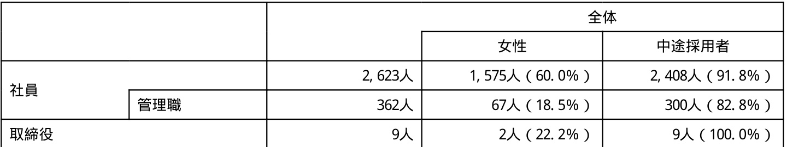

LlamaParse:
| 全体  | 女性      | 中途採用者           |
| --- | ------- | --------------- |
| 社員  | 2, 623人 | 1, 575人（60. 0％） |
| 管理職 | 362人    | 67人（18. 5％）     |
| 取締役 | 9人      | 2人（22. 2％）      |

Azure:
<table>
<tr>
<th rowspan="2"></th>
<th rowspan="2"></th>
<th colspan="2">全体</th>
</tr>
<tr>
<th>女性</th>
<th>中途採用者</th>
</tr>
<tr>
<td rowspan="2">社員 管理職</td>
<td>2,623人</td>
<td>1,575人 (60.0%)</td>
<td>2,408人 (91.8%)</td>
</tr>
<tr>
<td>362人</td>
<td>67人 (18.5%)</td>
<td>300人 (82.8%)</td>
</tr>
<tr>
<td>取締役</td>
<td>9人</td>
<td>2人 (22.2%)</td>
<td>9人 (100.0%)</td>
</tr>
</table>

DotsOCR:
<table><thead><tr><th rowspan="2"></th><th rowspan="2"></th><th colspan="2">全体</th></tr><tr><th>女性</th><th>中途採用者</th></tr></thead><tbody><tr><td rowspan="2">社員</td><td></td><td>2,623人</td><td>1,575人 (60.0%)</td><td>2,408人 (91.8%)</td></tr><tr><td>管理職</td><td>362人</td><td>67人 (18.5%)</td><td>300人 (82.8%)</td></tr><tr><td>取締役</td><td></td><td>9人</td><td>2人 (22.2%)</td><td>9人 (100.0%)</td></tr></tbody></table>

OlmOCR:
| 社員 | 女性 | 中途採用者 |
|------|------|------------|
|      | 2,623人 | 1,575人（60.0％） | 2,408人（91.8％） |
| 管理職 | 362人 | 67人（18.5％） | 300人（82.8％） |
| 取締役 | 9人 | 2人（22.2％） | 9人（100.0％） |

MinerU-2110-vlm
<table><tr><td rowspan="2" colspan="2"></td><td colspan="2">全体</td></tr><tr><td>女性</td><td>中途採用者</td></tr><tr><td rowspan="2">社員</td><td>2,623人</td><td>1,575人 (60.0%)</td><td>2,408人 (91.8%)</td></tr><tr><td>管理職</td><td>362人</td><td>67人 (18.5%)</td></tr><tr><td colspan="2">取締役</td><td>9人</td><td>2人 (22.2%)</td></tr></table>

Marker-162:
<table><tbody><tr><th></th><th></th><th colspan=3>全体</th></tr><tr><td></td><td></td><td></td><td>女性</td><td>中途採用者</td></tr><tr><td></td><td></td><td>2, 623人</td><td>1, 575人(60. 0%)</td><td>2, 408人(91. 8%)</td></tr><tr><td>社員</td><td>管理職</td><td>362人</td><td>67人(18. 5%)</td><td>300人(82. 8%)</td></tr><tr><td colspan=2>取締役</td><td>9人</td><td>2人(22. 2%)</td><td>9人(100. 0%)</td></tr></tbody></table>

MinerU-1310:
<html><body><table><tr><td colspan="2" rowspan="2"></td><td colspan="3">全体</td></tr><tr><td>女性</td><td>中途採用者</td></tr><tr><td rowspan="2">社員</td><td></td><td>2,623人</td><td>1,575人 (60.0%)</td><td>2,408人 (91.8%)</td></tr><tr><td>管理職</td><td>362人</td><td>67人 (18.5%)</td><td>300人 (82.8%)</td></tr><tr><td colspan="2">取缔役</td><td>9人</td><td>2人 (22.2%)</td><td>9人（100.0%)</td></tr></table></body></html>

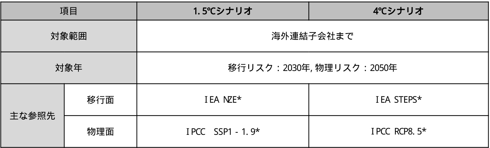

LlamaParse:
| 項目    | 1.5℃シナリオ                 | 4℃シナリオ      |
| ----- | ------------------------ | ----------- |
| 対象範囲  | 海外連結子会社まで                |             |
| 対象年   | 移行リスク：2030年, 物理リスク：2050年 |             |
| 移行面   | IEA NZE\*                | IEA STEPS\* |
| 主な参照先 | IPCC                     | CRC         |
| 物理面   | IPCC                     | RCP8.5\*    |
|       | SSP1－1.9\*               |             |

Azure:
<table>
<tr>
<th colspan="2">項目</th>
<th>1.5℃シナリオ</th>
<th>4℃シナリオ</th>
</tr>
<tr>
<td colspan="2">対象範囲</td>
<td colspan="2">海外連結子会社まで</td>
</tr>
<tr>
<td colspan="2">対象年</td>
<td colspan="2">移行リスク:2030年,物理リスク:2050年</td>
</tr>
<tr>
<td rowspan="2">主な参照先</td>
<td>移行面</td>
<td>IEA NE*</td>
<td>IEA STEPS*</td>
</tr>
<tr>
<td>物理面</td>
<td>IPCC SSP1-1.9*</td>
<td>I PCC ROP8. 5*</td>
</tr>
</table>

DotsOCR:
<table><thead><tr><th>項目</th><th colspan="2">1.5℃シナリオ</th><th>4℃シナリオ</th></tr></thead><tbody><tr><td>対象範囲</td><td colspan="3">海外連結子会社まで</td></tr><tr><td>対象年</td><td colspan="3">移行リスク:2030年,物理リスク:2050年</td></tr><tr><td rowspan="2">主な参照先</td><td>移行面</td><td>IEA NZE*</td><td>IEA STEPS*</td></tr><tr><td>物理面</td><td>IPCC SSP1-1.9*</td><td>IPCC RCP8.5*</td></tr></tbody></table>

OlmOCR:
| 項目     | 1.5℃シナリオ | 4℃シナリオ |
|----------|--------------|------------|
| 対象範囲 | 海外連結子会社まで |
| 対象年   | 移行リスク：2030年、物理リスク：2050年 |
| 主な参照先 | 移行面 | IEA NZE* | IEA STEPS* |
| 物理面   | IPCC SSP1－1.9* | IPCC RCP8.5* |

MinerU-2110-vlm
<table><tr><td colspan="2">項目</td><td>1.5℃シナリオ</td><td>4℃シナリオ</td></tr><tr><td colspan="2">对象範囲</td><td colspan="2">海外連箱子会社まぐ</td></tr><tr><td colspan="2">对象年</td><td colspan="2">移行リスク：2030年，物理リスク：2050年</td></tr><tr><td rowspan="2">主な参照先</td><td>移行面</td><td>IEA NZ*</td><td>IEA STEPS*</td></tr><tr><td>物理面</td><td>IPCC SSP1-1.9*</td><td>IPCC RCP8.5*</td></tr></table>

Marker-162:
<table><tbody><tr><th></th><th>項目</th><th colspan=4>1. 5℃シナリオ 4℃シナリオ</th></tr><tr><td colspan=2>対象範囲</td><td colspan=2>海外連結子会社まで</td></tr><tr><td colspan=2>対象年</td><td colspan=2>移行リスク:2030年, 物理リスク:2050年</td></tr><tr><td rowspan=2>主な参照先</td><td>移行面</td><td>IEA NZE*</td><td>IEA STEPS*</td></tr><tr><td>物理面</td><td>IPCC SSP1-1. 9*</td><td>IPCC RCP8. 5*</td></tr></tbody></table>

MinerU-1310:
<html><body><table><tr><td colspan="2">项目</td><td>1.5℃シリオ</td><td>4℃リオ</td></tr><tr><td colspan="2">对象範圈</td><td colspan="2">海外連結子会社ま</td></tr><tr><td colspan="2">对象年</td><td colspan="2">移行リク：2030年，物理リク：2050年</td></tr><tr><td rowspan="2">主な参照先</td><td>移行面</td><td>I EA NZE*</td><td>I EA STEPS*</td></tr><tr><td>物理面</td><td>IPCCSSP1-1.9*</td><td>I PCC RCP8.5*</td></tr></table></body></html>

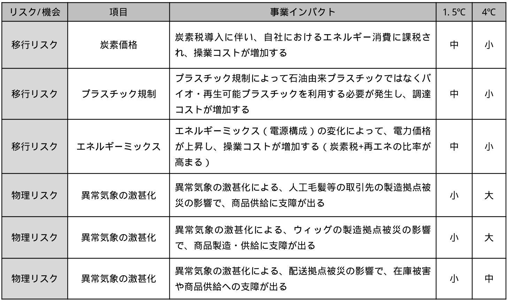

LlamaParse:
| リスク/ 機会 | 項目        | 事業インパクト                                                        | 1. 5℃ | 4℃ |   |   |
| ------- | --------- | -------------------------------------------------------------- | ----- | -- | - | - |
| 影響度     | 発生可能性     | 影響度                                                            | 発生可能性 |    |   |   |
| 中       | 小         | 小                                                              | 小     |    |   |   |
| 移行リスク   | 炭素価格      | 炭素税導入に伴い、自社におけるエネルギー消費に課税され、操業コストが増加する                         | 中     | 小  | 中 | 小 |
| 移行リスク   | プラスチック規制  | プラスチック規制によって石油由来プラスチックではなくバイオ・再生可能プラスチックを利用する必要が発生し、調達コストが増加する | 中     | 小  | 中 | 小 |
| 移行リスク   | エネルギーミックス | エネルギーミックス（電源構成）の変化によって、電力価格が上昇し、操業コストが増加する（炭素税+再エネの比率が高まる）     | 中     | 小  | 中 | 小 |
| 物理リスク   | 異常気象の激甚化  | 異常気象の激甚化による、人工毛髪等の取引先の製造拠点被災の影響で、商品供給に支障が出る                    | 小     | 大  | 小 | 大 |
| 物理リスク   | 異常気象の激甚化  | 異常気象の激甚化による、ウィッグの製造拠点被災の影響で、商品製造・供給に支障が出る                      | 小     | 大  | 小 | 大 |
| 物理リスク   | 異常気象の激甚化  | 異常気象の激甚化による、配送拠点被災の影響で、在庫被害や商品供給への支障が出る                        | 小     | 中  | 小 | 中 |

Azure:
<table>
<tr>
<th>リスク/機会</th>
<th>項目</th>
<th>事業インパクト</th>
<th>1. 5℃</th>
<th>4℃</th>
</tr>
<tr>
<td>移行リスク</td>
<td>炭素価格</td>
<td>炭素税導入に伴い、自社におけるエネルギー消費に課税さ れ、操業コストが増加する</td>
<td>中</td>
<td>小</td>
</tr>
<tr>
<td>移行リスク</td>
<td>プラスチック規制</td>
<td>プラスチック規制によって石油由来プラスチックではなくバ イオ·再生可能プラスチックを利用する必要が発生し、調達 コストが増加する</td>
<td>中</td>
<td>小</td>
</tr>
<tr>
<td>移行リスク</td>
<td>エネルギーミックス</td>
<td>エネルギーミックス(電源構成) の変化によって、電力価格 が上昇し、操業コストが増加する(炭素税+再エネの比率が 高まる)</td>
<td>中</td>
<td>小</td>
</tr>
<tr>
<td>物理リスク</td>
<td>異常気象の激甚化</td>
<td>異常気象の激甚化による、人工毛髪等の取引先の製造拠点被 災の影響で、商品供給に支障が出る</td>
<td>小</td>
<td>大</td>
</tr>
<tr>
<td>物理リスク</td>
<td>異常気象の激甚化</td>
<td>異常気象の激甚化による、ウィッグの製造拠点被災の影響 で、商品製造·供給に支障が出る</td>
<td>小</td>
<td>大</td>
</tr>
<tr>
<td>物理リスク</td>
<td>異常気象の激甚化</td>
<td>異常気象の激甚化による、配送拠点被災の影響で、在庫被害 や商品供給への支障が出る</td>
<td>小</td>
<td>中</td>
</tr>
</table>

DotsOCR:
<table><thead><tr><th>リスク/機会</th><th>項目</th><th>事業インパクト</th><th>1.5℃</th><th>4℃</th></tr></thead><tbody><tr><td>移行リスク</td><td>炭素価格</td><td>炭素税導入に伴い、自社におけるエネルギー消費に課税され、操業コストが増加する</td><td>中</td><td>小</td></tr><tr><td>移行リスク</td><td>プラスチック規制</td><td>プラスチック規制によって石油由来プラスチックではなくバイオ・再生可能プラスチックを利用する必要が発生し、調達コストが増加する</td><td>中</td><td>小</td></tr><tr><td>移行リスク</td><td>エネルギーミックス</td><td>エネルギーミックス(電源構成)の変化によって、電力価格が上昇し、操業コストが増加する(炭素税+再エネの比率が高まる)</td><td>中</td><td>小</td></tr><tr><td>物理リスク</td><td>異常気象の激甚化</td><td>異常気象の激甚化による、人工毛髪等の取引先の製造拠点被災の影響で、商品供給に支障が出る</td><td>小</td><td>大</td></tr><tr><td>物理リスク</td><td>異常気象の激甚化</td><td>異常気象の激甚化による、ウィッグの製造拠点被災の影響で、商品製造・供給に支障が出る</td><td>小</td><td>大</td></tr><tr><td>物理リスク</td><td>異常気象の激甚化</td><td>異常気象の激甚化による、配送拠点被災の影響で、在庫被害や商品供給への支障が出る</td><td>小</td><td>中</td></tr></tbody></table>

OlmOCR:
| リスク/機会 | 項目 | 事業インパクト | 1.5℃ | 4℃ |
|-------------|------|----------------|------|-----|
| 移行リスク | 炭素価格 | 炭素税導入に伴い、自社におけるエネルギー消費に課税され、操業コストが増加する | 中 | 小 |
| 移行リスク | プラスチック規制 | プラスチック規制によって石油由来プラスチックではなくバイオ・再生可能プラスチックを利用する必要が発生し、調達コストが増加する | 中 | 小 |
| 移行リスク | エネルギーミックス | エネルギーミックス（電源構成）の変化によって、電力価格が上昇し、操業コストが増加する（炭素税+再エネの比率が高まる） | 中 | 小 |
| 物理リスク | 異常気象の激甚化 | 異常気象の激甚化による、人工毛髪等の取引先の製造拠点被災の影響で、商品供給に支障が出る | 小 | 大 |
| 物理リスク | 異常気象の激甚化 | 異常気象の激甚化による、ウィッグの製造拠点被災の影響で、商品製造・供給に支障が出る | 小 | 大 |
| 物理リスク | 異常気象の激甚化 | 異常気象の激甚化による、配送拠点被災の影響で、在庫被害や商品供給への支障が出る | 小 | 中 |

MinerU-2110-vlm

<table><tr><td>15℃</td><td>4℃</td><td></td><td></td><td></td></tr><tr><td>移行リスク</td><td>炭素価格</td><td>炭素税導入に伴い、自社におけるエネルギー消費に課税され、操業コストが増加する</td><td>中</td><td>小</td></tr><tr><td>移行リスク</td><td>ラスチック規制</td><td>ラスチック規制による石油由来ラスチックではないスイオ・再生可能ラスチックを利用する必要が発生し、調達コストが増加する</td><td>中</td><td>小</td></tr><tr><td>移行リスク</td><td>エネルギーテラス</td><td>エネルギーテラス（電源構成）の変化によるで、電力価格が上昇し、操業コストが増加する（炭素税+再エネの比率が高まる）</td><td>中</td><td>小</td></tr><tr><td>物理リスク</td><td>異常気象の激甚化</td><td>異常気象の激甚化による、人工毛髪等の収引先の製造拠点被災の影響で、商品供給に支障が出る</td><td>小</td><td>大</td></tr><tr><td>物理リスク</td><td>異常気象の激甚化</td><td>異常気象の激甚化による、ラスラクの製造拠点被災の影響で、商品製造・供給に支障が出る</td><td>小</td><td>大</td></tr><tr><td>物理リスク</td><td>異常気象の激甚化</td><td>異常気象の激甚化による、配送拠点被災の影響で、在庫被害や商品供給への支障が出る</td><td>小</td><td>中</td></tr></table>

Marker-162:
<table><tbody><tr><th>リスク/機会</th><th>項目</th><th>事業インパクト</th><th>1. 5℃</th><th>4℃</th></tr><tr><td>移行リスク</td><td>炭素価格</td><td>炭素税導入に伴い、自社におけるエネルギー消費に課税さ れ、操業コストが増加する</td><td>中</td><td>小</td></tr><tr><td>移行リスク</td><td>プラスチック規制</td><td>プラスチック規制によって石油由来プラスチックではなくバ イオ・再生可能プラスチックを利用する必要が発生し、調達 コストが増加する</td><td>中</td><td>小</td></tr><tr><td>移行リスク</td><td>エネルギーミックス</td><td>エネルギーミックス(電源構成)の変化によって、電力価格 が上昇し、操業コストが増加する(炭素税+再エネの比率が 高まる)</td><td>中</td><td>小</td></tr><tr><td>物理リスク</td><td>異常気象の激甚化</td><td>異常気象の激甚化による、人工毛髪等の取引先の製造拠点被 災の影響で、商品供給に支障が出る</td><td>小</td><td>大</td></tr><tr><td>物理リスク</td><td>異常気象の激甚化</td><td>異常気象の激甚化による、ウィッグの製造拠点被災の影響 で、商品製造・供給に支障が出る</td><td>小</td><td>大</td></tr><tr><td>物理リスク</td><td>異常気象の激甚化</td><td>異常気象の激甚化による、配送拠点被災の影響で、在庫被害 や商品供給への支障が出る</td><td>小</td><td>中</td></tr></tbody></table>

MinerU-1310:
<html><body><table><tr><td>）スク/機会</td><td>项目</td><td>事業ト</td><td>1.5°℃</td><td>4℃</td></tr><tr><td>移行リク</td><td>炭素倆格</td><td>炭素税導に伴い、自社におけるルー消費に課税 れ、操業□ス卜か增加す</td><td>中</td><td>小</td></tr><tr><td>移行リク</td><td>ラク規制</td><td>ラク規制によ石油由ラクでは 才·再生可能ラチクを利用る必要が生し、調達 ト增加</td><td>中</td><td>小</td></tr><tr><td>移行リク</td><td>工礻ル戈一三クス</td><td>工ーミク（電源構成）の変化によー、電力倆格 が上昇し、操業コトか增加する（炭素税+再工の比率か 高まる）</td><td>中</td><td>小</td></tr><tr><td>物理ク</td><td>異常氨象の激甚化</td><td>異常氨象の激甚化よ、人工毛髪等の取引先の製造抛点被 災の影響で、商品供給に支障が出</td><td>小</td><td>大</td></tr><tr><td>物理リク</td><td>異常氨象の激甚化</td><td>異常気象の激甚化による、イの製造点被災の影響 、商品製造·供給に支障が出</td><td>小</td><td>大</td></tr><tr><td>物理リク</td><td>異常気象の激甚化</td><td>異常氨象の激甚化よ、配送抛点被災の影響、在庫被害 や商品供給^の支障か出る</td><td>小</td><td>中</td></tr></table></body></html>  

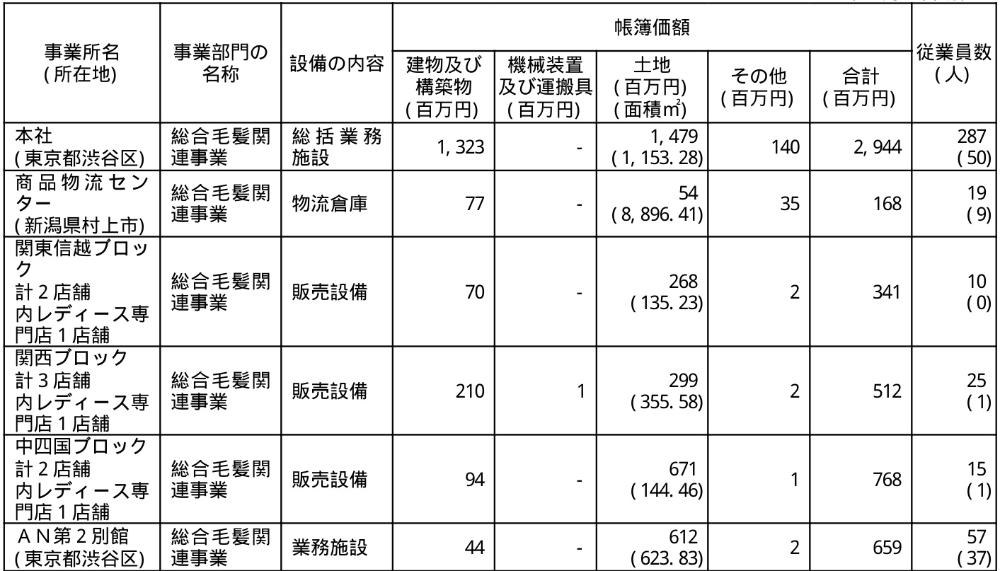

LlamaParse:
| 事業所名              | 事業部門の名称  | 設備の内容  | 建物及び構築物 (百万円) | 機械装置及び運搬具 (百万円) | 土地 (百万円)   | 合計 (百万円) | 従業員数 (人) |     |
| ----------------- | -------- | ------ | ------------- | --------------- | ---------- | -------- | -------- | --- |
| 本社 (東京都渋谷区)       | 総合毛髪関連事業 | 総括業務施設 | 1,323         | -               | 1,479      | 140      | 2,944    | 287 |
| 商品物流センター (新潟県村上市) | 総合毛髪関連事業 | 物流倉庫   | 77            | -               | (8,896.41) | 35       | 168      | (9) |
| 関東信越ブロック          | 総合毛髪関連事業 | 販売設備   | 70            | -               | (135.23)   | 2        | 341      | (0) |
| 関西ブロック            | 総合毛髪関連事業 | 販売設備   | 210           | 1               | 299        | -        | 512      | 25  |
| 中四国ブロック           | 総合毛髪関連事業 | 販売設備   | 94            | -               | 671        | -        | 768      | 15  |
| ＡＮ第２別館 (東京都渋谷区)   | 総合毛髪関連事業 | 業務施設   | 44            | -               | 612        | -        | 659      | 57  |

Azure:
<table>
<tr>
<th rowspan="2">事業所名 (所在地)</th>
<th rowspan="2">事業部門の 名称</th>
<th rowspan="2">設備の内容</th>
<th colspan="5">帳簿価額</th>
<th rowspan="2">従業員数 (人)</th>
</tr>
<tr>
<th>建物及び 構築物 (百万円)</th>
<th>機械装置 及び運搬具 (百万円)</th>
<th>土地 (百万円) (面積m2)</th>
<th>その他 (百万円)</th>
<th>合計 (百万円)</th>
</tr>
<tr>
<td>本社 (東京都渋谷区)</td>
<td>総合毛髪関 連事業</td>
<td>総括業務 施設</td>
<td>1,323</td>
<td>-</td>
<td>1,479 ( 1, 153. 28)</td>
<td>140</td>
<td>2,944</td>
<td>287 (50)</td>
</tr>
<tr>
<td>商品物流セン ター (新潟県村上市)</td>
<td>総合毛髮関 連事業</td>
<td>物流倉庫</td>
<td>77</td>
<td>-</td>
<td>54 (8, 896. 41)</td>
<td>35</td>
<td>168</td>
<td>19 (9)</td>
</tr>
<tr>
<td>関東信越ブロッ ク 計2店舗 内レディース専 門店 1 店舗</td>
<td>総合毛髮関 連事業</td>
<td>販売設備</td>
<td>70</td>
<td>-</td>
<td>268 ( 135. 23)</td>
<td>2</td>
<td>341</td>
<td>10 (0)</td>
</tr>
<tr>
<td>関西ブロック 計3店舗 内レディース専 門店 1 店舗</td>
<td>総合毛髮関 連事業</td>
<td>販売設備</td>
<td>210</td>
<td>1</td>
<td>299 ( 355. 58)</td>
<td>2</td>
<td>512</td>
<td>25 (1)</td>
</tr>
<tr>
<td>中四国ブロック 計2店舗 内レディース専 門店 1 店舗</td>
<td>総合毛髮関 連事業</td>
<td>販売設備</td>
<td>94</td>
<td>-</td>
<td>671 ( 144. 46)</td>
<td>1</td>
<td>768</td>
<td>15 (1)</td>
</tr>
<tr>
<td>AN第2別館 (東京都渋谷区)</td>
<td>総合毛髮関 連事業</td>
<td>業務施設</td>
<td>44</td>
<td>-</td>
<td>612 ( 623. 83)</td>
<td>2</td>
<td>659</td>
<td>57 (37)</td>
</tr>
</table>

DotsOCR:
<table><thead><tr><th rowspan="2">事業所名 (所在地)</th><th rowspan="2">事業部門の 名称</th><th rowspan="2">設備の内容</th><th colspan="5">帳簿価額</th><th rowspan="2">従業員数 (人)</th></tr><tr><th>建物及び 構築物 (百万円)</th><th>機械装置 及び運搬具 (百万円)</th><th>土地 (百万円) (面積㎡)</th><th>その他 (百万円)</th><th>合計 (百万円)</th></tr></thead><tbody><tr><td>本社 (東京都渋谷区)</td><td>総合毛髪関連事業</td><td>総括業務 施設</td><td>1,323</td><td>-</td><td>1,479 (1,153.28)</td><td>140</td><td>2,944</td><td>287 (50)</td></tr><tr><td>商品物流センター (新潟県村上市)</td><td>総合毛髪関連事業</td><td>物流倉庫</td><td>77</td><td>-</td><td>54 (8,896.41)</td><td>35</td><td>168</td><td>19 (9)</td></tr><tr><td>関東信越ブロック 計2店舗 内レディース専門店1店舗</td><td>総合毛髪関連事業</td><td>販売設備</td><td>70</td><td>-</td><td>268 (135.23)</td><td>2</td><td>341</td><td>10 (0)</td></tr><tr><td>関西ブロック 計3店舗 内レディース専門店1店舗</td><td>総合毛髪関連事業</td><td>販売設備</td><td>210</td><td>1</td><td>299 (355.58)</td><td>2</td><td>512</td><td>25 (1)</td></tr><tr><td>中四国ブロック 計2店舗 内レディース専門店1店舗</td><td>総合毛髪関連事業</td><td>販売設備</td><td>94</td><td>-</td><td>671 (144.46)</td><td>1</td><td>768</td><td>15 (1)</td></tr><tr><td>AN第2別館 (東京都渋谷区)</td><td>総合毛髪関連事業</td><td>業務施設</td><td>44</td><td>-</td><td>612 (623.83)</td><td>2</td><td>659</td><td>57 (37)</td></tr></tbody></table>

OlmOCR:
| 事業所名 (所在地) | 事業部門の名称 | 設備の内容 | 帳簿価額 | 従業員数 (人) |
|-------------------|----------------|------------|----------|---------------|
| 本社 (東京都渋谷区) | 総合毛髪関連事業 | 総合業務施設 | 1,323 | - | 1,479 (1,153.28) | 140 | 2,944 | 287 (50) |
| 商業物流センター (新潟県村上市) | 総合毛髪関連事業 | 物流倉庫 | 77 | - | 54 (8,896.41) | 35 | 168 | 19 (9) |
| 関東信越ブロック 計2店舗 内レディース専門店1店舗 | 総合毛髪関連事業 | 販売設備 | 70 | - | 268 (135.23) | 2 | 341 | 10 (0) |
| 関西ブロック 計3店舗 内レディース専門店1店舗 | 総合毛髪関連事業 | 販売設備 | 210 | 1 | 299 (355.58) | 2 | 512 | 25 (1) |
| 中四国ブロック 計2店舗 内レディース専門店1店舗 | 総合毛髪関連事業 | 販売設備 | 94 | - | 671 (144.46) | 1 | 768 | 15 (1) |
| AN第2別館 (東京都渋谷区) | 総合毛髪関連事業 | 業務施設 | 44 | - | 612 (623.83) | 2 | 659 | 57 (37) |

MinerU-2110-vlm
<table><tr><td rowspan="2">事業所名(所在地)</td><td rowspan="2">事業部門の名称</td><td rowspan="2">設備の内容</td><td colspan="5">帳簿価額</td><td rowspan="2">從業員数(人)</td></tr><tr><td>建物及で構築物(百万円)</td><td>機械設置及で連載員(百万円)</td><td>土地(百万円)(面積m)</td><td>その他(百万円)</td><td>合計(百万円)</td></tr><tr><td>本社(東京都済谷区)</td><td>総合毛髪関連事業</td><td>経括業務施設</td><td>1,323</td><td>-</td><td>1,479(1,153.28)</td><td>140</td><td>2,944</td><td>287(50)</td></tr><tr><td>商品物流センター(新潟県村上市)</td><td>総合毛髪関連事業</td><td>物流倉庫</td><td>77</td><td>-</td><td>54(8,896.41)</td><td>35</td><td>168</td><td>19(3)</td></tr><tr><td>関東信越アロッラ2店舗内レディース専門店1店舗</td><td>総合毛髪関連事業</td><td>販売設備</td><td>70</td><td>-</td><td>268(135.23)</td><td>2</td><td>341</td><td>10(0)</td></tr><tr><td>関西アロッラ3店舗内レディース専門店1店舗</td><td>総合毛髪関連事業</td><td>販売設備</td><td>210</td><td>1</td><td>299(355.58)</td><td>2</td><td>512</td><td>25(1)</td></tr><tr><td>中四国アロッラ2店舗内レディース専門店1店舗</td><td>総合毛髪関連事業</td><td>販売設備</td><td>94</td><td>-</td><td>671(144.46)</td><td>1</td><td>768</td><td>15(1)</td></tr><tr><td>AN第2別館(東京都済谷区)</td><td>総合毛髪関連事業</td><td>業務施設</td><td>44</td><td>-</td><td>612(623.83)</td><td>2</td><td>659</td><td>57(37)</td></tr></table>

Marker-162:
TextInlineMath (failed)

MinerU-1310:
<html><body><table><tr><td rowspan="2">事業所名 (所在地)</td><td rowspan="2">事業部門の 名称</td><td rowspan="2">設備の内容</td><td colspan="5">帳簿佃額</td><td rowspan="2">從業員数 （人）</td></tr><tr><td>建物及 精物</td><td>機械装置 及具</td><td>土地 （面m）</td><td>の他 (百万門)</td><td>合計 (百万門)</td></tr><tr><td>京都涉谷区)</td><td>髪</td><td>括業務</td><td>1,323</td><td></td><td>(1, 153.79</td><td>140</td><td>2, 944</td><td>287</td></tr><tr><td>商品物流七 夕一 (新渴鼎村上市)</td><td>総合毛髪闋 連事業</td><td>物流倉库</td><td>77</td><td></td><td>54 (8,896.41)</td><td>35</td><td>168</td><td>19 (9)</td></tr><tr><td>東信越□ 2惠 門店1店舖</td><td>髪</td><td>販壳設備</td><td>70</td><td></td><td>(135.28)</td><td>2</td><td>341</td><td>10</td></tr><tr><td>西口ク 門店1店舖</td><td>總髪</td><td>販壳設備</td><td>210</td><td>1</td><td>(355.5)</td><td>2</td><td>512</td><td>25</td></tr><tr><td>中四国</td><td>髪</td><td>販壳設備</td><td>94</td><td></td><td>(144.7)</td><td>1</td><td>768</td><td>5</td></tr><tr><td>門店1店舖 京</td><td>髪</td><td>業務施設</td><td>44</td><td></td><td>(623.12)</td><td>2</td><td>659</td><td>37</td></tr></table></body></html>

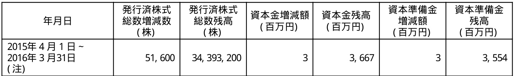

LlamaParse:
| 年月日                  | 発行済株式総数増減数 (株) | 発行済株式総数残高 (株) | 資本金増減額 (百万円) | 資本金残高 (百万円) | 資本準備金増減額 (百万円) | 資本準備金残高 (百万円) |
| -------------------- | -------------- | ------------- | ------------ | ----------- | -------------- | ------------- |
| 2015年４月１日～2016年３月31日 | 51,600         | 34,393,200    | 3            | 3,667       | 3              | 3,554         |

Azure:
<table>
<tr>
<th>年月日</th>
<th>発行済株式 総数増減数 (株)</th>
<th>発行済株式 総数残高 (株)</th>
<th>資本金増減額 (百万円)</th>
<th>資本金残高 (百万円)</th>
<th>資本準備金 増減額 (百万円)</th>
<th>資本準備金 残高 (百万円)</th>
</tr>
<tr>
<td>2015年4月1日~ 2016年3月31日 (注)</td>
<td>51,600</td>
<td>34, 393, 200</td>
<td>3</td>
<td>3, 667</td>
<td>3</td>
<td>3,554</td>
</tr>
</table>

DotsOCR:
<table><thead><tr><th>年月日</th><th>発行済株式 総数増減数 (株)</th><th>発行済株式 総数残高 (株)</th><th>資本金増減額 (百万円)</th><th>資本金残高 (百万円)</th><th>資本準備金 増減額 (百万円)</th><th>資本準備金 残高 (百万円)</th></tr></thead><tbody><tr><td>2015年4月1日~ 2016年3月31日 (注)</td><td>51,600</td><td>34,393,200</td><td>3</td><td>3,667</td><td>3</td><td>3,554</td></tr></tbody></table>

OlmOCR:
| 年月日 | 発行済株式総数増減数（株） | 発行済株式総数残高（株） | 資本金増減額（百万円） | 資本金残高（百万円） | 資本準備金増減額（百万円） | 資本準備金残高（百万円） |
|--------|--------------------------|--------------------------|----------------------|---------------------|--------------------------|--------------------------|
| 2015年4月1日～2016年3月31日（注） | 51,600 | 34,393,200 | 3 | 3,667 | 3 | 3,554 |

MinerU-2110-vlm
<table><tr><td>年月日</td><td>発行济株式総数増減数(株)</td><td>発行济株式総数残高(株)</td><td>資本金増減額(百万円)</td><td>資本金残高(百万円)</td><td>資本準備金增減額(百万円)</td><td>資本準備金残高(百万円)</td></tr><tr><td>2015年4月1日～2016年3月31日(注)</td><td>51,600</td><td>34,393,200</td><td>3</td><td>3,667</td><td>3</td><td>3,554</td></tr></table>

Marker-162:
<table><tbody><tr><th>年月日</th><th>発行済株式 総数増減数 ( 株)</th><th>発行済株式 総数残高 ( 株)</th><th>資本金増減額 ( 百万円)</th><th>資本金残高 ( 百万円)</th><th>資本準備金 増減額 ( 百万円)</th><th>資本準備金 残高 ( 百万円)</th></tr><tr><td>2015年4月1日~ 2016年3月31日 ( 注)</td><td>51, 600</td><td>34, 393, 200</td><td>3</td><td>3, 667</td><td>3</td><td>3, 554</td></tr></tbody></table>

MinerU-1310:
<html><body><table><tr><td>年月日</td><td>龚行济株式 総数增減数 (株)</td><td>龚行济株式 総数残高 (株)</td><td>资本金增減额 (百万門)</td><td>资本金残高 (百万門)</td><td>资本準備金 增減额 (百万門)</td><td>资本準備金 残高 (百万門)</td></tr><tr><td>2015年4月1日～ 2016年3月31日 (注)</td><td>51,600</td><td>34,393,200</td><td>3</td><td>3,667</td><td>3</td><td>3,554</td></tr></table></body></html>

LlamaParse:
| 细分行业  | 主要治疗领域    | 药（产）品名称     | 注册分类     | 适应症或功能主治         | 是否属 |   | 发明专利起止期（如适用）                                | 报告期内纳入 |   |   |   |   |   |   |   |
| ----- | --------- | ----------- | -------- | ---------------- | --- | - | ------------------------------------------- | ------ | - | - | - | - | - | - | - |
| 中药    | 保护品种（如涉及） | 国家基药目录      | 国家医保目录   | 省级医保目录           |     |   |                                             |        |   |   |   |   |   |   |   |
| 化学制剂  | 泌尿系统类     | 爱普列特片       | 化学药品 1 类 | 前列腺增生            | 是   | 否 | 2009.08.28-2029.08.28；2006.07.27-2026.07.27 | 否      | 否 | 是 | 否 |   |   |   |   |
| 化学制剂  | 抗生素类      | 盐酸多西环素片     |          | 抗感染              | 是   | 否 | 2010.04.15-2030.04.15                       | 否      | 是 | 是 | 否 |   |   |   |   |
| 化学制剂  | 抗过敏类      | 依巴斯汀片       | 化学药品 2 类 | 抗过敏              | 是   | 否 | 2014.08.01-2034.08.01；2019.01.23-2039.01.23 | 否      | 否 | 是 | 否 |   |   |   |   |
| 化学制剂  | 抗生素类      | 硫酸黏菌素片      |          | 抗感染              | 是   | 否 |                                             | 否      | 是 | 是 | 否 |   |   |   |   |
| 化学制剂  | 泌尿系统类     | 盐酸达泊西汀片     | 化学药品 4 类 | 治疗早泄药物           | 是   | 否 |                                             | 否      | 否 | 否 | 否 |   |   |   |   |
| 化学原料药 | 毛细血管类     | 地奥司明        |          | 血管保护和毛细血管稳定剂     | 否   | 否 |                                             | 否      | 否 | 否 | 否 |   |   |   |   |
| 化学制剂  | 抗胆碱药和胃动力药 | 盐酸屈他维林注射液   |          | 用于胃肠道痉挛、应激性肠道综合症 | 是   | 否 | 2016.12.26-2036.12.26                       | 否      | 否 | 否 | 是 |   |   |   |   |
| 化学制剂  | 抗过敏类      | 敏迪（特非那定）片   | 化学药品 2 类 | 抗过敏              | 是   | 否 |                                             | 否      | 否 | 否 | 是 |   |   |   |   |
| 化学制剂  | 心血管类      | 联环尔定（非洛地平片） | 化学药品 4 类 | 抗高血压             | 是   | 否 |                                             | 否      | 是 | 是 | 否 |   |   |   |   |

Azure:
<table>
<tr>
<th>细分 行业</th>
<th>主要治 疗领域</th>
<th>药(产) 品名称</th>
<th>注册分 类</th>
<th>适应症或 功能主治</th>
<th>是否处方药</th>
<th>是否属 于中药 保护品 种(如 涉及)</th>
<th>发明专利起止期 限(如适用)</th>
<th>是否属于 报告期内 推出的新 药(产) 品</th>
<th>是否 纳入 国家 基药 目录</th>
<th>是否 纳入 国家 医保 目录</th>
<th>是否 纳入 省级 医保 目录</th>
</tr>
<tr>
<td>化学 制剂</td>
<td>泌尿系 统类</td>
<td>爱普列特 片</td>
<td>化学药 品1类</td>
<td>前列腺增 生</td>
<td>是</td>
<td>否</td>
<td>2009. 08. 28- 2029.08.28; 2006. 07.27- 2026.07.27</td>
<td>否</td>
<td>否</td>
<td>是</td>
<td>否</td>
</tr>
<tr>
<td>化学 制剂</td>
<td>抗生素 类</td>
<td>盐酸多西 环素片</td>
<td></td>
<td>抗感染</td>
<td>是</td>
<td>否</td>
<td></td>
<td>否</td>
<td>是</td>
<td>是</td>
<td>否</td>
</tr>
<tr>
<td>化学 制剂</td>
<td>抗过敏 类</td>
<td>依巴斯汀 片</td>
<td>化学药 品2类</td>
<td>抗过敏</td>
<td>是</td>
<td>否</td>
<td>2010. 04. 15- 2030. 04. 15; 2014. 08. 01- 2034. 08. 01 2019. 01. 23–– 2039.01.23</td>
<td>否</td>
<td>否</td>
<td>是</td>
<td>否</td>
</tr>
<tr>
<td>化学 制剂</td>
<td>抗生素 类</td>
<td>硫酸黏菌 素片</td>
<td></td>
<td>抗感染</td>
<td>是</td>
<td>否</td>
<td></td>
<td></td>
<td>否</td>
<td>是</td>
<td></td>
</tr>
<tr>
<td>化学 制剂</td>
<td>泌尿系 统类</td>
<td>盐酸达泊 西汀片</td>
<td>化学药 品4类</td>
<td>治疗早泄 药物</td>
<td>是</td>
<td>否</td>
<td></td>
<td></td>
<td>否</td>
<td>否</td>
<td></td>
</tr>
<tr>
<td>化学 原料 药</td>
<td>毛细血 管类</td>
<td>地奥司明</td>
<td></td>
<td>血管保护 和毛细血 管稳定剂</td>
<td>否</td>
<td>否</td>
<td></td>
<td>否</td>
<td>否</td>
<td>否</td>
<td>否</td>
</tr>
<tr>
<td>针剂</td>
<td>胃肠解 痉药, 抗胆碱 药和胃 动力药</td>
<td>盐酸屈他 维林注射 液</td>
<td></td>
<td>用于胃肠 道痉挛、 应激性肠 道综合症 泌尿系结 石等</td>
<td>是</td>
<td>否</td>
<td>2016. 12. 26- 2036. 12. 26</td>
<td>否</td>
<td>否</td>
<td>否</td>
<td>是</td>
</tr>
<tr>
<td>化学 制剂</td>
<td>抗过敏 类</td>
<td>敏迪(特 非那定 片)</td>
<td>化学药 品2类</td>
<td>抗过敏</td>
<td>是</td>
<td>否</td>
<td></td>
<td>否</td>
<td>否</td>
<td>否</td>
<td>是</td>
</tr>
<tr>
<td>化学 制剂</td>
<td>心血管 类</td>
<td>联环尔定 (非洛地 平片)</td>
<td>化学药 品4类</td>
<td>抗高血压</td>
<td>是</td>
<td>否</td>
<td></td>
<td>否</td>
<td>是</td>
<td>是</td>
<td>否</td>
</tr>
</table>

DotsOCR:
<table><thead><tr><th>细分行业</th><th>主要治疗领域</th><th>药(产)品名称</th><th>注册分类</th><th>适应症或功能主治</th><th>是否处方药</th><th>是否属于中药保护品种(如涉及)</th><th>发明专利起止期限(如适用)</th><th>是否属于报告期内推出的新药(产品)</th><th>是否纳入国家基药目录</th><th>是否纳入国家医保目录</th><th>是否纳入省级医保目录</th></tr></thead><tbody><tr><td>化学制剂</td><td>泌尿系统类</td><td>爱普列特片</td><td>化学药品1类</td><td>前列腺增生</td><td>是</td><td>否</td><td>2009.08.28-2029.08.28; 2006.07.27-2026.07.27</td><td>否</td><td>否</td><td>是</td><td>否</td></tr><tr><td>化学制剂</td><td>抗生素类</td><td>盐酸多西环素片</td><td></td><td>抗感染</td><td>是</td><td>否</td><td></td><td>否</td><td>是</td><td>是</td><td>否</td></tr><tr><td>化学制剂</td><td>抗过敏类</td><td>依巴斯汀片</td><td>化学药品2类</td><td>抗过敏</td><td>是</td><td>否</td><td>2010.04.15-2030.04.15; 2014.08.01-2034.08.01 2019.01.23-2039.01.23</td><td>否</td><td>否</td><td>是</td><td>否</td></tr><tr><td>化学制剂</td><td>抗生素类</td><td>硫酸黏菌素片</td><td></td><td>抗感染</td><td>是</td><td>否</td><td></td><td>否</td><td>是</td><td></td><td></td></tr><tr><td>化学制剂</td><td>泌尿系统类</td><td>盐酸达泊西汀片</td><td>化学药品4类</td><td>治疗早泄药物</td><td>是</td><td>否</td><td></td><td>否</td><td>否</td><td></td><td></td></tr><tr><td>化学原料药</td><td>毛细血管类</td><td>地奥司明</td><td></td><td>血管保护和毛细血管稳定剂</td><td>否</td><td>否</td><td></td><td>否</td><td>否</td><td>否</td><td>否</td></tr><tr><td>针剂</td><td>胃肠解痉药,抗胆碱药和胃动力药</td><td>盐酸屈他维林注射液</td><td></td><td>用于胃肠道痉挛、应激性肠道综合症泌尿系结石等</td><td>是</td><td>否</td><td>2016.12.26-2036.12.26</td><td>否</td><td>否</td><td>否</td><td>是</td></tr><tr><td>化学制剂</td><td>抗过敏类</td><td>敏迪(特非那定片)</td><td>化学药品2类</td><td>抗过敏</td><td>是</td><td>否</td><td></td><td>否</td><td>否</td><td>否</td><td>是</td></tr><tr><td>化学制剂</td><td>心血管类</td><td>联环尔定(非洛地平片)</td><td>化学药品4类</td><td>抗高血压</td><td>是</td><td>否</td><td></td><td>否</td><td>是</td><td>是</td><td>否</td></tr></tbody></table>

OlmOCR:

| 细分行业 | 主要治疗领域 | 药（产）品名称 | 注册分类 | 适应症或功能主治 | 是否处方药 | 是否属于中药保护品种（如涉及） | 发明专利起止期限（如适用） | 是否属于报告期内推出的新药（产品） | 是否纳入国家基药目录 | 是否纳入国家医保目录 | 是否纳入省级医保目录 |
|-----------|--------------|----------------|----------|------------------|------------|---------------------------------|----------------------------|-------------------------------------|----------------------|----------------------|----------------------|
| 化学制剂 | 泌尿系统类   | 爱普列特片     | 化学药品1类 | 前列腺增生       | 是         | 否                              | 2009.08.28~2029.08.28;2006.07.27~2026.07.27 | 否                                  | 否                   | 是                   | 否                   |
| 化学制剂 | 抗生素类     | 盐酸多西环素片 | 化学药品1类 | 抗感染           | 是         | 否                              | 2010.04.15~2030.04.15;2014.08.01~2034.08.01;2019.01.23~2039.01.23 | 否                                  | 否                   | 是                   | 否                   |
| 化学制剂 | 抗过敏类     | 依巴斯汀片     | 化学药品2类 | 抗过敏           | 是         | 否                              | 2010.04.15~2030.04.15;2014.08.01~2034.08.01;2019.01.23~2039.01.23 | 否                                  | 否                   | 是                   | 否                   |
| 化学制剂 | 抗生素类     | 硫酸黏菌素片   | 化学药品4类 | 抗感染           | 是         | 否                              | 2010.04.15~2030.04.15;2014.08.01~2034.08.01;2019.01.23~2039.01.23 | 否                                  | 否                   | 是                   | 否                   |
| 化学制剂 | 泌尿系统类   | 盐酸达泊西汀片 | 化学药品4类 | 治疗早泄药物     | 是         | 否                              | 2010.04.15~2030.04.15;2014.08.01~2034.08.01;2019.01.23~2039.01.23 | 否                                  | 否                   | 否                   | 否                   |
| 化学原料药 | 毛细血管类   | 地奥司明       | 化学药品4类 | 血管保护和毛细血管稳定剂 | 否         | 否                              | 2010.04.15~2030.04.15;2014.08.01~2034.08.01;2019.01.23~2039.01.23 | 否                                  | 否                   | 否                   | 否                   |
| 针剂      | 胃肠解痉药，抗胆碱药和胃动力药 | 盐酸屈他维林注射液 | 化学药品2类 | 用于胃肠道痉挛、应激性肠道综合症泌尿系结石等 | 是         | 否                              | 2010.04.15~2030.04.15;2014.08.01~2034.08.01;2019.01.23~2039.01.23 | 否                                  | 否                   | 否                   | 是                   |
| 化学制剂 | 抗过敏类     | 敏迪（特非那定片） | 化学药品2类 | 抗过敏           | 是         | 否                              | 2010.04.15~2030.04.15;2014.08.01~2034.08.01;2019.01.23~2039.01.23 | 否                                  | 否                   | 否                   | 是                   |
| 化学制剂 | 心血管类     | 联环尔定（非洛地平片） | 化学药品4类 | 抗高血压         | 是         | 否                              | 2010.04.15~2030.04.15;2014.08.01~2034.08.01;2019.01.23~2039.01.23 | 否                                  | 否                   | 是                   | 否                   |

MinerU-2110-vlm
<table><tr><td>细分行业</td><td>主要治疗领域</td><td>药（产）品名称</td><td>注册分类</td><td>适应症或功能主治</td><td>是否处方药</td><td>是否属于中药保护品种（如涉及）</td><td>发明专利起止期限（如适用）</td><td>是否属于报告期内推出的新药（产）品</td><td>是否纳入国家基药目录</td><td>是否纳入国家医保目录</td><td>是否纳入省级医保目录</td></tr><tr><td>化学制剂</td><td>泌尿系统类</td><td>爱普列特片</td><td>化学药品1类</td><td>前列腺增生</td><td>是</td><td>否</td><td>2009.08.28-2029.08.28-2006.07.27-2026.07.27</td><td>否</td><td>否</td><td>是</td><td>否</td></tr><tr><td>化学制剂</td><td>抗生素类</td><td>盐酸多西环素片</td><td></td><td>抗感染</td><td>是</td><td>否</td><td></td><td>否</td><td>是</td><td>是</td><td>否</td></tr><tr><td>化学制剂</td><td>抗过敏类</td><td>依巴斯汀片</td><td>化学药品2类</td><td>抗过敏</td><td>是</td><td>否</td><td>2010.04.15-2030.04.15-2014.08.01-2034.08.01-2019.01.23-2039.01.23</td><td>否</td><td>否</td><td>是</td><td>否</td></tr><tr><td>化学制剂</td><td>抗生素类</td><td>硫酸黏菌素片</td><td></td><td>抗感染</td><td>是</td><td>否</td><td></td><td></td><td>否</td><td>是</td><td></td></tr><tr><td>化学制剂</td><td>泌尿系统类</td><td>盐酸达泊西汀片</td><td>化学药品4类</td><td>治疗早泄药物</td><td>是</td><td>否</td><td></td><td></td><td>否</td><td>否</td><td></td></tr><tr><td>化学原料药</td><td>毛细血管类</td><td>地奥司明</td><td></td><td>血管保护和毛细血管稳定剂</td><td>否</td><td>否</td><td></td><td>否</td><td>否</td><td>否</td><td>否</td></tr><tr><td>针剂</td><td>胃肠解痉药，抗胆碱药和胃动力药</td><td>盐酸屈他维林注射液</td><td></td><td>用于胃肠道痉挛、应激性肠道综合症泌尿系结石等</td><td>是</td><td>否</td><td>2016.12.26-2036.12.26</td><td>否</td><td>否</td><td>否</td><td>是</td></tr><tr><td>化学制剂</td><td>抗过敏类</td><td>敏迪（特非那定片）</td><td>化学药品2类</td><td>抗过敏</td><td>是</td><td>否</td><td></td><td>否</td><td>否</td><td>否</td><td>是</td></tr><tr><td>化学制剂</td><td>心血管类</td><td>联环尔定（非洛地平片）</td><td>化学药品4类</td><td>抗高血压</td><td>是</td><td>否</td><td></td><td>否</td><td>是</td><td>是</td><td>否</td></tr></table>

Marker-162:
<table><tbody><tr><th>细分 行业</th><th>主要治 疗领域</th><th>药(产) 品名称</th><th>注册分 类</th><th>适应症或 功能主治</th><th>是 否 处 方 药</th><th>是否属 于中药 保护品 种(如 涉及)</th><th>发明专利起止期 限(如适用)</th><th>是否属于 报告期内 推出的新 药(产) 品</th><th>是否 纳入 国家 基药 目录</th><th>是否 纳入 国家 医保 目录</th><th>是否 纳入 省级 医保 目录</th></tr><tr><td>化学 制剂</td><td>泌尿系 统类</td><td>爱普列特 片</td><td>化学药 品 1 类</td><td>前列腺增 生</td><td>是</td><td>否</td><td>2009.08.28- 2029.08.28; 2006.07.27- 2026.07.27</td><td>否</td><td>否</td><td>是</td><td>否</td></tr><tr><td>化学 制剂</td><td>抗生素 类</td><td>盐酸多西 环素片</td><td></td><td>抗感染</td><td>是</td><td>否</td><td></td><td>否</td><td>是</td><td>是</td><td>否</td></tr><tr><td>化学 制剂</td><td>抗过敏 类</td><td>依巴斯汀 片</td><td>化学药 品 2 类</td><td>抗过敏</td><td>是</td><td>否</td><td>2010.04.15- 2030.04.15; 2014.08.01- 2034.08.01 2019.01.23— 2039.01.23</td><td>否</td><td>否</td><td>是</td><td>否</td></tr><tr><td>化学 制剂</td><td>抗生素 类</td><td>硫酸黏菌 素片</td><td></td><td>抗感染</td><td>是</td><td>否</td><td></td><td></td><td>否</td><td>是</td><td></td></tr><tr><td>化学 制剂</td><td>泌尿系 统类</td><td>盐酸达泊 西汀片</td><td>化学药 品 4 类</td><td>治疗早泄 药物</td><td>是</td><td>否</td><td></td><td></td><td>否</td><td>否</td><td></td></tr><tr><td>化学 原料 药</td><td>毛细血 管类</td><td>地奥司明</td><td></td><td>血管保护 和毛细血 管稳定剂</td><td>否</td><td>否</td><td></td><td>否</td><td>否</td><td>否</td><td>否</td></tr><tr><td>针剂</td><td>胃肠解 痉药, 抗胆碱 药和胃 动力药</td><td>盐酸屈他 维林注射 液</td><td></td><td>用于胃肠 道痉挛、 应激性肠 道综合症 泌尿系结 石等</td><td>是</td><td>否</td><td>2016.12.26- 2036.12.26</td><td>否</td><td>否</td><td>否</td><td>是</td></tr><tr><td>化学 制剂</td><td>抗过敏 类</td><td>敏迪(特 非那定 片)</td><td>化学药 品 2 类</td><td>抗过敏</td><td>是</td><td>否</td><td></td><td>否</td><td>否</td><td>否</td><td>是</td></tr><tr><td>化学 制剂</td><td>心血管 类</td><td>联环尔定 (非洛地 平片)</td><td>化学药 品 4 类</td><td>抗高血压</td><td>是</td><td>否</td><td></td><td>否</td><td>是</td><td>是</td><td>否</td></tr></tbody></table>

MinerU-1310:
<html><body><table><tr><td>细分 行业</td><td>主要治 疗领域</td><td>药 (产) 品名称</td><td>注册分 类</td><td>适应症或 功能主治</td><td>是 否 处 方 药</td><td>是否属 于中药 保护品 种（如 涉及）</td><td>发明专利起止期 限（如适用）</td><td>是否属于 报告期内 推出的新 药 (产) 品</td><td>是否 纳入 国家 基药 目录</td><td>是否 纳入 国家 医保 目录</td><td>是否 纳入 省级 医保 目录</td></tr><tr><td>化学利</td><td>类系</td><td>爱普列特</td><td>化学药</td><td>前列腺增</td><td>是</td><td>否</td><td>2009.08.28- 2029.07. 28 2026.07.27</td><td>否</td><td>否</td><td>是</td><td>香</td></tr><tr><td>化学 制剂</td><td>抗生素 类</td><td>盐酸多西 环素片</td><td></td><td>抗感染</td><td>是</td><td>香</td><td>2010.04.15-</td><td>否</td><td>是</td><td>是</td><td>否</td></tr><tr><td>化学 制剂</td><td>抗过敏 类</td><td>依巴斯汀 片</td><td>化学药 品2类</td><td>抗过敏</td><td>是</td><td>否</td><td>2030.04.15; 2014.08.01- 2034.08.01 2019.01.23— 2039.01.23</td><td>否</td><td>否</td><td>是</td><td>否</td></tr><tr><td>化学 制剂</td><td>抗生素 类</td><td>硫酸黏菌 素片</td><td></td><td>抗感染</td><td>是</td><td>香</td><td></td><td></td><td>香</td><td>是</td><td></td></tr><tr><td>化学 制剂 化学</td><td>泌尿系 统类</td><td>盐酸达泊 西汀片</td><td>化学药 品4类</td><td>治疗早泄 药物 血管保护</td><td>是</td><td>香</td><td></td><td></td><td>香</td><td>香</td><td></td></tr><tr><td>原料 药</td><td>毛细血 管类 胃肠解</td><td>地奥司明</td><td></td><td>和毛细血 管稳定剂 用于胃肠</td><td>否</td><td>否</td><td></td><td>否</td><td>否</td><td>香</td><td>否</td></tr><tr><td>针剂</td><td>痉药， 抗胆碱 药和胃 动力药</td><td>盐酸屈他 维林注射 液</td><td></td><td>道痉挛、 应激性肠 道综合症 泌尿系结 石等</td><td>是</td><td>否</td><td>2016.12.26- 2036.12.26</td><td>否</td><td>否</td><td>否</td><td>是</td></tr><tr><td>化学 制剂</td><td>抗过敏 类</td><td>敏定特 片）</td><td>化学药 品2类</td><td>抗过敏</td><td>是</td><td>否</td><td></td><td>否</td><td>否</td><td>否</td><td>是</td></tr><tr><td>化学 制剂</td><td>心血管 类</td><td>联环尔定 （非洛地 平片）</td><td>化学药 品4类</td><td>抗高血压</td><td>是</td><td>否</td><td></td><td>否</td><td>是</td><td>是</td><td>否</td></tr></table></body></html>  

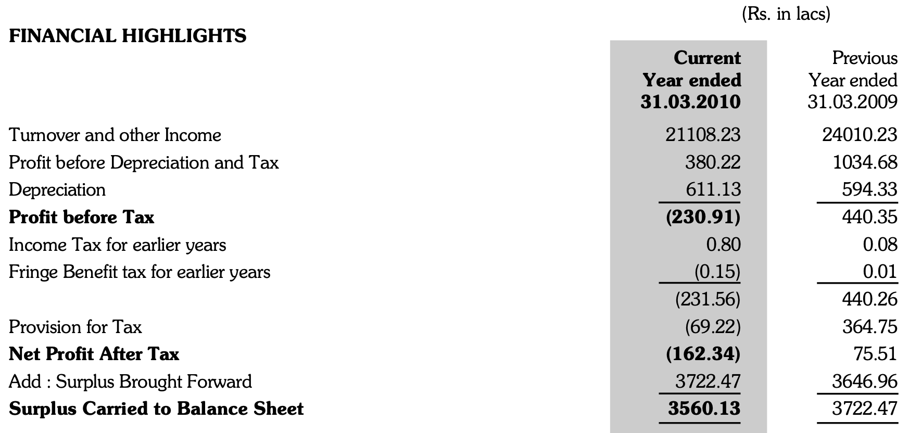

LlamaParse:
|                                      | Current Year ended | Previous Year ended |
| ------------------------------------ | ------------------ | ------------------- |
| (Rs. in lacs)                        | 31.03.2010         | 31.03.2009          |
| Turnover and other Income            | 21108.23           | 24010.23            |
| Profit before Depreciation and Tax   | 380.22             | 1034.68             |
| Depreciation                         | 611.13             | 594.33              |
| Profit before Tax                    | (230.91)           | 440.35              |
| Income Tax for earlier years         | 0.80               | 0.08                |
| Fringe Benefit tax for earlier years | (0.15)             | 0.01                |
|                                      | (231.56)           | 440.26              |
| Provision for Tax                    | (69.22)            | 364.75              |
| Net Profit After Tax                 | (162.34)           | 75.51               |
| Add : Surplus Brought Forward        | 3722.47            | 3646.96             |
| Surplus Carried to Balance Sheet     | 3560.13            | 3722.47             |

Azure:
<table>
<tr>
<th>FINANCIAL HIGHLIGHTS</th>
<th>Current Year ended 31.03.2010</th>
<th>Previous Year ended 31.03.2009</th>
</tr>
<tr>
<td>Turnover and other Income</td>
<td>21108.23</td>
<td>24010.23</td>
</tr>
<tr>
<td>Profit before Depreciation and Tax</td>
<td>380.22</td>
<td>1034.68</td>
</tr>
<tr>
<td>Depreciation</td>
<td>611.13</td>
<td>594.33</td>
</tr>
<tr>
<td>Profit before Tax</td>
<td>(230.91)</td>
<td>440.35</td>
</tr>
<tr>
<td>Income Tax for earlier years</td>
<td>0.80</td>
<td>0.08</td>
</tr>
<tr>
<td>Fringe Benefit tax for earlier years</td>
<td>(0.15)</td>
<td>0.01</td>
</tr>
<tr>
<td></td>
<td>(231.56)</td>
<td>440.26</td>
</tr>
<tr>
<td>Provision for Tax</td>
<td>(69.22)</td>
<td>364.75</td>
</tr>
<tr>
<td>Net Profit After Tax</td>
<td>(162.34)</td>
<td>75.51</td>
</tr>
<tr>
<td>Add : Surplus Brought Forward</td>
<td>3722.47</td>
<td>3646.96</td>
</tr>
<tr>
<td>Surplus Carried to Balance Sheet</td>
<td>3560.13</td>
<td>3722.47</td>
</tr>
</table>

DotsOCR:
<table><thead><tr><th></th><th>Current Year ended 31.03.2010</th><th>Previous Year ended 31.03.2009</th></tr></thead><tbody><tr><td>Turnover and other Income</td><td>21108.23</td><td>24010.23</td></tr><tr><td>Profit before Depreciation and Tax</td><td>380.22</td><td>1034.68</td></tr><tr><td>Depreciation</td><td>611.13</td><td>594.33</td></tr><tr><td><strong>Profit before Tax</strong></td><td><strong>(230.91)</strong></td><td><strong>440.35</strong></td></tr><tr><td>Income Tax for earlier years</td><td>0.80</td><td>0.08</td></tr><tr><td>Fringe Benefit tax for earlier years</td><td>(0.15)</td><td>0.01</td></tr><tr><td></td><td>(231.56)</td><td>440.26</td></tr><tr><td>Provision for Tax</td><td>(69.22)</td><td>364.75</td></tr><tr><td><strong>Net Profit After Tax</strong></td><td><strong>(162.34)</strong></td><td><strong>75.51</strong></td></tr><tr><td>Add : Surplus Brought Forward</td><td>3722.47</td><td>3646.96</td></tr><tr><td><strong>Surplus Carried to Balance Sheet</strong></td><td><strong>3560.13</strong></td><td><strong>3722.47</strong></td></tr></tbody></table>

OlmOCR:
|                                | Current Year ended 31.03.2010 | Previous Year ended 31.03.2009 |
|--------------------------------|-------------------------------|-------------------------------|
| Turnover and other Income      | 21108.23                      | 24010.23                      |
| Profit before Deprecation and Tax | 380.22                        | 1034.68                       |
| Depreciation                   | 611.13                        | 594.33                        |
| **Profit before Tax**          | (230.91)                      | 440.35                        |
| Income Tax for earlier years   | 0.80                          | 0.08                          |
| Fringe Benefit tax for earlier years | (0.15)                      | 0.01                          |
| Provision for Tax              | (231.56)                      | 440.26                        |
| **Net Profit After Tax**       | (162.34)                      | 75.51                         |
| Add : Surplus Brought Forward  | 3722.47                       | 3646.96                       |
| **Surplus Carried to Balance Sheet** | 3560.13                     | 3722.47                       |

MinerU-2110-vlm
<table><tr><td></td><td>Current Year ended 31.03.2010</td><td>Previous Year ended 31.03.2009</td></tr><tr><td>Turnover and other Income</td><td>21108.23</td><td>24010.23</td></tr><tr><td>Profit before Depreciation and Tax</td><td>380.22</td><td>1034.68</td></tr><tr><td>Depreciation</td><td>611.13</td><td>594.33</td></tr><tr><td>Profit before Tax</td><td>(230.91)</td><td>440.35</td></tr><tr><td>Income Tax for earlier years</td><td>0.80</td><td>0.08</td></tr><tr><td>Fringe Benefit tax for earlier years</td><td>(0.15)</td><td>0.01</td></tr><tr><td></td><td>(231.56)</td><td>440.26</td></tr><tr><td>Provision for Tax</td><td>(69.22)</td><td>364.75</td></tr><tr><td>Net Profit After Tax</td><td>(162.34)</td><td>75.51</td></tr><tr><td>Add : Surplus Brought Forward</td><td>3722.47</td><td>3646.96</td></tr><tr><td>Surplus Carried to Balance Sheet</td><td>3560.13</td><td>3722.47</td></tr></table>

marker-162:
<table><tbody><tr><th>FINANCIAL HIGHLIGHTS</th><th colspan=4>(Rs. in lacs)</th></tr><tr><th></th><th>Current Year ended 31.03.2010</th><th>Previous Year ended 31.03.2009</th></tr><tr><td>Turnover and other Income</td><td>21108.23</td><td>24010.23</td></tr><tr><td>Profit before Depreciation and Tax</td><td>380.22</td><td>1034.68</td></tr><tr><td>Depreciation</td><td>611.13</td><td>594.33</td></tr><tr><td>Profit before Tax</td><td>(230.91)</td><td>440.35</td></tr><tr><td>Income Tax for earlier years</td><td>0.80</td><td>0.08</td></tr><tr><td>Fringe Benefit tax for earlier years</td><td>(0.15)</td><td>0.01</td></tr><tr><td></td><td>(231.56)</td><td>440.26</td></tr><tr><td>Provision for Tax</td><td>(69.22)</td><td>364.75</td></tr><tr><td>Net Profit After Tax</td><td>(162.34)</td><td>75.51</td></tr><tr><td>Add : Surplus Brought Forward</td><td>3722.47</td><td>3646.96</td></tr><tr><td>Surplus Carried to Balance Sheet</td><td>3560.13</td><td>3722.47</td></tr></tbody></table>

MinerU-1310:
failed

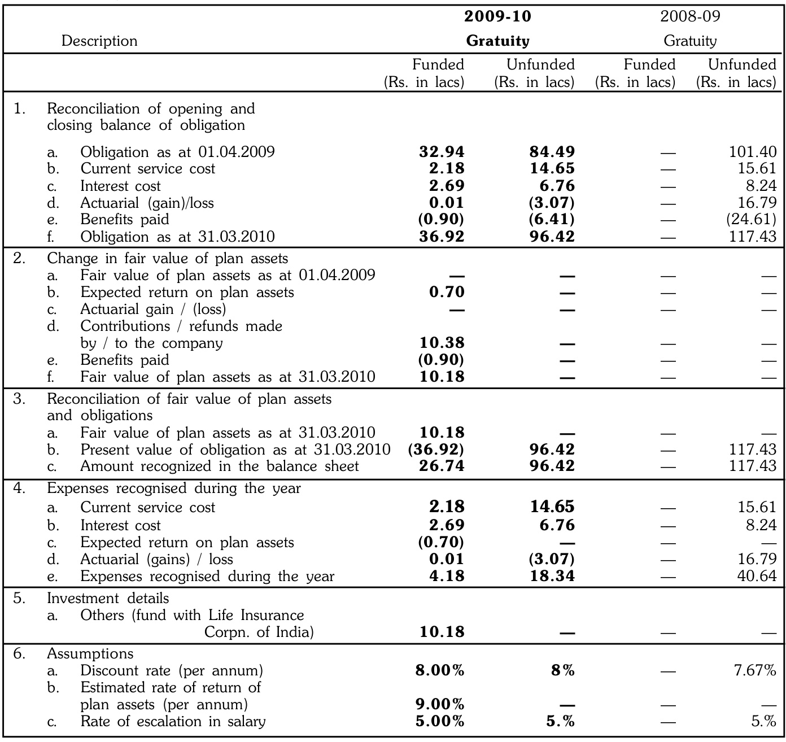

LlamaParse:
| Description                                                    | Gratuity | Funded  | Unfunded | Funded | Unfunded |   |   |
| -------------------------------------------------------------- | -------- | ------- | -------- | ------ | -------- | - | - |
| 1. Reconciliation of opening and closing balance of obligation |          |         |          |        |          |   |   |
| a. Obligation as at 01.04.2009                                 |          | 32.94   | 84.49    | —      | 101.40   |   |   |
| b. Current service cost                                        |          | 2.18    | 14.65    | —      | 15.61    |   |   |
| c. Interest cost                                               |          | 2.69    | 6.76     | —      | 8.24     |   |   |
| d. Actuarial (gain)/loss                                       |          | 0.01    | (3.07)   | —      | 16.79    |   |   |
| e. Benefits paid                                               |          | (0.90)  | (6.41)   | —      | (24.61)  |   |   |
| f. Obligation as at 31.03.2010                                 |          | 36.92   | 96.42    | —      | 117.43   |   |   |
| 2. Change in fair value of plan assets                         |          |         |          |        |          |   |   |
| a. Fair value of plan assets as at 01.04.2009                  |          |         |          | —      | —        | — | — |
| b. Expected return on plan assets                              |          | 0.70    | —        | —      | —        |   |   |
| c. Actuarial gain / (loss)                                     |          |         |          | —      | —        | — | — |
| d. Contributions / refunds made by / to the company            |          | 10.38   | —        | —      | —        |   |   |
| e. Benefits paid                                               |          | (0.90)  |          | —      | —        | — |   |
| f. Fair value of plan assets as at 31.03.2010                  |          | 10.18   | —        | —      | —        |   |   |
| 3. Reconciliation of fair value of plan assets and obligations |          |         |          |        |          |   |   |
| a. Fair value of plan assets as at 31.03.2010                  |          | 10.18   | —        | —      | —        |   |   |
| b. Present value of obligation as at 31.03.2010                |          | (36.92) | 96.42    | —      | 117.43   |   |   |
| c. Amount recognized in the balance sheet                      |          | 26.74   | 96.42    | —      | 117.43   |   |   |
| 4. Expenses recognised during the year                         |          |         |          |        |          |   |   |
| a. Current service cost                                        |          | 2.18    | 14.65    | —      | 15.61    |   |   |
| b. Interest cost                                               |          | 2.69    | 6.76     | —      | 8.24     |   |   |
| c. Expected return on plan assets                              |          | (0.70)  | —        | —      | —        |   |   |
| d. Actuarial (gains) / loss                                    |          | 0.01    | (3.07)   | —      | 16.79    |   |   |
| e. Expenses recognised during the year                         |          | 4.18    | 18.34    | —      | 40.64    |   |   |
| 5. Investment details                                          |          |         |          |        |          |   |   |
| a. Others (fund with Life Insurance Corpn. of India)           |          | 10.18   | —        | —      | —        |   |   |
| 6. Assumptions                                                 |          |         |          |        |          |   |   |
| a. Discount rate (per annum)                                   |          | 8.00%   | 8%       | —      | 7.67%    |   |   |
| b. Estimated rate of return of plan assets (per annum)         |          | 9.00%   | —        | —      | —        |   |   |
| c. Rate of escalation in salary                                |          | 5.00%   | 5.%      | —      | 5.%      |   |   |

Azure:
<table>
<tr>
<th colspan="3">Description</th>
<th colspan="2">2009-10 Gratuity</th>
<th colspan="2">2008-09 Gratuity</th>
</tr>
<tr>
<th colspan="3"></th>
<th>Funded (Rs. in lacs)</th>
<th>Unfunded (Rs. in lacs)</th>
<th>Funded (Rs. in lacs)</th>
<th>Unfunded (Rs. in lacs)</th>
</tr>
<tr>
<td colspan="3">1. Reconciliation of opening and closing balance of obligation</td>
<td></td>
<td></td>
<td></td>
<td></td>
</tr>
<tr>
<td></td>
<td>a.</td>
<td>Obligation as at 01.04.2009</td>
<td>32.94</td>
<td>84.49</td>
<td>—</td>
<td>101.40</td>
</tr>
<tr>
<td colspan="2">b.</td>
<td>Current service cost</td>
<td>2.18</td>
<td>14.65</td>
<td>—</td>
<td>15.61</td>
</tr>
<tr>
<td colspan="2">C.</td>
<td>Interest cost</td>
<td>2.69</td>
<td>6.76</td>
<td>—</td>
<td>8.24</td>
</tr>
<tr>
<td colspan="2">d.</td>
<td>Actuarial (gain)/loss</td>
<td>0.01</td>
<td>(3.07)</td>
<td>—</td>
<td>16.79</td>
</tr>
<tr>
<td colspan="2">e.</td>
<td>Benefits paid</td>
<td>(0.90)</td>
<td>(6.41)</td>
<td>—</td>
<td>(24.61)</td>
</tr>
<tr>
<td colspan="2">f.</td>
<td>Obligation as at 31.03.2010</td>
<td>36.92</td>
<td>96.42</td>
<td>—</td>
<td>117.43</td>
</tr>
<tr>
<td colspan="3">2. Change in fair value of plan assets</td>
<td></td>
<td></td>
<td></td>
<td></td>
</tr>
<tr>
<td></td>
<td>a.</td>
<td>Fair value of plan assets as at 01.04.2009</td>
<td>—</td>
<td>—</td>
<td>—</td>
<td>—</td>
</tr>
<tr>
<td colspan="3">b. Expected return on plan assets</td>
<td>0.70</td>
<td>—</td>
<td>—</td>
<td>—</td>
</tr>
<tr>
<td colspan="2">C.</td>
<td>Actuarial gain / (loss)</td>
<td>—</td>
<td>—</td>
<td>—</td>
<td>—</td>
</tr>
<tr>
<td colspan="2">d.</td>
<td>Contributions / refunds made</td>
<td></td>
<td></td>
<td></td>
<td></td>
</tr>
<tr>
<td colspan="2"></td>
<td>by / to the company</td>
<td>10.38</td>
<td>—</td>
<td>—</td>
<td>—</td>
</tr>
<tr>
<td colspan="2">e.</td>
<td>Benefits paid</td>
<td>(0.90)</td>
<td>—</td>
<td>—</td>
<td>—</td>
</tr>
<tr>
<td colspan="2">f.</td>
<td>Fair value of plan assets as at 31.03.2010</td>
<td>10.18</td>
<td>—</td>
<td>—</td>
<td>—</td>
</tr>
<tr>
<td colspan="3">3. Reconciliation of fair value of plan assets and obligations</td>
<td></td>
<td></td>
<td></td>
<td></td>
</tr>
<tr>
<td></td>
<td>a.</td>
<td>Fair value of plan assets as at 31.03.2010</td>
<td>10.18</td>
<td>—</td>
<td>—</td>
<td>—</td>
</tr>
<tr>
<td colspan="3">b. Present value of obligation as at 31.03.2010</td>
<td>(36.92)</td>
<td>96.42</td>
<td>—</td>
<td>117.43</td>
</tr>
<tr>
<td colspan="2">C.</td>
<td>Amount recognized in the balance sheet</td>
<td>26.74</td>
<td>96.42</td>
<td>—</td>
<td>117.43</td>
</tr>
<tr>
<td colspan="3">4. Expenses recognised during the year</td>
<td></td>
<td></td>
<td></td>
<td></td>
</tr>
<tr>
<td></td>
<td>a.</td>
<td>Current service cost</td>
<td>2.18</td>
<td>14.65</td>
<td>—</td>
<td>15.61</td>
</tr>
<tr>
<td colspan="2">b.</td>
<td>Interest cost</td>
<td>2.69</td>
<td>6.76</td>
<td>—</td>
<td>8.24</td>
</tr>
<tr>
<td colspan="2">C.</td>
<td>Expected return on plan assets</td>
<td>(0.70)</td>
<td>—</td>
<td>—</td>
<td>—</td>
</tr>
<tr>
<td colspan="2">d.</td>
<td>Actuarial (gains) / loss</td>
<td>0.01</td>
<td>(3.07)</td>
<td>—</td>
<td>16.79</td>
</tr>
<tr>
<td colspan="2">e.</td>
<td>Expenses recognised during the year</td>
<td>4.18</td>
<td>18.34</td>
<td>—</td>
<td>40.64</td>
</tr>
<tr>
<td colspan="3">5. Investment details</td>
<td></td>
<td></td>
<td></td>
<td></td>
</tr>
<tr>
<td colspan="2">a.</td>
<td>Others (fund with Life Insurance</td>
<td></td>
<td></td>
<td></td>
<td></td>
</tr>
<tr>
<td colspan="2"></td>
<td>Corpn. of India)</td>
<td>10.18</td>
<td>—</td>
<td>—</td>
<td>—</td>
</tr>
<tr>
<td colspan="3">6. Assumptions</td>
<td></td>
<td></td>
<td></td>
<td></td>
</tr>
<tr>
<td></td>
<td>a.</td>
<td>Discount rate (per annum)</td>
<td>8.00%</td>
<td>8%</td>
<td>—</td>
<td>7.67%</td>
</tr>
<tr>
<td colspan="2">b.</td>
<td>Estimated rate of return of</td>
<td></td>
<td></td>
<td></td>
<td></td>
</tr>
<tr>
<td colspan="2"></td>
<td>plan assets (per annum)</td>
<td>9.00%</td>
<td>—</td>
<td>—</td>
<td>—</td>
</tr>
<tr>
<td colspan="2">C.</td>
<td>Rate of escalation in salary</td>
<td>5.00%</td>
<td>5.%</td>
<td>—</td>
<td>5.%</td>
</tr>
</table>

DotsOCR:
<table><thead><tr><th rowspan="2">Description</th><th colspan="2">2009-10 Gratuity</th><th colspan="2">2008-09 Gratuity</th></tr><tr><th>Funded (Rs. in lacs)</th><th>Unfunded (Rs. in lacs)</th><th>Funded (Rs. in lacs)</th><th>Unfunded (Rs. in lacs)</th></tr></thead><tbody><tr><td>1. Reconciliation of opening and closing balance of obligation</td><td></td><td></td><td></td><td></td></tr><tr><td>a. Obligation as at 01.04.2009</td><td>32.94</td><td>84.49</td><td>—</td><td>101.40</td></tr><tr><td>b. Current service cost</td><td>2.18</td><td>14.65</td><td>—</td><td>15.61</td></tr><tr><td>c. Interest cost</td><td>2.69</td><td>6.76</td><td>—</td><td>8.24</td></tr><tr><td>d. Actuarial (gain)/loss</td><td>0.01</td><td>(3.07)</td><td>—</td><td>16.79</td></tr><tr><td>e. Benefits paid</td><td>(0.90)</td><td>(6.41)</td><td>—</td><td>(24.61)</td></tr><tr><td>f. Obligation as at 31.03.2010</td><td>36.92</td><td>96.42</td><td>—</td><td>117.43</td></tr><tr><td>2. Change in fair value of plan assets</td><td></td><td></td><td></td><td></td></tr><tr><td>a. Fair value of plan assets as at 01.04.2009</td><td>—</td><td>—</td><td>—</td><td>—</td></tr><tr><td>b. Expected return on plan assets</td><td>0.70</td><td>—</td><td>—</td><td>—</td></tr><tr><td>c. Actuarial gain / (loss)</td><td>—</td><td>—</td><td>—</td><td>—</td></tr><tr><td>d. Contributions / refunds made by / to the company</td><td>10.38</td><td>—</td><td>—</td><td>—</td></tr><tr><td>e. Benefits paid</td><td>(0.90)</td><td>—</td><td>—</td><td>—</td></tr><tr><td>f. Fair value of plan assets as at 31.03.2010</td><td>10.18</td><td>—</td><td>—</td><td>—</td></tr><tr><td>3. Reconciliation of fair value of plan assets and obligations</td><td></td><td></td><td></td><td></td></tr><tr><td>a. Fair value of plan assets as at 31.03.2010</td><td>10.18</td><td>—</td><td>—</td><td>—</td></tr><tr><td>b. Present value of obligation as at 31.03.2010</td><td>(36.92)</td><td>96.42</td><td>—</td><td>117.43</td></tr><tr><td>c. Amount recognized in the balance sheet</td><td>26.74</td><td>96.42</td><td>—</td><td>117.43</td></tr><tr><td>4. Expenses recognised during the year</td><td></td><td></td><td></td><td></td></tr><tr><td>a. Current service cost</td><td>2.18</td><td>14.65</td><td>—</td><td>15.61</td></tr><tr><td>b. Interest cost</td><td>2.69</td><td>6.76</td><td>—</td><td>8.24</td></tr><tr><td>c. Expected return on plan assets</td><td>(0.70)</td><td>—</td><td>—</td><td>—</td></tr><tr><td>d. Actuarial (gains) / loss</td><td>0.01</td><td>(3.07)</td><td>—</td><td>16.79</td></tr><tr><td>e. Expenses recognised during the year</td><td>4.18</td><td>18.34</td><td>—</td><td>40.64</td></tr><tr><td>5. Investment details</td><td></td><td></td><td></td><td></td></tr><tr><td>a. Others (fund with Life Insurance Corpn. of India)</td><td>10.18</td><td>—</td><td>—</td><td>—</td></tr><tr><td>6. Assumptions</td><td></td><td></td><td></td><td></td></tr><tr><td>a. Discount rate (per annum)</td><td>8.00%</td><td>8%</td><td>—</td><td>7.67%</td></tr><tr><td>b. Estimated rate of return of plan assets (per annum)</td><td>9.00%</td><td>—</td><td>—</td><td>—</td></tr><tr><td>c. Rate of escalation in salary</td><td>5.00%</td><td>5.%</td><td>—</td><td>5.%</td></tr></tbody></table>

OlmOCR:
| Description | 2009-10 | 2008-09 |
|-------------|---------|---------|
|             | Funded  | Unfunded| Funded  | Unfunded|
|             | (Rs. in lacs) | (Rs. in lacs) | (Rs. in lacs) | (Rs. in lacs) |
| 1. Reconciliation of opening and closing balance of obligation |         |         |         |         |
| a. Obligation as at 01.04.2009 | 32.94   | 84.49   | —       | 101.40  |
| b. Current service cost        | 2.18    | 14.65   | —       | 15.61   |
| c. Interest cost               | 2.69    | 6.76    | —       | 8.24    |
| d. Actuarial (gain)/loss       | 0.01    | (3.07)  | —       | 16.79   |
| e. Benefits paid               | (0.90)  | (6.41)  | —       | (24.61) |
| f. Obligation as at 31.03.2010 | 36.92   | 96.42   | —       | 117.43  |
| 2. Change in fair value of plan assets |         |         |         |         |
| a. Fair value of plan assets as at 01.04.2009 | —       | —       | —       | —       |
| b. Expected return on plan assets | 0.70    | —       | —       | —       |
| c. Actuarial gain / (loss)     | —       | —       | —       | —       |
| d. Contributions / refunds made by / to the company | 10.38   | —       | —       | —       |
| e. Benefits paid               | (0.90)  | —       | —       | —       |
| f. Fair value of plan assets as at 31.03.2010 | 10.18   | —       | —       | —       |
| 3. Reconciliation of fair value of plan assets and obligations |         |         |         |         |
| a. Fair value of plan assets as at 31.03.2010 | 10.18   | —       | —       | —       |
| b. Present value of obligation as at 31.03.2010 | (36.92) | 96.42   | —       | 117.43  |
| c. Amount recognized in the balance sheet | 26.74   | 96.42   | —       | 117.43  |
| 4. Expenses recognised during the year |         |         |         |         |
| a. Current service cost        | 2.18    | 14.65   | —       | 15.61   |
| b. Interest cost               | 2.69    | 6.76    | —       | 8.24    |
| c. Expected return on plan assets | (0.70) | —       | —       | —       |
| d. Actuarial (gains) / loss    | 0.01    | (3.07)  | —       | 16.79   |
| e. Expenses recognised during the year | 4.18    | 18.34   | —       | 40.64   |
| 5. Investment details         |         |         |         |         |
| a. Others (fund with Life Insurance Corpn. of India) | 10.18   | —       | —       | —       |
| 6. Assumptions                 |         |         |         |         |
| a. Discount rate (per annum)   | 8.00%   | 8%      | —       | 7.67%   |
| b. Estimated rate of return of plan assets (per annum) | 9.00%   | —       | —       | —       |
| c. Rate of escalation in salary | 5.00%   | 5.%     | —       | 5.%     |

MinerU-2110-vlm
<table><tr><td rowspan="2">Description</td><td colspan="2">2009-10</td><td colspan="2">2008-09</td></tr><tr><td colspan="2">Gratuity</td><td colspan="2">Gratuity</td></tr><tr><td></td><td>Funded 
(Rs. in lacs)</td><td>Unfunded 
(Rs. in lacs)</td><td>Funded 
(Rs. in lacs)</td><td>Unfunded 
(Rs. in lacs)</td></tr><tr><td>1. Reconciliation of opening and closing balance of obligation</td><td></td><td></td><td></td><td></td></tr><tr><td>a. Obligation as at 01.04.2009</td><td>32.94</td><td>84.49</td><td>—</td><td>101.40</td></tr><tr><td>b. Current service cost</td><td>2.18</td><td>14.65</td><td>—</td><td>15.61</td></tr><tr><td>c. Interest cost</td><td>2.69</td><td>6.76</td><td>—</td><td>8.24</td></tr><tr><td>d. Actuarial (gain)/loss</td><td>0.01</td><td>(5.07)</td><td>—</td><td>16.79</td></tr><tr><td>e. Benefits paid</td><td>(0.90)</td><td>(6.41)</td><td>—</td><td>(24.61)</td></tr><tr><td>f. Obligation as at 31.03.2010</td><td>36.92</td><td>96.42</td><td>—</td><td>117.43</td></tr><tr><td>2. Change in fair value of plan assets</td><td></td><td></td><td></td><td></td></tr><tr><td>a. Fair value of plan assets as at 01.04.2009</td><td>—</td><td>—</td><td>—</td><td>—</td></tr><tr><td>b. Expected return on plan assets</td><td>0.70</td><td>—</td><td>—</td><td>—</td></tr><tr><td>c. Actuarial gain / (loss)</td><td>—</td><td>—</td><td>—</td><td>—</td></tr><tr><td>d. Contributions / refunds made</td><td></td><td></td><td></td><td></td></tr><tr><td>by / to the company</td><td>10.38</td><td>—</td><td>—</td><td>—</td></tr><tr><td>e. Benefits paid</td><td>(0.90)</td><td>—</td><td>—</td><td>—</td></tr><tr><td>f. Fair value of plan assets as at 31.03.2010</td><td>10.18</td><td>—</td><td>—</td><td>—</td></tr><tr><td>3. Reconciliation of fair value of plan assets and obligations</td><td></td><td></td><td></td><td></td></tr><tr><td>a. Fair value of plan assets as at 31.03.2010</td><td>10.18</td><td>—</td><td>—</td><td>—</td></tr><tr><td>b. Present value of obligation as at 31.03.2010</td><td>(36.92)</td><td>96.42</td><td>—</td><td>117.43</td></tr><tr><td>c. Amount recognized in the balance sheet</td><td>26.74</td><td>96.42</td><td>—</td><td>117.43</td></tr><tr><td>4. Expenses recognized during the year</td><td></td><td></td><td></td><td></td></tr><tr><td>a. Current service cost</td><td>2.18</td><td>14.65</td><td>—</td><td>15.61</td></tr><tr><td>b. Interest cost</td><td>2.69</td><td>6.76</td><td>—</td><td>8.24</td></tr><tr><td>c. Expected return on plan assets</td><td>(0.70)</td><td>—</td><td>—</td><td>—</td></tr><tr><td>d. Actuarial (gains) / loss</td><td>0.01</td><td>(3.07)</td><td>—</td><td>16.79</td></tr><tr><td>e. Expenses recognized during the year</td><td>4.18</td><td>18.34</td><td>—</td><td>40.64</td></tr><tr><td>5. Investment details</td><td></td><td></td><td></td><td></td></tr><tr><td>a. Others (fund with Life Insurance Corpn. of India)</td><td>10.18</td><td>—</td><td>—</td><td>—</td></tr><tr><td>6. Assumptions</td><td></td><td></td><td></td><td></td></tr><tr><td>a. Discount rate (per annum)</td><td>8.00%</td><td>8%</td><td>—</td><td>7.67%</td></tr><tr><td>b. Estimated rate of return of plan assets (per annum)</td><td>9.00%</td><td>—</td><td>—</td><td>—</td></tr><tr><td>c. Rate of escalation in salary</td><td>5.00%</td><td>5.%</td><td>—</td><td>5.%</td></tr></table>

Marker-162:
<table><tbody><tr><th></th><th></th><th></th><th>2009-10</th><th colspan=3>2008-09</th></tr><tr><td colspan=2>Description</td><td colspan=2>Gratuity</td><td colspan=2>Gratuity</td></tr><tr><td></td><td></td><td>Funded</td><td>Unfunded</td><td>Funded</td><td>Unfunded</td></tr><tr><td></td><td></td><td>(Rs. in lacs)</td><td>(Rs. in lacs)</td><td>(Rs. in lacs)</td><td>(Rs. in lacs)</td></tr><tr><td>1.</td><td>Reconciliation of opening and closing balance of obligation</td><td></td><td></td><td></td><td></td></tr><tr><td></td><td>a. Obligation as at 01.04.2009 b. Current service cost c. Interest cost</td><td>32.94 2.18 2.69</td><td>84.49 14.65 6.76</td><td>— — —</td><td>101.40 15.61 8.24</td></tr><tr><td></td><td>d. Actuarial (gain)/loss e. Benefits paid f. Obligation as at 31.03.2010</td><td>0.01 (0.90) 36.92</td><td>(3.07) (6.41) 96.42</td><td>— — —</td><td>16.79 (24.61) 117.43</td></tr><tr><td>2.</td><td>Change in fair value of plan assets a. Fair value of plan assets as at 01.04.2009 b. Expected return on plan assets</td><td>— 0.70</td><td>— —</td><td>— —</td><td>— —</td></tr><tr><td></td><td>c. Actuarial gain / (loss) d. Contributions / refunds made by / to the company e. Benefits paid</td><td>— 10.38 (0.90)</td><td>— — —</td><td>— — —</td><td>— — —</td></tr><tr><td></td><td>f. Fair value of plan assets as at 31.03.2010</td><td>10.18</td><td>—</td><td>—</td><td>—</td></tr><tr><td>3.</td><td>Reconciliation of fair value of plan assets and obligations a. Fair value of plan assets as at 31.03.2010 b. Present value of obligation as at 31.03.2010 c. Amount recognized in the balance sheet</td><td>10.18 (36.92) 26.74</td><td>— 96.42 96.42</td><td>— — —</td><td>— 117.43 117.43</td></tr><tr><td>4.</td><td>Expenses recognised during the year a. Current service cost b. Interest cost c. Expected return on plan assets d. Actuarial (gains) / loss e. Expenses recognised during the year</td><td>2.18 2.69 (0.70) 0.01 4.18</td><td>14.65 6.76 — (3.07) 18.34</td><td>— — — — —</td><td>15.61 8.24 — 16.79 40.64</td></tr><tr><td>5.</td><td>Investment details a. Others (fund with Life Insurance Corpn. of India)</td><td>10.18</td><td>—</td><td>—</td><td>—</td></tr><tr><td>6.</td><td>Assumptions a. Discount rate (per annum) b. Estimated rate of return of</td><td>8.00%</td><td>8%</td><td>—</td><td>7.67%</td></tr><tr><td></td><td>plan assets (per annum) c. Rate of escalation in salary</td><td>9.00% 5.00%</td><td>— 5.%</td><td>— —</td><td>— 5.%</td></tr></tbody></table>

MinerU-1310:
<html><body><table><tr><td colspan="2">Description</td><td colspan="2">2009-10 Gratuity</td><td colspan="2">2008-09 Gratuity</td></tr><tr><td colspan="2"></td><td>Funded (Rs.in lacs)</td><td>Unfunded (Rs.in lacs)</td><td>Funded (Rs.in lacs)</td><td>Unfunded (Rs.in lacs)</td></tr><tr><td colspan="2">1. Reconciliation of opening and closing balance of obligation</td><td></td><td></td><td></td><td></td></tr><tr><td>a.</td><td>Obligation as at 01.04.2009</td><td>32.94</td><td>84.49</td><td></td><td>101.40</td></tr><tr><td>b. C.</td><td>Current service cost</td><td>2.18</td><td>14.65</td><td></td><td>15.61</td></tr><tr><td>d.</td><td>Interest cost</td><td>2.69</td><td>6.76</td><td></td><td>8.24</td></tr><tr><td></td><td>Actuarial (gain)/loss</td><td>0.01</td><td>(3.07)</td><td></td><td>16.79</td></tr><tr><td>e. f</td><td>Benefits paid</td><td>(0.90)</td><td>(6.41)</td><td></td><td>(24.61)</td></tr><tr><td>2.</td><td>Obligation as at 31.03.2010</td><td>36.92</td><td>96.42</td><td></td><td>117.43</td></tr><tr><td>a. b.</td><td>Change in fair value of plan assets Fair value of plan assets as at O1.04.2009</td><td></td><td></td><td></td><td></td></tr><tr><td>C. d.</td><td>Expected return on plan assets Actuarial gain / (loss) Contributions /refunds made by / to the company</td><td>0.70 10.38</td><td></td><td></td><td></td></tr><tr><td>e. f.</td><td>Benefits paid Fair value of plan assets as at 31.03.2010</td><td>(0.90) 10.18</td><td></td><td></td><td></td></tr><tr><td>3.</td><td>Reconciliation of fair value of plan assets and obligations</td><td></td><td></td><td></td><td></td></tr><tr><td>a.</td><td>Fair value of plan assets as at 31.03.2010</td><td>10.18</td><td></td><td></td><td></td></tr><tr><td></td><td>b. Present value of obligation as at 31.03.2010</td><td>(36.92)</td><td>96.42</td><td></td><td>117.43</td></tr><tr><td></td><td>C. Amount recognized in the balance sheet</td><td>26.74</td><td>96.42</td><td></td><td>117.43</td></tr><tr><td>4.</td><td>Expenses recognised during the year</td><td></td><td></td><td></td><td></td></tr><tr><td></td><td></td><td>2.18</td><td></td><td></td><td></td></tr><tr><td></td><td>a. Current service cost</td><td>2.69</td><td>14.65</td><td></td><td>15.61</td></tr><tr><td></td><td>b. Interest cost</td><td></td><td>6.76</td><td></td><td>8.24</td></tr><tr><td></td><td>C. Expected return on plan assets</td><td>(0.70)</td><td></td><td></td><td></td></tr><tr><td></td><td>d. Actuarial (gains) /loss</td><td>0.01</td><td>(3.07)</td><td></td><td>16.79</td></tr><tr><td></td><td>e. Expenses recognised during the year</td><td>4.18</td><td>18.34</td><td></td><td>40.64</td></tr><tr><td>5.</td><td>Investment details</td><td></td><td></td><td></td><td></td></tr><tr><td>a.</td><td>Others (fund with Life Insurance</td><td></td><td></td><td></td><td></td></tr><tr><td></td><td>Corpn.of India)</td><td>10.18</td><td></td><td></td><td></td></tr><tr><td>6.</td><td>Assumptions</td><td></td><td></td><td></td><td></td></tr><tr><td>a.</td><td>Discount rate (per annum)</td><td>8.00%</td><td>8%</td><td></td><td>7.67%</td></tr><tr><td>b.</td><td>Estimated rate of return of</td><td></td><td></td><td></td><td></td></tr><tr><td></td><td>plan assets (per annum)</td><td>9.00%</td><td></td><td></td><td></td></tr><tr><td>C.</td><td>Rate of escalation in salary</td><td>5.00%</td><td>5.%</td><td></td><td>5.%</td></tr></table></body></html>

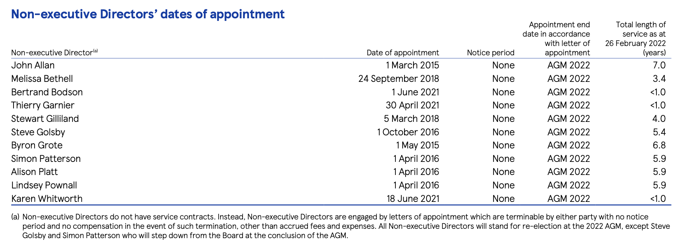

LlamaParse:
| Non-executive Director(a) | Date of appointment | Notice period | Appointment end date in accordance with letter of appointment | Total length of service as at 26 February 2022 (years) |
| ------------------------- | ------------------- | ------------- | ------------------------------------------------------------- | ------------------------------------------------------ |
| John Allan                | 1 March 2015        | None          | AGM 2022                                                      | 7.0                                                    |
| Melissa Bethell           | 24 September 2018   | None          | AGM 2022                                                      | 3.4                                                    |
| Bertrand Bodson           | 1 June 2021         | None          | AGM 2022                                                      | <1.0                                                   |
| Thierry Garnier           | 30 April 2021       | None          | AGM 2022                                                      | <1.0                                                   |
| Stewart Gilliland         | 5 March 2018        | None          | AGM 2022                                                      | 4.0                                                    |
| Steve Golsby              | 1 October 2016      | None          | AGM 2022                                                      | 5.4                                                    |
| Byron Grote               | 1 May 2015          | None          | AGM 2022                                                      | 6.8                                                    |
| Simon Patterson           | 1 April 2016        | None          | AGM 2022                                                      | 5.9                                                    |
| Alison Platt              | 1 April 2016        | None          | AGM 2022                                                      | 5.9                                                    |
| Lindsey Pownall           | 1 April 2016        | None          | AGM 2022                                                      | 5.9                                                    |
| Karen Whitworth           | 18 June 2021        | None          | AGM 2022                                                      | <1.0                                                   |

Azure:
<table>
<tr>
<th>Non-executive Director(a)</th>
<th>Date of appointment</th>
<th>Notice period</th>
<th>Appointment end date in accordance with letter of appointment</th>
<th>Total length of service as at 26 February 2022 (years)</th>
</tr>
<tr>
<td>John Allan</td>
<td>1 March 2015</td>
<td>None</td>
<td>AGM 2022</td>
<td>7.0</td>
</tr>
<tr>
<td>Melissa Bethell</td>
<td>24 September 2018</td>
<td>None</td>
<td>AGM 2022</td>
<td>3.4</td>
</tr>
<tr>
<td>Bertrand Bodson</td>
<td>1 June 2021</td>
<td>None</td>
<td>AGM 2022</td>
<td>&lt;1.0</td>
</tr>
<tr>
<td>Thierry Garnier</td>
<td>30 April 2021</td>
<td>None</td>
<td>AGM 2022</td>
<td>&lt;1.0</td>
</tr>
<tr>
<td>Stewart Gilliland</td>
<td>5 March 2018</td>
<td>None</td>
<td>AGM 2022</td>
<td>4.0</td>
</tr>
<tr>
<td>Steve Golsby</td>
<td>1 October 2016</td>
<td>None</td>
<td>AGM 2022</td>
<td>5.4</td>
</tr>
<tr>
<td>Byron Grote</td>
<td>1 May 2015</td>
<td>None</td>
<td>AGM 2022</td>
<td>6.8</td>
</tr>
<tr>
<td>Simon Patterson</td>
<td>1 April 2016</td>
<td>None</td>
<td>AGM 2022</td>
<td>5.9</td>
</tr>
<tr>
<td>Alison Platt</td>
<td>1 April 2016</td>
<td>None</td>
<td>AGM 2022</td>
<td>5.9</td>
</tr>
<tr>
<td>Lindsey Pownall</td>
<td>1 April 2016</td>
<td>None</td>
<td>AGM 2022</td>
<td>5.9</td>
</tr>
<tr>
<td>Karen Whitworth</td>
<td>18 June 2021</td>
<td>None</td>
<td>AGM 2022</td>
<td>&lt;1.0</td>
</tr>
</table>

DotsOCR:
<table><thead><tr><th>Non-executive Director(a)</th><th>Date of appointment</th><th>Notice period</th><th>Appointment end date in accordance with letter of appointment</th><th>Total length of service as at 26 February 2022 (years)</th></tr></thead><tbody><tr><td>John Allan</td><td>1 March 2015</td><td>None</td><td>AGM 2022</td><td>7.0</td></tr><tr><td>Melissa Bethell</td><td>24 September 2018</td><td>None</td><td>AGM 2022</td><td>3.4</td></tr><tr><td>Bertrand Bodson</td><td>1 June 2021</td><td>None</td><td>AGM 2022</td><td>&lt;1.0</td></tr><tr><td>Thierry Garnier</td><td>30 April 2021</td><td>None</td><td>AGM 2022</td><td>&lt;1.0</td></tr><tr><td>Stewart Gilliland</td><td>5 March 2018</td><td>None</td><td>AGM 2022</td><td>4.0</td></tr><tr><td>Steve Golsby</td><td>1 October 2016</td><td>None</td><td>AGM 2022</td><td>5.4</td></tr><tr><td>Byron Grote</td><td>1 May 2015</td><td>None</td><td>AGM 2022</td><td>6.8</td></tr><tr><td>Simon Patterson</td><td>1 April 2016</td><td>None</td><td>AGM 2022</td><td>5.9</td></tr><tr><td>Alison Platt</td><td>1 April 2016</td><td>None</td><td>AGM 2022</td><td>5.9</td></tr><tr><td>Lindsey Pownall</td><td>1 April 2016</td><td>None</td><td>AGM 2022</td><td>5.9</td></tr><tr><td>Karen Whitworth</td><td>18 June 2021</td><td>None</td><td>AGM 2022</td><td>&lt;1.0</td></tr></tbody></table>

OlmOCR:

| Non-executive Director | Date of appointment | Notice period | Appointment end date in accordance with letter of appointment | Total length of service as at 26 February 2022 (years) |
|------------------------|---------------------|--------------|---------------------------------------------------------------|---------------------------------------------------|
| John Allan             | 1 March 2015        | None         | AGM 2022                                                      | 7.0                                               |
| Melissa Bethell        | 24 September 2018   | None         | AGM 2022                                                      | 3.4                                               |
| Bertrand Bodson        | 1 June 2021         | None         | AGM 2022                                                      | <1.0                                              |
| Thierry Garnier        | 30 April 2021       | None         | AGM 2022                                                      | <1.0                                              |
| Stewart Gilliland      | 5 March 2018        | None         | AGM 2022                                                      | 4.0                                               |
| Steve Golsby           | 1 October 2016      | None         | AGM 2022                                                      | 5.4                                               |
| Byron Grote            | 1 May 2015          | None         | AGM 2022                                                      | 6.8                                               |
| Simon Patterson        | 1 April 2016        | None         | AGM 2022                                                      | 5.9                                               |
| Alison Platt           | 1 April 2016        | None         | AGM 2022                                                      | 5.9                                               |
| Lindsey Pownall        | 1 April 2016        | None         | AGM 2022                                                      | 5.9                                               |
| Karen Whitworth        | 18 June 2021        | None         | AGM 2022                                                      | <1.0                                              |

MinerU-2110-vlm
<table><tr><td></td><td></td><td></td><td rowspan="2">Appointment end date in accordance with letter of appointment</td><td rowspan="2">Total length of service as at 26 February 2022 (years)</td></tr><tr><td>Non-executive Director</td><td>Date of appointment</td><td>Notable period</td></tr><tr><td>John Allan</td><td>1 March 2015</td><td>None</td><td>AGM 2022</td><td>7.0</td></tr><tr><td>Melissa Bethell</td><td>24 September 2018</td><td>None</td><td>AGM 2022</td><td>3.4</td></tr><tr><td>Bertrand Bodson</td><td>1 June 2021</td><td>None</td><td>AGM 2022</td><td>&amp;lt;1.0</td></tr><tr><td>Thierry Garnier</td><td>30 April 2021</td><td>None</td><td>AGM 2022</td><td>&amp;lt;1.0</td></tr><tr><td>Stewart Gilliland</td><td>5 March 2016</td><td>None</td><td>AGM 2022</td><td>4.0</td></tr><tr><td>Steve Golsby</td><td>1 October 2016</td><td>None</td><td>AGM 2022</td><td>5.4</td></tr><tr><td>Byron Grote</td><td>1 May 2015</td><td>None</td><td>AGM 2022</td><td>6.8</td></tr><tr><td>Simon Patterson</td><td>1 April 2016</td><td>None</td><td>AGM 2022</td><td>5.9</td></tr><tr><td>Alison Platt</td><td>1 April 2016</td><td>None</td><td>AGM 2022</td><td>5.9</td></tr><tr><td>Lindsey Pownall</td><td>1 April 2016</td><td>None</td><td>AGM 2022</td><td>5.9</td></tr><tr><td>Karen Whitworth</td><td>18 June 2021</td><td>None</td><td>AGM 2022</td><td>&amp;lt;1.0</td></tr></table>

Marker-162:
<table><tbody><tr><th></th><th></th><th></th><th>Appointment end</th><th>Total length of</th></tr><tr><td></td><td></td><td></td><td>date in accordance</td><td>service as at</td></tr><tr><td></td><td></td><td></td><td>with letter of</td><td>26 February 2022</td></tr><tr><td>Non-executive Director(a)</td><td>Date of appointment</td><td>Notice period</td><td>appointment</td><td>(years)</td></tr><tr><td>John Allan</td><td>1 March 2015</td><td>None</td><td>AGM 2022</td><td>7.0</td></tr><tr><td>Melissa Bethell</td><td>24 September 2018</td><td>None</td><td>AGM 2022</td><td>3.4</td></tr><tr><td>Bertrand Bodson</td><td>1 June 2021</td><td>None</td><td>AGM 2022</td><td>&lt;1.0</td></tr><tr><td>Thierry Garnier</td><td>30 April 2021</td><td>None</td><td>AGM 2022</td><td>&lt;1.0</td></tr><tr><td>Stewart Gilliland</td><td>5 March 2018</td><td>None</td><td>AGM 2022</td><td>4.0</td></tr><tr><td>Steve Golsby</td><td>1 October 2016</td><td>None</td><td>AGM 2022</td><td>5.4</td></tr><tr><td>Byron Grote</td><td>1 May 2015</td><td>None</td><td>AGM 2022</td><td>6.8</td></tr><tr><td>Simon Patterson</td><td>1 April 2016</td><td>None</td><td>AGM 2022</td><td>5.9</td></tr><tr><td>Alison Platt</td><td>1 April 2016</td><td>None</td><td>AGM 2022</td><td>5.9</td></tr><tr><td>Lindsey Pownall</td><td>1 April 2016</td><td>None</td><td>AGM 2022</td><td>5.9</td></tr><tr><td>Karen Whitworth</td><td>18 June 2021</td><td>None</td><td>AGM 2022</td><td>&lt;1.0</td></tr></tbody></table>

MinerU-1310:
<html><body><table><tr><td>Non-executive Directorla)</td><td>Date of appointment</td><td>Notice period</td><td>with letter of appointment</td><td>26 February 2022 (years)</td></tr><tr><td>John Allan</td><td>1March 2015</td><td>None</td><td>AGM 2022</td><td>7.0</td></tr><tr><td>Melissa Bethell</td><td>24 September 2018</td><td>None</td><td>AGM 2022</td><td>3.4</td></tr><tr><td>Bertrand Bodson</td><td>1June 2021</td><td>None</td><td>AGM 2022</td><td><1.0</td></tr><tr><td>Thierry Garnier</td><td>30 April 2021</td><td>None</td><td>AGM 2022</td><td><1.0</td></tr><tr><td>Stewart Gilliland</td><td>5 March 2018</td><td>None</td><td>AGM 2022</td><td>4.0</td></tr><tr><td>Steve Golsby</td><td>1October 2016</td><td>None</td><td>AGM 2022</td><td>5.4</td></tr><tr><td>Byron Grote</td><td>1 May 2015</td><td>None</td><td>AGM 2022</td><td>6.8</td></tr><tr><td>Simon Patterson</td><td>1April 2016</td><td>None</td><td>AGM 2022</td><td>5.9</td></tr><tr><td>Alison Platt</td><td>1April 2016</td><td>None</td><td>AGM 2022</td><td>5.9</td></tr><tr><td>Lindsey Pownall</td><td>1April 2016</td><td>None</td><td>AGM 2022</td><td>5.9</td></tr><tr><td>Karen Whitworth</td><td>18 June 2021</td><td>None</td><td>AGM2022</td><td><1.0</td></tr></table></body></html>

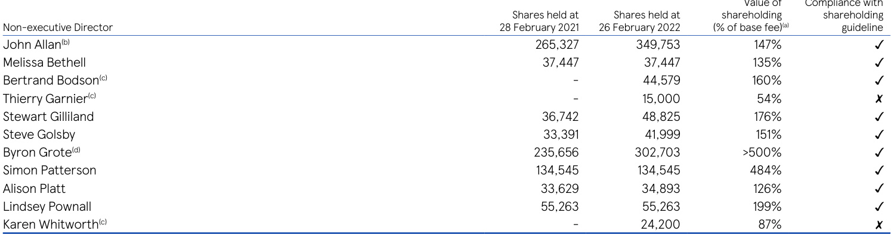

LlamaParse:
| Non-executive Director | Shares held at 28 February 2021 | Shares held at 26 February 2022 | Value of shareholding (% of base fee)(a) | Compliance with shareholding guideline |
| ---------------------- | ------------------------------- | ------------------------------- | ---------------------------------------- | -------------------------------------- |
| John Allan(b)          | 265,327                         | 349,753                         | 147%                                     | ✓                                      |
| Melissa Bethell        | 37,447                          | 37,447                          | 135%                                     | ✓                                      |
| Bertrand Bodson(c)     | -                               | 44,579                          | 160%                                     | ✓                                      |
| Thierry Garnier(c)     | -                               | 15,000                          | 54%                                      | ✗                                      |
| Stewart Gilliland      | 36,742                          | 48,825                          | 176%                                     | ✓                                      |
| Steve Golsby           | 33,391                          | 41,999                          | 151%                                     | ✓                                      |
| Byron Grote(d)         | 235,656                         | 302,703                         | >500%                                    | ✓                                      |
| Simon Patterson        | 134,545                         | 134,545                         | 484%                                     | ✓                                      |
| Alison Platt           | 33,629                          | 34,893                          | 126%                                     | ✓                                      |
| Lindsey Pownall        | 55,263                          | 55,263                          | 199%                                     | ✓                                      |
| Karen Whitworth(c)     | -                               | 24,200                          | 87%                                      | ✗                                      |

Azure:

<table>
<tr>
<th>Non-executive Director</th>
<th>Shares held at 28 February 2021</th>
<th>Shares held at 26 February 2022</th>
<th>Value of shareholding (% of base fee)(a)</th>
<th>Compliance with shareholding guideline</th>
</tr>
<tr>
<td>John Allan(b)</td>
<td>265,327</td>
<td>349,753</td>
<td>147%</td>
<td>✓ ☒</td>
</tr>
<tr>
<td>Melissa Bethell</td>
<td>37,447</td>
<td>37,447</td>
<td>135%</td>
<td>✓ ☒</td>
</tr>
<tr>
<td>Bertrand Bodson(c)</td>
<td>-</td>
<td>44,579</td>
<td>160%</td>
<td>✓ ☒</td>
</tr>
<tr>
<td>Thierry Garnier(c)</td>
<td>-</td>
<td>15,000</td>
<td>54%</td>
<td>✗ ☒</td>
</tr>
<tr>
<td>Stewart Gilliland</td>
<td>36,742</td>
<td>48,825</td>
<td>176%</td>
<td>✓ ☒</td>
</tr>
<tr>
<td>Steve Golsby</td>
<td>33,391</td>
<td>41,999</td>
<td>151%</td>
<td>✓ ☒</td>
</tr>
<tr>
<td>Byron Grote(d)</td>
<td>235,656</td>
<td>302,703</td>
<td>&gt;500%</td>
<td>✓ ☒</td>
</tr>
<tr>
<td>Simon Patterson</td>
<td>134,545</td>
<td>134,545</td>
<td>484%</td>
<td>✓ ☒</td>
</tr>
<tr>
<td>Alison Platt</td>
<td>33,629</td>
<td>34,893</td>
<td>126%</td>
<td>✓ ☒</td>
</tr>
<tr>
<td>Lindsey Pownall</td>
<td>55,263</td>
<td>55,263</td>
<td>199%</td>
<td>✓ ☒</td>
</tr>
<tr>
<td>Karen Whitworth(c)</td>
<td>-</td>
<td>24,200</td>
<td>87%</td>
<td>✗ ☒</td>
</tr>
</table>

DotsOCR
<table><thead><tr><th>Non-executive Director</th><th>Shares held at 28 February 2021</th><th>Shares held at 26 February 2022</th><th>Value of shareholding (% of base fee)(a)</th><th>Compliance with shareholding guideline</th></tr></thead><tbody><tr><td>John Allan(b)</td><td>265,327</td><td>349,753</td><td>147%</td><td>✓</td></tr><tr><td>Melissa Bethell</td><td>37,447</td><td>37,447</td><td>135%</td><td>✓</td></tr><tr><td>Bertrand Bodson(c)</td><td>-</td><td>44,579</td><td>160%</td><td>✓</td></tr><tr><td>Thierry Garnier(c)</td><td>-</td><td>15,000</td><td>54%</td><td>x</td></tr><tr><td>Stewart Gilliland</td><td>36,742</td><td>48,825</td><td>176%</td><td>✓</td></tr><tr><td>Steve Golsby</td><td>33,391</td><td>41,999</td><td>151%</td><td>✓</td></tr><tr><td>Byron Grote(d)</td><td>235,656</td><td>302,703</td><td>&gt;500%</td><td>✓</td></tr><tr><td>Simon Patterson</td><td>134,545</td><td>134,545</td><td>484%</td><td>✓</td></tr><tr><td>Alison Platt</td><td>33,629</td><td>34,893</td><td>126%</td><td>✓</td></tr><tr><td>Lindsey Pownall</td><td>55,263</td><td>55,263</td><td>199%</td><td>✓</td></tr><tr><td>Karen Whitworth(c)</td><td>-</td><td>24,200</td><td>87%</td><td>x</td></tr></tbody></table>

OlmOCR:
| Non-executive Director | Shares held at 28 February 2021 | Shares held at 26 February 2022 | Value of shareholding (% of base fee)(a) | Compliance with shareholding guideline |
|------------------------|---------------------------------|---------------------------------|--------------------------------------|---------------------------------------|
| John Allan(b)          | 265,327                         | 349,753                         | 147%                                 | ✓                                     |
| Melissa Bethell        | 37,447                          | 37,447                          | 135%                                 | ✓                                     |
| Bertrand Bodson(b)     | –                               | 44,579                          | 160%                                 | ✓                                     |
| Thierry Garnier(c)     | –                               | 15,000                          | 54%                                  | ✗                                     |
| Stewart Gilliland      | 36,742                          | 48,825                          | 176%                                 | ✓                                     |
| Steve Golsby           | 33,391                          | 41,999                          | 151%                                 | ✓                                     |
| Byron Grote(d)         | 235,656                         | 302,703                         | >500%                                | ✓                                     |
| Simon Patterson        | 134,545                         | 134,545                         | 484%                                 | ✓                                     |
| Alison Platt           | 33,629                          | 34,893                          | 126%                                 | ✓                                     |
| Lindsey Pownall        | 55,263                          | 55,263                          | 199%                                 | ✓                                     |
| Karen Whitworth(e)     | –                               | 24,200                          | 87%                                  | ✗                                     |

MinerU-2110-vlm
<table><tr><td></td><td>Shares held at 28 February 2021</td><td>Share held at 26 February 2022</td><td>Value of shareholding (% of base fee)a</td><td>Compliance with shareholding guideline</td></tr><tr><td>Non-executive Director</td><td></td><td></td><td></td><td></td></tr><tr><td>John Allan</td><td>265,327</td><td>349,753</td><td>147%</td><td>✓</td></tr><tr><td>Melissa Bethell</td><td>37,447</td><td>37,447</td><td>135%</td><td>✓</td></tr><tr><td>Bertrand Bodson</td><td>-</td><td>44,579</td><td>160%</td><td>✓</td></tr><tr><td>Thierry Garnier</td><td>-</td><td>15,000</td><td>54%</td><td>✘</td></tr><tr><td>Stewart Gilliland</td><td>36,742</td><td>48,825</td><td>176%</td><td>✓</td></tr><tr><td>Steve Golsby</td><td>33,391</td><td>41,999</td><td>151%</td><td>✓</td></tr><tr><td>Byron Grote</td><td>235,656</td><td>302,703</td><td>&amp;gt;500%</td><td>✓</td></tr><tr><td>Simon Patterson</td><td>134,545</td><td>134,545</td><td>484%</td><td>✓</td></tr><tr><td>Alison Platt</td><td>33,629</td><td>34,893</td><td>126%</td><td>✓</td></tr><tr><td>Lindsey Pownall</td><td>55,263</td><td>55,263</td><td>199%</td><td>✓</td></tr><tr><td>Karen Whitworth</td><td>-</td><td>24,200</td><td>87%</td><td>✘</td></tr></table>

Marker-162:
<table><tbody><tr><th></th><th></th><th></th><th>Value of</th><th>Compliance with</th></tr><tr><th></th><th>Shares held at</th><th>Shares held at</th><th>shareholding</th><th>shareholding</th></tr><tr><th>Non-executive Director</th><th>28 February 2021</th><th>26 February 2022</th><th>(% of base fee)(a)</th><th>guideline</th></tr><tr><td>John Allan(b)</td><td>265,327</td><td>349,753</td><td>147%</td><td>✓</td></tr><tr><td>Melissa Bethell</td><td>37,447</td><td>37,447</td><td>135%</td><td>✓</td></tr><tr><td>Bertrand Bodson(c)</td><td>-</td><td>44,579</td><td>160%</td><td>✓</td></tr><tr><td>Thierry Garnier(c)</td><td>-</td><td>15,000</td><td>54%</td><td>✗</td></tr><tr><td>Stewart Gilliland</td><td>36,742</td><td>48,825</td><td>176%</td><td>✓</td></tr><tr><td>Steve Golsby</td><td>33,391</td><td>41,999</td><td>151%</td><td>✓</td></tr><tr><td>Byron Grote(d)</td><td>235,656</td><td>302,703</td><td>&gt;500%</td><td>✓</td></tr><tr><td>Simon Patterson</td><td>134,545</td><td>134,545</td><td>484%</td><td>✓</td></tr><tr><td>Alison Platt</td><td>33,629</td><td>34,893</td><td>126%</td><td>✓</td></tr><tr><td>Lindsey Pownall</td><td>55,263</td><td>55,263</td><td>199%</td><td>✓</td></tr><tr><td>Karen Whitworth(c)</td><td>-</td><td>24,200</td><td>87%</td><td>✗</td></tr></tbody></table>

MinerU-1310:
<html><body><table><tr><td>Non-executive Director</td><td>Shares held at 28 February 2021</td><td>Shares held at 26 February 2022</td><td>vaiue of shareholding (% of base fee)la)</td><td>Compllance with shareholding guideline</td></tr><tr><td>John Allan(b)</td><td>265,327</td><td>349.753</td><td>147%</td><td>√</td></tr><tr><td>Melissa Bethell</td><td>37,447</td><td>37,447</td><td>135%</td><td>√</td></tr><tr><td>Bertrand Bodson(c)</td><td>1</td><td>44,579</td><td>160%</td><td>√</td></tr><tr><td>Thierry Garnier(c)</td><td>1</td><td>15,000</td><td>54%</td><td>X</td></tr><tr><td>Stewart Gilliland</td><td>36,742</td><td>48,825</td><td>176%</td><td>√</td></tr><tr><td>Steve Golsby</td><td>33,391</td><td>41,999</td><td>151%</td><td>√</td></tr><tr><td>Byron Grote(d)</td><td>235,656</td><td>302.703</td><td>>500%</td><td>√</td></tr><tr><td>Simon Patterson</td><td>134,545</td><td>134,545</td><td>484%</td><td>√</td></tr><tr><td>Alison Platt</td><td>33,629</td><td>34,893</td><td>126%</td><td>√</td></tr><tr><td>Lindsey Pownall</td><td>55,263</td><td>55,263</td><td>199%</td><td>√</td></tr><tr><td>Karen Whitworth(c)</td><td></td><td>24,200</td><td>87%</td><td>X</td></tr></table></body></html>

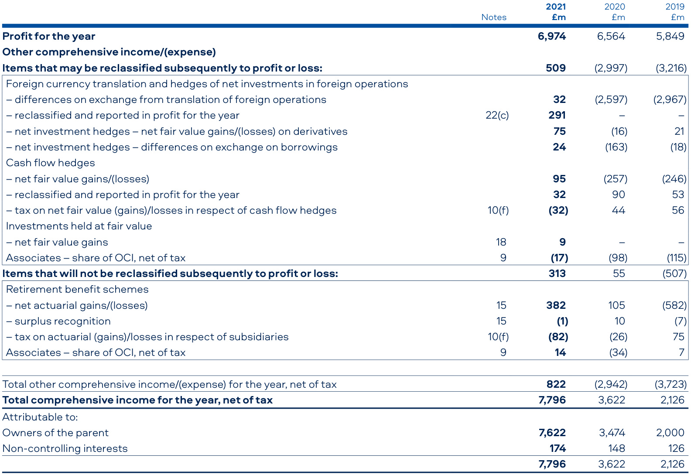

LlamaParse:
|                                                                                  |       |       |         |         |
| -------------------------------------------------------------------------------- | ----- | ----- | ------- | ------- |
|                                                                                  | 2021  | 2020  | 2019    |         |
| Profit for the year                                                              |       | 6,974 | 6,564   | 5,849   |
| Other comprehensive income/(expense)                                             |       |       |         |         |
| Items that may be reclassified subsequently to profit or loss:                   |       |       |         |         |
| Foreign currency translation and hedges of net investments in foreign operations |       |       |         |         |
| – differences on exchange from translation of foreign operations                 |       | 32    | (2,597) | (2,967) |
| – reclassified and reported in profit for the year                               |       | 22(c) | 291     | –       |
| – net investment hedges – net fair value gains/(losses) on derivatives           |       | 75    | (16)    | 21      |
| – net investment hedges – differences on exchange on borrowings                  |       | 24    | (163)   | (18)    |
| Cash flow hedges                                                                 |       |       |         |         |
| – net fair value gains/(losses)                                                  |       | 95    | (257)   | (246)   |
| – reclassified and reported in profit for the year                               |       | 32    | 90      | 53      |
| – tax on net fair value (gains)/losses in respect of cash flow hedges            | 10(f) | (32)  | 44      | 56      |
| Investments held at fair value                                                   |       |       |         |         |
| – net fair value gains                                                           |       | 18    | 9       | –       |
| Associates – share of OCI, net of tax                                            | 9     | (17)  | (98)    | (115)   |
| Items that will not be reclassified subsequently to profit or loss:              |       |       |         |         |
| Retirement benefit schemes                                                       |       |       |         |         |
| – net actuarial gains/(losses)                                                   | 15    | 382   | 105     | (582)   |
| – surplus recognition                                                            | 15    | (1)   | 10      | (7)     |
| – tax on actuarial (gains)/losses in respect of subsidiaries                     | 10(f) | (82)  | (26)    | 75      |
| Associates – share of OCI, net of tax                                            | 9     | 14    | (34)    | 7       |
| Total other comprehensive income/(expense) for the year, net of tax              |       | 822   | (2,942) | (3,723) |
| Total comprehensive income for the year, net of tax                              |       | 7,796 | 3,622   | 2,126   |
| Attributable to:                                                                 |       |       |         |         |
| Owners of the parent                                                             |       | 7,622 | 3,474   | 2,000   |
| Non-controlling interests                                                        |       | 174   | 148     | 126     |
|                                                                                  |       | 7,796 | 3,622   | 2,126   |

Azure:
<table>
<tr>
<th rowspan="3"></th>
<th rowspan="3">Notes</th>
<th colspan="3">For the years ended 31 December</th>
</tr>
<tr>
<th>2021</th>
<th>2020</th>
<th>2019</th>
</tr>
<tr>
<th>£m</th>
<th>Êm</th>
<th>Êm</th>
</tr>
<tr>
<td>Profit for the year</td>
<td></td>
<td>6,974</td>
<td>6,564</td>
<td>5,849</td>
</tr>
<tr>
<td>Other comprehensive income/(expense)</td>
<td></td>
<td></td>
<td></td>
<td></td>
</tr>
<tr>
<td>Items that may be reclassified subsequently to profit or loss:</td>
<td></td>
<td>509</td>
<td>(2,997)</td>
<td>(3,216)</td>
</tr>
<tr>
<td>Foreign currency translation and hedges of net investments in foreign operations - differences on exchange from translation of foreign operations</td>
<td></td>
<td>32</td>
<td>(2,597)</td>
<td>(2,967)</td>
</tr>
<tr>
<td>- reclassified and reported in profit for the year</td>
<td>22(c)</td>
<td>291</td>
<td>–</td>
<td>–</td>
</tr>
<tr>
<td>- net investment hedges - net fair value gains/(losses) on derivatives</td>
<td></td>
<td>75</td>
<td>(16)</td>
<td>21</td>
</tr>
<tr>
<td>- net investment hedges - differences on exchange on borrowings</td>
<td></td>
<td>24</td>
<td>(163)</td>
<td>(18)</td>
</tr>
<tr>
<td>Cash flow hedges</td>
<td></td>
<td></td>
<td></td>
<td></td>
</tr>
<tr>
<td>- net fair value gains/(losses)</td>
<td></td>
<td>95</td>
<td>(257)</td>
<td>(246)</td>
</tr>
<tr>
<td>- reclassified and reported in profit for the year</td>
<td></td>
<td>32</td>
<td>90</td>
<td>53</td>
</tr>
<tr>
<td>- tax on net fair value (gains)/losses in respect of cash flow hedges</td>
<td>10(f)</td>
<td>(32)</td>
<td>44</td>
<td>56</td>
</tr>
<tr>
<td>Investments held at fair value</td>
<td></td>
<td></td>
<td></td>
<td></td>
</tr>
<tr>
<td>- net fair value gains</td>
<td>18</td>
<td>9</td>
<td>–</td>
<td>–</td>
</tr>
<tr>
<td>Associates - share of OCI, net of tax</td>
<td>9</td>
<td>(17)</td>
<td>(98)</td>
<td>(115)</td>
</tr>
<tr>
<td>Items that will not be reclassified subsequently to profit or loss:</td>
<td></td>
<td>313</td>
<td>55</td>
<td>(507)</td>
</tr>
<tr>
<td>Retirement benefit schemes</td>
<td></td>
<td></td>
<td></td>
<td></td>
</tr>
<tr>
<td>- net actuarial gains/(losses)</td>
<td>15</td>
<td>382</td>
<td>105</td>
<td>(582)</td>
</tr>
<tr>
<td>- surplus recognition</td>
<td>15</td>
<td>(1)</td>
<td>10</td>
<td>(7)</td>
</tr>
<tr>
<td>- tax on actuarial (gains)/losses in respect of subsidiaries</td>
<td>10(f)</td>
<td>(82)</td>
<td>(26)</td>
<td>75</td>
</tr>
<tr>
<td>Associates - share of OCI, net of tax</td>
<td>9</td>
<td>14</td>
<td>(34)</td>
<td>7</td>
</tr>
<tr>
<td></td>
<td></td>
<td></td>
<td></td>
<td></td>
</tr>
<tr>
<td>Total other comprehensive income/(expense) for the year, net of tax</td>
<td></td>
<td>822</td>
<td>(2,942)</td>
<td>(3,723)</td>
</tr>
<tr>
<td>Total comprehensive income for the year, net of tax</td>
<td></td>
<td>7,796</td>
<td>3,622</td>
<td>2,126</td>
</tr>
<tr>
<td>Attributable to:</td>
<td></td>
<td></td>
<td></td>
<td></td>
</tr>
<tr>
<td>Owners of the parent</td>
<td></td>
<td>7,622</td>
<td>3,474</td>
<td>2,000</td>
</tr>
<tr>
<td>Non-controlling interests</td>
<td></td>
<td>174</td>
<td>148</td>
<td>126</td>
</tr>
<tr>
<td></td>
<td></td>
<td>7,796</td>
<td>3,622</td>
<td>2,126</td>
</tr>
</table>

DotsOCR:
<table><thead><tr><th></th><th></th><th colspan="3">For the years ended 31 December</th></tr><tr><th></th><th>Notes</th><th>2021 £m</th><th>2020 £m</th><th>2019 £m</th></tr></thead><tbody><tr><td>Profit for the year</td><td></td><td>6,974</td><td>6,564</td><td>5,849</td></tr><tr><td colspan="5">Other comprehensive income/(expense)</td></tr><tr><td colspan="5">Items that may be reclassified subsequently to profit or loss:</td></tr><tr><td></td><td></td><td>509</td><td>(2,997)</td><td>(3,216)</td></tr><tr><td colspan="5">Foreign currency translation and hedges of net investments in foreign operations</td></tr><tr><td>- differences on exchange from translation of foreign operations</td><td></td><td>32</td><td>(2,597)</td><td>(2,967)</td></tr><tr><td>- reclassified and reported in profit for the year</td><td>22(c)</td><td>291</td><td>-</td><td>-</td></tr><tr><td>- net investment hedges - net fair value gains/(losses) on derivatives</td><td></td><td>75</td><td>(16)</td><td>21</td></tr><tr><td>- net investment hedges - differences on exchange on borrowings</td><td></td><td>24</td><td>(163)</td><td>(18)</td></tr><tr><td colspan="5">Cash flow hedges</td></tr><tr><td>- net fair value gains/(losses)</td><td></td><td>95</td><td>(257)</td><td>(246)</td></tr><tr><td>- reclassified and reported in profit for the year</td><td></td><td>32</td><td>90</td><td>53</td></tr><tr><td>- tax on net fair value (gains)/losses in respect of cash flow hedges</td><td>10(f)</td><td>(32)</td><td>44</td><td>56</td></tr><tr><td colspan="5">Investments held at fair value</td></tr><tr><td>- net fair value gains</td><td>18</td><td>9</td><td>-</td><td>-</td></tr><tr><td>Associates - share of OCI, net of tax</td><td>9</td><td>(17)</td><td>(98)</td><td>(115)</td></tr><tr><td colspan="5">Items that will not be reclassified subsequently to profit or loss:</td></tr><tr><td></td><td></td><td>313</td><td>55</td><td>(507)</td></tr><tr><td colspan="5">Retirement benefit schemes</td></tr><tr><td>- net actuarial gains/(losses)</td><td>15</td><td>382</td><td>105</td><td>(582)</td></tr><tr><td>- surplus recognition</td><td>15</td><td>(1)</td><td>10</td><td>(7)</td></tr><tr><td>- tax on actuarial (gains)/losses in respect of subsidiaries</td><td>10(f)</td><td>(82)</td><td>(26)</td><td>75</td></tr><tr><td>Associates - share of OCI, net of tax</td><td>9</td><td>14</td><td>(34)</td><td>7</td></tr><tr><td>Total other comprehensive income/(expense) for the year, net of tax</td><td></td><td>822</td><td>(2,942)</td><td>(3,723)</td></tr><tr><td>Total comprehensive income for the year, net of tax</td><td></td><td>7,796</td><td>3,622</td><td>2,126</td></tr><tr><td colspan="5">Attributable to:</td></tr><tr><td>Owners of the parent</td><td></td><td>7,622</td><td>3,474</td><td>2,000</td></tr><tr><td>Non-controlling interests</td><td></td><td>174</td><td>148</td><td>126</td></tr><tr><td></td><td></td><td>7,796</td><td>3,622</td><td>2,126</td></tr></tbody></table>

OlmOCR:
| Notes | 2021 £m | 2020 £m | 2019 £m |
|-------|---------|---------|---------|
| **Profit for the year** | 6,974 | 6,564 | 5,849 |
| **Other comprehensive income/(expense)** | | | |
| **Items that may be reclassified subsequently to profit or loss:** | 509 | (2,997) | (3,216) |
| Foreign currency translation and hedges of net investments in foreign operations | | | |
| – differences on exchange from translation of foreign operations | 32 | (2,597) | (2,967) |
| – reclassified and reported in profit for the year | 22(c) | 291 | – |
| – net investment hedges – net fair value gains/(losses) on derivatives | 75 | (16) | 21 |
| – net investment hedges – differences on exchange on borrowings | 24 | (163) | (18) |
| Cash flow hedges | | | |
| – net fair value gains/(losses) | 95 | (257) | (246) |
| – reclassified and reported in profit for the year | 32 | 90 | 53 |
| – tax on net fair value (gains)/losses in respect of cash flow hedges | 10(f) | (32) | 44 |
| Investments held at fair value | | | |
| – net fair value gains | 18 | 9 | – |
| Associates – share of OCI, net of tax | 9 | (17) | (98) |
| **Items that will not be reclassified subsequently to profit or loss:** | 313 | 55 | (507) |
| Retirement benefit schemes | | | |
| – net actuarial gains/(losses) | 15 | 382 | 105 |
| – surplus recognition | 15 | (1) | 10 |
| – tax on actuarial (gains)/losses in respect of subsidiaries | 10(f) | (82) | (26) |
| Associates – share of OCI, net of tax | 9 | 14 | (34) |
| **Total other comprehensive income/(expense) for the year, net of tax** | 822 | (2,942) | (3,723) |
| **Total comprehensive income for the year, net of tax** | 7,796 | 3,622 | 2,126 |
| Attributable to: | | | |
| Owners of the parent | 7,622 | 3,474 | 2,000 |
| Non-controlling interests | 174 | 148 | 126 |

MinerU-2110-vlm
<table><tr><td rowspan="2"></td><td rowspan="2">Notes</td><td colspan="3">For the years ended 31 December</td></tr><tr><td>2021 
£m</td><td>2020 
£m</td><td>2019 
£m</td></tr><tr><td>Profit for the year</td><td></td><td>6,974</td><td>6,564</td><td>5,849</td></tr><tr><td>Other comprehensive income/(expense)</td><td></td><td></td><td></td><td></td></tr><tr><td>Items that may be reclassified subsequently to profit or loss:</td><td></td><td>509</td><td>(2,997)</td><td>(3,216)</td></tr><tr><td>Foreign currency translation and hedges of net investments in foreign operations</td><td></td><td></td><td></td><td></td></tr><tr><td>- differences on exchange from translation of foreign operations</td><td></td><td>32</td><td>(2,597)</td><td>(2,967)</td></tr><tr><td>- reclassified and reported in profit for the year</td><td>22(c)</td><td>291</td><td>-</td><td>-</td></tr><tr><td>- net investment hedges - net fair value gains/(losses) on derivatives</td><td></td><td>75</td><td>(16)</td><td>21</td></tr><tr><td>- net investment hedges - differences on exchange on borrowings</td><td></td><td>24</td><td>(163)</td><td>(18)</td></tr><tr><td>Cash flow hedges</td><td></td><td></td><td></td><td></td></tr><tr><td>- net fair value gains/(losses)</td><td></td><td>95</td><td>(257)</td><td>(246)</td></tr><tr><td>- reclassified and reported in profit for the year</td><td></td><td>32</td><td>90</td><td>53</td></tr><tr><td>- tax on net fair value (gains)/losses in respect of cash flow hedges</td><td>10(f)</td><td>(32)</td><td>44</td><td>56</td></tr><tr><td>Investments held at fair value</td><td></td><td></td><td></td><td></td></tr><tr><td>- net fair value gains</td><td>18</td><td>9</td><td>-</td><td>-</td></tr><tr><td>Associates - share of OCI, net of tax</td><td>9</td><td>(17)</td><td>(98)</td><td>(115)</td></tr><tr><td>Items that will not be reclassified subsequently to profit or loss:</td><td></td><td>313</td><td>55</td><td>(507)</td></tr><tr><td>Retirement benefit schemes</td><td></td><td></td><td></td><td></td></tr><tr><td>- net actuarial gains/(losses)</td><td>15</td><td>382</td><td>105</td><td>(582)</td></tr><tr><td>- surplus recognition</td><td>15</td><td>(1)</td><td>10</td><td>(7)</td></tr><tr><td>- tax on actuarial (gains)/losses in respect of subsidiaries</td><td>10(f)</td><td>(82)</td><td>(26)</td><td>75</td></tr><tr><td>Associates - share of OCI, net of tax</td><td>9</td><td>14</td><td>(34)</td><td>7</td></tr><tr><td>Total other comprehensive income/(expense) for the year, net of tax</td><td></td><td>822</td><td>(2,942)</td><td>(3,723)</td></tr><tr><td>Total comprehensive income for the year, net of tax</td><td></td><td>7,796</td><td>3,622</td><td>2,126</td></tr><tr><td>Attributable to:</td><td></td><td></td><td></td><td></td></tr><tr><td>Owners of the parent</td><td></td><td>7,622</td><td>3,474</td><td>2,000</td></tr><tr><td>Non-controlling interests</td><td></td><td>174</td><td>148</td><td>126</td></tr><tr><td></td><td></td><td>7,796</td><td>3,622</td><td>2,126</td></tr></table>

Marker-162:
<table><tbody><tr><th>2021 Notes £m Profit for the year 6,974 Other comprehensive income/(expense) Items that may be reclassified subsequently to profit or loss: 509 Foreign currency translation and hedges of net investments in foreign operations – differences on exchange from translation of foreign operations 32 – reclassified and reported in profit for the year 22(c) 291 – net investment hedges – net fair value gains/(losses) on derivatives 75 – net investment hedges – differences on exchange on borrowings 24</th><th colspan=2>For the years ended 31 December</th></tr><tr><th></th><th>2020 £m</th><th>2019 £m</th></tr><tr><td></td><td>6,564</td><td>5,849</td></tr><tr><td></td><td></td><td></td></tr><tr><td></td><td>(2,997)</td><td>(3,216)</td></tr><tr><td></td><td></td><td></td></tr><tr><td></td><td>(2,597)</td><td>(2,967)</td></tr><tr><td></td><td>–</td><td>–</td></tr><tr><td></td><td>(16)</td><td>21</td></tr><tr><td></td><td>(163)</td><td>(18)</td></tr><tr><td>Cash flow hedges</td><td></td><td></td></tr><tr><td>– net fair value gains/(losses) 95</td><td>(257)</td><td>(246)</td></tr><tr><td>– reclassified and reported in profit for the year 32</td><td>90</td><td>53</td></tr><tr><td>– tax on net fair value (gains)/losses in respect of cash flow hedges 10(f) (32)</td><td>44</td><td>56</td></tr><tr><td>Investments held at fair value</td><td></td><td></td></tr><tr><td>– net fair value gains 18 9</td><td>–</td><td>–</td></tr><tr><td>Associates – share of OCI, net of tax 9 (17)</td><td>(98)</td><td>(115)</td></tr><tr><td>Items that will not be reclassified subsequently to profit or loss: 313</td><td>55</td><td>(507)</td></tr><tr><td>Retirement benefit schemes</td><td></td><td></td></tr><tr><td>– net actuarial gains/(losses) 15 382</td><td>105</td><td>(582)</td></tr><tr><td>– surplus recognition 15 (1)</td><td>10</td><td>(7)</td></tr><tr><td>– tax on actuarial (gains)/losses in respect of subsidiaries 10(f) (82)</td><td>(26)</td><td>75</td></tr><tr><td>Associates – share of OCI, net of tax 9 14</td><td>(34)</td><td>7</td></tr><tr><td>Total other comprehensive income/(expense) for the year, net of tax 822</td><td>(2,942)</td><td>(3,723)</td></tr><tr><td>Total comprehensive income for the year, net of tax 7,796</td><td>3,622</td><td>2,126</td></tr><tr><td>Attributable to:</td><td></td><td></td></tr><tr><td>Owners of the parent 7,622</td><td>3,474</td><td>2,000</td></tr><tr><td>Non-controlling interests 174</td><td>148</td><td>126</td></tr><tr><td>7,796</td><td>3,622</td><td>2,126</td></tr></tbody></table>

MinerU-1310:
<html><body><table><tr><td></td><td>Notes</td><td>2021 £m</td><td>2020 £m</td><td>2019 £m</td></tr><tr><td>Profit for the year</td><td></td><td>6,974</td><td>6,564</td><td>5,849</td></tr><tr><td>Othercomprehensive income/(expense)</td><td></td><td></td><td></td><td>(3,216)</td></tr><tr><td>Items that may be reclassified subsequently to profit or loss:</td><td></td><td>509</td><td>(2,997)</td><td></td></tr><tr><td>Foreign currency translation and hedges of net investments in foreign operations</td><td></td><td></td><td>(2,597)</td><td>(2,967)</td></tr><tr><td>- differences on exchange from translation of foreign operations - reclassified and reported in profit for the year</td><td>22(c)</td><td>32</td><td></td><td></td></tr><tr><td></td><td></td><td>291</td><td>1</td><td>1</td></tr><tr><td>- net investment hedges- net fair value gains/(losses) on derivatives</td><td></td><td>75</td><td>(16)</td><td>21</td></tr><tr><td>- net investment hedges - differences on exchange on borrowings</td><td></td><td>24</td><td>(163)</td><td>(18)</td></tr><tr><td>Cash flow hedges</td><td></td><td></td><td></td><td></td></tr><tr><td>- net fair value gains/(losses)</td><td></td><td>95</td><td>(257)</td><td>(246)</td></tr><tr><td>- reclassified and reported in profit for the year</td><td></td><td>32</td><td>90</td><td>53</td></tr><tr><td>- tax on net fair value (gains)/losses in respect of cash flow hedges</td><td>10(f)</td><td>(32)</td><td>44</td><td>56</td></tr><tr><td>Investments held at fair value</td><td></td><td></td><td></td><td></td></tr><tr><td>- net fair value gains Associates - share of OCl, net of tax</td><td>18</td><td>9</td><td></td><td>一</td></tr><tr><td>Items that will not be reclassified subsequently to profit or loss:</td><td>9</td><td>(17)</td><td>(98)</td><td>(115)</td></tr><tr><td></td><td></td><td>313</td><td>55</td><td>(507)</td></tr><tr><td>Retirement benefit schemes</td><td></td><td></td><td></td><td></td></tr><tr><td>- net actuarial gains/(losses)</td><td>15</td><td>382</td><td>105</td><td>(582)</td></tr><tr><td>- surplus recognition</td><td>15</td><td>(1)</td><td>10</td><td>(7)</td></tr><tr><td>- tax on actuarial (gains)/losses in respect of subsidiaries</td><td>10(f)</td><td>(82)</td><td>(26)</td><td>75</td></tr><tr><td>Associates - share of OCl, net of tax</td><td>9</td><td>14</td><td>(34)</td><td>7</td></tr><tr><td></td><td></td><td></td><td></td><td></td></tr><tr><td>Total other comprehensive income/(expense) for the year, net of tax</td><td></td><td>822</td><td>(2,942)</td><td>(3,723)</td></tr><tr><td>Total comprehensive income for the year, net of tax</td><td></td><td>7,796</td><td>3,622</td><td>2,126</td></tr><tr><td>Attributable to:</td><td></td><td></td><td></td><td></td></tr><tr><td>Owners of the parent Non-controlling interests</td><td></td><td>7,622</td><td>3,474</td><td>2,000</td></tr><tr><td></td><td></td><td>174 7,796</td><td>148 3,622</td><td>126 2,126</td></tr></table></body></html>

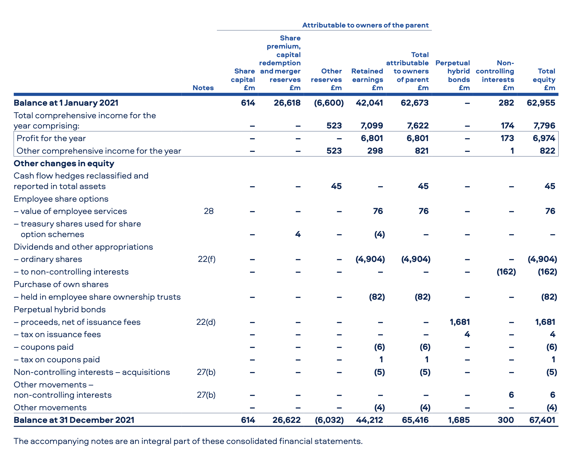

LlamaParse:
|                                                                  |                |                   |                                        |                                      |                           |              |       |     |         |        |
| ---------------------------------------------------------------- | -------------- | ----------------- | -------------------------------------- | ------------------------------------ | ------------------------- | ------------ | ----- | --- | ------- | ------ |
|                                                                  |                |                   |                                        | Attributable to owners of the parent | Non-controlling interests | Total equity |       |     |         |        |
| Share premium, capital redemption                                | Other reserves | Retained earnings | Total attributable to owners of parent | Perpetual hybrid bonds               | Controlling               |              |       |     |         |        |
| Balance at 1 January 2021                                        | 614            | 26,618            | (6,600)                                |                                      | 42,041                    | 62,673       | –     |     | 282     | 62,955 |
| Total comprehensive income for the year comprising:              | –              | –                 | 523                                    |                                      | 7,099                     | 7,622        | –     | 174 |         | 7,796  |
| Profit for the year                                              | –              | –                 | –                                      |                                      | 6,801                     | 6,801        | –     | 173 |         | 6,974  |
| Other comprehensive income for the year                          | –              | –                 | 523                                    |                                      | 298                       | 821          | –     | 1   |         | 822    |
| Other changes in equity                                          | –              | –                 | 45                                     | –                                    | 45                        | –            | –     | 45  |         |        |
| Employee share options – value of employee services              | 28             | –                 | –                                      |                                      | 76                        | 76           | –     | –   | 76      |        |
| – treasury shares used for share option schemes                  | –              | 4                 | –                                      |                                      | (4)                       | –            | –     | –   | –       |        |
| Dividends and other appropriations – ordinary shares             | 22(f)          | –                 | –                                      |                                      | (4,904)                   | (4,904)      | –     | –   | (4,904) |        |
| – to non-controlling interests                                   | –              | –                 | –                                      | –                                    | –                         | –            |       |     | (162)   | (162)  |
| Purchase of own shares – held in employee share ownership trusts | –              | –                 | –                                      |                                      | (82)                      | (82)         | –     | –   | (82)    |        |
| Perpetual hybrid bonds – proceeds, net of issuance fees          | 22(d)          | –                 | –                                      | –                                    | –                         |              | 1,681 | –   | 1,681   |        |
| – tax on issuance fees                                           | –              | –                 | –                                      | –                                    | –                         |              | 4     | –   | 4       |        |
| – coupons paid                                                   | –              | –                 | –                                      |                                      | (6)                       | (6)          | –     | –   | (6)     |        |
| – tax on coupons paid                                            | –              | –                 | –                                      | 1                                    | 1                         | –            | –     | 1   |         |        |
| Non-controlling interests – acquisitions                         | 27(b)          | –                 | –                                      |                                      | (5)                       | (5)          | –     | –   | (5)     |        |
| Other movements – non-controlling interests                      | 27(b)          | –                 | –                                      | –                                    | –                         | –            |       | 6   | 6       |        |
| Other movements                                                  | –              | –                 | –                                      |                                      | (4)                       | (4)          | –     | –   | (4)     |        |
| Balance at 31 December 2021                                      | 614            | 26,622            | (6,032)                                |                                      | 44,212                    | 65,416       | 1,685 |     | 300     | 67,401 |

Azure:
<table>
<tr>
<th rowspan="3"></th>
<th rowspan="3">Notes</th>
<th colspan="5">Attributable to owners of the parent</th>
<th rowspan="3">Perpetual hybrid bonds £m</th>
<th rowspan="2">Non- controlling interests</th>
<th rowspan="2">Total equity</th>
</tr>
<tr>
<th rowspan="2">Share capital £m</th>
<th>Share premium, capital redemption and merger reserves</th>
<th>Other reserves</th>
<th>Retained earnings</th>
<th>Total attributable to owners of parent</th>
</tr>
<tr>
<th>£m</th>
<th>£m</th>
<th>£m</th>
<th>£m</th>
<th>£m</th>
<th>£m</th>
</tr>
<tr>
<td>Balance at 1 January 2021</td>
<td></td>
<td>614</td>
<td>26,618</td>
<td>(6,600)</td>
<td>42,041</td>
<td>62,673</td>
<td>–</td>
<td>282</td>
<td>62,955</td>
</tr>
<tr>
<td>Total comprehensive income for the year comprising:</td>
<td></td>
<td>–</td>
<td>–</td>
<td>523</td>
<td>7,099</td>
<td>7,622</td>
<td>–</td>
<td>174</td>
<td>7,796</td>
</tr>
<tr>
<td>Profit for the year</td>
<td></td>
<td>–</td>
<td>–</td>
<td>–</td>
<td>6,801</td>
<td>6,801</td>
<td>–</td>
<td>173</td>
<td>6,974</td>
</tr>
<tr>
<td>Other comprehensive income for the year</td>
<td></td>
<td>–</td>
<td>–</td>
<td>523</td>
<td>298</td>
<td>821</td>
<td>–</td>
<td>1</td>
<td>822</td>
</tr>
<tr>
<td>Other changes in equity</td>
<td></td>
<td></td>
<td></td>
<td></td>
<td></td>
<td></td>
<td></td>
<td></td>
<td></td>
</tr>
<tr>
<td>Cash flow hedges reclassified and reported in total assets</td>
<td></td>
<td>–</td>
<td>–</td>
<td>45</td>
<td>–</td>
<td>45</td>
<td>–</td>
<td>–</td>
<td>45</td>
</tr>
<tr>
<td rowspan="2">Employee share options - value of employee services</td>
<td></td>
<td></td>
<td rowspan="2">–</td>
<td rowspan="2">–</td>
<td rowspan="2">76</td>
<td rowspan="2">76</td>
<td></td>
<td rowspan="2">–</td>
<td></td>
</tr>
<tr>
<td>28</td>
<td>–</td>
<td>–</td>
<td>76</td>
</tr>
<tr>
<td>- treasury shares used for share option schemes</td>
<td></td>
<td>–</td>
<td>4</td>
<td>–</td>
<td>(4)</td>
<td>–</td>
<td>–</td>
<td>–</td>
<td>–</td>
</tr>
<tr>
<td>Dividends and other appropriations - ordinary shares</td>
<td>22(f)</td>
<td>–</td>
<td>–</td>
<td>–</td>
<td>(4,904)</td>
<td>(4,904)</td>
<td>–</td>
<td>–</td>
<td>(4,904)</td>
</tr>
<tr>
<td>- to non-controlling interests</td>
<td></td>
<td>–</td>
<td>–</td>
<td>–</td>
<td>–</td>
<td>–</td>
<td>–</td>
<td>(162)</td>
<td>(162)</td>
</tr>
<tr>
<td>Purchase of own shares</td>
<td></td>
<td></td>
<td></td>
<td></td>
<td></td>
<td></td>
<td></td>
<td></td>
<td></td>
</tr>
<tr>
<td>- held in employee share ownership trusts</td>
<td></td>
<td>–</td>
<td>–</td>
<td>–</td>
<td>(82)</td>
<td>(82)</td>
<td>–</td>
<td>–</td>
<td>(82)</td>
</tr>
<tr>
<td>Perpetual hybrid bonds</td>
<td></td>
<td></td>
<td></td>
<td></td>
<td></td>
<td></td>
<td></td>
<td></td>
<td></td>
</tr>
<tr>
<td>- proceeds, net of issuance fees</td>
<td>22(d)</td>
<td>–</td>
<td>–</td>
<td>–</td>
<td>–</td>
<td>–</td>
<td>1,681</td>
<td>–</td>
<td>1,681</td>
</tr>
<tr>
<td>- tax on issuance fees</td>
<td></td>
<td>–</td>
<td>–</td>
<td>–</td>
<td>–</td>
<td>–</td>
<td>4</td>
<td>–</td>
<td>4</td>
</tr>
<tr>
<td>- coupons paid</td>
<td></td>
<td>–</td>
<td>–</td>
<td>–</td>
<td>(6)</td>
<td>(6)</td>
<td>–</td>
<td>–</td>
<td>(6)</td>
</tr>
<tr>
<td>- tax on coupons paid</td>
<td></td>
<td>–</td>
<td>–</td>
<td>–</td>
<td>1</td>
<td>1</td>
<td>–</td>
<td>–</td>
<td>1</td>
</tr>
<tr>
<td>Non-controlling interests - acquisitions</td>
<td>27(b)</td>
<td>–</td>
<td>–</td>
<td>–</td>
<td>(5)</td>
<td>(5)</td>
<td>–</td>
<td>–</td>
<td>(5)</td>
</tr>
<tr>
<td>Other movements -</td>
<td></td>
<td></td>
<td rowspan="2">–</td>
<td rowspan="2">–</td>
<td rowspan="2">–</td>
<td rowspan="2">–</td>
<td rowspan="2">–</td>
<td rowspan="2">6</td>
<td></td>
</tr>
<tr>
<td>non-controlling interests</td>
<td>27(b)</td>
<td>–</td>
<td>6</td>
</tr>
<tr>
<td>Other movements</td>
<td></td>
<td>–</td>
<td>–</td>
<td>–</td>
<td>(4)</td>
<td>(4)</td>
<td>–</td>
<td>–</td>
<td>(4)</td>
</tr>
<tr>
<td>Balance at 31 December 2021</td>
<td></td>
<td>614</td>
<td>26,622</td>
<td>(6,032)</td>
<td>44,212</td>
<td>65,416</td>
<td>1,685</td>
<td>300</td>
<td>67,401</td>
</tr>
</table>

DotsOCR:
<table><thead><tr><th rowspan="2"></th><th rowspan="2">Notes</th><th colspan="7">Attributable to owners of the parent</th></tr><tr><th>Share capital £m</th><th>Share premium, capital redemption and merger reserves £m</th><th>Other reserves £m</th><th>Retained earnings £m</th><th>Total attributable to owners of parent £m</th><th>Perpetual hybrid bonds £m</th><th>Non-controlling interests £m</th><th>Total equity £m</th></tr></thead><tbody><tr><td><strong>Balance at 1 January 2021</strong></td><td></td><td>614</td><td>26,618</td><td>(6,600)</td><td>42,041</td><td>62,673</td><td>-</td><td>282</td><td>62,955</td></tr><tr><td>Total comprehensive income for the year comprising:</td><td></td><td>-</td><td>-</td><td>523</td><td>7,099</td><td>7,622</td><td>-</td><td>174</td><td>7,796</td></tr><tr><td>Profit for the year</td><td></td><td>-</td><td>-</td><td>-</td><td>6,801</td><td>6,801</td><td>-</td><td>173</td><td>6,974</td></tr><tr><td>Other comprehensive income for the year</td><td></td><td>-</td><td>-</td><td>523</td><td>298</td><td>821</td><td>-</td><td>1</td><td>822</td></tr><tr><td><strong>Other changes in equity</strong></td><td></td><td></td><td></td><td></td><td></td><td></td><td></td><td></td><td></td></tr><tr><td>Cash flow hedges reclassified and reported in total assets</td><td></td><td>-</td><td>-</td><td>45</td><td>-</td><td>45</td><td>-</td><td>-</td><td>45</td></tr><tr><td>Employee share options</td><td></td><td></td><td></td><td></td><td></td><td></td><td></td><td></td><td></td></tr><tr><td>- value of employee services</td><td>28</td><td>-</td><td>-</td><td>-</td><td>76</td><td>76</td><td>-</td><td>-</td><td>76</td></tr><tr><td>- treasury shares used for share option schemes</td><td></td><td>-</td><td>4</td><td>-</td><td>(4)</td><td>-</td><td>-</td><td>-</td><td>-</td></tr><tr><td>Dividends and other appropriations</td><td></td><td></td><td></td><td></td><td></td><td></td><td></td><td></td><td></td></tr><tr><td>- ordinary shares</td><td>22(f)</td><td>-</td><td>-</td><td>-</td><td>(4,904)</td><td>(4,904)</td><td>-</td><td>-</td><td>(4,904)</td></tr><tr><td>- to non-controlling interests</td><td></td><td>-</td><td>-</td><td>-</td><td>-</td><td>-</td><td>-</td><td>(162)</td><td>(162)</td></tr><tr><td>Purchase of own shares</td><td></td><td></td><td></td><td></td><td></td><td></td><td></td><td></td><td></td></tr><tr><td>- held in employee share ownership trusts</td><td></td><td>-</td><td>-</td><td>-</td><td>(82)</td><td>(82)</td><td>-</td><td>-</td><td>(82)</td></tr><tr><td>Perpetual hybrid bonds</td><td></td><td></td><td></td><td></td><td></td><td></td><td></td><td></td><td></td></tr><tr><td>- proceeds, net of issuance fees</td><td>22(d)</td><td>-</td><td>-</td><td>-</td><td>-</td><td>-</td><td>1,681</td><td>-</td><td>1,681</td></tr><tr><td>- tax on issuance fees</td><td></td><td>-</td><td>-</td><td>-</td><td>-</td><td>-</td><td>4</td><td>-</td><td>4</td></tr><tr><td>- coupons paid</td><td></td><td>-</td><td>-</td><td>-</td><td>(6)</td><td>(6)</td><td>-</td><td>-</td><td>(6)</td></tr><tr><td>- tax on coupons paid</td><td></td><td>-</td><td>-</td><td>-</td><td>1</td><td>1</td><td>-</td><td>-</td><td>1</td></tr><tr><td>Non-controlling interests - acquisitions</td><td>27(b)</td><td>-</td><td>-</td><td>-</td><td>(5)</td><td>(5)</td><td>-</td><td>-</td><td>(5)</td></tr><tr><td>Other movements - non-controlling interests</td><td>27(b)</td><td>-</td><td>-</td><td>-</td><td>-</td><td>-</td><td>-</td><td>6</td><td>6</td></tr><tr><td>Other movements</td><td></td><td>-</td><td>-</td><td>-</td><td>(4)</td><td>(4)</td><td>-</td><td>-</td><td>(4)</td></tr><tr><td><strong>Balance at 31 December 2021</strong></td><td></td><td>614</td><td>26,622</td><td>(6,032)</td><td>44,212</td><td>65,416</td><td>1,685</td><td>300</td><td>67,401</td></tr></tbody></table>

OlmOCR:
| Notes | Share capital £m | Share premium, capital redemption and merger reserves £m | Other reserves £m | Retained earnings £m | Total attributable to owners of parent £m | Perpetual hybrid bonds £m | Non-controlling interests £m | Total equity £m |
|-------|------------------|--------------------------------------------------------|------------------|----------------------|------------------------------------------|--------------------------|-----------------------------|------------------|
| **Balance at 1 January 2021** | 614 | 26,618 | (6,600) | 42,041 | 62,673 | – | 282 | 62,955 |
| **Total comprehensive income for the year comprising:** | – | – | 523 | 7,099 | 7,622 | – | 174 | 7,796 |
| **Profit for the year** | – | – | – | 6,801 | 6,801 | – | 173 | 6,974 |
| **Other comprehensive income for the year** | – | – | 523 | 298 | 821 | – | 1 | 822 |

### Other changes in equity

- Cash flow hedges reclassified and reported in total assets: – – 45 – 45 – – 45
- Employee share options:
  - value of employee services: 28 – – – 76 76 – – 76
  - treasury shares used for share option schemes: – 4 – (4) – – – –
- Dividends and other appropriations:
  - ordinary shares: 22(f) – – – (4,904) (4,904) – – (4,904)
  - to non-controlling interests: – – – – – – (162) (162)
- Purchase of own shares:
  - held in employee share ownership trusts: – – – (82) (82) – – (82)
- Perpetual hybrid bonds:
  - proceeds, net of issuance fees: 22(d) – – – – 1,681 – 1,681
  - tax on issuance fees: – – – – – 4 – 4
  - coupons paid: – – – – (6) (6) – – (6)
  - tax on coupons paid: – – – – 1 1 – – 1
- Non-controlling interests – acquisitions: 27(b) – – – (5) (5) – – (5)
- Other movements – non-controlling interests: 27(b) – – – – – 6 6
- Other movements: – – – – (4) (4) – – (4)

| **Balance at 31 December 2021** | 614 | 26,622 | (6,032) | 44,212 | 65,416 | 1,685 | 300 | 67,401 |

MinerU-2110-vlm
<table><tr><td rowspan="3"></td><td colspan="9">Attributable to owners of the parent</td></tr><tr><td rowspan="2">Notes</td><td>Share premium, capital redemption and merger reserves</td><td>Share capital</td><td>Share other reserves</td><td>Retained earnings</td><td>Total attributable to owners of parent</td><td>Perpetual hybrid bonds</td><td>Non-controlling interests</td><td>Total equity</td></tr><tr><td>£m</td><td>£m</td><td>£m</td><td>£m</td><td>£m</td><td>£m</td><td>£m</td><td>£m</td></tr><tr><td>Balance at 1 January 2021</td><td>614</td><td>26,618</td><td>(6,030)</td><td>42,041</td><td>62,673</td><td>-</td><td>282</td><td>62,939</td><td></td></tr><tr><td>Total comprehensive income for the year comprising:</td><td>-</td><td>-</td><td>523</td><td>7,099</td><td>7,622</td><td>-</td><td>174</td><td>7,796</td><td></td></tr><tr><td>Profit for the year</td><td>-</td><td>-</td><td>-</td><td>6,801</td><td>6,801</td><td>-</td><td>173</td><td>6,974</td><td></td></tr><tr><td>Other comprehensive income for the year</td><td>-</td><td>-</td><td>523</td><td>298</td><td>821</td><td>-</td><td>1</td><td>822</td><td></td></tr><tr><td>Other changes in equity</td><td></td><td></td><td></td><td></td><td></td><td></td><td></td><td></td><td></td></tr><tr><td>Cash flow hedges reclassified and reported in total assets</td><td>-</td><td>-</td><td>45</td><td>-</td><td>45</td><td>-</td><td>-</td><td>45</td><td></td></tr><tr><td>Employee share options</td><td></td><td></td><td></td><td></td><td></td><td></td><td></td><td></td><td></td></tr><tr><td>- value of employee services</td><td>28</td><td>-</td><td>-</td><td>76</td><td>76</td><td>-</td><td>-</td><td>76</td><td></td></tr><tr><td>- treasury shares used for share option schemes</td><td>-</td><td>4</td><td>-</td><td>(4)</td><td>-</td><td>-</td><td>-</td><td>-</td><td></td></tr><tr><td>Dividends and other appropriations</td><td></td><td></td><td></td><td></td><td></td><td></td><td></td><td></td><td></td></tr><tr><td>- ordinary shares</td><td>22(f)</td><td>-</td><td>-</td><td>(4,904)</td><td>(4,904)</td><td>-</td><td>-</td><td>(4,904)</td><td></td></tr><tr><td>- to non-controlling interests</td><td>-</td><td>-</td><td>-</td><td>-</td><td>-</td><td>-</td><td>(162)</td><td>(162)</td><td></td></tr><tr><td>Purchase of own shares</td><td></td><td></td><td></td><td></td><td></td><td></td><td></td><td></td><td></td></tr><tr><td>- held in employee share ownership trusts</td><td>-</td><td>-</td><td>-</td><td>(82)</td><td>(82)</td><td>-</td><td>-</td><td>(82)</td><td></td></tr><tr><td>Perpetual hybrid bonds</td><td></td><td></td><td></td><td></td><td></td><td></td><td></td><td></td><td></td></tr><tr><td>- proceeds, net of issuance fees</td><td>22(d)</td><td>-</td><td>-</td><td>-</td><td>-</td><td>1,681</td><td>-</td><td>1,681</td><td></td></tr><tr><td>- tax on issuance fees</td><td>-</td><td>-</td><td>-</td><td>-</td><td>-</td><td>4</td><td>-</td><td>4</td><td></td></tr><tr><td>- coupons paid</td><td>-</td><td>-</td><td>-</td><td>(6)</td><td>(6)</td><td>-</td><td>-</td><td>(6)</td><td></td></tr><tr><td>- tax on coupons paid</td><td>-</td><td>-</td><td>-</td><td>1</td><td>1</td><td>-</td><td>-</td><td>1</td><td></td></tr><tr><td>Non-controlling interests - acquisitions</td><td>27(b)</td><td>-</td><td>-</td><td>(5)</td><td>(5)</td><td>-</td><td>-</td><td>(5)</td><td></td></tr><tr><td>Other movements - non-controlling interests</td><td>27(b)</td><td>-</td><td>-</td><td>-</td><td>-</td><td>-</td><td>6</td><td>6</td><td></td></tr><tr><td>Other movements</td><td>-</td><td>-</td><td>-</td><td>(4)</td><td>(4)</td><td>-</td><td>-</td><td>(4)</td><td></td></tr><tr><td>Balance at 31 December 2021</td><td>614</td><td>26,622</td><td>(6,032)</td><td>44,212</td><td>65,416</td><td>1,685</td><td>300</td><td>67,401</td><td></td></tr></table>

Marker-162:
<table><tbody><tr><th></th><th></th><th></th><th></th><th></th><th></th><th>Attributable to owners of the parent</th><th></th><th></th><th></th></tr><tr><th></th><th>Notes</th><th>Share capital £m</th><th>Share premium, capital redemption and merger reserves £m</th><th>Other reserves £m</th><th>Retained earnings £m</th><th>Total attributable to owners of parent £m</th><th>Perpetual hybrid bonds £m</th><th>Non controlling interests £m</th><th>Total equity £m</th></tr><tr><td>Balance at 1 January 2021</td><td></td><td>614</td><td>26,618</td><td>(6,600)</td><td>42,041</td><td>62,673</td><td>–</td><td>282</td><td>62,955</td></tr><tr><td>Total comprehensive income for the year comprising:</td><td></td><td>–</td><td>–</td><td>523</td><td>7,099</td><td>7,622</td><td>–</td><td>174</td><td>7,796</td></tr><tr><td>Profit for the year</td><td></td><td>–</td><td>–</td><td>–</td><td>6,801</td><td>6,801</td><td>–</td><td>173</td><td>6,974</td></tr><tr><td>Other comprehensive income for the year</td><td></td><td>–</td><td>–</td><td>523</td><td>298</td><td>821</td><td>–</td><td>1</td><td>822</td></tr><tr><td>Other changes in equity</td><td></td><td></td><td></td><td></td><td></td><td></td><td></td><td></td><td></td></tr><tr><td>Cash flow hedges reclassified and reported in total assets</td><td></td><td>–</td><td>–</td><td>45</td><td>–</td><td>45</td><td>–</td><td>–</td><td>45</td></tr><tr><td>Employee share options</td><td></td><td></td><td></td><td></td><td></td><td></td><td></td><td></td><td></td></tr><tr><td>– value of employee services</td><td>28</td><td>–</td><td>–</td><td>–</td><td>76</td><td>76</td><td>–</td><td>–</td><td>76</td></tr><tr><td>– treasury shares used for share option schemes</td><td></td><td>–</td><td>4</td><td>–</td><td>(4)</td><td>–</td><td>–</td><td>–</td><td>–</td></tr><tr><td>Dividends and other appropriations</td><td></td><td></td><td></td><td></td><td></td><td></td><td></td><td></td><td></td></tr><tr><td>– ordinary shares</td><td>22(f)</td><td>–</td><td>–</td><td>–</td><td>(4,904)</td><td>(4,904)</td><td>–</td><td>–</td><td>(4,904)</td></tr><tr><td>– to non-controlling interests</td><td></td><td>–</td><td>–</td><td>–</td><td>–</td><td>–</td><td>–</td><td>(162)</td><td>(162)</td></tr><tr><td>Purchase of own shares</td><td></td><td></td><td></td><td></td><td></td><td></td><td></td><td></td><td></td></tr><tr><td>– held in employee share ownership trusts</td><td></td><td>–</td><td>–</td><td>–</td><td>(82)</td><td>(82)</td><td>–</td><td>–</td><td>(82)</td></tr><tr><td>Perpetual hybrid bonds</td><td></td><td></td><td></td><td></td><td></td><td></td><td></td><td></td><td></td></tr><tr><td>– proceeds, net of issuance fees</td><td>22(d)</td><td>–</td><td>–</td><td>–</td><td>–</td><td>–</td><td>1,681</td><td>–</td><td>1,681</td></tr><tr><td>– tax on issuance fees</td><td></td><td>–</td><td>–</td><td>–</td><td>–</td><td>–</td><td>4</td><td>–</td><td>4</td></tr><tr><td>– coupons paid</td><td></td><td>–</td><td>–</td><td>–</td><td>(6)</td><td>(6)</td><td>–</td><td>–</td><td>(6)</td></tr><tr><td>– tax on coupons paid</td><td></td><td>–</td><td>–</td><td>–</td><td>1</td><td>1</td><td>–</td><td>–</td><td>1</td></tr><tr><td>Non-controlling interests – acquisitions</td><td>27(b)</td><td>–</td><td>–</td><td>–</td><td>(5)</td><td>(5)</td><td>–</td><td>–</td><td>(5)</td></tr><tr><td>Other movements – non-controlling interests</td><td>27(b)</td><td>–</td><td>–</td><td>–</td><td>–</td><td>–</td><td>–</td><td>6</td><td>6</td></tr><tr><td>Other movements</td><td></td><td>–</td><td>–</td><td>–</td><td>(4)</td><td>(4)</td><td>–</td><td>–</td><td>(4)</td></tr><tr><td>Balance at 31 December 2021</td><td></td><td>614</td><td>26,622</td><td>(6,032)</td><td>44,212</td><td>65,416</td><td>1,685</td><td>300</td><td>67,401</td></tr></tbody></table>

MinerU-1310:
<html><body><table><tr><td></td><td>Share and merger capital £m</td><td>Share premium, capital redemption reserves £m</td><td>Other reserves £m</td><td>Retained earnings</td><td>Total attributable to owners of parent</td><td>Perpetual hybrid bonds</td><td>Non- controlling interests</td><td>Total</td></tr><tr><td>Balance at 1January 2021 Total comprehensive income for the</td><td>614</td><td>26,618</td><td>(6,600)</td><td>42,041</td><td>62,673</td><td>1</td><td>282</td><td>62,955</td></tr><tr><td>yearcomprising:</td><td></td><td></td><td>523</td><td>7,099</td><td>7,622</td><td>1</td><td>174</td><td>7,796</td></tr><tr><td>Profit for the year</td><td></td><td></td><td>1</td><td>6,801</td><td>6,801</td><td>1</td><td>173</td><td>6,974</td></tr><tr><td>Other comprehensive income for the year Other changes in equity</td><td></td><td></td><td>523</td><td>298</td><td>821</td><td>1</td><td>1</td><td>822</td></tr><tr><td>Cash flow hedges reclassified and reported in total assets</td><td></td><td></td><td></td><td></td><td></td><td></td><td></td><td></td></tr><tr><td>Employee share options - value of employee services</td><td>28</td><td>1</td><td></td><td>45</td><td>45</td><td>1</td><td>一 1</td><td>45</td></tr><tr><td>- treasury shares used for share</td><td></td><td>1</td><td>1</td><td>1</td><td>76</td><td>76</td><td></td><td>76</td></tr><tr><td>option schemes Dividends and other appropriations</td><td></td><td></td><td>4</td><td>1</td><td>(4)</td><td>1</td><td></td><td>1</td></tr><tr><td>- ordinary shares</td><td>22(f)</td><td></td><td>1</td><td>1 (4,904)</td><td>(4,904)</td><td></td><td></td><td>(4,904)</td></tr><tr><td>- to non-controlling interests</td><td></td><td></td><td></td><td>1</td><td></td><td></td><td>(162)</td><td>(162)</td></tr><tr><td>Purchase of own shares - held in employee share ownership trusts</td><td></td><td></td><td></td><td></td><td></td><td></td><td></td><td></td></tr><tr><td>Perpetual hybrid bonds</td><td></td><td></td><td></td><td>1 (82)</td><td>(82)</td><td>1</td><td></td><td>(82)</td></tr><tr><td>- proceeds,net of issuance fees</td><td>22(d)</td><td></td><td></td><td></td><td></td><td>1,681</td><td></td><td>1,681</td></tr><tr><td>- tax on issuance fees</td><td></td><td></td><td>1 1</td><td>1 1</td><td>1 1</td><td>1 1</td><td></td><td>4</td></tr><tr><td>- coupons paid</td><td></td><td></td><td>1</td><td></td><td>(6)</td><td>(6)</td><td></td><td></td></tr><tr><td>- tax on coupons paid</td><td></td><td></td><td>1</td><td></td><td>1</td><td>1</td><td></td><td>(6) 1</td></tr><tr><td>Non-controlling interests - acquisitions</td><td>27(b)</td><td>1 1</td><td>1</td><td>1</td><td></td><td></td><td>1</td><td>(5)</td></tr><tr><td>Other movements</td><td></td><td></td><td></td><td>1</td><td>(5)</td><td>(5)</td><td>1</td><td></td></tr><tr><td>non-controlling interests</td><td>27(b)</td><td>1</td><td>1</td><td>1</td><td>1</td><td>1</td><td></td><td>6</td></tr><tr><td>Othermovements</td><td></td><td></td><td>1</td><td></td><td>(4)</td><td>(4)</td><td></td><td>(4)</td></tr><tr><td>Balance at 31 December 2021</td><td></td><td>614 26,622</td><td></td><td>(6,032) 44,212</td><td>65,416</td><td>1,685</td><td>300</td><td>67,401</td></tr></table></body></html>

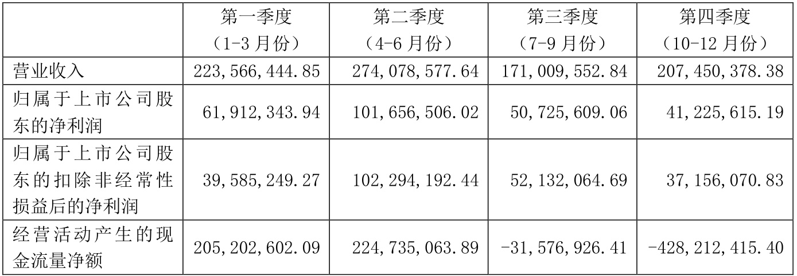
LlamaParse:
| 项目                                     | 第一季度 (1-3 月份)  | 第二季度 (4-6 月份)  | 第三季度 (7-9 月份)  | 第四季度 (10-12 月份) |
| -------------------------------------- | -------------- | -------------- | -------------- | --------------- |
| 营业收入                                   | 223,566,444.85 | 274,078,577.64 | 171,009,552.84 | 207,450,378.38  |
| 归 属 于 上 市 公 司 股 东的净利润                  | 61,912,343.94  | 101,656,506.02 | 50,725,609.06  | 41,225,615.19   |
| 归 属 于 上 市 公 司 股 东 的 扣 除 非 经 常 性损益后的净利润 | 39,585,249.27  | 102,294,192.44 | 52,132,064.69  | 37,156,070.83   |
| 经营活动产生的现金流量净额                          | 205,202,602.09 | 224,735,063.89 | -31,576,926.41 | -428,212,415.40 |

Azure:
<table>
<tr>
<th></th>
<th>第一季度 (1-3月份)</th>
<th>第二季度 (4-6月份)</th>
<th>第三季度 (7-9月份)</th>
<th>第四季度 (10-12 月份)</th>
</tr>
<tr>
<td>营业收入</td>
<td>223, 566, 444. 85</td>
<td>274, 078,577.64</td>
<td>171, 009, 552. 84</td>
<td>207,450,378.38</td>
</tr>
<tr>
<td>归属于上市公司股 东的净利润</td>
<td>61,912, 343. 94</td>
<td>101, 656, 506. 02</td>
<td>50, 725,609.06</td>
<td>41,225,615. 19</td>
</tr>
<tr>
<td>归属于上市公司股 东的扣除非经常性 损益后的净利润</td>
<td>39, 585, 249.27</td>
<td>102, 294, 192. 44</td>
<td>52, 132,064.69</td>
<td>37,156,070.83</td>
</tr>
<tr>
<td>经营活动产生的现 金流量净额</td>
<td>205, 202, 602. 09</td>
<td>224, 735, 063.89</td>
<td>-31, 576,926.41</td>
<td>-428, 212, 415. 40</td>
</tr>
</table>

DotsOCR:
<table><thead><tr><th></th><th>第一季度 (1-3月份)</th><th>第二季度 (4-6月份)</th><th>第三季度 (7-9月份)</th><th>第四季度 (10-12月份)</th></tr></thead><tbody><tr><td>营业收入</td><td>223, 566, 444.85</td><td>274, 078, 577.64</td><td>171, 009, 552.84</td><td>207, 450, 378.38</td></tr><tr><td>归属于上市公司股东的净利润</td><td>61, 912, 343.94</td><td>101, 656, 506.02</td><td>50, 725, 609.06</td><td>41, 225, 615.19</td></tr><tr><td>归属于上市公司股东的扣除非经常性损益后的净利润</td><td>39, 585, 249.27</td><td>102, 294, 192.44</td><td>52, 132, 064.69</td><td>37, 156, 070.83</td></tr><tr><td>经营活动产生的现金流量净额</td><td>205, 202, 602.09</td><td>224, 735, 063.89</td><td>-31, 576, 926.41</td><td>-428, 212, 415.40</td></tr></tbody></table>

OlmOCR:
|                | 第一季度（1-3 月份） | 第二季度（4-6 月份） | 第三季度（7-9 月份） | 第四季度（10-12 月份） |
|----------------|--------------------|--------------------|--------------------|------------------------|
| 营业收入       | 223,566,444.85     | 274,078,577.64     | 171,009,552.84     | 207,450,378.38         |
| 归属于上市公司股东的净利润 | 61,912,343.94     | 101,656,506.02     | 50,725,609.06      | 41,225,615.19          |
| 归属于上市公司股东的扣除非经常性损益后的净利润 | 39,585,249.27     | 102,294,192.44     | 52,132,064.69      | 37,156,070.83          |
| 经营活动产生的现金流量净额 | 205,202,602.09    | 224,735,063.89     | -31,576,926.41     | -428,212,415.40        |

MinerU-2110-vlm
<table><tr><td></td><td>第一季度
(1-3月份)</td><td>第二季度
(4-6月份)</td><td>第三季度
(7-9月份)</td><td>第四季度
(10-12月份)</td></tr><tr><td>营业收入</td><td>223,566,444.85</td><td>274,078,577.64</td><td>171,009,552.84</td><td>207,450,378.38</td></tr><tr><td>归属于上市公司股东的净利润</td><td>61,912,343.94</td><td>101,656,506.02</td><td>50,725,609.06</td><td>41,225,615.19</td></tr><tr><td>归属于上市公司股东的扣除非经常性损益后的净利润</td><td>39,585,249.27</td><td>102,294,192.44</td><td>52,132,064.69</td><td>37,156,070.83</td></tr><tr><td>经营活动产生的现金流量净额</td><td>205,202,602.09</td><td>224,735,063.89</td><td>-31,576,926.41</td><td>-428,212,415.40</td></tr></table>

Marker-162:
<table><tbody><tr><th></th><th>第一季度</th><th>第二季度</th><th>第三季度</th><th colspan=2>第四季度</th></tr><tr><td></td><td>(1-3 月份)</td><td>(4-6 月份)</td><td>(7-9 月份)</td><td>(10-12 月份)</td></tr><tr><td>营业收入</td><td>223,566,444.85</td><td>274,078,577.64</td><td>171,009,552.84</td><td>207,450,378.38</td></tr><tr><td>归属于上市公司股</td><td>61,912,343.94</td><td>101,656,506.02</td><td>50,725,609.06</td><td>41,225,615.19</td></tr><tr><td>东的净利润</td><td></td><td></td><td></td><td></td></tr><tr><td>归属于上市公司股</td><td></td><td></td><td></td><td></td></tr><tr><td>东的扣除非经常性</td><td>39,585,249.27</td><td>102,294,192.44</td><td>52,132,064.69</td><td>37,156,070.83</td></tr><tr><td>损益后的净利润</td><td></td><td></td><td></td><td></td></tr><tr><td>经营活动产生的现</td><td></td><td></td><td></td><td></td></tr><tr><td>金流量净额</td><td>205,202,602.09</td><td>224,735,063.89</td><td>-31,576,926.41</td><td>-428,212,415.40</td></tr></tbody></table>

MinerU-1310:
<html><body><table><tr><td></td><td>第一季度 （1-3月份）</td><td>第二季度 （4-6月份）</td><td>第三季度 （7-9月份）</td><td>第四季度 （10-12月份）</td></tr><tr><td>营业收入</td><td>223,566,444.85</td><td>274,078,577. 64</td><td>171,009, 552. 84</td><td>207,450,378. 38</td></tr><tr><td>归属于上市公司股 东的净利润</td><td>61,912, 343.94</td><td>101,656, 506. 02</td><td>50,725,609.06</td><td>41,225,615.19</td></tr><tr><td>归属于上市公司股 东的扣除非经常性 损益后的净利润</td><td>39,585,249.27</td><td>102,294,192.44</td><td>52,132,064.69</td><td>37,156,070. 83</td></tr><tr><td>经营活动产生的现 金流量净额</td><td>205,202,602.09</td><td>224,735,063.89</td><td>-31,576, 926.41</td><td>-428,212,415.40</td></tr></table></body></html>

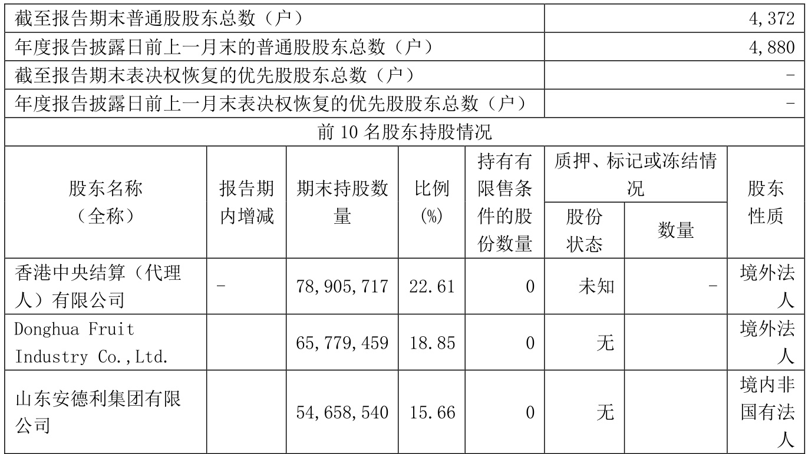

LlamaParse:
| 截至报告期末普通股股东总数（户）             | 4,372 |
| ---------------------------- | ----- |
| 年度报告披露日前上一月末的普通股股东总数（户）      | 4,880 |
| 截至报告期末表决权恢复的优先股股东总数（户）       | -     |
| 年度报告披露日前上一月末表决权恢复的优先股股东总数（户） | -     |

# 前 10 名股东持股情况

| 股东名称（全称）                        | 报告期内增减 | 期末持股数      | 比例 (%) | 质押、标记或冻结情况 | 限售条 件的股份数量 | 股东性质    |
| ------------------------------- | ------ | ---------- | ------ | ---------- | ---------- | ------- |
| 香港中央结算（代理人）有限公司                 | -      | 78,905,717 | 22.61  | 0          | 未知         | -       |
| Donghua Fruit Industry Co.,Ltd. |        | 65,779,459 | 18.85  | 0          | 无          | 境外法人    |
| 山东安德利集团有限公司                     |        | 54,658,540 | 15.66  | 0          | 无          | 境内非国有法人 |

Azure:
<table>
<caption>前 10名股东持股情况</caption>
<tr>
<td>截至报告期末普通股股东总数(户)</td>
<td>4,372</td>
</tr>
<tr>
<td>年度报告披露日前上一月末的普通股股东总数(户)</td>
<td>4,880</td>
</tr>
<tr>
<td>截至报告期末表决权恢复的优先股股东总数(户)</td>
<td>-</td>
</tr>
<tr>
<td>年度报告披露日前上一月末表决权恢复的优先股股东总数(户)</td>
<td>-</td>
</tr>
</table>

<table>
<tr>
<th rowspan="2">股东名称 (全称)</th>
<th rowspan="2">报告期 内增减</th>
<th rowspan="2">期末持股数 量</th>
<th rowspan="2">比例 (%)</th>
<th rowspan="2">持有有 限售条 件的股 份数量</th>
<th colspan="2">质押、标记或冻结情 况</th>
<th rowspan="2">股东 性质</th>
</tr>
<tr>
<th>股份 状态</th>
<th>数量</th>
</tr>
<tr>
<td>香港中央结算(代理 人)有限公司</td>
<td>-</td>
<td>78, 905,717</td>
<td>22. 61</td>
<td>0</td>
<td>未知</td>
<td>-</td>
<td>境外法 人</td>
</tr>
<tr>
<td>Donghua Fruit Industry Co., Ltd.</td>
<td></td>
<td>65, 779,459</td>
<td>18. 85</td>
<td>0</td>
<td>无</td>
<td></td>
<td>境外法 人</td>
</tr>
<tr>
<td>山东安德利集团有限 公司</td>
<td></td>
<td>54,658,540</td>
<td>15. 66</td>
<td>0</td>
<td>无</td>
<td></td>
<td>境内非 国有法 人</td>
</tr>
</table>

DotsOCR:
<table><tr><td>截至报告期末普通股股东总数(户)</td><td>4,372</td></tr><tr><td>年度报告披露日前上一月末的普通股股东总数(户)</td><td>4,880</td></tr><tr><td>截至报告期末表决权恢复的优先股股东总数(户)</td><td>-</td></tr><tr><td>年度报告披露日前上一月末表决权恢复的优先股股东总数(户)</td><td>-</td></tr></table>

前 10 名股东持股情况

<table><thead><tr><th rowspan="2">股东名称 (全称)</th><th rowspan="2">报告期 内增减</th><th rowspan="2">期末持股数 量</th><th rowspan="2">比例 (%)</th><th rowspan="2">持有有 限售条 件的股 份数量</th><th colspan="2">质押、标记或冻结情 况</th><th rowspan="2">股东 性质</th></tr><tr><th>股份 状态</th><th>数量</th></tr></thead><tbody><tr><td>香港中央结算(代理 人)有限公司</td><td>-</td><td>78, 905, 717</td><td>22.61</td><td>0</td><td>未知</td><td>-</td><td>境外法 人</td></tr><tr><td>Donghua Fruit Industry Co., Ltd.</td><td></td><td>65, 779, 459</td><td>18.85</td><td>0</td><td>无</td><td></td><td>境外法 人</td></tr><tr><td>山东安德利集团有限 公司</td><td></td><td>54, 658, 540</td><td>15.66</td><td>0</td><td>无</td><td></td><td>境内非 国有法 人</td></tr></tbody></table>

OlmOCR:
| 截至报告期末普通股股东总数（户） | 4,372 |
|-----------------------------------|-------|
| 年度报告披露日前上一月末的普通股股东总数（户） | 4,880 |
| 截至报告期末表决权恢复的优先股股东总数（户） | - |
| 年度报告披露日前上一月末表决权恢复的优先股股东总数（户） | - |

前 10 名股东持股情况

| 股东名称（全称） | 报告期内增减 | 期末持股数量 | 比例（%） | 持有有限售条件的股份数量 | 质押、标记或冻结情况 | 股东性质 |
|------------------|---------------|---------------|----------|---------------------------|----------------------|----------|
| 香港中央结算（代理人）有限公司 | -             | 78,905,717    | 22.61    | 0                         | 未知                 | 境外法人 |
| Donghua Fruit Industry Co., Ltd. |               | 65,779,459    | 18.85    | 0                         | 无                   | 境外法人 |
| 山东安德利集团有限公司 |               | 54,658,540    | 15.66    | 0                         | 无                   | 境内非国有法人 |

MinerU-2110-vlm
<table><tr><td colspan="5">截至报告期末普通股股东总数(户)</td><td colspan="2">4,372</td><td></td></tr><tr><td colspan="5">年度报告披露日前上一月末的普通股股东总数(户)</td><td colspan="2">4,880</td><td></td></tr><tr><td colspan="5">截至报告期末表决权恢复的优先股股东总数(户)</td><td colspan="2">-</td><td></td></tr><tr><td colspan="5">年度报告披露日前上一月末表决权恢复的优先股股东总数(户)</td><td colspan="2">-</td><td></td></tr><tr><td colspan="7">前10名股东持股情况</td><td></td></tr><tr><td rowspan="2">股东名称(全称)</td><td rowspan="2">报告期内增减</td><td rowspan="2">期末持股数量</td><td rowspan="2">比例(%)</td><td rowspan="2">持有有限售条件的股份数量</td><td colspan="2">质押、标记或冻结情况</td><td rowspan="2">股东性质</td></tr><tr><td>股份状态</td><td>数量</td></tr><tr><td>香港中央结算(代理人)有限公司</td><td>-</td><td>78,905,717</td><td>22.61</td><td>0</td><td>未知</td><td>-</td><td>境外法人</td></tr><tr><td>Donghua Fruit Industry Co.,Ltd.</td><td></td><td>65,779,459</td><td>18.85</td><td>0</td><td>无</td><td></td><td>境外法人</td></tr><tr><td>山东安德利集团有限公司</td><td></td><td>54,658,540</td><td>15.66</td><td>0</td><td>无</td><td></td><td>境内非国有法人</td></tr></table>

Marker-162:
<table><tbody><tr><th></th><th></th><th></th><th></th><th></th><th></th><th></th><th></th></tr><tr><td colspan=6>截至报告期末普通股股东总数(户)</td><td colspan=3>4,372</td></tr><tr><td colspan=5>年度报告披露日前上一月末的普通股股东总数(户)</td><td colspan=3>4,880</td></tr><tr><td colspan=5>截至报告期末表决权恢复的优先股股东总数(户)</td><td></td><td></td><td>-</td></tr><tr><td colspan=5>年度报告披露日前上一月末表决权恢复的优先股股东总数(户)</td><td></td><td></td><td>-</td></tr><tr><td colspan=7>前 10 名股东持股情况</td></tr><tr><td></td><td></td><td></td><td></td><td>持有有</td><td></td><td>质押、标记或冻结情</td><td></td></tr><tr><td>股东名称</td><td>报告期</td><td>期末持股数</td><td>比例</td><td>限售条</td><td colspan=2>况</td><td>股东</td></tr><tr><td>(全称)</td><td>内增减</td><td>量</td><td>(%)</td><td>件的股</td><td>股份</td><td></td><td>性质</td></tr><tr><td></td><td></td><td></td><td></td><td>份数量</td><td>状态</td><td>数量</td><td></td></tr><tr><td>香港中央结算(代理</td><td></td><td></td><td></td><td></td><td></td><td></td><td>境外法</td></tr><tr><td>人)有限公司</td><td>-</td><td>78,905,717</td><td>22.61</td><td>0</td><td>未知</td><td>-</td><td>人</td></tr><tr><td>Donghua Fruit</td><td></td><td></td><td></td><td></td><td></td><td></td><td>境外法</td></tr><tr><td>Industry Co.,Ltd.</td><td></td><td>65,779,459</td><td>18.85</td><td>0</td><td>无</td><td></td><td>人</td></tr><tr><td></td><td></td><td></td><td></td><td></td><td></td><td></td><td>境内非</td></tr><tr><td>山东安德利集团有限</td><td></td><td>54,658,540</td><td>15.66</td><td>0</td><td>无</td><td></td><td>国有法</td></tr><tr><td>公司</td><td></td><td></td><td></td><td></td><td></td><td></td><td>人</td></tr></tbody></table>

MinerU-1310:
<html><body><table><tr><td colspan="5">截至报告期末普通股股东总数（户）</td><td colspan="3">4,372</td></tr><tr><td colspan="5">年度报告披露日前上一月末的普通股股东总数（户）</td><td colspan="3">4,880</td></tr><tr><td colspan="4">截至报告期末表决权恢复的优先股股东总数（户）</td><td></td><td colspan="3">二</td></tr><tr><td colspan="6">年度报告披露日前上一月末表决权恢复的优先股股东总数（户）</td><td colspan="3">二</td></tr><tr><td colspan="8">前10名股东持股情况</td></tr><tr><td>股东名称</td><td rowspan="2">报告期 内增减</td><td rowspan="2">期末持股数 量</td><td rowspan="2">比例 (%)</td><td rowspan="2">持有有 限售条 件的股</td><td colspan="2">质押、标记或冻结情</td><td rowspan="3">股东 性质</td></tr><tr><td rowspan="2">（全称）</td><td colspan="2">股份</td><td>况 数量</td></tr><tr><td>香港中央结算（代理</td><td></td><td>78, 905, 717 22.61</td><td>份数量 0</td><td>状态 未知</td><td></td><td>境外法</td></tr><tr><td>人）有限公司 Donghua Fruit</td><td></td><td>65,779,459</td><td>18.85</td><td></td><td>无</td><td></td><td>人 境外法</td></tr><tr><td>Industry Co.,Ltd. 山东安德利集团有限 公司</td><td></td><td>54,658,540</td><td>15.66</td><td></td><td>无</td><td></td><td>人 境内非 国有法 人</td></tr></table></body></html> 

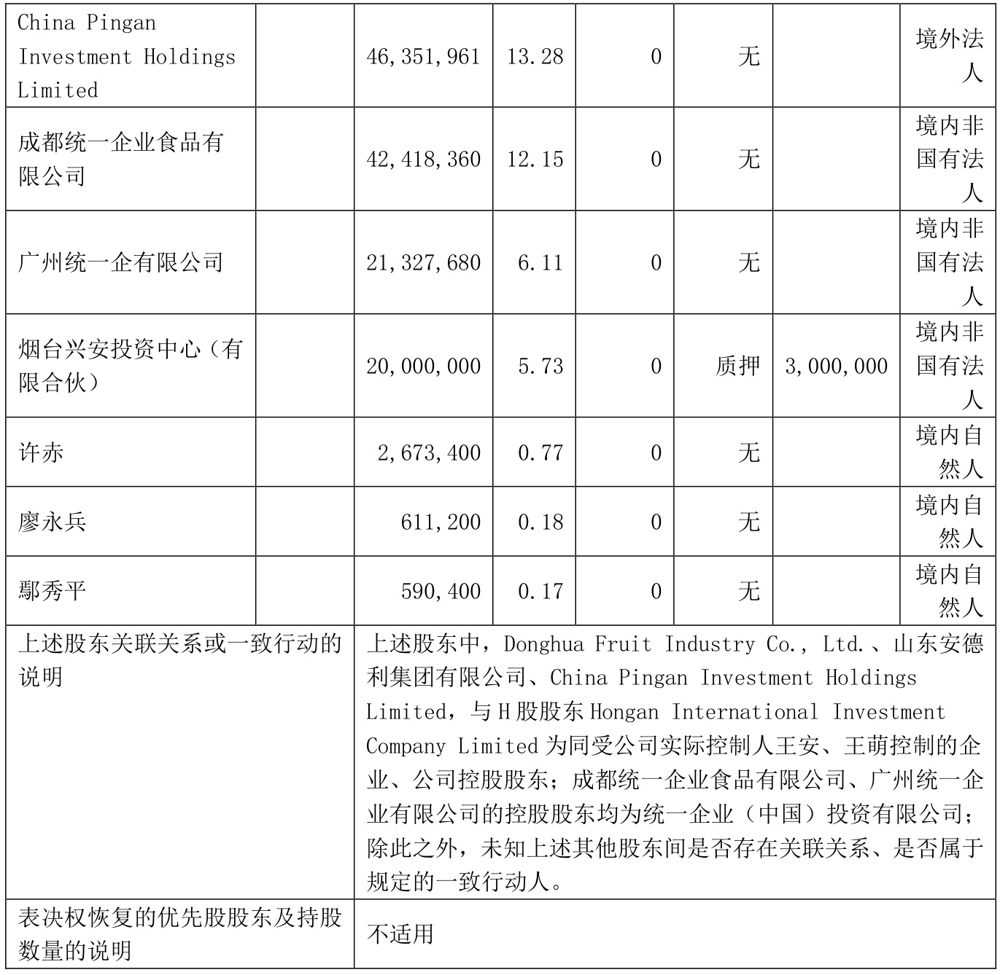

LlamaParse:

| 投资者                              | 持股数量       | 持股比例  | 质押情况 | 质押数量 | 股东类型      |        |
| -------------------------------- | ---------- | ----- | ---- | ---- | --------- | ------ |
| China Pingan Investment Holdings | 46,351,961 | 13.28 | 0    | 无    | 境外法       |        |
| 成都统一企业食品有限公司                     | 42,418,360 | 12.15 | 0    | 无    | 境内非国有法    |        |
| 广州统一企有限公司                        | 21,327,680 | 6.11  | 0    | 无    | 境内非国有法    |        |
| 烟台兴安投资中心（有限合伙）                   | 20,000,000 | 5.73  | 0    | 质押   | 3,000,000 | 境内非国有法 |
| 许赤                               | 2,673,400  | 0.77  | 0    | 无    | 境内自然人     |        |
| 廖永兵                              | 611,200    | 0.18  | 0    | 无    | 境内自然人     |        |
| 鄢秀平                              | 590,400    | 0.17  | 0    | 无    | 境内自然人     |        |

上述股东关联关系或一致行动的说明

上述股东中，Donghua Fruit Industry Co., Ltd.、山东安德利集团有限公司、China Pingan Investment Holdings Limited，与 H 股股东 Hongan International Investment Company Limited 为同受公司实际控制人王安、王萌控制的企业、公司控股股东；成都统一企业食品有限公司、广州统一企业有限公司的控股股东均为统一企业（中国）投资有限公司；除此之外，未知上述其他股东间是否存在关联关系、是否属于规定的一致行动人。

表决权恢复的优先股股东及持股数量的说明

不适用

Azure:
<table>
<tr>
<th>China Pingan Investment Holdings Limited</th>
<th></th>
<th>46, 351,961</th>
<th>13.28</th>
<th>0</th>
<th>无</th>
<th></th>
<th>境外法 人</th>
</tr>
<tr>
<td>成都统一企业食品有 限公司</td>
<td></td>
<td>42,418,360</td>
<td>12. 15</td>
<td>0</td>
<td>无</td>
<td></td>
<td>境内非 国有法 人</td>
</tr>
<tr>
<td>广州统一企有限公司</td>
<td></td>
<td>21, 327, 680</td>
<td>6.11</td>
<td>0</td>
<td>无</td>
<td></td>
<td>境内非 国有法 人</td>
</tr>
<tr>
<td>烟台兴安投资中心(有 限合伙)</td>
<td></td>
<td>20, 000, 000</td>
<td>5.73</td>
<td>0</td>
<td>质押</td>
<td>3, 000,000</td>
<td>境内非 国有法 人</td>
</tr>
<tr>
<td>许赤</td>
<td></td>
<td>2, 673, 400</td>
<td>0.77</td>
<td>0</td>
<td>无</td>
<td></td>
<td>境内自 然人</td>
</tr>
<tr>
<td>廖永兵</td>
<td></td>
<td>611, 200</td>
<td>0. 18</td>
<td>0</td>
<td>无</td>
<td></td>
<td>境内自 然人</td>
</tr>
<tr>
<td>鄢秀平</td>
<td></td>
<td>590, 400</td>
<td>0. 17</td>
<td>0</td>
<td>无</td>
<td></td>
<td>境内自 然人</td>
</tr>
</table>

<table>
<tr>
<td>上述股东关联关系或一致行动的 说明</td>
<td>上述股东中,Donghua Fruit Industry Co., Ltd .、 山东安德 利集团有限公司、China Pingan Investment Holdings Limited,与H股股东 Hongan International Investment Company Limited 为同受公司实际控制人王安、王萌控制的企 业、公司控股股东;成都统一企业食品有限公司、广州统一企 业有限公司的控股股东均为统一企业(中国)投资有限公司; 除此之外,未知上述其他股东间是否存在关联关系、是否属于 规定的一致行动人。</td>
</tr>
<tr>
<td>表决权恢复的优先股股东及持股 数量的说明</td>
<td>不适用</td>
</tr>
</table>

DotsOCR:
<table><tr><td>China Pingan Investment Holdings Limited</td><td>46,351,961</td><td>13.28</td><td>0</td><td>无</td><td>境外法人</td></tr><tr><td>成都统一企业食品有限公司</td><td>42,418,360</td><td>12.15</td><td>0</td><td>无</td><td>境内非国有法人</td></tr><tr><td>广州统一企有限公司</td><td>21,327,680</td><td>6.11</td><td>0</td><td>无</td><td>境内非国有法人</td></tr><tr><td>烟台兴安投资中心(有限合伙)</td><td>20,000,000</td><td>5.73</td><td>0</td><td>质押</td><td>境内非国有法人</td></tr><tr><td>许赤</td><td>2,673,400</td><td>0.77</td><td>0</td><td>无</td><td>境内自然人</td></tr><tr><td>廖永兵</td><td>611,200</td><td>0.18</td><td>0</td><td>无</td><td>境内自然人</td></tr><tr><td>鄢秀平</td><td>590,400</td><td>0.17</td><td>0</td><td>无</td><td>境内自然人</td></tr><tr><td>上述股东关联关系或一致行动的说明</td><td colspan="5">上述股东中,Donghua Fruit Industry Co., Ltd.、山东安德利集团有限公司、China Pingan Investment Holdings Limited,与H股股东Hongan International Investment Company Limited 为同受公司实际控制人王安、王萌控制的企业、公司控股股东;成都统一企业食品有限公司、广州统一企业有限公司的控股股东均为统一企业(中国)投资有限公司;除此之外,未知上述其他股东间是否存在关联关系、是否属于规定的一致行动人。</td></tr><tr><td>表决权恢复的优先股股东及持股数量的说明</td><td colspan="5">不适用</td></tr></table>

OlmOCR:

| 公司名称 | 股份数量 | 持股比例 | 行动 | 注释 |
|----------|----------|---------|------|------|
| China Pingan Investment Holdings Limited | 46,351,961 | 13.28 | 0 | 无 | 境外法人 |
| 成都统一企业食品有限公司 | 42,418,360 | 12.15 | 0 | 无 | 境内非国有法人 |
| 广州统一企有限公司 | 21,327,680 | 6.11 | 0 | 无 | 境内非国有法人 |
| 烟台兴安投资中心（有限合伙） | 20,000,000 | 5.73 | 0 | 质押 | 3,000,000 | 境内非国有法人 |
| 许赤 | 2,673,400 | 0.77 | 0 | 无 | 境内自然人 |
| 廖永兵 | 611,200 | 0.18 | 0 | 无 | 境内自然人 |
| 郭秀平 | 590,400 | 0.17 | 0 | 无 | 境内自然人 |

上述股东关联关系或一致行动的说明：
上述股东中，Donghua Fruit Industry Co., Ltd.、山东安德利集团有限公司、China Pingan Investment Holdings Limited，与H股股东Hongan International Investment Company Limited为同受公司实际控制人王安、王萌控制的企业、公司控股股东；成都统一企业食品有限公司、广州统一企业有限公司的控股股东均为统一企业（中国）投资有限公司；除此之外，未知上述其他股东间是否存在关联关系、是否属于规定的一致行动人。

表决权恢复的优先股股东及持股数量的说明：
不适用

MinerU-2110-vlm
<table><tr><td>China Pingan Investment Holdings Limited</td><td></td><td>46,351,961</td><td>13.28</td><td>0</td><td>无</td><td></td><td>境外法 人</td></tr><tr><td>成都统一企业食品有限公司</td><td></td><td>42,418,360</td><td>12.15</td><td>0</td><td>无</td><td></td><td>境内非 国有法 人</td></tr><tr><td>广州统一企有限公司</td><td></td><td>21,327,680</td><td>6.11</td><td>0</td><td>无</td><td></td><td>境内非 国有法 人</td></tr><tr><td>烟台兴安投资中心（有 限合伙）</td><td></td><td>20,000,000</td><td>5.73</td><td>0</td><td>质押</td><td>3,000,000</td><td>境内非 国有法 人</td></tr><tr><td>许赤</td><td></td><td>2,673,400</td><td>0.77</td><td>0</td><td>无</td><td></td><td>境内自 然人</td></tr><tr><td>廖永兵</td><td></td><td>611,200</td><td>0.18</td><td>0</td><td>无</td><td></td><td>境内自 然人</td></tr><tr><td>鄢秀平</td><td></td><td>590,400</td><td>0.17</td><td>0</td><td>无</td><td></td><td>境内自 然人</td></tr><tr><td>上述股东关联关系或一致行动的说明</td><td></td><td colspan="6">上述股东中，Donghua Fruit Industry Co., Ltd.、山东安德 利集团有限公司、China Pingan Investment Holdings Limited，与H股股东 Hongan International Investment Company Limited为同受公司实际控制人王安、王萌控制的企业、公司控股股东；成都统一企业食品有限公司、广州统一企业有限公司的控股股东均为统一企业（中国）投资有限公司；除此之外，未知上述其他股东间是否存在关联关系、是否属于 规定的一致行动人。</td></tr><tr><td>表决权恢复的优先股股东及持股数量的说明</td><td></td><td colspan="6">不适用</td></tr></table>

Marker-162:
<table><tbody><tr><th>China Pingan Investment Holdings Limited</th><th></th><th>46,351,961</th><th>13.28</th><th>0</th><th>无</th><th></th><th>境外法 人</th></tr><tr><td>成都统一企业食品有 限公司</td><td></td><td>42,418,360</td><td>12.15</td><td>0</td><td>无</td><td></td><td>境内非 国有法 人</td></tr><tr><td>广州统一企有限公司</td><td></td><td>21,327,680</td><td>6.11</td><td>0</td><td>无</td><td></td><td>境内非 国有法 人</td></tr><tr><td>烟台兴安投资中心(有 限合伙)</td><td></td><td>20,000,000</td><td>5.73</td><td>0</td><td>质押</td><td>3,000,000</td><td>境内非 国有法 人</td></tr><tr><td>许赤</td><td></td><td>2,673,400</td><td>0.77</td><td>0</td><td>无</td><td></td><td>境内自 然人</td></tr><tr><td>廖永兵</td><td></td><td>611,200</td><td>0.18</td><td>0</td><td>无</td><td></td><td>境内自 然人</td></tr><tr><td>鄢秀平</td><td></td><td>590,400</td><td>0.17</td><td>0</td><td>无</td><td></td><td>境内自 然人</td></tr><tr><td>上述股东关联关系或一致行动的 说明 表决权恢复的优先股股东及持股</td><td></td><td colspan=5>上述股东中,Donghua Fruit Industry Co., Ltd.、山东安德 利集团有限公司、China Pingan Investment Holdings Limited,与 H 股股东 Hongan International Investment Company Limited 为同受公司实际控制人王安、王萌控制的企 业、公司控股股东;成都统一企业食品有限公司、广州统一企 业有限公司的控股股东均为统一企业(中国)投资有限公司; 除此之外,未知上述其他股东间是否存在关联关系、是否属于 规定的一致行动人。</td><td></td></tr><tr><td colspan=2>数量的说明</td><td>不适用</td><td></td><td></td><td></td><td></td><td></td></tr></tbody></table>

MinerU-1310:
<html><body><table><tr><td>China Pingan Investment Holdings Limited</td><td></td><td>46,351, 961</td><td>13.28</td><td>0</td><td>无</td><td></td><td>境外法 人</td></tr><tr><td>成都统一企业食品有 限公司</td><td></td><td>42,418,360</td><td>12.15</td><td>0</td><td>无</td><td></td><td>境内非 国有法 人</td></tr><tr><td>广州统一企有限公司</td><td></td><td>21,327,680</td><td>6.11</td><td>0</td><td>无</td><td></td><td>境内非 国有法 人</td></tr><tr><td>烟台兴安投资中心（有 限合伙）</td><td></td><td>20,000,000</td><td>5.73</td><td>0</td><td>质押</td><td>3,000,000</td><td>境内非 国有法 人</td></tr><tr><td>许赤</td><td></td><td>2, 673,400</td><td>0.77</td><td>0</td><td>无</td><td></td><td>境内自 然人</td></tr><tr><td>廖永兵</td><td></td><td>611,200</td><td>0.18</td><td>0</td><td>无</td><td></td><td>境内自 然人</td></tr><tr><td>鄢秀平</td><td></td><td>590,400</td><td>0. 17</td><td>0</td><td>无</td><td></td><td>境内自 然人</td></tr><tr><td colspan="2">上述股东关联关系或一致行动的 说明</td><td colspan="6">上述股东中，Donghua Fruit Industry Co.，Ltd.、山东安德 利集团有限公司、China Pingan Investment Holdings Limited，与H股股东Hongan International Investment CompanyLimited为同受公司实际控制人王安、王萌控制的企 业、公司控股股东；成都统一企业食品有限公司、广州统一企 业有限公司的控股股东均为统一企业（中国）投资有限公司； 除此之外，未知上述其他股东间是否存在关联关系、是否属于</td></tr><tr><td colspan="2">表决权恢复的优先股股东及持股 数量的说明</td><td colspan="6">规定的一致行动人。 不适用</td></tr></table></body></html> 

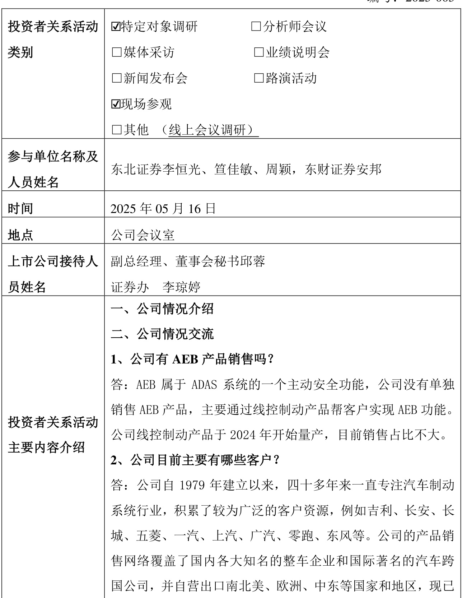

LlamaParse:

投资者关系活动
☑特定对象调研
□分析师会议
□媒体采访
□业绩说明会
□新闻发布会
□路演活动
☑现场参观
□其他 （线上会议调研）

# 参与单位名称及人员姓名

东北证券李恒光、笪佳敏、周颖，东财证券安邦

# 时间

2025 年 05 月 16 日

# 地点

公司会议室

# 上市公司接待人员姓名

副总经理、董事会秘书邱蓉

证券办 李琼婷

# 一、公司情况介绍

# 二、公司情况交流

1. 公司有 AEB 产品销售吗？

答：AEB 属于 ADAS 系统的一个主动安全功能，公司没有单独销售 AEB 产品，主要通过线控制动产品帮客户实现 AEB 功能。公司线控制动产品于 2024 年开始量产，目前销售占比不大。
2. 公司目前主要有哪些客户？

答：公司自 1979 年建立以来，四十多年来一直专注汽车制动系统行业，积累了较为广泛的客户资源，例如吉利、长安、长城、五菱、一汽、上汽、广汽、零跑、东风等。公司的产品销售网络覆盖了国内各大知名的整车企业和国际著名的汽车跨国公司，并自营出口南北美、欧洲、中东等国家和地区，现已

Azure:
<table>
<tr>
<td rowspan="5">投资者关系活动 类别</td>
<td>☒ 特定对象调研</td>
<td>☐ 分析师会议</td>
</tr>
<tr>
<td colspan="2">☐ 媒体采访 ☐ 业绩说明会</td>
</tr>
<tr>
<td colspan="2">☐ 新闻发布会 ☐ 路演活动</td>
</tr>
<tr>
<td colspan="2">☒ 现场参观</td>
</tr>
<tr>
<td colspan="2">☐ 其他 (线上会议调研)</td>
</tr>
<tr>
<td>参与单位名称及 人员姓名</td>
<td colspan="2">东北证券李恒光、笪佳敏、周颖,东财证券安邦</td>
</tr>
<tr>
<td>时间</td>
<td colspan="2">2025 年 05月16日</td>
</tr>
<tr>
<td>地点</td>
<td colspan="2">公司会议室</td>
</tr>
<tr>
<td>上市公司接待人 员姓名</td>
<td colspan="2">副总经理、董事会秘书邱蓉 证券办 李琼婷</td>
</tr>
<tr>
<td rowspan="2">投资者关系活动 主要内容介绍</td>
<td colspan="2">一、公司情况介绍 二、公司情况交流</td>
</tr>
<tr>
<td colspan="2">1、公司有 AEB产品销售吗? 答:AEB 属于 ADAS 系统的一个主动安全功能,公司没有单独 销售 AEB 产品,主要通过线控制动产品帮客户实现 AEB 功能。 公司线控制动产品于 2024年开始量产,目前销售占比不大。 2、公司目前主要有哪些客户? 答:公司自 1979年建立以来,四十多年来一直专注汽车制动 系统行业,积累了较为广泛的客户资源,例如吉利、长安、长 城、五菱、一汽、上汽、广汽、零跑、东风等。公司的产品销 售网络覆盖了国内各大知名的整车企业和国际著名的汽车跨 国公司,并自营出口南北美、欧洲、中东等国家和地区,现已</td>
</tr>
</table>

DotsOCR:
<table><tr><td>投资者关系活动类别</td><td>☑特定对象调研 □分析师会议 □媒体采访 □业绩说明会 □新闻发布会 □路演活动 ☑现场参观 □其他 (线上会议调研)</td></tr><tr><td>参与单位名称及人员姓名</td><td>东北证券李恒光、lw佳敏、周颖, 东财证券安邦</td></tr><tr><td>时间</td><td>2025年05月16日</td></tr><tr><td>地点</td><td>公司会议室</td></tr><tr><td>上市公司接待人员姓名</td><td>副总经理、董事会秘书邱蓉 证券办 李琼婷</td></tr><tr><td>投资者关系活动主要内容介绍</td><td>
一、公司情况介绍

二、公司情况交流

1、公司有AEB产品销售吗?

答: AEB 属于 ADAS 系统的一个主动安全功能, 公司没有单独销售 AEB 产品, 主要通过线控制动产品帮客户实现 AEB 功能。公司线控制动产品于 2024 年开始量产, 目前销售占比不大。

2、公司目前主要有哪些客户?

答: 公司自 1979 年建立以来, 四十多年来一直专注汽车制动系统行业, 积累了较为广泛的客户资源, 例如吉利、长安、长城、五菱、一汽、上汽、广汽、零跑、东风等。公司的产品销售网络覆盖了国内各大知名的整车企业和国际著名的汽车跨国公司, 并自营出口南北美、欧洲、中东等国家和地区, 现已
</td></tr></table>

OlmOCR:

| 投资者关系活动类别 | □特定对象调研 □分析师会议 □媒体采访 □业绩说明会 □新闻发布会 □路演活动 □现场参观 □其他 （线上会议调研） |
|---------------------|---------------------------------------------------------------|
| 参与单位名称及人员姓名 | 东北证券李恒光、笪佳敏、周颖，东财证券安邦 |
| 时间 | 2025年05月16日 |
| 地点 | 公司会议室 |
| 上市公司接待人员姓名 | 副总经理、董事会秘书邱蓉 证券办 李琼婷 |

一、公司情况介绍

二、公司情况交流

1、公司有AEB产品销售吗？

答：AEB属于ADAS系统的一个主动安全功能，公司没有单独销售AEB产品，主要通过线控制动产品帮客户实现AEB功能。公司线控制动产品于2024年开始量产，目前销售占比不大。

2、公司目前主要有哪些客户？

答：公司自1979年建立以来，四十多年来一直专注汽车制动系统行业，积累了较为广泛的客户资源，例如吉利、长安、长城、五菱、一汽、上汽、广汽、零跑、东风等。公司的产品销售网络覆盖了国内各大知名的整车企业和国际著名的汽车跨国公司，并自营出口南北美、欧洲、中东等国家和地区，现已

MinerU-2110-vlm
<table><tr><td>投资者关系活动类别</td><td>☑特定对象调研                 □分析师会议
□媒体采访                 □业绩说明会
□新闻发布会                 □路演活动
☑现场参观
□其他（线上会议调研）</td></tr><tr><td>参与单位名称及人员姓名</td><td>东北证券李恒光、笪佳敏、周颖，东财证券安邦</td></tr><tr><td>时间</td><td>2025年05月16日</td></tr><tr><td>地点</td><td>公司会议室</td></tr><tr><td>上市公司接待人员姓名</td><td>副总经理、董事会秘书邱蓉
证券办 李琼婷</td></tr><tr><td>投资者关系活动主要内容介绍</td><td>一、公司情况介绍
二、公司情况交流
1、公司有AEB产品销售吗？
答：AEB属于ADAS系统的一个主动安全功能，公司没有单独销售AEB产品，主要通过线控制动产品帮客户实现AEB功能。公司线控制动产品于2024年开始量产，目前销售占比不大。
2、公司目前主要有哪些客户？
答：公司自1979年建立以来，四十多年来一直专注汽车制动系统行业，积累了较为广泛的客户资源，例如吉利、长安、长城、五菱、一汽、上汽、广汽、零跑、东风等。公司的产品销售网络覆盖了国内各大知名的整车企业和国际著名的汽车跨国公司，并自营出口南北美、欧洲、中东等国家和地区，现已</td></tr></table>

Marker-162:
<table><tbody><tr><th>投资者关系活动</th><th>☑特定对象调研</th><th>□分析师会议</th></tr><tr><th>类别</th><th>□媒体采访</th><th>□业绩说明会</th></tr><tr><th></th><th>□新闻发布会</th><th>□路演活动</th></tr><tr><th></th><th>☑现场参观</th><th></th></tr><tr><th></th><th>□其他 (线上会议调研)</th><th></th></tr><tr><th>参与单位名称及</th><th></th><th></th></tr><tr><th>人员姓名</th><th></th><th>东北证券李恒光、笪佳敏、周颖,东财证券安邦</th></tr><tr><th>时间</th><th>年 月 日 2025 05 16</th><th></th></tr><tr><th>地点</th><th>公司会议室</th><th></th></tr><tr><th>上市公司接待人</th><th colspan=5>副总经理、董事会秘书邱蓉</th></tr><tr><th>员姓名</th><th>证券办 李琼婷</th><th></th></tr><tr><th></th><th colspan=5>一、公司情况介绍</th></tr><tr><th></th><td colspan=5>二、公司情况交流</td></tr><tr><th></th><td colspan=5>1、公司有 产品销售吗? AEB</td></tr><tr><th></th><td colspan=5>答:AEB 属于 ADAS 系统的一个主动安全功能,公司没有单独</td></tr><tr><th>投资者关系活动</th><td colspan=5>销售 AEB 产品,主要通过线控制动产品帮客户实现 AEB 功能。</td></tr><tr><th>主要内容介绍</th><td colspan=4>公司线控制动产品于 2024 年开始量产,目前销售占比不大。</td></tr><tr><th></th><td colspan=5>2、公司目前主要有哪些客户?</td></tr><tr><th></th><td colspan=5>答:公司自 1979 年建立以来,四十多年来一直专注汽车制动</td></tr><tr><th></th><td colspan=5>系统行业,积累了较为广泛的客户资源,例如吉利、长安、长</td></tr><tr><td></td><td colspan=5>城、五菱、一汽、上汽、广汽、零跑、东风等。公司的产品销</td></tr><tr><th></th><th colspan=5>售网络覆盖了国内各大知名的整车企业和国际著名的汽车跨</th></tr><tr><th></th><td></td><td>国公司,并自营出口南北美、欧洲、中东等国家和地区,现已</td></tr></tbody></table>

MinerU-1310:
<html><body><table><tr><td>投资者关系活动 类别</td><td>回特定对象调研 □分析师会议 □媒体采访 □业绩说明会 □新闻发布会 □路演活动</td></tr><tr><td>参与单位名称及 人员姓名</td><td>□其他（线上会议调研） 东北证券李恒光、宣佳敏、周颖，东财证券安邦</td></tr><tr><td>时间</td><td>2025年05月16日</td></tr><tr><td>地点</td><td>公司会议室</td></tr><tr><td>上市公司接待人 员姓名</td><td>副总经理、董事会秘书邱蓉 证券办李琼婷</td></tr><tr><td>投资者关系活动 主要内容介绍</td><td>一、公司情况介绍 二、公司情况交流 1、公司有AEB产品销售吗? 答：AEB 属于 ADAS 系统的一个主动安全功能，公司没有单独 销售 AEB产品，主要通过线控制动产品帮客户实现AEB 功能。 公司线控制动产品于2024年开始量产，目前销售占比不大。 2、公司目前主要有哪些客户？ 答：公司自1979 年建立以来，四十多年来一直专注汽车制动 系统行业，积累了较为广泛的客户资源，例如吉利、长安、长 城、五菱、一汽、上汽、广汽、零跑、东风等。公司的产品销 售网络覆盖了国内各大知名的整车企业和国际著名的汽车跨 国公司，并自营出口南北美、欧洲、中东等国家和地区，现已</td></tr></table></body></html> 

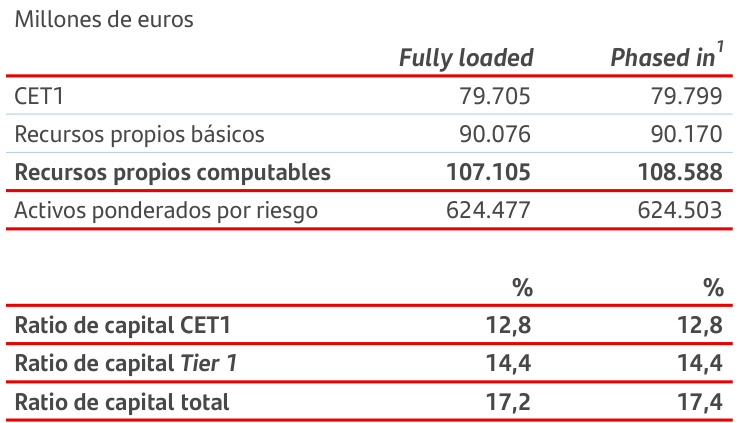

LlamaParse:
| Millones de euros             | Fully loaded | Phased in¹ | Total |
| ----------------------------- | ------------ | ---------- | ----- |
| CET1                          | 79.705       | 79.799     | 14,1  |
| Recursos propios básicos      | 90.076       | 90.170     |       |
| Recursos propios computables  | 107.105      | 108.588    | 12,5  |
| Activos ponderados por riesgo | 624.477      | 624.503    |       |

| %                       | %    | Sep-24 | Dic-24 |
| ----------------------- | ---- | ------ | ------ |
| Ratio de capital CET1   | 12,8 | 12,8   |        |
| Ratio de capital Tier 1 | 14,4 | 14,4   |        |
| Ratio de capital total  | 17,2 | 17,4   |        |

Azure:
Millones de euros

<table>
<tr>
<th></th>
<th>Fully loaded</th>
<th>Phased in</th>
</tr>
<tr>
<td>CET1</td>
<td>79.705</td>
<td>79.799</td>
</tr>
<tr>
<td>Recursos propios básicos</td>
<td>90.076</td>
<td>90.170</td>
</tr>
<tr>
<td>Recursos propios computables</td>
<td>107.105</td>
<td>108.588</td>
</tr>
<tr>
<td>Activos ponderados por riesgo</td>
<td>624.477</td>
<td>624.503</td>
</tr>
</table>

<table>
<tr>
<th></th>
<th>%</th>
<th>%</th>
</tr>
<tr>
<td>Ratio de capital CET1</td>
<td>12,8</td>
<td>12,8</td>
</tr>
<tr>
<td>Ratio de capital Tier 1</td>
<td>14,4</td>
<td>14,4</td>
</tr>
<tr>
<td>Ratio de capital total</td>
<td>17,2</td>
<td>17,4</td>
</tr>
</table>

DotsOCR:
<table><caption>Millones de euros</caption><thead><tr><th></th><th>Fully loaded</th><th>Phased in1</th></tr></thead><tbody><tr><th scope="row">CET1</th><td>79.705</td><td>79.799</td></tr><tr><th scope="row">Recursos propios básicos</th><td>90.076</td><td>90.170</td></tr><tr><th scope="row"><strong>Recursos propios computables</strong></th><td><strong>107.105</strong></td><td><strong>108.588</strong></td></tr><tr><th scope="row">Activos ponderados por riesgo</th><td>624.477</td><td>624.503</td></tr></tbody><thead><tr><th></th><th>%</th><th>%</th></tr></thead><tbody><tr><th scope="row">Ratio de capital CET1</th><td>12,8</td><td>12,8</td></tr><tr><th scope="row">Ratio de capital Tier 1</th><td>14,4</td><td>14,4</td></tr><tr><th scope="row">Ratio de capital total</th><td>17,2</td><td>17,4</td></tr></tbody></table>

OlmOCR:
Millones de euros

|                     | Fully loaded | Phased in¹ |
|---------------------|--------------|------------|
| CET1                | 79.705       | 79.799     |
| Recursos propios básicos | 90.076      | 90.170     |
| Recursos propios computables | 107.105    | 108.588    |
| Activos ponderados por riesgo | 624.477   | 624.503    |

% % %

|                     | %          | %          |
|---------------------|------------|------------|
| Ratio de capital CET1 | 12,8       | 12,8       |
| Ratio de capital Tier 1 | 14,4       | 14,4       |
| Ratio de capital total | 17,2       | 17,4       |

MinerU-2110-vlm
<table><tr><td colspan="3">Millones de euros</td></tr><tr><td></td><td>Fully loaded</td><td>Phased in¹</td></tr><tr><td>CET1</td><td>79.705</td><td>79.799</td></tr><tr><td>Recursos propos básicos</td><td>90.076</td><td>90.170</td></tr><tr><td>Recursos propos computables</td><td>107.105</td><td>108.588</td></tr><tr><td>Activos ponderados por riesgo</td><td>624.477</td><td>624.503</td></tr></table>

<table><tr><td></td><td>%</td><td>%</td></tr><tr><td>Ratio de capital CET1</td><td>12,8</td><td>12,8</td></tr><tr><td>Ratio de capital Tier 1</td><td>14,4</td><td>14,4</td></tr><tr><td>Ratio de capital total</td><td>17,2</td><td>17,4</td></tr></table>

Marker-162:
<table><tbody><tr><th>Millones de euros</th><th></th><th></th></tr><tr><td></td><td>Fully loaded</td><td>Phased in1</td></tr><tr><td>CET1</td><td>79.705</td><td>79.799</td></tr><tr><td>Recursos propios básicos</td><td>90.076</td><td>90.170</td></tr><tr><td>Recursos propios computables</td><td>107.105</td><td>108.588</td></tr><tr><td>Activos ponderados por riesgo</td><td>624.477</td><td>624.503</td></tr><tr><td></td><td></td><td></td></tr><tr><td></td><td>%</td><td>%</td></tr><tr><td>Ratio de capital CET1</td><td>12,8</td><td>12,8</td></tr><tr><td>Ratio de capital Tier 1</td><td>14,4</td><td>14,4</td></tr><tr><td>Ratio de capital total</td><td>17,2</td><td>17,4</td></tr></tbody></table>

MinerU-1310:
<html><body><table><tr><td colspan=\"3\">Millones de euros</td></tr><tr><td></td><td>Fully loaded</td><td>Phased in1</td></tr><tr><td>CET1</td><td>79.705</td><td>79.799</td></tr><tr><td>Recursos propios basicos</td><td>90.076</td><td>90.170</td></tr><tr><td>Recursos propios computables</td><td>107.105</td><td>108.588</td></tr><tr><td>Activos ponderados por riesgo</td><td>624.477</td><td>624.503</td></tr><tr><td></td><td>%</td><td>%</td></tr><tr><td>Ratio de capital CET1</td><td>12,8</td><td>12,8</td></tr><tr><td>Ratio de capital Tier 1</td><td>14,4</td><td>14,4</td></tr><tr><td>Ratio de capital total</td><td>17,2</td><td>17,4</td></tr></table></body></html>

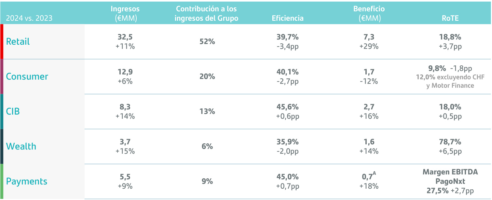

LlamaParse:
| Ingresos (€MM) | Contribución a los ingresos del Grupo |     | Eficiencia | Beneficio (€MM) | RoTE          |
| -------------- | ------------------------------------- | --- | ---------- | --------------- | ------------- |
| Retail         | 32,5                                  | 52% | 39,7%      | 7,3             | 18,8%         |
| Consumer       | 12,9                                  | 20% | 40,1%      | 1,7             | 9,8%          |
| CIB            | 8,3                                   | 13% | 45,6%      | 2,7             | 18,0%         |
| Wealth         | 3,7                                   | 6%  | 35,9%      | 1,6             | 78,7%         |
| Payments       | 5,5                                   | 9%  | 45,0%      | 0,7ᴬ            | Margen EBITDA |

Azure:
<table>
<tr>
<th>2024 vs. 2023</th>
<th>Ingresos (€MM)</th>
<th>Contribución a los ingresos del Grupo</th>
<th>Eficiencia</th>
<th>Beneficio (€MM)</th>
<th>RoTE</th>
</tr>
<tr>
<td>Retail</td>
<td>32,5 +11%</td>
<td>52%</td>
<td>39,7% -3,4pp</td>
<td>7,3 +29%</td>
<td>18,8% +3,7pp</td>
</tr>
<tr>
<td>Consumer</td>
<td>12,9 +6%</td>
<td>20%</td>
<td>40,1% -2,7pp</td>
<td>1,7 -12%</td>
<td>9,8% -1,8pp 12,0% excluyendo CHF y Motor Finance</td>
</tr>
<tr>
<td>CIB</td>
<td>8,3 +14%</td>
<td>13%</td>
<td>45,6% +0,6pp</td>
<td>2,7 +16%</td>
<td>18,0% +0,5pp</td>
</tr>
<tr>
<td>Wealth</td>
<td>3,7 +15%</td>
<td>6%</td>
<td>35,9% -2,0pp</td>
<td>1,6 +14%</td>
<td>78,7% +6,5pp</td>
</tr>
<tr>
<td>Payments</td>
<td>5,5 +9%</td>
<td>9%</td>
<td>45,0% +0,7pp</td>
<td>0,7ª +18%</td>
<td>Margen EBITDA PagoNxt 27,5% +2,7pp</td>
</tr>
</table>

DotsOCR:
<table><thead><tr><th>2024 vs. 2023</th><th>Ingresos (€MM)</th><th>Contribución a los ingresos del Grupo</th><th>Eficiencia</th><th>Beneficio (€MM)</th><th>RoTE</th></tr></thead><tbody><tr><th scope="row">Retail</th><td>32,5 +11%</td><td>52%</td><td>39,7% -3,4pp</td><td>7,3 +29%</td><td>18,8% +3,7pp</td></tr><tr><th scope="row">Consumer</th><td>12,9 +6%</td><td>20%</td><td>40,1% -2,7pp</td><td>1,7 -12%</td><td>9,8% -1,8pp 12,0% excluyendo CHF y Motor Finance</td></tr><tr><th scope="row">CIB</th><td>8,3 +14%</td><td>13%</td><td>45,6% +0,6pp</td><td>2,7 +16%</td><td>18,0% +0,5pp</td></tr><tr><th scope="row">Wealth</th><td>3,7 +15%</td><td>6%</td><td>35,9% -2,0pp</td><td>1,6 +14%</td><td>78,7% +6,5pp</td></tr><tr><th scope="row">Payments</th><td>5,5 +9%</td><td>9%</td><td>45,0% +0,7pp</td><td>0,7A +18%</td><td>Margen EBITDA PagoNxt 27,5% +2,7pp</td></tr></tbody></table>

OlmOCR:
| 2024 vs. 2023 | Ingresos (€MM) | Contribución a los ingresos del Grupo | Eficiencia | Beneficio (€MM) | RoTE |
|---------------|----------------|-------------------------------------|------------|----------------|------|
| Retail        | 32,5 +11%      | 52%                                 | 39,7% -3,4pp | 7,3 +29%       | 18,8% +3,7pp |
| Consumer      | 12,9 +6%       | 20%                                 | 40,1% -2,7pp | 1,7 -12%       | 9,8% -1,8pp  |
|               |                |                                     |            |                | 12,0%, excluyendo CHF y Motor Finance |
| CIB           | 8,3 +14%       | 13%                                 | 45,6% +0,6pp | 2,7 +16%       | 18,0% +0,5pp |
| Wealth        | 3,7 +15%       | 6%                                  | 35,9% -2,0pp | 1,6 +14%       | 78,7% +6,5pp |
| Payments      | 5,5 +9%        | 9%                                  | 45,0% +0,7pp | 0,7A +18%      | Margen EBITDA PagoNxt 27,5% +2,7pp |

MinerU-2110-vlm
<table><tr><td>2024 vs. 2023</td><td>Ingresos (€MM)</td><td>Contribución a los ingresos del Grupo</td><td>Eficiencia</td><td>Beneficio (€MM)</td><td>RoTE</td></tr><tr><td>Retail</td><td>32,5 +11%</td><td>52%</td><td>39,7% -3,4pp</td><td>7,3 +29%</td><td>18,8% +3,7pp</td></tr><tr><td>Consumer</td><td>12,9 +6%</td><td>20%</td><td>40,1% -2,7pp</td><td>1,7 -12%</td><td>9,8% -1,8pp 12,0% excluyendo CHF y Motor Finance</td></tr><tr><td>CIB</td><td>8,3 +14%</td><td>13%</td><td>45,6% +0,6pp</td><td>2,7 +16%</td><td>18,0% +0,5pp</td></tr><tr><td>Wealth</td><td>3,7 +15%</td><td>6%</td><td>35,9% -2,0pp</td><td>1,6 +14%</td><td>78,7% +6,5pp</td></tr><tr><td>Payments</td><td>5,5 +9%</td><td>9%</td><td>45,0% +0,7pp</td><td>0,7A +18%</td><td>Margen EBITDA PagoNxt 27,5% +2,7pp</td></tr></table>

Marker-162:
<table><tbody><tr><th>2024 vs. 2023</th><th>Ingresos (€MM)</th><th>Contribución a los ingresos del Grupo</th><th>Eficiencia</th><th>Beneficio (€MM)</th><th>RoTE</th></tr><tr><td>Retail</td><td>32,5 +11%</td><td>52%</td><td>39,7% -3,4pp</td><td>7,3 +29%</td><td>18,8% +3,7pp</td></tr><tr><td>Consumer</td><td>12,9 +6%</td><td>20%</td><td>40,1% -2,7pp</td><td>1,7 -12%</td><td>9,8% -1,8pp 12,0% excluyendo CHF y Motor Finance</td></tr><tr><td>CIB</td><td>8,3 +14%</td><td>13%</td><td>45,6% +0,6pp</td><td>2,7 +16%</td><td>18,0% +0,5pp</td></tr><tr><td>Wealth</td><td>3,7 +15%</td><td>6%</td><td>35,9% -2,0pp</td><td>1,6 +14%</td><td>78,7% +6,5pp</td></tr><tr><td>Payments</td><td>5,5 +9%</td><td>9%</td><td>45,0% +0,7pp</td><td>0,7A +18%</td><td>Margen EBITDA PagoNxt 27,5% +2,7pp</td></tr></tbody></table>

MinerU-1310:
<html><body><table><tr><td>2024 vs. 2023</td><td>Ingresos (€MM)</td><td>Contribucion a los ingresos del Grupo</td><td>Eficiencia</td><td>Beneficio (€MM)</td><td>RoTE</td></tr><tr><td>Retail</td><td>115</td><td>52%</td><td>33.,7%</td><td>+7.3%</td><td>18.7p</td></tr><tr><td>Consumer</td><td>12.9</td><td>20%</td><td>-2.70%</td><td>-12%</td><td>12,0g</td></tr><tr><td>CIB</td><td>+1%</td><td>13%</td><td>45.6%p</td><td>+27%</td><td>18.5%p</td></tr><tr><td>Wealth</td><td>+37%</td><td>6%</td><td>35.0%p</td><td>+1%</td><td>78.7%</td></tr><tr><td>Payments</td><td>55</td><td>9%</td><td>45.0p</td><td>+18% 0,7A</td><td></td></tr></table></body></html>

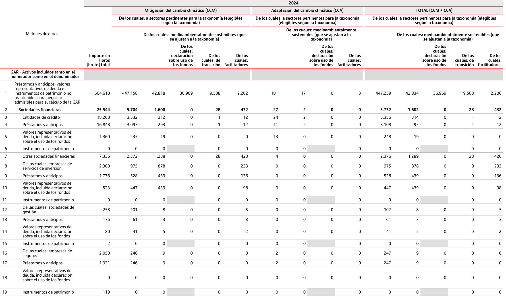

LlamaParse:
| Millones de euros                                                                                                                                     |                                                                                |                              |                                                                                        |                                                                                | Mitigación del cambio climático (CCM) |                                                                                        |                                                                                |                              | Adaptación del cambio climático (CCA) |   |   |         | TOTAL (CCM + CCA) |        |       |       |   |   |   |
| ----------------------------------------------------------------------------------------------------------------------------------------------------- | ------------------------------------------------------------------------------ | ---------------------------- | -------------------------------------------------------------------------------------- | ------------------------------------------------------------------------------ | ------------------------------------- | -------------------------------------------------------------------------------------- | ------------------------------------------------------------------------------ | ---------------------------- | ------------------------------------- | - | - | ------- | ----------------- | ------ | ----- | ----- | - | - | - |
| De los cuales: a sectores pertinentes para la taxonomía (elegibles según la taxonomía)                                                                | De los cuales: medioambientalmente sostenibles (que se ajustan a la taxonomía) | De los cuales: facilitadores | De los cuales: a sectores pertinentes para la taxonomía (elegibles según la taxonomía) | De los cuales: medioambientalmente sostenibles (que se ajustan a la taxonomía) | De los cuales: facilitadores          | De los cuales: a sectores pertinentes para la taxonomía (elegibles según la taxonomía) | De los cuales: medioambientalmente sostenibles (que se ajustan a la taxonomía) | De los cuales: facilitadores |                                       |   |   |         |                   |        |       |       |   |   |   |
| GAR - Activos incluidos tanto en el numerador como en el denominador                                                                                  |                                                                                | 664.610                      | 447.158                                                                                | 42.818                                                                         | 36.969                                | 9.508                                                                                  | 2.202                                                                          | 101                          | 17                                    | 0 |   |         |                   |        |       |       |   |   |   |
| Préstamos y anticipos, valores representativos de deuda e instrumentos de patrimonio no mantenidos para negociar admisibles para el cálculo de la GAR |                                                                                |                              |                                                                                        |                                                                                | 3                                     |                                                                                        |                                                                                |                              |                                       |   |   | 447.259 | 42.834            | 36.969 | 9.508 | 2.206 |   |   |   |
|                                                                                                                                                       | Sociedades financieras                                                         | 25.544                       | 5.704                                                                                  | 1.600                                                                          | 0                                     | 28                                                                                     | 432                                                                            | 27                           | 2                                     | 0 |   |         |                   |        |       |       |   |   |   |
|                                                                                                                                                       | Entidades de crédito                                                           | 18.208                       | 3.332                                                                                  | 312                                                                            | 0                                     | 1                                                                                      | 12                                                                             | 24                           | 2                                     | 0 |   |         |                   |        |       |       |   |   |   |
|                                                                                                                                                       | Préstamos y anticipos                                                          | 16.848                       | 3.097                                                                                  | 293                                                                            | 0                                     | 1                                                                                      | 12                                                                             | 11                           | 2                                     | 0 |   |         |                   |        |       |       |   |   |   |
| Valores representativos de deuda, incluida declaración sobre el uso de los fondos                                                                     |                                                                                | 1.360                        | 235                                                                                    | 19                                                                             | 0                                     | 0                                                                                      | 0                                                                              | 13                           | 0                                     | 0 |   |         |                   |        |       |       |   |   |   |
|                                                                                                                                                       | Instrumentos de patrimonio                                                     | 0                            | 0                                                                                      | 0                                                                              | 0                                     | 0                                                                                      | 0                                                                              |                              |                                       |   |   |         |                   |        |       |       |   |   |   |
|                                                                                                                                                       | Otras sociedades financieras                                                   | 7.336                        | 2.372                                                                                  | 1.288                                                                          | 0                                     | 28                                                                                     | 420                                                                            | 4                            | 0                                     | 0 |   |         |                   |        |       |       |   |   |   |
| De las cuales: empresas de servicios de inversión                                                                                                     |                                                                                | 2.300                        | 975                                                                                    | 878                                                                            | 0                                     | 0                                                                                      | 233                                                                            | 0                            | 0                                     | 0 |   |         |                   |        |       |       |   |   |   |
|                                                                                                                                                       | Préstamos y anticipos                                                          | 1.778                        | 528                                                                                    | 439                                                                            | 0                                     | 0                                                                                      | 136                                                                            | 0                            | 0                                     | 0 |   |         |                   |        |       |       |   |   |   |
| Valores representativos de deuda, incluida declaración sobre el uso de los fondos                                                                     |                                                                                | 523                          | 447                                                                                    | 439                                                                            | 0                                     | 0                                                                                      | 98                                                                             | 0                            | 0                                     | 0 |   |         |                   |        |       |       |   |   |   |
|                                                                                                                                                       | Instrumentos de patrimonio                                                     | 0                            | 0                                                                                      | 0                                                                              |                                       |                                                                                        |                                                                                |                              |                                       |   |   |         |                   |        |       |       |   |   |   |
| De las cuales: sociedades de gestión                                                                                                                  |                                                                                | 258                          | 101                                                                                    | 8                                                                              | 0                                     | 0                                                                                      | 5                                                                              | 0                            | 0                                     | 0 |   |         |                   |        |       |       |   |   |   |
|                                                                                                                                                       | Préstamos y anticipos                                                          | 176                          | 61                                                                                     | 3                                                                              | 0                                     | 0                                                                                      | 3                                                                              | 0                            | 0                                     | 0 |   |         |                   |        |       |       |   |   |   |
| Valores representativos de deuda, incluida declaración sobre el uso de los fondos                                                                     |                                                                                | 80                           | 41                                                                                     | 5                                                                              | 0                                     | 0                                                                                      | 2                                                                              | 0                            | 0                                     | 0 |   |         |                   |        |       |       |   |   |   |
|                                                                                                                                                       | Instrumentos de patrimonio                                                     | 2                            | 0                                                                                      | 0                                                                              |                                       |                                                                                        |                                                                                |                              |                                       |   |   |         |                   |        |       |       |   |   |   |
| De las cuales: empresas de seguros                                                                                                                    |                                                                                | 2.050                        | 246                                                                                    | 9                                                                              | 0                                     | 0                                                                                      | 0                                                                              | 2                            | 0                                     | 0 |   |         |                   |        |       |       |   |   |   |
|                                                                                                                                                       | Préstamos y anticipos                                                          | 1.931                        | 246                                                                                    | 9                                                                              | 0                                     | 0                                                                                      | 0                                                                              | 2                            | 0                                     | 0 |   |         |                   |        |       |       |   |   |   |
| Valores representativos de deuda, incluida declaración sobre el uso de los fondos                                                                     |                                                                                | 0                            | 0                                                                                      | 0                                                                              | 0                                     | 0                                                                                      | 0                                                                              | 0                            | 0                                     | 0 |   |         |                   |        |       |       |   |   |   |
|                                                                                                                                                       | Instrumentos de patrimonio                                                     | 119                          | 0                                                                                      | 0                                                                              |                                       |                                                                                        |                                                                                |                              |                                       |   |   |         |                   |        |       |       |   |   |   |

Azure:
<table>
<tr>
<th colspan="2" rowspan="5">Millones de euros</th>
<th colspan="15">2024</th>
</tr>
<tr>
<th rowspan="4">Importe en libros [bruto] total</th>
<th colspan="5">Mitigación del cambio climático (CCM)</th>
<th colspan="4">Adaptación del cambio climático (CCA)</th>
<th colspan="5">TOTAL (CCM + CCA)</th>
</tr>
<tr>
<th colspan="5">De los cuales: a sectores pertinentes para la taxonomia (elegibles según la taxonomía)</th>
<th colspan="4" rowspan="3">De los cuales: a sectores pertinentes para la taxonomía (elegibles según la taxonomía) De los cuales: medioambientalmente sostenibles (que se ajustan a la taxonomía) De los cuales: declaración De los sobre uso de cuales: los fondos facilitadores</th>
<th colspan="5">De los cuales: a sectores pertinentes para la taxonomía (elegibles según la taxonomía)</th>
</tr>
<tr>
<th></th>
<th>De los cuales:</th>
<th colspan="3">medioambientalmente sostenibles (que se ajustan a la taxonomía)</th>
<th></th>
<th>De los cuales:</th>
<th colspan="3">medioambientalmente sostenibles (que se ajustan a la taxonomía)</th>
</tr>
<tr>
<th></th>
<th></th>
<th>De los cuales: declaración sobre uso de los fondos</th>
<th>De los cuales: de transición</th>
<th>De los cuales: facilitadores</th>
<th></th>
<th></th>
<th>De los cuales: declaración sobre uso de los fondos</th>
<th>De los cuales: de transición</th>
<th>De los cuales: facilitadores</th>
</tr>
<tr>
<td></td>
<td>GAR - Activos incluidos tanto en el numerador como en el denominador</td>
<td></td>
<td></td>
<td></td>
<td></td>
<td></td>
<td></td>
<td></td>
<td></td>
<td></td>
<td></td>
<td></td>
<td></td>
<td></td>
<td></td>
<td></td>
</tr>
<tr>
<td>1</td>
<td>Préstamos y anticipos, valores representativos de deuda e instrumentos de patrimonio no mantenidos para negociar admisibles para el cálculo de la GAR</td>
<td>664.610</td>
<td>447.158</td>
<td>42.818</td>
<td>36.969</td>
<td>9.508</td>
<td>2.202</td>
<td>101</td>
<td>17</td>
<td>0</td>
<td>3</td>
<td>447.259</td>
<td>42.834</td>
<td>36.969</td>
<td>9.508</td>
<td>2.206</td>
</tr>
<tr>
<td>2</td>
<td>Sociedades financieras</td>
<td>25.544</td>
<td>5.704</td>
<td>1.600</td>
<td>0</td>
<td>28</td>
<td>432</td>
<td>27</td>
<td>2</td>
<td>0</td>
<td>0</td>
<td>5.732</td>
<td>1.602</td>
<td>0</td>
<td>28</td>
<td>432</td>
</tr>
<tr>
<td>3</td>
<td>Entidades de crédito</td>
<td>18.208</td>
<td>3.332</td>
<td>312</td>
<td>0</td>
<td>1</td>
<td>12</td>
<td>24</td>
<td>2</td>
<td>0</td>
<td>0</td>
<td>3.356</td>
<td>314</td>
<td>0</td>
<td>1</td>
<td>12</td>
</tr>
<tr>
<td>4</td>
<td>Préstamos y anticipos</td>
<td>16.848</td>
<td>3.097</td>
<td>293</td>
<td>0</td>
<td>1</td>
<td>12</td>
<td>11</td>
<td>2</td>
<td>0</td>
<td>0</td>
<td>3.108</td>
<td>295</td>
<td>0</td>
<td>1</td>
<td>12</td>
</tr>
<tr>
<td>5</td>
<td>Valores representativos de deuda, incluida declaración sobre el uso de los fondos</td>
<td>1.360</td>
<td>235</td>
<td>19</td>
<td>0</td>
<td>0</td>
<td>0</td>
<td>13</td>
<td>0</td>
<td>0</td>
<td>0</td>
<td>248</td>
<td>19</td>
<td>0</td>
<td>0</td>
<td>0</td>
</tr>
<tr>
<td>6</td>
<td>Instrumentos de patrimonio</td>
<td>0</td>
<td>0</td>
<td>0</td>
<td></td>
<td>0</td>
<td>0</td>
<td>0</td>
<td>0</td>
<td></td>
<td>0</td>
<td>0</td>
<td>0</td>
<td></td>
<td>0</td>
<td>0</td>
</tr>
<tr>
<td>7</td>
<td>Otras sociedades financieras</td>
<td>7.336</td>
<td>2.372</td>
<td>1.288</td>
<td>0</td>
<td>28</td>
<td>420</td>
<td>4</td>
<td>0</td>
<td>0</td>
<td>0</td>
<td>2.376</td>
<td>1.289</td>
<td>0</td>
<td>28</td>
<td>420</td>
</tr>
<tr>
<td>8</td>
<td>De las cuales: empresas de servicios de inversión</td>
<td>2.300</td>
<td>975</td>
<td>878</td>
<td>0</td>
<td>0</td>
<td>233</td>
<td>0</td>
<td>0</td>
<td>0</td>
<td>0</td>
<td>975</td>
<td>878</td>
<td>0</td>
<td>0</td>
<td>233</td>
</tr>
<tr>
<td>9</td>
<td>Préstamos y anticipos</td>
<td>1.778</td>
<td>528</td>
<td>439</td>
<td>0</td>
<td>0</td>
<td>136</td>
<td>0</td>
<td>0</td>
<td>0</td>
<td>0</td>
<td>528</td>
<td>439</td>
<td>0</td>
<td>0</td>
<td>136</td>
</tr>
<tr>
<td>10</td>
<td>Valores representativos de deuda, incluida declaración sobre el uso de los fondos</td>
<td>523</td>
<td>447</td>
<td>439</td>
<td>0</td>
<td>0</td>
<td>98</td>
<td>0</td>
<td>0</td>
<td>0</td>
<td>0</td>
<td>447</td>
<td>439</td>
<td>0</td>
<td>0</td>
<td>98</td>
</tr>
<tr>
<td>11</td>
<td>Instrumentos de patrimonio</td>
<td>0</td>
<td>0</td>
<td>0</td>
<td></td>
<td>0</td>
<td>0</td>
<td>0</td>
<td>0</td>
<td></td>
<td>0</td>
<td>0</td>
<td>0</td>
<td></td>
<td>0</td>
<td>0</td>
</tr>
<tr>
<td>12</td>
<td>De las cuales: sociedades de gestión</td>
<td>258</td>
<td>101</td>
<td>8</td>
<td>0</td>
<td>0</td>
<td>5</td>
<td>0</td>
<td>0</td>
<td>0</td>
<td>0</td>
<td>102</td>
<td>8</td>
<td>0</td>
<td>0</td>
<td>5</td>
</tr>
<tr>
<td>13</td>
<td>Préstamos y anticipos</td>
<td>176</td>
<td>61</td>
<td>3</td>
<td>0</td>
<td>0</td>
<td>3</td>
<td>0</td>
<td>0</td>
<td>0</td>
<td>0</td>
<td>61</td>
<td>3</td>
<td>0</td>
<td>0</td>
<td>3</td>
</tr>
<tr>
<td>14</td>
<td>Valores representativos de deuda, incluida declaración sobre el uso de los fondos</td>
<td>80</td>
<td>41</td>
<td>5</td>
<td>0</td>
<td>0</td>
<td>2</td>
<td>0</td>
<td>0</td>
<td>0</td>
<td>0</td>
<td>41</td>
<td>5</td>
<td>0</td>
<td>0</td>
<td>2</td>
</tr>
<tr>
<td>15</td>
<td>Instrumentos de patrimonio</td>
<td>2</td>
<td>0</td>
<td>0</td>
<td></td>
<td>0</td>
<td>0</td>
<td>0</td>
<td>0</td>
<td></td>
<td>0</td>
<td>0</td>
<td>0</td>
<td></td>
<td>0</td>
<td>0</td>
</tr>
<tr>
<td>16</td>
<td>De las cuales: empresas de seguros</td>
<td>2.050</td>
<td>246</td>
<td>9</td>
<td>0</td>
<td>0</td>
<td>0</td>
<td>2</td>
<td>0</td>
<td>0</td>
<td>0</td>
<td>247</td>
<td>9</td>
<td>0</td>
<td>0</td>
<td>0</td>
</tr>
<tr>
<td>17</td>
<td>Préstamos y anticipos</td>
<td>1.931</td>
<td>246</td>
<td>9</td>
<td>0</td>
<td>0</td>
<td>0</td>
<td>2</td>
<td>0</td>
<td>0</td>
<td>0</td>
<td>247</td>
<td>9</td>
<td>0</td>
<td>0</td>
<td>0</td>
</tr>
<tr>
<td>18</td>
<td>Valores representativos de deuda, incluida declaración sobre el uso de los fondos</td>
<td>0</td>
<td>0</td>
<td>0</td>
<td>0</td>
<td>0</td>
<td>0</td>
<td>0</td>
<td>0</td>
<td>0</td>
<td>0</td>
<td>0</td>
<td>0</td>
<td>0</td>
<td>0</td>
<td>0</td>
</tr>
<tr>
<td>19</td>
<td>Instrumentos de patrimonio</td>
<td>119</td>
<td>0</td>
<td>0</td>
<td></td>
<td>0</td>
<td>0</td>
<td>0</td>
<td>0</td>
<td></td>
<td>0</td>
<td>0</td>
<td>0</td>
<td></td>
<td>0</td>
<td>0</td>
</tr>
</table>

DotsOCR:
<table><thead><tr><th rowspan="4">Millones de euros</th><th rowspan="4"></th><th colspan="7">Mitigación del cambio climático (CCM)</th><th colspan="3">Adaptación del cambio climático (CCA)</th><th colspan="3">TOTAL (CCM + CCA)</th></tr><tr><th colspan="5">De los cuales: a sectores pertinentes para la taxonomía (elegibles según la taxonomía)</th><th colspan="3">De los cuales: medioambientalmente sostenibles (que se ajustan a la taxonomía)</th><th colspan="3">De los cuales: medioambientalmente sostenibles (que se ajustan a la taxonomía)</th><th colspan="3">De los cuales: medioambientalmente sostenibles (que se ajustan a la taxonomía)</th></tr><tr><th rowspan="2">Importe en libros [bruto] total</th><th colspan="5">De los cuales: medioambientalmente sostenibles (que se ajustan a la taxonomía)</th><th colspan="3">De los cuales: medioambientalmente sostenibles (que se ajustan a la taxonomía)</th><th colspan="3">De los cuales: medioambientalmente sostenibles (que se ajustan a la taxonomía)</th><th colspan="3">De los cuales: medioambientalmente sostenibles (que se ajustan a la taxonomía)</th></tr><tr><th>De los cuales: declaración sobre uso de los fondos</th><th>De los cuales: de transición</th><th>De los cuales: facilitadores</th><th>De los cuales: declaración sobre uso de los fondos</th><th>De los cuales: facilitadores</th><th>De los cuales: declaración sobre uso de los fondos</th><th>De los cuales: facilitadores</th><th>De los cuales: declaración sobre uso de los fondos</th><th>De los cuales: facilitadores</th><th>De los cuales: declaración sobre uso de los fondos</th><th>De los cuales: facilitadores</th><th>De los cuales: declaración sobre uso de los fondos</th><th>De los cuales: facilitadores</th><th>De los cuales: declaración sobre uso de los fondos</th><th>De los cuales: facilitadores</th></tr></thead><tbody><tr><td></td><td>GAR - Activos incluidos tanto en el numerador como en el denominador</td><td></td><td></td><td></td><td></td><td></td><td></td><td></td><td></td><td></td><td></td><td></td><td></td><td></td><td></td><td></td></tr><tr><td>1</td><td>Préstamos y anticipos, valores representativos de deuda e instrumentos de patrimonio no mantenidos para negociar admisibles para el cálculo de la GAR</td><td>664.610</td><td>447.158</td><td>42.818</td><td>36.969</td><td>9.508</td><td>2.202</td><td>101</td><td>17</td><td>0</td><td>3</td><td>447.259</td><td>42.834</td><td>36.969</td><td>9.508</td><td>2.206</td></tr><tr><td>2</td><td>Sociedades financieras</td><td>25.544</td><td>5.704</td><td>1.600</td><td>0</td><td>28</td><td>432</td><td>27</td><td>2</td><td>0</td><td>0</td><td>5.732</td><td>1.602</td><td>0</td><td>28</td><td>432</td></tr><tr><td>3</td><td>Entidades de crédito</td><td>18.208</td><td>3.332</td><td>312</td><td>0</td><td>1</td><td>12</td><td>24</td><td>2</td><td>0</td><td>0</td><td>3.356</td><td>314</td><td>0</td><td>1</td><td>12</td></tr><tr><td>4</td><td>Préstamos y anticipos</td><td>16.848</td><td>3.097</td><td>293</td><td>0</td><td>1</td><td>12</td><td>11</td><td>2</td><td>0</td><td>0</td><td>3.108</td><td>295</td><td>0</td><td>1</td><td>12</td></tr><tr><td>5</td><td>Valores representativos de deuda, incluida declaración sobre el uso de los fondos</td><td>1.360</td><td>235</td><td>19</td><td>0</td><td>0</td><td>0</td><td>13</td><td>0</td><td>0</td><td>0</td><td>248</td><td>19</td><td>0</td><td>0</td><td>0</td></tr><tr><td>6</td><td>Instrumentos de patrimonio</td><td>0</td><td>0</td><td>0</td><td>0</td><td>0</td><td>0</td><td>0</td><td>0</td><td>0</td><td>0</td><td>0</td><td>0</td><td>0</td><td>0</td><td>0</td></tr><tr><td>7</td><td>Otras sociedades financieras</td><td>7.336</td><td>2.372</td><td>1.288</td><td>0</td><td>28</td><td>420</td><td>4</td><td>0</td><td>0</td><td>0</td><td>2.376</td><td>1.289</td><td>0</td><td>28</td><td>420</td></tr><tr><td>8</td><td>De las cuales: empresas de servicios de inversión</td><td>2.300</td><td>975</td><td>878</td><td>0</td><td>0</td><td>233</td><td>0</td><td>0</td><td>0</td><td>0</td><td>975</td><td>878</td><td>0</td><td>0</td><td>233</td></tr><tr><td>9</td><td>Préstamos y anticipos</td><td>1.778</td><td>528</td><td>439</td><td>0</td><td>0</td><td>136</td><td>0</td><td>0</td><td>0</td><td>0</td><td>528</td><td>439</td><td>0</td><td>0</td><td>136</td></tr><tr><td>10</td><td>Valores representativos de deuda, incluida declaración sobre el uso de los fondos</td><td>523</td><td>447</td><td>439</td><td>0</td><td>0</td><td>98</td><td>0</td><td>0</td><td>0</td><td>0</td><td>447</td><td>439</td><td>0</td><td>0</td><td>98</td></tr><tr><td>11</td><td>Instrumentos de patrimonio</td><td>0</td><td>0</td><td>0</td><td>0</td><td>0</td><td>0</td><td>0</td><td>0</td><td>0</td><td>0</td><td>0</td><td>0</td><td>0</td><td>0</td><td>0</td></tr><tr><td>12</td><td>De las cuales: sociedades de gestión</td><td>258</td><td>101</td><td>8</td><td>0</td><td>0</td><td>5</td><td>0</td><td>0</td><td>0</td><td>0</td><td>102</td><td>8</td><td>0</td><td>0</td><td>5</td></tr><tr><td>13</td><td>Préstamos y anticipos</td><td>176</td><td>61</td><td>3</td><td>0</td><td>0</td><td>3</td><td>0</td><td>0</td><td>0</td><td>0</td><td>61</td><td>3</td><td>0</td><td>0</td><td>3</td></tr><tr><td>14</td><td>Valores representativos de deuda, incluida declaración sobre el uso de los fondos</td><td>80</td><td>41</td><td>5</td><td>0</td><td>0</td><td>2</td><td>0</td><td>0</td><td>0</td><td>0</td><td>41</td><td>5</td><td>0</td><td>0</td><td>2</td></tr><tr><td>15</td><td>Instrumentos de patrimonio</td><td>2</td><td>0</td><td>0</td><td>0</td><td>0</td><td>0</td><td>0</td><td>0</td><td>0</td><td>0</td><td>0</td><td>0</td><td>0</td><td>0</td><td>0</td></tr><tr><td>16</td><td>De las cuales: empresas de seguros</td><td>2.050</td><td>246</td><td>9</td><td>0</td><td>0</td><td>0</td><td>2</td><td>0</td><td>0</td><td>0</td><td>247</td><td>9</td><td>0</td><td>0</td><td>0</td></tr><tr><td>17</td><td>Préstamos y anticipos</td><td>1.931</td><td>246</td><td>9</td><td>0</td><td>0</td><td>0</td><td>2</td><td>0</td><td>0</td><td>0</td><td>247</td><td>9</td><td>0</td><td>0</td><td>0</td></tr><tr><td>18</td><td>Valores representativos de deuda, incluida declaración sobre el uso de los fondos</td><td>0</td><td>0</td><td>0</td><td>0</td><td>0</td><td>0</td><td>0</td><td>0</td><td>0</td><td>0</td><td>0</td><td>0</td><td>0</td><td>0</td><td>0</td></tr><tr><td>19</td><td>Instrumentos de patrimonio</td><td>119</td><td>0</td><td>0</td><td>0</td><td>0</td><td>0</td><td>0</td><td>0</td><td>0</td><td>0</td><td>0</td><td>0</td><td>0</td><td>0</td><td>0</td></tr></tbody></table>

OlmOCR:
| Millones de euros | Importe en libros [bruto] total | Mitigación del cambio climático (CCM) | Adaptación del cambio climático (CCA) | TOTAL (CCM + CCA) |
|-------------------|---------------------------------|--------------------------------------|--------------------------------------|------------------|
|                   | De los cuales: a sectores pertinentes para la taxonomía (elegibles según la taxonomía) | De los cuales: medioambientalmente sostenibles (que se ajustan a la taxonomía) | De los cuales: a sectores pertinentes para la taxonomía (elegibles según la taxonomía) | De los cuales: medioambientalmente sostenibles (que se ajustan a la taxonomía) |
|                   | De los cuales: declaración sobre uso de los fondos | De los cuales: de transición | De los cuales: facilitadores | De los cuales: declaración sobre uso de los fondos | De los cuales: de transición | De los cuales: facilitadores |
| GAR - Activos incluidos tanto en el numerador como en el denominador | | | | |
| 1 Préstamos y anticipos valores representativos de deuda e instrumentos de patrimonio no mantenidos para negociar admisibles para el cálculo de la GAR | 664.610 | 447.158 | 42.818 | 36.969 | 9.508 | 2.202 | 101 | 17 | 0 | 3 | 447.259 | 42.834 | 36.969 | 9.508 | 2.206 |
| 2 Sociedades financieras | 25.544 | 5.704 | 1.600 | 0 | 28 | 432 | 27 | 2 | 0 | 0 | 5.732 | 1.602 | 0 | 28 | 432 |
| 3 Entidades de crédito | 18.208 | 3.332 | 312 | 0 | 1 | 12 | 24 | 2 | 0 | 0 | 3.356 | 314 | 0 | 1 | 12 |
| 4 Préstamos y anticipos | 16.848 | 3.097 | 293 | 0 | 1 | 12 | 11 | 2 | 0 | 0 | 3.108 | 295 | 0 | 1 | 12 |
| 5 Valores representativos de deuda, incluida declaración sobre el uso de los fondos | 1.360 | 235 | 19 | 0 | 0 | 0 | 13 | 0 | 0 | 0 | 248 | 19 | 0 | 0 | 0 |
| 6 Instrumentos de patrimonio | 0 | 0 | 0 | 0 | 0 | 0 | 0 | 0 | 0 | 0 | 0 | 0 | 0 | 0 | 0 |
| 7 Otras sociedades financieras | 7.336 | 2.372 | 1.288 | 0 | 28 | 420 | 4 | 0 | 0 | 0 | 2.376 | 1.289 | 0 | 28 | 420 |
| 8 De las cuales: empresas de servicios de inversión | 2.300 | 975 | 878 | 0 | 0 | 233 | 0 | 0 | 0 | 0 | 975 | 878 | 0 | 0 | 233 |
| 9 Préstamos y anticipos | 1.778 | 528 | 439 | 0 | 0 | 136 | 0 | 0 | 0 | 0 | 528 | 439 | 0 | 0 | 136 |
| 10 Valores representativos de deuda, incluida declaración sobre el uso de los fondos | 523 | 447 | 439 | 0 | 0 | 98 | 0 | 0 | 0 | 0 | 447 | 439 | 0 | 0 | 98 |
| 11 Instrumentos de patrimonio | 0 | 0 | 0 | 0 | 0 | 0 | 0 | 0 | 0 | 0 | 0 | 0 | 0 | 0 | 0 |
| 12 De las cuales: sociedades de gestión | 258 | 101 | 8 | 0 | 0 | 5 | 0 | 0 | 0 | 0 | 102 | 8 | 0 | 0 | 5 |
| 13 Préstamos y anticipos | 176 | 61 | 3 | 0 | 0 | 3 | 0 | 0 | 0 | 0 | 61 | 3 | 0 | 0 | 3 |
| 14 Valores representativos de deuda, incluida declaración sobre el uso de los fondos | 80 | 41 | 5 | 0 | 0 | 2 | 0 | 0 | 0 | 0 | 41 | 5 | 0 | 0 | 2 |
| 15 Instrumentos de patrimonio | 2 | 0 | 0 | 0 | 0 | 0 | 0 | 0 | 0 | 0 | 0 | 0 | 0 | 0 | 0 |
| 16 De las cuales: empresas de seguros | 2.050 | 246 | 9 | 0 | 0 | 0 | 2 | 0 | 0 | 0 | 247 | 9 | 0 | 0 | 0 |
| 17 Préstamos y anticipos | 1.931 | 246 | 9 | 0 | 0 | 0 | 2 | 0 | 0 | 0 | 247 | 9 | 0 | 0 | 0 |
| 18 Valores representativos de deuda, incluida declaración sobre el uso de los fondos | 0 | 0 | 0 | 0 | 0 | 0 | 0 | 0 | 0 | 0 | 0 | 0 | 0 | 0 | 0 |
| 19 Instrumentos de patrimonio | 119 | 0 | 0 | 0 | 0 | 0 | 0 | 0 | 0 | 0 | 0 | 0 | 0 | 0 | 0 |

MinerU-2110-vlm
<table><tr><td rowspan="2" colspan="101"></td><td>Miltones de euros</td><td>Importe en libros [bruto]</td><td>De los cuales: medioambientalmente sostenibles (que se ajustan a la taxonomía)</td><td>De los cuales: de la taxonomía</td><td>De los cuales: de la taxonomía</td><td>De los cuales: de la taxonomía</td><td>De los cuales: de la taxonomía</td><td>De los cuales: de la taxonomía</td><td>De los cuales: de la taxonomía</td><td>De los cuales: de la taxonomía</td><td>De los cuales: de la taxonomía</td><td>De los cuales: de La taxonomía</td><td>De los cuales: de La taxonomía</td><td>De los cuales: de La taxonomía</td><td>De los cuales: de La taxonomía</td><td>De los cuales: de La taxonomía</td><td>De los cuales: de La taxonomía</td><td>De los cuales: de La taxonomía</td><td>De los cuales: de La taxonomía</td><td>De los Cuales: de La taxonomía</td><td>De los cuales: de La taxonomía</td><td>De los cuales: de La taxonomía</td><td>De los cuales: de La taxonomía</td><td>De los cuales: de La taxonomía</td><td>De los cuales: de La taxonomía</td><td>De los cuales: de La taxonomía</td><td>De los cuales: de La taxonomía&lt;ftd&gt;De los cuales: de La taxonomía</td><td>De los cuales: de La taxonomía</td><td>De los cuales: de La taxonomía</td><td>De los cuales: de La taxonomía</td><td>De los cuales: de La taxonomía</td><td>De los cuales: de La taxonomía</td><td>De los cuales: de La taxonomía</td><td>De los cuales: de La wax</td><td>De los cuales: de La wax</td><td>De los cuales: de La wax</td><td>De los cuales: de La wax</td><td>De los cuales: de La wax</td><td>De los cuales: de La wax</td><td>De los cuales: de La wax</td><td>De los cuales: de La wax</td><td>De los cuales: de La wax</td><td>De los cuales: de La wax</td></tr><tr><td>De los cuales: de la taxonomía</td><td>De los cuales: de la taxonomía</td><td>De los cuales: de la taxonomía</td><td>De los cuales: de la taxonomía</td><td>De los cuales: de la taxonomía</td><td>De los cuales: de la taxonomía</td><td>De los cuales: de la taxonomía</td><td>De los cuales: of la taxonomía</td><td>De los cuales: de la taxonomía</td><td>De los cuales: de la taxonomía</td><td>De los cuales: de la taxonomía</td><td>De los cuales: de la taxonomía</td><td>De los cuales: de la taxonomía</td><td>De los cuales: de la taxonomía</td><td>De los cuales: de la taxonomía</td><td>De Los cuales: de La taxonomía</td><td>De los cuales: de La taxonomía</td><td>De los cuales: de La taxonomía</td><td>De los cuales: de La taxonomía</td><td>De los cuales: de La taxonomía</td><td>De los cuales: de La taxonomía</td><td>De los cuales: de La taxonomía</td><td>De los cuales: de La taxonomía</td><td></td><td></td><td></td><td></td><td></td><td></td><td></td><td></td><td></td><td></td><td></td><td></td><td></td><td></td><td></td><td></td><td></td><td></td><td></td><td></td><td></td><td></td><td></td><td></td><td></td><td></td><td></td><td></td><td></td><td></td><td></td><td></td><td></td><td></td><td></td><td></td><td></td><td></td><td></td><td></td><td></td><td></td><td></td><td></td><td></td><td></td><td></td><td></td><td></td><td></td><td></td><td></td><td></td><td></td><td></td><td></td><td></td><td></td><td></td><td></td><td></td><td></td><td></td><td></td><td></td><td></td><td></td><td></td><td></td><td></td><td></td><td></td><td></td><td></td><td></td><td></td><td></td><td></td><td></td><td></td><td></td><td></td><td></td><td></td><td></td><td></td><td></td><td></td><td></td><td></td><td></td><td></td><td></td><td></td><td></td><td></td><td></td><td></td><td></td><td></td><td></td><td></td><td></td><td></td><td></td><td></td><td></td><td></td><td></td><td></td><td></td><td></td><td></td><td></td><td></td><td></td><td></td><td></td><td></td></tr><tr><td colspan="34">GAR - Activos incluidos tanto en el numerador como en el denominator</td><td></td><td></td><td></td><td></td><td></td><td></td><td></td><td></td><td></td><td></td><td></td><td></td><td></td><td></td><td></td><td></td><td></td><td></td><td></td><td></td><td></td><td></td><td></td><td></td><td></td><td></td><td></td><td></td><td></td><td></td><td></td><td></td><td></td><td></td><td></td><td></td><td></td><td></td><td></td><td></td><td></td><td></td><td></td><td></td><td></td><td></td><td></td><td></td><td></td><td></td><td></td><td></td><td></td><td></td><td></td><td></td><td></td><td></td><td></td><td></td><td></td><td></td><td></td><td></td><td></td><td></td><td></td><td></td><td></td><td></td><td></td><td></td><td></td><td></td><td></td><td></td><td></td><td></td><td></td><td></td><td></td><td></td><td></td><td></td><td></td><td></td><td></td><td></td><td></td><td></td><td></td><td></td><td></td><td></td><td></td><td></td><td></td><td></td><td></td><td></td><td></td><td></td><td></td><td></td><td></td><td></td><td></td><td></td><td></td><td></td></tr><tr><td colspan="33">Préstamos y anticipamos de la instrumentos de patrimonio no mántendidos para negociar admisibles para el calculo de la GAR</td><td></td><td></td><td></td><td></td><td></td><td></td><td></td><td></td><td></td><td></td><td></td><td></td><td></td><td></td><td></td><td></td><td></td><td></td><td></td><td></td><td></td><td></td><td></td><td></td><td></td><td></td><td></td><td></td><td></td><td></td><td></td><td></td><td></td><td></td><td></td><td></td><td></td><td></td><td></td><td></td><td></td><td></td><td></td><td></td><td></td><td></td><td></td><td></td><td></td><td></td><td></td><td></td><td></td><td></td><td></td><td></td><td></td><td></td><td></td><td></td><td></td><td></td><td></td><td></td><td></td><td></td><td></td><td></td><td></td><td></td><td></td><td></td><td></td><td></td><td></td><td></td><td></td><td></td><td></td><td></td><td></td><td></td><td></td><td></td><td></td><td></td><td></td><td></td><td></td><td></td><td></td><td></td><td></td><td></td><td></td><td></td><td></td><td></td><td></td><td></td><td></td><td></td><td></td><td></td><td></td><td></td><td></td><td></td><td></td><td></td><td></td></tr><tr><td colspan="32">Sociedades financieras</td><td></td><td></td><td></td><td></td><td></td><td></td><td></td><td></td><td></td><td></td><td></td><td></td><td></td><td></td><td></td><td></td><td></td><td></td><td></td><td></td><td></td><td></td><td></td><td></td><td></td><td></td><td></td><td></td><td></td><td></td><td></td><td></td><td></td><td></td><td></td><td></td><td></td><td></td><td></td><td></td><td></td><td></td><td></td><td></td><td></td><td></td><td></td><td></td><td></td><td></td><td></td><td></td><td></td><td></td><td></td><td></td><td></td><td></td><td></td><td></td><td></td><td></td><td></td><td></td><td></td><td></td><td></td><td></td><td></td><td></td><td></td><td></td><td></td><td></td><td></td><td></td><td></td><td></td><td></td><td></td><td></td><td></td><td></td><td></td><td></td><td></td><td></td><td></td><td></td><td></td><td></td><td></td><td></td><td></td><td></td><td></td><td></td><td></td><td></td><td></td><td></td><td></td><td></td><td></td><td></td><td></td><td></td><td></td><td></td><td></td><td></td><td></td></tr><tr><td>3</td><td colspan="31">Entidades de crédito</td><td></td><td></td><td></td><td></td><td></td><td></td><td></td><td></td><td></td><td></td><td></td><td></td><td></td><td></td><td></td><td></td><td></td><td></td><td></td><td></td><td></td><td></td><td></td><td></td><td></td><td></td><td></td><td></td><td></td><td></td><td></td><td></td><td></td><td></td><td></td><td></td><td></td><td></td><td></td><td></td><td></td><td></td><td></td><td></td><td></td><td></td><td></td><td></td><td></td><td></td><td></td><td></td><td></td><td></td><td></td><td></td><td></td><td></td><td></td><td></td><td></td><td></td><td></td><td></td><td></td><td></td><td></td><td></td><td></td><td></td><td></td><td></td><td></td><td></td><td></td><td></td><td></td><td></td><td></td><td></td><td></td><td></td><td></td><td></td><td></td><td></td><td></td><td></td><td></td><td></td><td></td><td></td><td></td><td></td><td></td><td></td><td></td><td></td><td></td><td></td><td></td><td></td><td></td><td></td><td></td><td></td><td></td><td></td><td></td><td></td><td></td><td></td></tr><tr><td>4</td><td colspan="31">Préstamos y anticipados</td><td></td><td></td><td></td><td></td><td></td><td></td><td></td><td></td><td></td><td></td><td></td><td></td><td></td><td></td><td></td><td></td><td></td><td></td><td></td><td></td><td></td><td></td><td></td><td></td><td></td><td></td><td></td><td></td><td></td><td></td><td></td><td></td><td></td><td></td><td></td><td></td><td></td><td></td><td></td><td></td><td></td><td></td><td></td><td></td><td></td><td></td><td></td><td></td><td></td><td></td><td></td><td></td><td></td><td></td><td></td><td></td><td></td><td></td><td></td><td></td><td></td><td></td><td></td><td></td><td></td><td></td><td></td><td></td><td></td><td></td><td></td><td></td><td></td><td></td><td></td><td></td><td></td><td></td><td></td><td></td><td></td><td></td><td></td><td></td><td></td><td></td><td></td><td></td><td></td><td></td><td></td><td></td><td></td><td></td><td></td><td></td><td></td><td></td><td></td><td></td><td></td><td></td><td></td><td></td><td></td><td></td><td></td><td></td><td></td><td></td><td></td><td></td></tr><tr><td colspan="31">Valores representativos de deuda, incluida declaraación sobre el uso de los fonos</td><td></td><td></td><td></td><td></td><td></td><td></td><td></td><td></td><td></td><td></td><td></td><td></td><td></td><td></td><td></td><td></td><td></td><td></td><td></td><td></td><td></td><td></td><td></td><td></td><td></td><td></td><td></td><td></td><td></td><td></td><td></td><td></td><td></td><td></td><td></td><td></td><td></td><td></td><td></td><td></td><td></td><td></td><td></td><td></td><td></td><td></td><td></td><td></td><td></td><td></td><td></td><td></td><td></td><td></td><td></td><td></td><td></td><td></td><td></td><td></td><td></td><td></td><td></td><td></td><td></td><td></td><td></td><td></td><td></td><td></td><td></td><td></td><td></td><td></td><td></td><td></td><td></td><td></td><td></td><td></td><td></td><td></td><td></td><td></td><td></td><td></td><td></td><td></td><td></td><td></td><td></td><td></td><td></td><td></td><td></td><td></td><td></td><td></td><td></td><td></td><td></td><td></td><td></td><td></td><td></td><td></td><td></td><td></td><td></td><td></td><td></td><td></td><td></td></tr><tr><td>6</td><td colspan="30">Instrumentos de patrimonio</td><td></td><td></td><td></td><td></td><td></td><td></td><td></td><td></td><td></td><td></td><td></td><td></td><td></td><td></td><td></td><td></td><td></td><td></td><td></td><td></td><td></td><td></td><td></td><td></td><td></td><td></td><td></td><td></td><td></td><td></td><td></td><td></td><td></td><td></td><td></td><td></td><td></td><td></td><td></td><td></td><td></td><td></td><td></td><td></td><td></td><td></td><td></td><td></td><td></td><td></td><td></td><td></td><td></td><td></td><td></td><td></td><td></td><td></td><td></td><td></td><td></td><td></td><td></td><td></td><td></td><td></td><td></td><td></td><td></td><td></td><td></td><td></td><td></td><td></td><td></td><td></td><td></td><td></td><td></td><td></td><td></td><td></td><td></td><td></td><td></td><td></td><td></td><td></td><td></td><td></td><td></td><td></td><td></td><td></td><td></td><td></td><td></td><td></td><td></td><td></td><td></td><td></td><td></td><td></td><td></td><td></td><td></td><td></td><td></td><td></td><td></td><td></td><td></td></tr><tr><td>7</td><td colspan="30">Otras sociociedades financieras</td><td></td><td></td><td></td><td></td><td></td><td></td><td></td><td></td><td></td><td></td><td></td><td></td><td></td><td></td><td></td><td></td><td></td><td></td><td></td><td></td><td></td><td></td><td></td><td></td><td></td><td></td><td></td><td></td><td></td><td></td><td></td><td></td><td></td><td></td><td></td><td></td><td></td><td></td><td></td><td></td><td></td><td></td><td></td><td></td><td></td><td></td><td></td><td></td><td></td><td></td><td></td><td></td><td></td><td></td><td></td><td></td><td></td><td></td><td></td><td></td><td></td><td></td><td></td><td></td><td></td><td></td><td></td><td></td><td></td><td></td><td></td><td></td><td></td><td></td><td></td><td></td><td></td><td></td><td></td><td></td><td></td><td></td><td></td><td></td><td></td><td></td><td></td><td></td><td></td><td></td><td></td><td></td><td></td><td></td><td></td><td></td><td></td><td></td><td></td><td></td><td></td><td></td><td></td><td></td><td></td><td></td><td></td><td></td><td></td><td></td><td></td><td></td><td></td></tr><tr><td>8</td><td>De las cuales: emprasas de servicios de inversion</td><td>2.300</td><td>975</td><td>878</td><td>0</td><td>0</td><td>233</td><td>0</td><td>0</td><td>0</td><td>0</td><td>0</td><td>975</td><td>878</td><td>0</td><td>0</td><td>0</td><td>0</td><td>0</td><td>0</td><td>0</td><td>0</td><td>0</td><td>0</td><td>0</td><td>0</td><td>0</td><td>0</td><td>0</td><td>0</td><td>0</td><td>0</td><td>0</td><td>0</td><td>0</td><td>0</td><td>0</td><td>0</td><td>0</td><td>136</td><td>0</td><td>0</td><td>0</td><td>0</td><td>0</td><td>0</td><td>0</td><td>0</td><td>0</td><td>0</td><td>0</td><td>0</td><td>0</td><td>0</td><td>0</td><td>0</td><td>0</td><td>0</td><td>0</td><td>0</td><td>0</td><td>0</td><td>0</td><td>0</td><td>2024</td><td>De los cuales: de la taxonomía</td><td>De los cuales: de la taxonomía</td><td>De los cuales: de la taxonomía</td><td>De los cuales: de la taxonomía</td><td>De los cuales: de la taxonomía</td><td>De los cuales: de la taxonomía</td><td>De los cuales: de la taxonomía</td><td>De los cuales: of La taxonomía</td><td>De los cuales: de La taxonomía</td><td>De los cuales: de La taxonomía</td><td>De los cuales: de La taxonomía</td><td>De los cuales: de La taxonomía</td><td>De los cuales: de La taxonomía</td><td>De los cuales: de La taxonomía</td><td>De los cuales: de La taxonomía</td><td>De Los cuales: de La taxonomía</td><td>De los cuales: de La taxonomía</td><td>De los cuales: de La taxonomía</td><td>De los cuales: de La taxonomía</td><td>De los cuales: de La taxonomía</td><td>De los cuales: de La taxonomía</td><td>De los cuales: de La taxonomía</td><td>De los Cuales: de La taxonomía</td><td></td><td></td><td></td><td></td><td></td><td></td><td></td><td></td><td></td><td></td><td></td><td></td><td></td><td></td><td></td><td></td><td></td><td></td><td></td><td></td><td></td><td></td><td></td><td></td><td></td><td></td><td></td><td></td><td></td><td></td><td></td><td></td><td></td><td></td><td></td><td></td><td></td><td></td><td></td><td></td><td></td><td></td><td></td><td></td><td></td><td></td><td></td><td></td><td></td><td></td><td></td><td></td><td></td><td></td><td></td></tr><tr><td>10</td><td colspan="26">Valores representativos de deuda, incluida declaraación sobre el uso de los fonos</td><td>447</td><td>439</td><td>0</td><td>0</td><td>0</td><td>0</td><td>0</td><td>0</td><td>0</td><td>0</td><td>0</td><td>0</td><td>0</td><td>0</td><td>0</td><td>0</td><td>0</td><td>0</td><td>0</td><td>0</td><td>0</td><td>0</td><td>0</td><td>0</td><td>0</td><td>0</td><td colspan="33">lcel&gt;</td><td></td><td></td><td></td><td></td><td></td><td></td><td></td><td></td><td></td><td></td><td></td><td></td><td></td><td></td><td></td><td></td><td></td><td></td><td></td><td></td><td></td><td></td><td></td><td></td><td></td><td></td><td></td><td></td><td></td><td></td><td></td><td></td><td></td><td></td><td></td><td></td><td></td><td></td><td></td><td></td><td></td><td></td><td></td><td></td><td></td><td></td><td></td><td></td><td></td><td></td><td></td><td></td><td></td><td></td><td></td><td></td><td></td><td></td></tr></table>

Marker-162:
<table><tbody><tr><th></th><th></th><th colspan=8>2024</th><th></th><th></th><th></th><th></th><th></th><th></th><th></th></tr><tr><td></td><td></td><td></td><td colspan=5>Mitigación del cambio climático (CCM)</td><td colspan=4>Adaptación del cambio climático (CCA)</td><td colspan=4>TOTAL (CCM + CCA)</td></tr><tr><td></td><td></td><td></td><td colspan=5>De los cuales: a sectores pertinentes para la taxonomía (elegibles según la taxonomía)</td><td colspan=4>De los cuales: a sectores pertinentes para la taxonomía (elegibles según la taxonomía)</td><td colspan=4>De los cuales: a sectores pertinentes para la taxonomía (elegibles según la taxonomía)</td></tr><tr><th colspan=2>Millones de euros</th><th></th><th></th><th>De los cuales: medioambientalmente sostenibles (que</th><th>se ajustan a la taxonomía)</th><th></th><th></th><th colspan=3>De los cuales: medioambientalmente sostenibles (que se ajustan a la taxonomía)</th><th colspan=4>De los cuales: medioambientalmente sostenibles (que se ajustan a la taxonomía)</th></tr><tr><th></th><th></th><th>Importe en libros [bruto] total</th><th></th><th></th><th>De los cuales: declaración sobre uso de los fondos</th><th>De los cuales: de</th><th>De los cuales: transición facilitadores</th><th></th><th></th><th>De los cuales: declaración sobre uso de</th><th>De los cuales: los fondos facilitadores</th><th></th><th></th><th>De los cuales: declaración sobre uso de los fondos</th><th>De los cuales: de</th><th>De los cuales: transición facilitadores</th></tr><tr><td></td><td>GAR - Activos incluidos tanto en el numerador como en el denominador</td><td></td><td></td><td></td><td></td><td></td><td></td><td></td><td></td><td></td><td></td><td></td><td></td><td></td><td></td><td></td></tr><tr><td>1</td><td>Préstamos y anticipos, valores representativos de deuda e instrumentos de patrimonio no mantenidos para negociar admisibles para el cálculo de la GAR</td><td>664.610</td><td>447.158</td><td>42.818</td><td>36.969</td><td>9.508</td><td>2.202</td><td>101</td><td>17</td><td>0</td><td>3</td><td>447.259</td><td>42.834</td><td>36.969</td><td>9.508</td><td>2.206</td></tr><tr><td>2</td><td>Sociedades financieras</td><td>25.544</td><td>5.704</td><td>1.600</td><td>0</td><td>28</td><td>432</td><td>27</td><td>2</td><td>0</td><td>0</td><td>5.732</td><td>1.602</td><td>0</td><td>28</td><td>432</td></tr><tr><td>3</td><td>Entidades de crédito</td><td>18.208</td><td>3.332</td><td>312</td><td>0</td><td>1</td><td>12</td><td>24</td><td>2</td><td>0</td><td>0</td><td>3.356</td><td>314</td><td>0</td><td>1</td><td>12</td></tr><tr><td>4</td><td>Préstamos y anticipos</td><td>16.848</td><td>3.097</td><td>293</td><td>0</td><td>1</td><td>12</td><td>11</td><td>2</td><td>0</td><td>0</td><td>3.108</td><td>295</td><td>0</td><td>1</td><td>12</td></tr><tr><td>5</td><td>Valores representativos de deuda, incluida declaración sobre el uso de los fondos</td><td>1.360</td><td>235</td><td>19</td><td>0</td><td>0</td><td>0</td><td>13</td><td>0</td><td>0</td><td>0</td><td>248</td><td>19</td><td>0</td><td>0</td><td>0</td></tr><tr><td>6</td><td>Instrumentos de patrimonio</td><td>0</td><td>0</td><td>0</td><td></td><td>0</td><td>0</td><td>0</td><td>0</td><td></td><td>0</td><td>0</td><td>0</td><td></td><td>0</td><td>0</td></tr><tr><td>7</td><td>Otras sociedades financieras</td><td>7.336</td><td>2.372</td><td>1.288</td><td>0</td><td>28</td><td>420</td><td>4</td><td>0</td><td>0</td><td>0</td><td>2.376</td><td>1.289</td><td>0</td><td>28</td><td>420</td></tr><tr><td>8</td><td>De las cuales: empresas de servicios de inversión</td><td>2.300</td><td>975</td><td>878</td><td>0</td><td>0</td><td>233</td><td>0</td><td>0</td><td>0</td><td>0</td><td>975</td><td>878</td><td>0</td><td>0</td><td>233</td></tr><tr><td>9</td><td>Préstamos y anticipos</td><td>1.778</td><td>528</td><td>439</td><td>0</td><td>0</td><td>136</td><td>0</td><td>0</td><td>0</td><td>0</td><td>528</td><td>439</td><td>0</td><td>0</td><td>136</td></tr><tr><td>10</td><td>Valores representativos de deuda, incluida declaración sobre el uso de los fondos</td><td>523</td><td>447</td><td>439</td><td>0</td><td>0</td><td>98</td><td>0</td><td>0</td><td>0</td><td>0</td><td>447</td><td>439</td><td>0</td><td>0</td><td>98</td></tr><tr><td>11</td><td>Instrumentos de patrimonio</td><td>0</td><td>0</td><td>0</td><td></td><td>0</td><td>0</td><td>0</td><td>0</td><td></td><td>0</td><td>0</td><td>0</td><td></td><td>0</td><td>0</td></tr><tr><td>12</td><td>De las cuales: sociedades de gestión</td><td>258</td><td>101</td><td>8</td><td>0</td><td>0</td><td>5</td><td>0</td><td>0</td><td>0</td><td>0</td><td>102</td><td>8</td><td>0</td><td>0</td><td>5</td></tr><tr><td>13</td><td>Préstamos y anticipos</td><td>176</td><td>61</td><td>3</td><td>0</td><td>0</td><td>3</td><td>0</td><td>0</td><td>0</td><td>0</td><td>61</td><td>3</td><td>0</td><td>0</td><td>3</td></tr><tr><td>14</td><td>Valores representativos de deuda, incluida declaración sobre el uso de los fondos</td><td>80</td><td>41</td><td>5</td><td>0</td><td>0</td><td>2</td><td>0</td><td>0</td><td>0</td><td>0</td><td>41</td><td>5</td><td>0</td><td>0</td><td>2</td></tr><tr><td>15</td><td>Instrumentos de patrimonio</td><td>2</td><td>0</td><td>0</td><td></td><td>0</td><td>0</td><td>0</td><td>0</td><td></td><td>0</td><td>0</td><td>0</td><td></td><td>0</td><td>0</td></tr><tr><td>16</td><td>De las cuales: empresas de seguros</td><td>2.050</td><td>246</td><td>9</td><td>0</td><td>0</td><td>0</td><td>2</td><td>0</td><td>0</td><td>0</td><td>247</td><td>9</td><td>0</td><td>0</td><td>0</td></tr><tr><td>17</td><td>Préstamos y anticipos</td><td>1.931</td><td>246</td><td>9</td><td>0</td><td>0</td><td>0</td><td>2</td><td>0</td><td>0</td><td>0</td><td>247</td><td>9</td><td>0</td><td>0</td><td>0</td></tr><tr><td>18</td><td>Valores representativos de deuda, incluida declaración sobre el uso de los fondos</td><td>0</td><td>0</td><td>0</td><td>0</td><td>0</td><td>0</td><td>0</td><td>0</td><td>0</td><td>0</td><td>0</td><td>0</td><td>0</td><td>0</td><td>0</td></tr><tr><td>19</td><td>Instrumentos de patrimonio</td><td>119</td><td>0</td><td>0</td><td></td><td>0</td><td>0</td><td>0</td><td>0</td><td></td><td>0</td><td>0</td><td>0</td><td></td><td>0</td><td>0</td></tr></tbody></table>

MinerU-13010:
<html><body><table><tr><td rowspan=\"5\"></td><td rowspan=\"5\">Millones de euros</td><td></td><td rowspan=\"5\">segun la taxonomia)</td><td colspan=\"9\" rowspan=\"5\">Mitigacion del cambio climatico (CCM) De los cuales: a sectores pertinentes para la taxonomia (elegibles</td><td colspan=\"9\">De los cuales:a sectores pertinentes para la taxonomia De los cuales: a sectores pertinentes para la taxonomia (elegibles</td></tr><tr><td colspan=\"5\"></td><td colspan=\"5\">(elegibles segun la taxonomia)</td></tr><tr><td colspan=\"5\">De los cuales: medioambientalmente sostenibles (que se ajustan a la taxonomia)</td><td colspan=\"2\">De los cuales: medioambientalmente sostenibles (que se ajustan a la taxonomia)</td><td colspan=\"5\">De los cuales: medioambientalmente sostenibles (que se ajustan a la taxonomia)</td></tr><tr><td></td><td></td><td>De los</td><td></td><td></td><td></td><td>De los</td><td></td><td></td><td></td><td>De los</td><td></td><td></td></tr><tr><td colspan=\"10\">Prestamosyanticipos,valores representativosdedeudae</td><td></td><td></td><td></td><td></td><td></td><td></td><td></td><td></td><td></td></tr><tr><td></td><td>instrumentos de patrimonio no mantenidos para negociar admisibles para elcalculode la GAR</td><td>664.610</td><td>447.158</td><td>42.818</td><td>36.969</td><td>9.508</td><td>2.202</td><td>101</td><td>17</td><td>0</td><td>3</td><td>447.259</td><td>42.834</td><td>36.969</td><td>9.508</td><td>2.206</td></tr><tr><td colspan=\"10\">2</td><td></td><td>0</td><td></td><td></td><td></td><td></td><td>28</td><td></td></tr><tr><td>3 4</td><td>Sociedades financieras Entidadesde credito</td><td>25.544 18.208</td><td>5.704 3.332</td><td>1.600 312</td><td>0 0</td><td>28 1</td><td>432 12</td><td>27 24</td><td>2 2</td><td>0 0</td><td>0</td><td>5.732 3.356</td><td>1.602 314</td><td>0 0</td><td>1</td><td>432 12</td></tr><tr><td></td><td>Prestamos y anticipos</td><td>16.848</td><td>3.097</td><td>293</td><td>0</td><td>1</td><td>12</td><td>11</td><td></td><td></td><td>3.108</td><td></td><td>295</td><td>0</td><td>1</td><td>12</td></tr><tr><td>5</td><td>Valoresrepresentativosde deuda,incluida declaracion</td><td>1.360</td><td>235</td><td></td><td></td><td></td><td></td><td></td><td></td><td></td><td></td><td></td><td></td><td></td><td></td><td>0</td></tr><tr><td>6</td><td>sobre eluso de los fondos</td><td></td><td></td><td>19</td><td>0</td><td>0</td><td>0</td><td>13</td><td>0</td><td>0</td><td>0</td><td>248</td><td>19</td><td>0</td><td>0</td><td></td></tr><tr><td>7</td><td>Instrumentos de patrimonio Otras sociedades financieras</td><td>0 7.336</td><td>0 2.372</td><td>0</td><td></td><td>0</td><td>0 420</td><td>0</td><td>0</td><td></td><td>0</td><td>0</td><td>0 1.289</td><td></td><td>0</td><td>0 420</td></tr><tr><td>8</td><td>Deriscsaeineroresasde</td><td>2.300</td><td>975</td><td>1.288 878</td><td>0 0</td><td>28 0</td><td>233</td><td>4 0</td><td>0 0</td><td>0 0</td><td>0 0</td><td>2.376 975</td><td>878</td><td>0 0</td><td>28 0</td><td>233</td></tr><tr><td>9</td><td>Prestamos y anticipos</td><td>1.778</td><td>528</td><td>439</td><td>0</td><td>0</td><td>136</td><td>0</td><td>0</td><td>0</td><td>0</td><td>528</td><td>439</td><td>0</td><td>0</td><td>136</td></tr><tr><td>10</td><td>Valoresrepresentativosde deuda,incluidadeclaracion</td><td>523</td><td>447</td><td>439</td><td>0</td><td>0</td><td>98</td><td>0</td><td></td><td></td><td>0</td><td>447</td><td>439</td><td></td><td></td><td>98</td></tr><tr><td>11</td><td>sobre el uso de los fondos Instrumentos de patrimonio</td><td></td><td></td><td></td><td></td><td></td><td></td><td></td><td>0</td><td>0</td><td></td><td></td><td></td><td>0</td><td>0</td><td></td></tr><tr><td>12</td><td>De lascalescieadesde</td><td>0 258</td><td>0 101</td><td>0</td><td></td><td>0</td><td>0 5</td><td>0</td><td>0</td><td></td><td>0</td><td>0</td><td>0 8</td><td>0</td><td>0 0</td><td>0 5</td></tr><tr><td>13</td><td>Prestamos y anticipos</td><td>176</td><td>61</td><td>8 3</td><td>0 0</td><td>0 0</td><td>3</td><td>0 0</td><td>0 0</td><td>0 0</td><td>0 0</td><td>102 61</td><td>3</td><td>0</td><td>0</td><td>3</td></tr><tr><td>14</td><td>Valores representivosde deuda,incluidadeclaracion</td><td>80</td><td>41</td><td>5</td><td>0</td><td>0</td><td>2</td><td>0</td><td>0</td><td>0</td><td>0</td><td>41</td><td>5</td><td>0</td><td>0</td><td>2</td></tr><tr><td>15</td><td>sobreelusode los fondos Instrumentos de patrimonio</td><td>2</td><td></td><td></td><td></td><td></td><td></td><td></td><td></td><td></td><td></td><td></td><td>0</td><td></td><td></td><td>0</td></tr><tr><td>16</td><td> Delas cuaes empresas de</td><td>2.050</td><td>0 246</td><td>0 9</td><td>0</td><td>0 0</td><td>0 0</td><td>0 2</td><td>0 0</td><td>0</td><td>0 0</td><td>0 247</td><td>9</td><td>0</td><td>0 0</td><td>0</td></tr><tr><td>17</td><td>Prestamos yanticipos</td><td>1.931</td><td>246</td><td>9</td><td>0</td><td>0</td><td>0</td><td>2</td><td>0</td><td>0</td><td>0</td><td>247</td><td>9</td><td>0</td><td>0</td><td>0</td></tr><tr><td>18</td><td>Valoresrepresentativos de debreincluidetosforacion</td><td>0</td><td>0</td><td>0</td><td>0</td><td>0</td><td>0</td><td>0</td><td>0</td><td>0</td><td>0</td><td>0</td><td>0</td><td>0</td><td>0</td><td>0</td></tr><tr><td></td><td></td><td></td><td></td><td></td><td></td><td></td><td></td><td></td><td></td><td></td><td></td><td></td><td></td><td></td><td></td><td></td></tr><tr><td>19</td><td>Instrumentos de patrimonio</td><td>119</td><td>0</td><td>。</td><td></td><td>0</td><td>0</td><td>0</td><td>0</td><td></td><td>0</td><td>0</td><td>0</td><td></td><td>0</td><td>0</td></tr></table></body></html>
